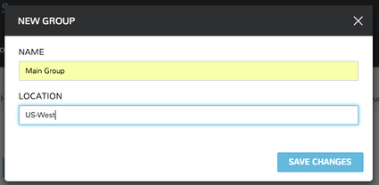
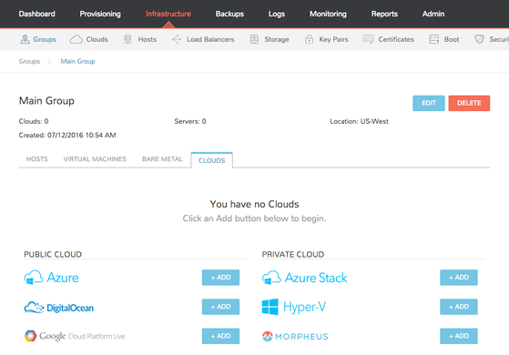

### Groups
#### Overview
---
**Groups** in Lumen Edge Orchestrator define what resources a user has access to. Group access is defined by **User Roles**. **Clouds** are added to groups, and a User can only access the Clouds that are in the groups their **Role** (or Roles) gives them admission to. Resources such as **Networks**, **Datastores**, **Resources Pools**, and **Folders** have additional group access settings.

Policies applied to a Group will be enforced on all **Instances** provisioned or moved into that Group.

_**Note**_: _Groups are not multi-tenant_. A group only exists within the tenant where it was created.

The Groups view:

- Displays all current groups 
- Includes the search feature 
- Enables the addition of new groups.

To View Groups:

1. Click the **Infrastructure** link in the navigation bar
2. Click the **Groups** link

#### UI
---
1.	Click the **Infrastructure** link in the navigation bar
2.	Click the **Groups** link

#### CLI
---
View all groups: `groups list` 

To use the group: `groups use <id>` or `groups use "group name"` 

JSON output of a specific group: `groups get <id> -j` or `groups get "group name" -j`

#### API
---
View all groups: `curl https://api.gomorpheus.com/api/groups -H "Authorization: BEARER access_token"` 

View a specific group: `curl https://api.gomorpheus.com/api/groups/:id -H "Authorization: BEARER access_token"`

#### Adding Groups
---

To add a group:

1. Click the **Infrastructure** link in the navigation bar
2. Click the **Groups** link
3. Click the **Create Group** button
4. Enter the the **Name** and **Location** (optional) parameters into those data fields
5. Click the **Save Changes** button to confirm the action and save the data for the new group.

#### Managing Groups
---

To view a Group:

1. Click the **Infrastructure** link in the navigation bar
2. Click the **Groups** link
3. Click the **Group name** to view/modify

#### Available Tabs in Group View

##### Hosts
Lists available hosts in the group and displays Power, O/S, Name, Type, Cloud, IP Address, Nodes, Disc Space, Memory, and Status. You can add a host from this tab panel by clicking **Add Host**.

##### Virtual Machines
Lists all Virtual Machines in the Group.

##### Bare Metal
Lists all Bare Metal Hosts added to the Group

##### Clouds
Lists Clouds added to the Group. Existing Clouds or new Clouds can be added from the Group by clicking **Add Cloud**.

##### Policies
Lists and allows creation or management of Policies applied to the Group.

#### Edit Group
---
To edit a group:

1. Click the **Infrastructure** link in the navigation bar 
2. Click the **Groups** link
3. Click the name of the group you wish to edit
4. Click the **Edit** button
5. From the **Edit Group Wizard**, modify information as needed
6. Click the **Save Changes** button to save your changes

#### Delete Group
---
To delete a group:

1. Click the **Infrastructure** link in the navigation bar
2. Click the **Groups** link
3. Click the name of the group you wish to delete
4. Click the **Delete** button
5. Confirm

#### User Access
---

**_Important_**

**User access to Groups is determined by user Roles. Group access for Roles can be configured with the _Group Access_ section in the Roles Settings menu.**

