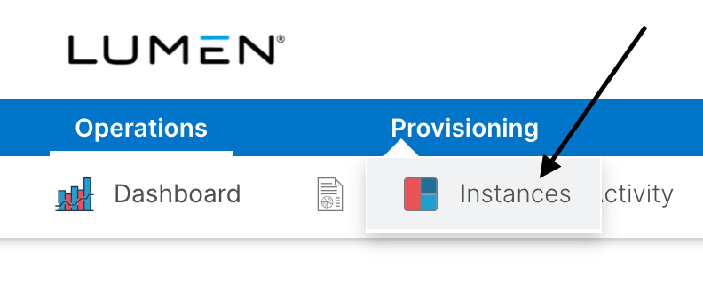
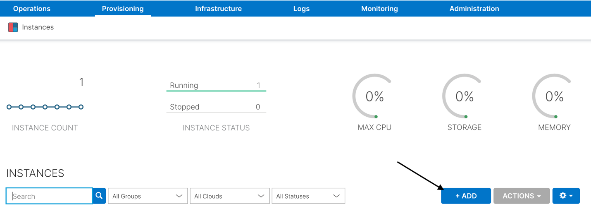
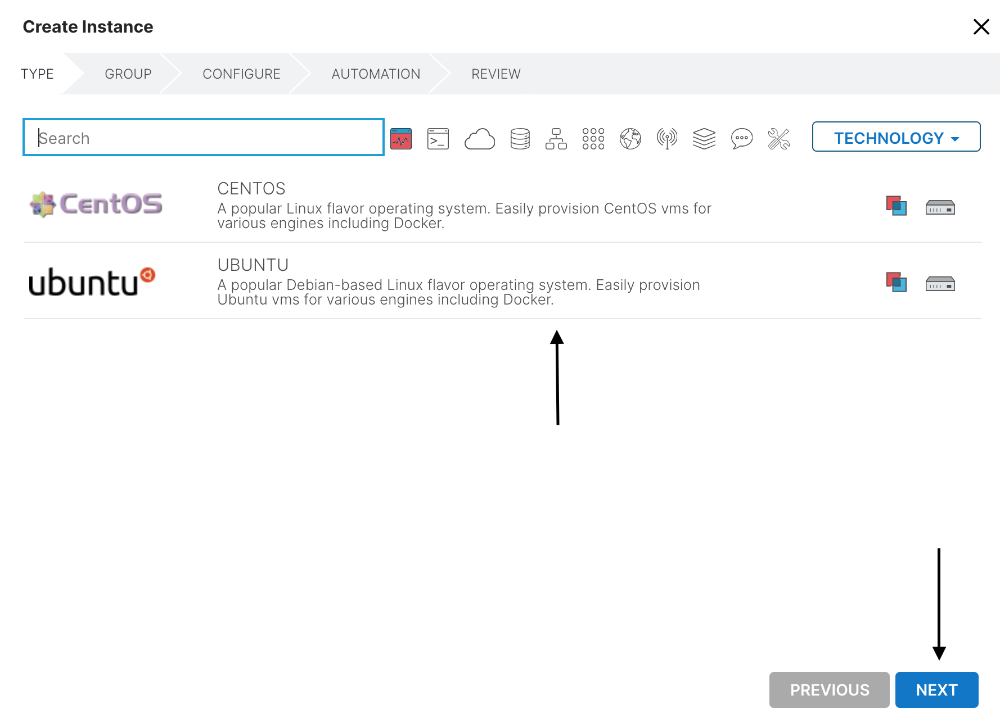
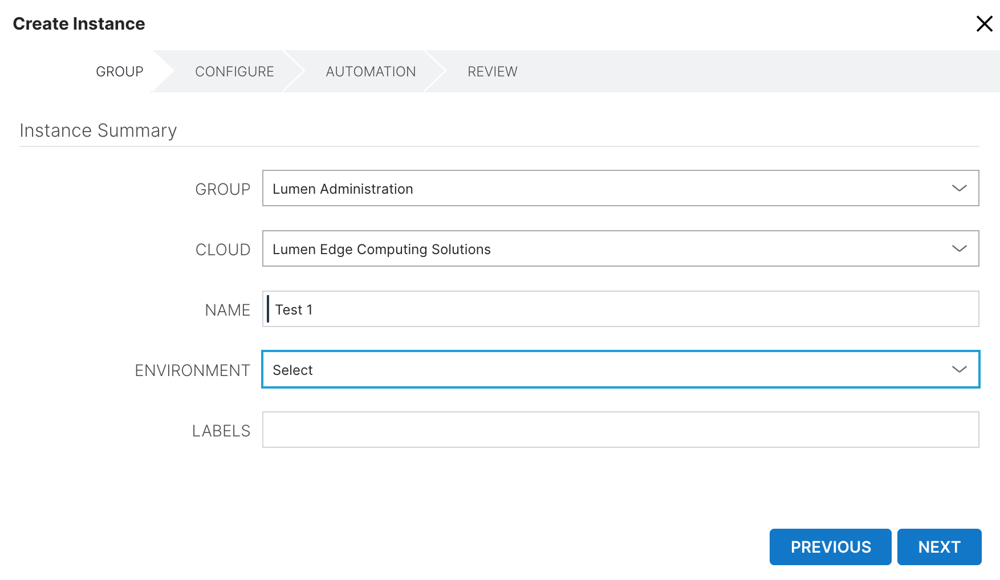
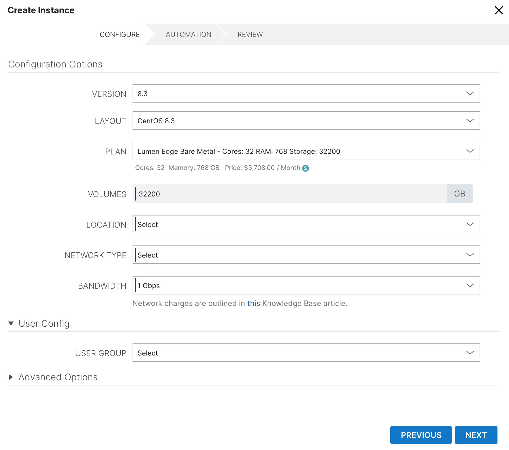
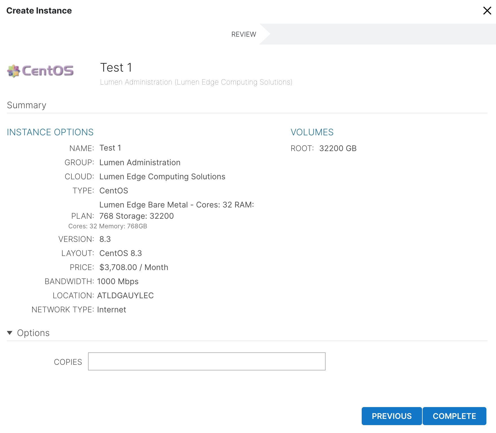

{{{
  "title": "How to Provision a Bare Metal Server",
  "date": "2-21-2021",
  "author": "Brandy Smith",
  "attachments": [],
  "contentIsHTML": false,
  "sticky": false
}}}
 
### Description

This article will outline the step-by-step process to provision a bare metal server within the Lumen Edge Orchestrator portal.

### Steps

Log in to the appropriate tenant within the Lumen Edge Orchestrator portal that you want to provision the server in.

1. To start the Provision Server process, use the top navigation and choose **Provisioning**.
2. Under the **Provisioning** tab, choose **Instances**.
  
3. Once under the **Instances** tab, Click the **+ADD** button, this will begin the process of Provisioning a Bare Metal server.
  
4. Create Instance Type
Choose the operating system for this server and click the **NEXT** button.
**Note** Some Operating Systems may have licensing fees associated with them, for ones that have a licensing fee the cost will be displayed in the portal prior to purchase.
Currently, only free Open Source Operating Systems are available.
Additional OS's will be made available in future releases and supporting documentation will be provided regarding how licensing costs are billed.
  
5. Instance Summary
In this section, you will see multiple fields.
  
Below outlines what each field does in the image above.

**Group**
-Required field, pre-populated, no cost
Currently, the only **Group** option available, **"Lumen Administration"**, is pre-populated for you.
As the platform evolves, customers will have more Group options to choose from.

**Cloud**
-Required field, pre-populated, no cost
Currently, the only **Cloud** option available, **"Lumen Edge Computing Solutions"**, is pre-populated for you.
As the platform evolves, customers will have more Cloud options to choose from.

**Name**
-Required field, free text, no cost
Customers can name the servers as they see fit.

**Environment**
-Required field, drop down, no cost
Customers can choose which environment they want the server to be hosted.
The environment is just there to provide segmentation of server groups across environments.
The Environments section is where you create and manage your environment labels, which are available in the Environment dropdown during Instance or App provisioning.
An Instance’s environment label can be changed by editing the Instance.

**Label**
-Required field, free text, no cost
Customers can add labels to the servers as they see fit.
Labels just provide another way for customers to manage, report, or group servers.
6. Configuration Options
In this section, you will see multiple fields. Once you have made selections for all the required fields please review for accuracy and press the **NEXT** button to proceed to the next steps.
Please note, there are some prerequisites and actions users must take for some fields below. Please read this section carefully before moving on to Step 7.
  
Below outlines what each field does in the image above.

**Version**
-Required field, drop down, **cost based on OS**
Choose the Version of the Operating System you selected in Step 4.

**Layout**
-Required field, pre-populated, **cost based on OS**
This fields pre-populated with the Operating System you selected in Step 4.

**Plan**
-Required field, drop down, **cost based on server configuration**
This fields where you select your Bare Metal Server configurations.

*Note,
Currently there is only one server configuration available, additional configurations will be available in future releases.
For estimated costing of server configuration, please visit the [Edge Price Estimator](https://www.ctl.io/estimator/).
Under the plan field, the server configuration selection and the cost associated will populate.
Ex. Cores: 32  Memory: 768 GB   Price: $3,708.00 / Month

**Volumes**
-Required field, pre-populated
This field shows the storage volumes for the related Server Plan selected.

**Location**
-Required field, drop down, **cost based on location selection**
This fields where you select your what Lumen Edge data center you want to deploy your Bare Metal Server in.
For estimated costing of the various locations where Edge Bare Metal is available, please visit the [Edge Price Estimator](https://www.ctl.io/estimator/).

**Network Type**
-Required field, drop down, **cost based on Network type selection**
This fields where you select your what Network type you want to connect to your Edge Bare Metal server.
Currently there is only one Network type available, which is Public Internet, additional Network types, including IPVPN will be available in future releases.
To learn more about the costs associated with Network type selections, please visit this [Knowledge Base article](../Getting Started/edge-bare-metal-billing/).

**Bandwidth**
-Required field, drop down, **Egress cost based on Bandwidth rate selection**
This fields where you select your Network Bandwidth.
**Note**
For Public Internet, Egress is charged based upon total number of bytes transferred over the course of the month.
Bandwidth selection identifies the requested rate limit for the internet port and is selected during the provisioning of the Bare Metal server instance.
**Note:** Higher rate limits can pass more traffic, which could result in additional Internet charges.
Customers should choose the Bandwidth selection that best fits their business needs to avoid unintended Internet charge spikes.
Network charges are outlined in this [Knowledge Base article](../Getting Started/edge-bare-metal-billing).

**User Config**
-Required field, pre-populated, no cost
This field applies the user configuration for access to the server.
**Important**
Before proceeding, please read.
The customer needs to add credentials for the instance type (Linux or Windows) in their profile and then, the applicable credentials for the account of the user provisioning the server is added by default.
If you have yet to add credentials for the instance type (Linux or Windows) to your profile, please do that step now.
**Failure to add credentials for the instance type in the User Profile will cause you to be locked out of accessing the server.**
In the event that you accidentally provision a server prior to adding your credentials, please reach out to our Edge Customer Care team to resolve.

**How to Contact Support:**

Phone 800-536-3273 or by email [EdgeServicesIncident@lumen.com](mailto:EdgeServicesIncident@lumen.com).

User Groups can also be created to additionally add more users if needed.

To learn more about overall User Management, please visit this [Knowledge Base article](../Administration/user-management).

**Advanced Options**
-Non-Required fields, free text, no costs
These fields are discretionary for the customer to use as they see fit.
7. Lifecycle
Currently, this section is not functional, please press the **NEXT** button to proceed.
8. Review
  
This is the final screen for customers to review all of the sections from the previous steps. Once you press the **COMPLETE** button, the server will begin provisioning.
Once the server is successfully created, billing for that server configuration starts, so it is important that you review and ensure that your selections are accurate prior to hitting the **COMPLETE** button.
Any billable components will show on the review screen.
If you need to make a change to selections, you can use the **PREVIOUS** button to go back to make any changes.
Once you have reviewed for accuracy, please press the **COMPLETE** button to proceed.
Once you press the **COMPLETE** button your Bare Metal server will begin to provision.
You will see a live tracker that shows you the progression of your server build with an estimated time of completion.
On average, large server configurations take up to 40 minutes to build, while smaller server configurations happen much faster.
Once the server is built, billing has started and you can manage your Bare Metal Server by going to your **Dashboard** section, and finding the server under the **MY INSTANCES** section of the dashboard.
To learn more about how to manage your Bare Metal servers, please visit this [Knowledge Base article](../Getting Started/managing-bare-metal-instances).
