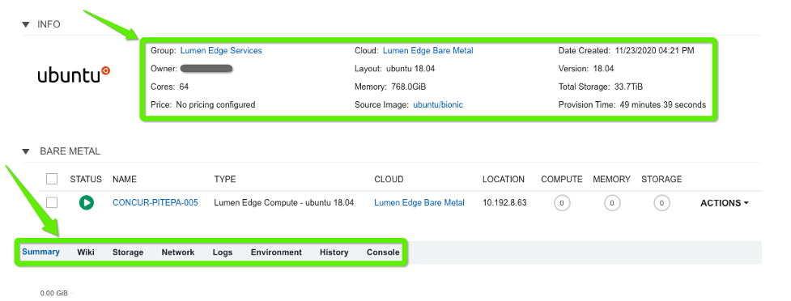
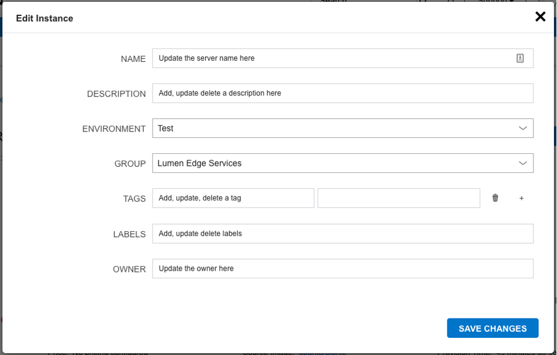
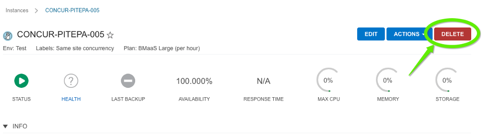

{{{ 
  "title": "Managing Bare Metal Instances", 
  "date": "2-21-2021", 
  "author": "Matthew Ordman", 
  "attachments": [], 
  "contentIsHTML": false, 
  "sticky": false 
}}} 
 
### Description 
 
Lumen Edge Bare Metal servers introduce the ability to provision and manage physical machines from the Lumen Edge Orchestrator Platform in a self-service, on-demand, and highly automated fashion. 

This article goes into detail around the management of the physical Bare Metal machines that have already been provisioned.

### Instance Details
The instance detail page is where you can view and fully manage an instance. To get to an instances detail page, navigate to provisioning, instances, and click on an instance. Please note instance details and actions differ between instance types and user permissions.

There are several sections within an Instance page that provide useful capabilities and details to the user.

 

Section | Description
---------- | -------------
Summary | Stats and status information
Info | Displays detailed information regarding the provisioned instance
Network | Displays detailed information on the network performance. Useful for access to the instance and creating security groups
Logs | View all aggregated logs from the containers or VM’s representing the instance.
Environment | View the environment variables presented to the instances or exported by the instances. Even see Imported environment variables that may be referenced by the running instance.
Console | Access the instance or container via a client-less Console supporting SSH, RDP, VNC, and even hypervisor level remote consoles.

### Instance Management

Instance actions allow you to perform numerous management tasks on instances. 
The actions available depend on the instance type, hypervisor, roles permissions, and instance state.

**To perform an instance action**
1. Select the Provisioning link in the navigation bar.
2. Click the Instance from the list of instances you wish to perform an action on.
3. Click the Actions drop down button and select an Action.
 
**What actions can be taken on an available server?** 

Action | Description
---------- | -------------
Stop/Start/Restart Server | Stops, Starts or Restarts the instance.
Clone | Creates a new Instance from the Instance at its current state.

**How to edit your server**

Within the edit screen you are able to adjust multiple descriptors of the server.  Edit the Name, Description, Environment, Group, Metadata, Tags, and Owner for the Instance.

 

**How to delete a server**

Within the Instance detail page, the user is able to click delete on the instance running.  A pop up will appear to confirm the delete.  Upon confirmation, the instance will be securely erased and removed from inventory.  The network will also be disconnected and removed from the inventory.

 
