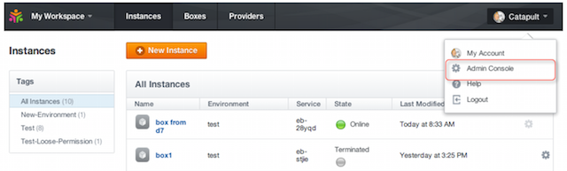
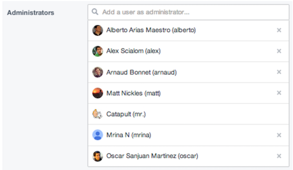

{{{
"title": "Give Admin Access to ElasticBox",
"date": "09-01-2016",
"author": "",
"attachments": [],
"contentIsHTML": false
}}}

### Give Admin Access to ElasticBox
When you sign up for the ElasticBox Enterprise Edition, you get a default administrator account that lets you globally manage settings for all ElasticBox users in your organization. Besides the default account, you can give any ElasticBox user administrator access through the admin console under Organization > Administrators.

**To Give Admin Access**
1. Log in to ElasticBox as the default administrator.
2. Go to the Admin Console located in menu drop-down at the top right corner of your workspace.
   

3. Under **Organization > Administrators**, type the user’s name in the search field and select to add them. 
   

To revoke administrator privileges for a user, click X against their name under **Organization > Administrators**.

Administrators can manage several org-wide settings that include [user authentication](../ElasticBox/user-authentication.md), the [ElasticBox appliance](../ElasticBox/appliance-overview.md), [provider access](../ElasticBox/provider-access.md), [admin boxes](../ElasticBox/deploymentpolicy-box.md), [webhooks](../ElasticBox/webhooks.md), and [instance tags](../ElasticBox/resource-tags.md). To get a good idea of things you can do, see [Overview](../ElasticBox/admin-overview.md).

### Contacting ElasticBox Support
We’re sorry you’re having an issue in [ElasticBox](//www.ctl.io/elasticbox/). Please review the [troubleshooting tips](./troubleshooting-tips.md), or contact [ElasticBox support](mailto:support@elasticbox.com) with details and screen shots where possible.

For issues related to API calls, send the request body along with details related to the issue. In the case of a box error, share the box in the workspace that your organization and ElasticBox can access and attach the logs.
* Linux: SSH and locate the log at /var/log/elasticbox/elasticbox-agent.log
* Windows: RDP into the instance to locate the log at ProgramDataElasticBoxLogselasticbox-agent.log
