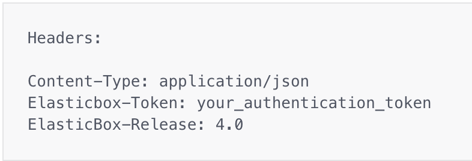
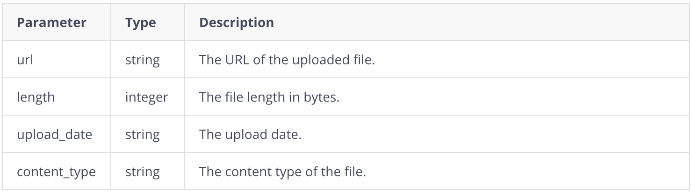
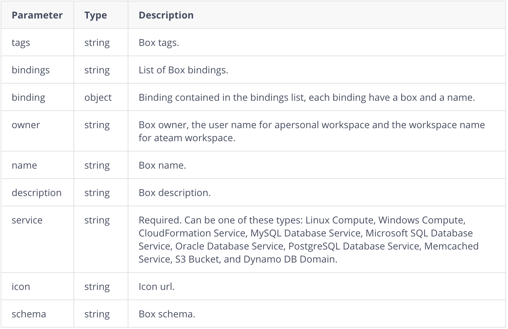
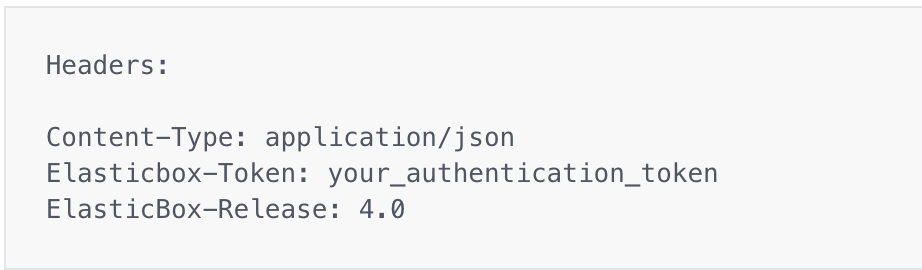
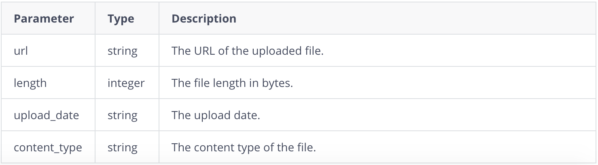

{{{ 
"title": "API Blobs",
"date": "09-01-2016",
"author": "",
"attachments": [],
"contentIsHTML": false
}}}
**Manage Blobs**

**Resource**|**Description**
------------|----------
[POST /services/blobs/upload](./post-services-blobs-upload.md) | Uploads a file using multi-part form data.
[POST /services/blobs/upload/{file_name}](./post-services-blobs-upload.md) | Creates a blob from submitted data.
[GET /services/blobs/download/{file_id}/{file_name}](./post-services-blobs-upload.md) | Downloads a file uploaded previously.

**POST /services/blobs/upload**

Uploads a file using multi-part form data when you give these parameters in the request body: url, length, upload_date, and content_type.

**Normal Response Codes**

* 200

**Error Response Codes**

* Bad Request (400)



**Response Parameters**



```
{
   "url":"/services/blobs/download/533577cb7d0083310b7c9600/arrow.png",
   "upload_date":"2014-03-28 13:23:23.462060",
   "length":1287,
   "content_type":"image/png"
}

```
**POST /services/blobs/upload/{file_name}**

Creates a blob from submitted data when you give the file name.

**Normal Response Codes**
* 200

**Error Response Codes**
* Bad request (400)

**Request Parameters**





**Response Parameters**



### Contacting ElasticBox Support

We’re sorry you’re having an issue in [ElasticBox](//www.ctl.io/elasticbox/). Please review the [troubleshooting tips](./troubleshooting-tips.md), or contact [ElasticBox support](mailto:support@elasticbox.com) with details and screenshots where possible.

For issues related to API calls, send the request body along with details related to the issue.

In the case of a box error, share the box in the workspace that your organization and ElasticBox can access and attach the logs.
Linux: SSH and locate the log at /var/log/elasticbox/elasticbox-agent.log
Windows: RDP into the instance to locate the log at ProgramDataElasticBoxLogselasticbox-agent.log
