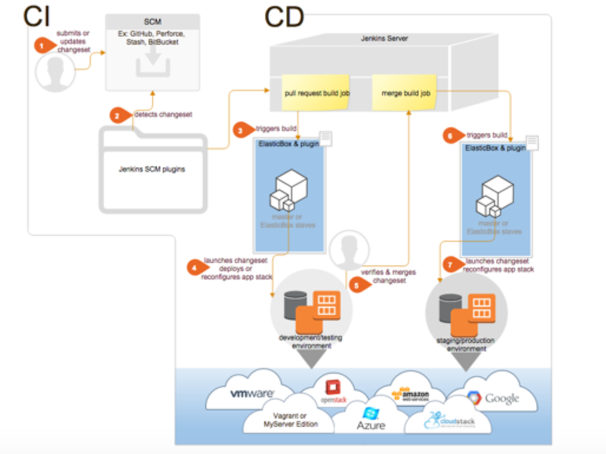

{{{
"title": "Overview of the Jenkins ElasticBox Plugin",
"date": "09-01-2016",
"author": "",
"attachments": [],
"contentIsHTML": false
}}}

If you use Jenkins to continuously test and integrate code changes in development, staging, or production, you’d want to use the [Jenkins ElasticBox plugin](https://wiki.jenkins-ci.org/display/JENKINS/ElasticBox+CI) to fully automate touchless deployments.

Here is a typical continuous integration and deployment (CI/CD) workflow that starts with developers checking in code and goes a full circle to launch changes in development, testing, staging, and production. See how ElasticBox automates the workflow in every step of the way.

### Supported CI/CD scenarios

* **Deploy with zero clicks involved.** After you set up Jenkins with source control management (SCM) plugins, the ElasticBox plugin, and build jobs, code changes automatically trigger Jenkins to test in development, or merge them into staging and production environments. The plugin deploys to your apps from boxes to any cloud or infrastructure.

* **Deploy complex multi-tier apps and manage their lifecycle.** Launch multi-tier app stacks from ElasticBox through a single Jenkins build job using flexible binding references. Trigger lifecycle actions on the apps automatically by adding them to build jobs.

* **Orchestrate large-scale deployments without downtime.** Automate deployments at scale with autoscaling and load balancing in AWS or Azure. Make sure your apps are always available and protected from failures, data loss, and downtime as you continuously integrate and deploy in production.

* **Launch slaves on demand.** Configure slaves to automatically execute build jobs concurrently. Slaves help to speed up builds, build in a specific OS, runtime stack, or build changesets for small or large dev teams.

Without the plugin, normally you’d have to manually set up slaves, provision each environment like testing, staging, production with a cloud provider or your own infrastructure, and then you have to configure applications to deploy in those environments. Besides laborious manual setup, you’d have to make sure applications deploy consistently. You can solve all these challenges with the ElasticBox Jenkins plugin.

### Next Up

* [Setting Up Jenkins with ElasticBox](./jenkins-elasticbox-setup.md)
* [Launching Slaves via ElasticBox](./jenkins-elasticbox-slaves.md)
* [Setting Up CI/CD with ElasticBox and Jenkins](./setting-up-ci-cd.md)
* [Jenkins CI/CD Tutorial](./jenkins-ci-cd-tutorial.md)

### Contacting ElasticBox Support

We’re sorry you’re having an issue in [ElasticBox](//www.ctl.io/elasticbox/). Please review the [troubleshooting tips](./troubleshooting-tips.md), or contact [ElasticBox support](mailto:support@elasticbox.com) with details and screenshots where possible.

For issues related to API calls, send the request body along with details related to the issue.

In the case of a box error, share the box in the workspace that your organization and ElasticBox can access and attach the logs.
Linux: SSH and locate the log at /var/log/elasticbox/elasticbox-agent.log
Windows: RDP into the instance to locate the log at ProgramDataElasticBoxLogselasticbox-agent.log
