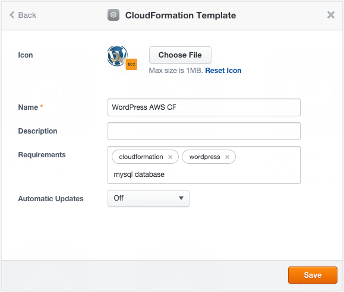
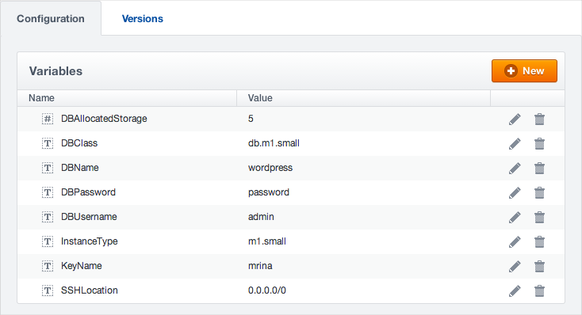
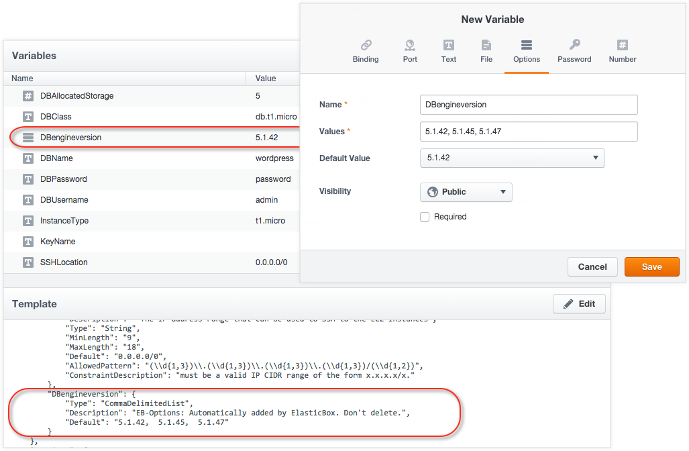
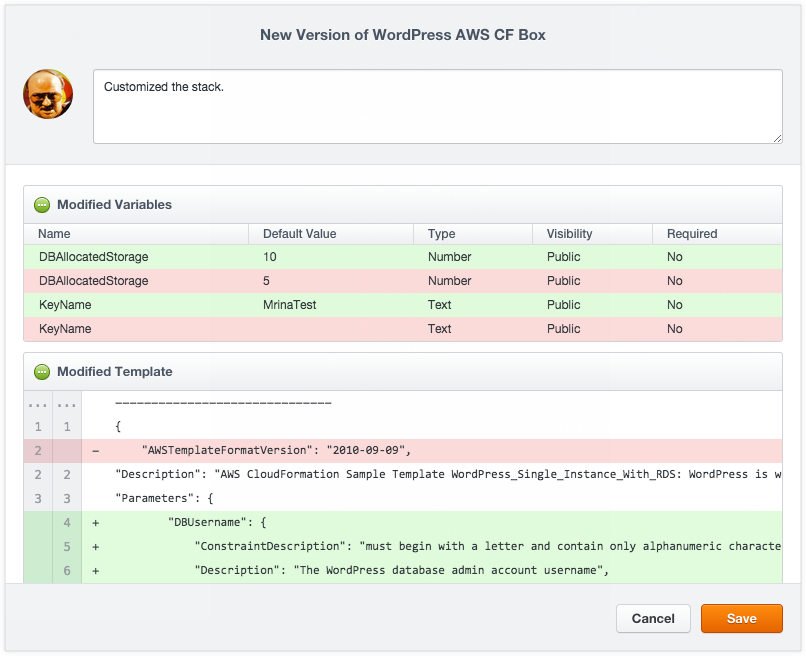
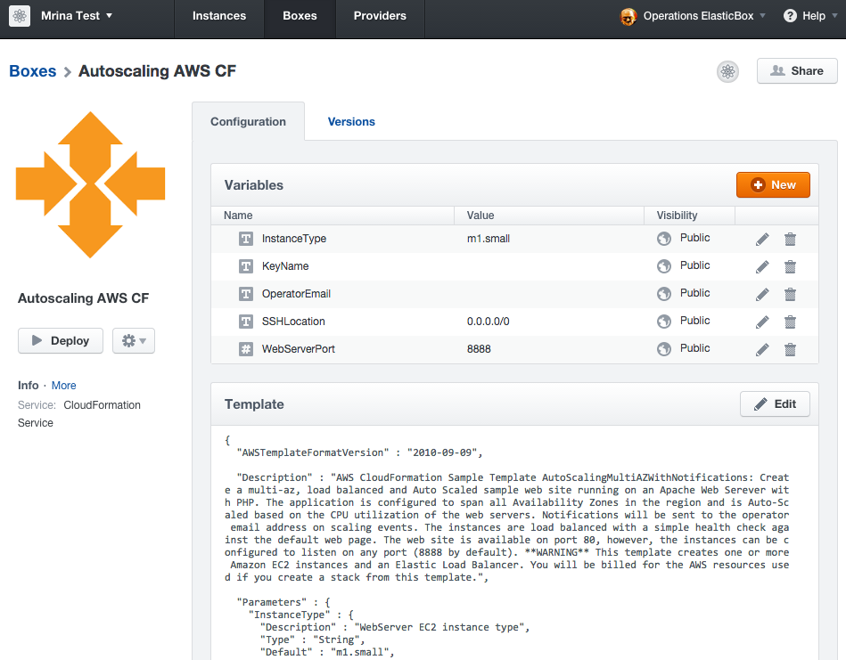
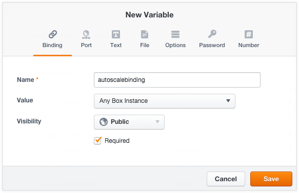
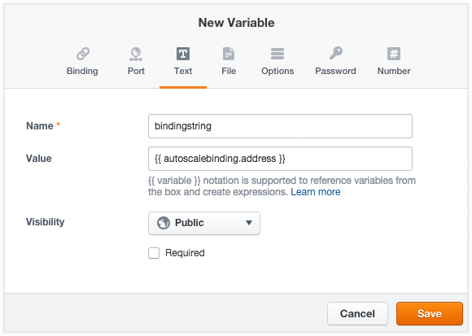

{{{ "title": "CloudFormation Boxes",
"date": "09-01-2016",
"author": "",
"attachments": [],
"contentIsHTML": false
}}}

The ElasticBox CloudFormation box type runs on the [AWS CloudFormation service](https://docs.aws.amazon.com/AWSCloudFormation/latest/UserGuide/Welcome.html).

ElasticBox works with the AWS CloudFormation API to provision the stack in your AWS account. So why use ElasticBox when you can launch CloudFormation templates directly in Amazon? [Here’s why](//www.ctl.io/knowledge-base/elasticbox/#1).

ElasticBox supports all CloudFormation templates available from AWS. Leverage services such as EC2, Elastic Block Store, Simple Notification Service, Elastic Load Balancing and Auto Scaling, RDS, S3, DynamoDB, Elastic IPs, and much more.

[AWS RDS services](./using-your-aws-account.md) such as MySQL, MS SQL, PostgreSQL, Oracle, and [Memcached](./using-your-aws-account.md), [S3](./using-your-aws-account.md), [DynamoDB](./using-your-aws-account.md) are readymade CloudFormation templates. To use these services, configure a CloudFormation box of the type and select an AWS account registered in ElasticBox.

**In this article:**

* Create a CloudFormation Template and Launch a Stack
* Update a CloudFormation stack in real-time
* Connect to other CloudFormation boxes over bindings

### Create a CloudFormation Template and Launch a Stack

The CloudFormation box consists mainly of a template where you describe all the AWS resources you need to run your application. ElasticBox parses the template and automatically shows input parameters under a section called Variables. This enables you to customize a template easily.

We use a sample Wordpress template to show how to create and launch a CloudFormation template in ElasticBox.

**Step 1. Create the template**

1. [Log in](https://elasticbox.com/login) to ElasticBox.

2. Click **Boxes > New > CloudFormation > CloudFormation Template**. Give the box a meaningful name to identify it in the box service catalog. Specify other [metadata](./boxes.md).

     

3. In the box Configuration tab under Template, click **New**. In this walkthrough, we import a [sample WordPress template](https://s3.amazonaws.com/cloudformation-templates-us-east-1/WordPress_Single_Instance_With_RDS.template) from a URL. When we save, contents from the URL are ported over.

    

    Besides URL, you have a couple of other options to create a template:

    * **Blank Template**. Develop one from scratch. When you save, you have a blank template you can start authoring.
    * **File**. Upload an existing template. When you save, the contents of the file are available in the template. You can upload one up to 1MB in size.

    **Note:** When you import from a file or a URL, make sure its content is formatted in JSON and follows the CloudFormation template conventions.

**Step 2. Author the template**

1. Start with a [sample AWS CloudFormation template](https://aws.amazon.com/cloudformation/aws-cloudformation-templates/) and click **Edit** to modify. Here we use the sample WordPress template.

     

	 **Note:** CloudFormation templates have their own taxonomy you must follow. Although a template typically has several sections, only Resources is required. For information and examples on how to declare each section, see [Template Anatomy](https://docs.aws.amazon.com/AWSCloudFormation/latest/UserGuide/template-anatomy.html) and [Template Reference](https://docs.aws.amazon.com/AWSCloudFormation/latest/UserGuide/template-reference.html).

2. Customize input parameters. Although optional, if you have them in the template, they’re automatically shown under Variables. You can customize several parameters as in this example.

     

	 You can customize further by adding parameters under Variables. In this example, we added an Options variable to set the database engine version at deploy time. When we save the variable, notice how it’s automatically added as a parameter to the template in the correct JSON format.

	 

	 Variables in CloudFormation boxes:

    * The template accepts only String, Number, or CommaDelimitedList types. So any variables you add to the box are converted to one of these types. Text, file, password, URL, and email variables are treated as string parameters. Number and port variables are treated as number parameters.

    * Bindings have a special use and are explained later in this walkthrough.

    * Variables imported from a template are always required at deploy time even if you don’t flag them as such in the box. Since they must contain values at launch time, you can set a default value when creating them or supply them at deploy time.

    * At this time, [box type variables](./parameterizing-boxes-with-variables.md) are not supported.

    * The file variable is a useful way to include a script that you want to execute in your stack. When you add a file, ElasticBox stores it on a secure server and declares the file variable as a parameter with a URL value in the parameters section of the template. To execute the file, you can add a script in the user data section of the template. Or depending on your resource type, reference it from the resource properties section. One example for using a file is to store it in the S3 bucket that you launch as part of the stack.

**Note:** As you’re authoring, it’s important to check that the template is valid. While ElasticBox validates the correctness of the JSON format and the template syntax correctness, we can’t know whether resources specified are available in your AWS account or whether property values of a resource are valid. For that level of checking, it’s best to test launch the CloudFormation box instance from ElasticBox and refine the template in real-time.

**Step 3. Launch the CloudFormation stack**

1. On the box page, click **Deploy**.

2. For Provider, select an AWS cloud account added in ElasticBox.

    

3. For Region, select the location and availability zone to launch the stack.

4. Optionally, add tags, [auto schedule the instance](./deploying-managing-instances.md), and set [auto updates](./boxes.md).

5. Under Variables, set values for each parameter based on the **AllowedValues** property in the template parameters section.

6. Click **Deploy** to launch the stack.

    **Note:** When launched successfully, outputs for the stack are available in the instance lifecycle editor. Click **Lifecycle Editor** on the instance page and look under Outputs.

	

### Update a CloudFormation Stack in Real-Time

Once live, you can continue to make changes to your CloudFormation template from the instance lifecycle editor and test in real-time. Follow these steps.

**Steps**

1. [Log in](https://elasticbox.com/login) to ElasticBox.

2. Click Instances and select the CloudFormation instance you want to update. In this example, we’ll select the WordPress instance launched earlier.

3. On the instance page, click **Lifecycle Editor**.

    

4. Update the template and test launch the stack. You can change any section of the template or rewrite it entirely. When ready to update the stack in AWS, click **Reconfigure**. In this example, we increased the RDS database size by changing the value of the DBAllocatedStorage parameter.

    

5. (Optional) Push updates back to the CloudFormation box. When you’re satisfied changing and testing the template in the instance, you can push it back to the CloudFormation box as a version. To do this, click the up arrow icon under Variables. This allows you or others in the future to choose a version that best suits your deployment.

    

### Connect to Other CloudFormation Boxes over Bindings

Large CloudFormation deployments are challenging to manage in a single template. To simplify, break the template into smaller, manageable CloudFormation boxes and connect them with [bindings](./managing-multi-tier-applications.md). Then use [text expressions](./parameterizing-boxes-with-variables.md) to call the bindings. When you do, they’re added to the parameter section of the template. At deploy time, the CloudFormation service calls the binding to connect and pass values between boxes.

To illustrate, we create a second CloudFormation box to scale the WordPress blog instance automatically when past its load limit. In the following steps, we add a binding and call it to connect the WordPress box to the autoscaling box.

**Steps**

1. Create a CloudFormation box using the [AWS autoscaling template](https://s3-us-west-2.amazonaws.com/cloudformation-templates-us-west-2/AutoScalingMultiAZWithNotifications.template).

    

2. Go to the WordPress box and add a binding to the Autoscaling box.

     Make the binding required to make sure you always bind to an autoscaled instance before deploying WordPress.

	 

3. In the WordPress box, specify a connection string to activate the binding.

    Under Variables, click **New** and select the text expression variable type. Enter this connection string: `\{{ autoscalebinding.address }}`

    

	The expression can contain any string value or variables from templates. It can also contain system variables like instance, username, addresses. In general, follow this syntax: `\{{ binding_name.variable_name }}`

When you next launch the WordPress box, its instance automatically connects to an Autoscaling instance over the binding.

### Contacting ElasticBox Support

We’re sorry you’re having an issue in [ElasticBox](//www.ctl.io/elasticbox/). Please review the [troubleshooting tips](./troubleshooting-tips.md), or contact [ElasticBox support](mailto:support@elasticbox.com) with details and screenshots where possible.

For issues related to API calls, send the request body along with details related to the issue.

In the case of a box error, share the box in the workspace that your organization and ElasticBox can access and attach the logs.
Linux: SSH and locate the log at /var/log/elasticbox/elasticbox-agent.log
Windows: RDP into the instance to locate the log at ProgramDataElasticBoxLogselasticbox-agent.log
