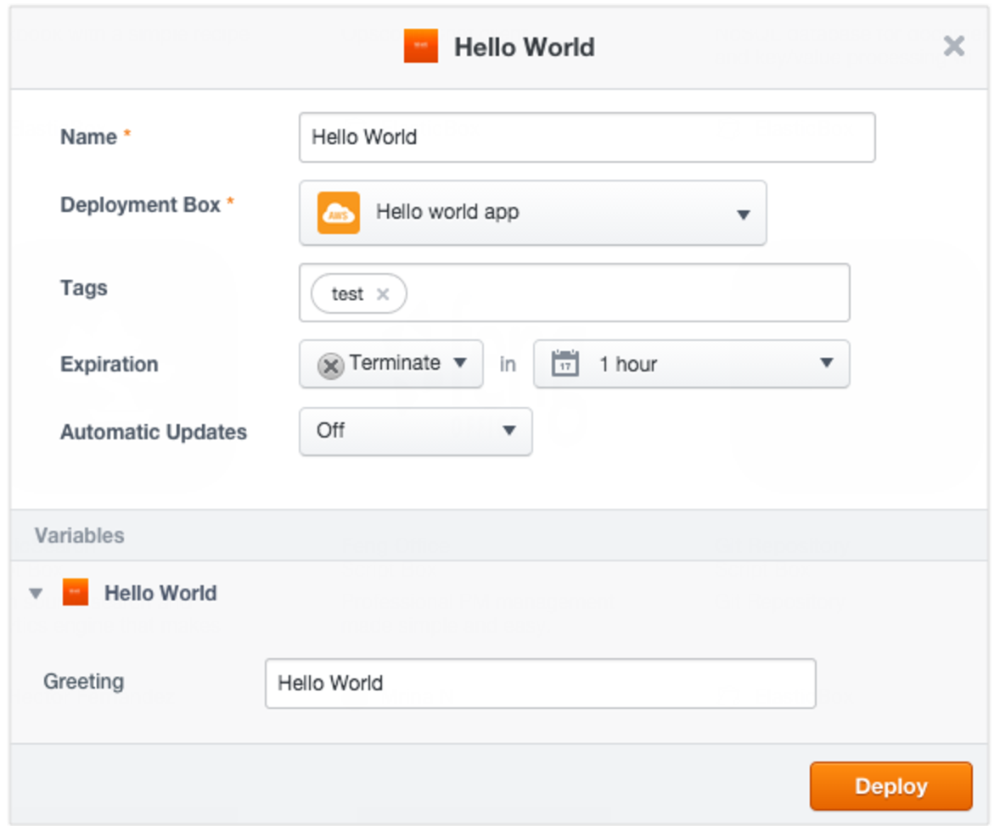
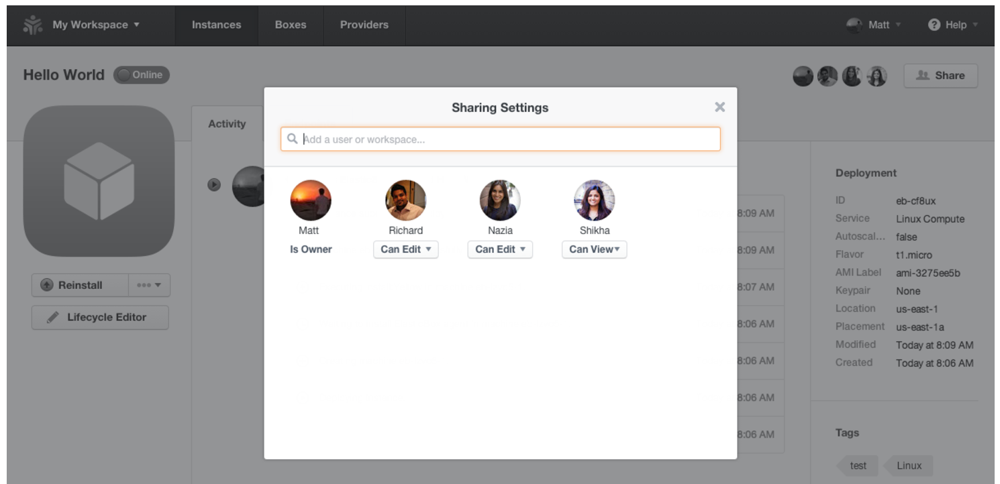

{{{
"title": "Hello World in ElasticBox",
"date": "09-01-2016",
"author": "",
"attachments": [],
"contentIsHTML": false
}}}

### Hello World in ElasticBox

Learn how ElasticBox works in minutes with Hello World.

Configure a box with reusable, infrastructure-independent configuration that you can deploy to any public or private cloud provider. What’s more, you can collaborate with your team to manage the deployments.

Before you start, sign up for an ElasticBox account. It’s free!

Then, follow these simple steps.

* Configure a Hello World box
* Add a provider and deployment policy
* Deploy the box
* Collaborate with team members

### Configure a Hello World box

On the Boxes page, click **New > Script** box. Under Requirements, select Linux to indicate that the box needs a Linux OS to deploy and save.


**Add a greeting variable**

Configure the box to install a greeting in the virtual environment. To store your Hello World greeting, under Configuration > Variables, create a text variable called **Greeting** and enter **Hello World** as its value and save.

**Note**: Add a port variable with a value of 22 if you plan to SSH into the Hello World instance after deploying.


**Automate the box install**

To install the greeting on the instance, add an install event. Under **Configuration > Events > install**, click **install**.


In the event editor, paste this bash script to call the Greeting variable:

```
#!/bin/bash
echo "${Greeting}" > /tmp/hello
```

When you deploy this box, the event creates a file with the greeting in the tmp folder on a newly provisioned instance in the virtual environment.

___

### Add a provider and deployment policy

You’ve configured the Hello World box. To deploy, you first need to connect to a cloud provider like [AWS](./using-your-aws-account.md), [Google Cloud](./using-your-google-cloud-account.md), [vSphere](./using-the-vsphere-private-datacenter.md), [OpenStack](./using-the-openstack-cloud.md), [CloudStack](./using-cloudstack.md), or [Azure](./using-azure.md) to launch the box using their services. For this walkthrough, we’ll use AWS.

**Add a provider**

On the Providers page, click **New Provider** to add your AWS account.

* If you’re on ElasticBox in the cloud, enter the [ElasticBox role ARN](./using-your-aws-account.md) from your AWS account.
* If you’re on the ElasticBox appliance, enter the [AWS root account key ID and secret credentials](https://console.aws.amazon.com/iam/home?#security_credential) or create an IAM user and enter those credentials.

Once you connect to AWS, all the default AMIs, VPCs, security groups, key pairs, and available services in your account are automatically accessible from ElasticBox.


___

**Create a deployment policy**

Next, create a deployment policy to select the services and infrastructure resources from the provider. In the Boxes page, click **New > Deployment Policy** box.


* Under Provider, select the AWS account you added.
Under Claims, select Linux as the service the policy provides to deployments. Then save.

___

### Deploy the Box

On the Boxes page, hover on the hello world box and click the play button to deploy.



* Under Deployment Policy, select the policy box you created.
* Optionally, tag the instance with useful information like dev or test.
* Under Expiration, set the instance to automatically terminate in an hour.
   **Note**: When you deploy to any cloud, the cloud provider may charge you. So it’s a good idea to [auto schedule the instance](./deploying-managing-instances.md) to terminate right after this tutorial to avoid costs.
* Under Variables, you can enter a different greeting before you deploy.

You’re all set to to launch the hello world box in AWS. Click **Deploy**.

___

### Collaborate with Team Members

You just configured and deployed a simple hello world app in minutes to the cloud. Did you know that you can share with other ElasticBox users and work together on deployments? Let’s share the Hello World instance with your team members.

On the Instances page, click the Hello World instance. Click **Share**. Add your team members and give them view or edit access. They can now access this instance from their personal workspaces.



Congrats, you successfully shared an automated configuration with others and can now collaborate to build an even better one!

___

### Contacting ElasticBox Support

We’re sorry you’re having an issue in [ElasticBox](//www.ctl.io/elasticbox/). Please review the [troubleshooting tips](./troubleshooting-tips.md), or contact [ElasticBox support](mailto:support@elasticbox.com) with details and screenshots where possible.

For issues related to API calls, send the request body along with details related to the issue. In the case of a box error, share the box in the workspace that your organization and ElasticBox can access and attach the logs.
* Linux: SSH and locate the log at /var/log/elasticbox/elasticbox-agent.log
* Windows: RDP into the instance to locate the log at ProgramDataElasticBoxLogselasticbox-agent.log
