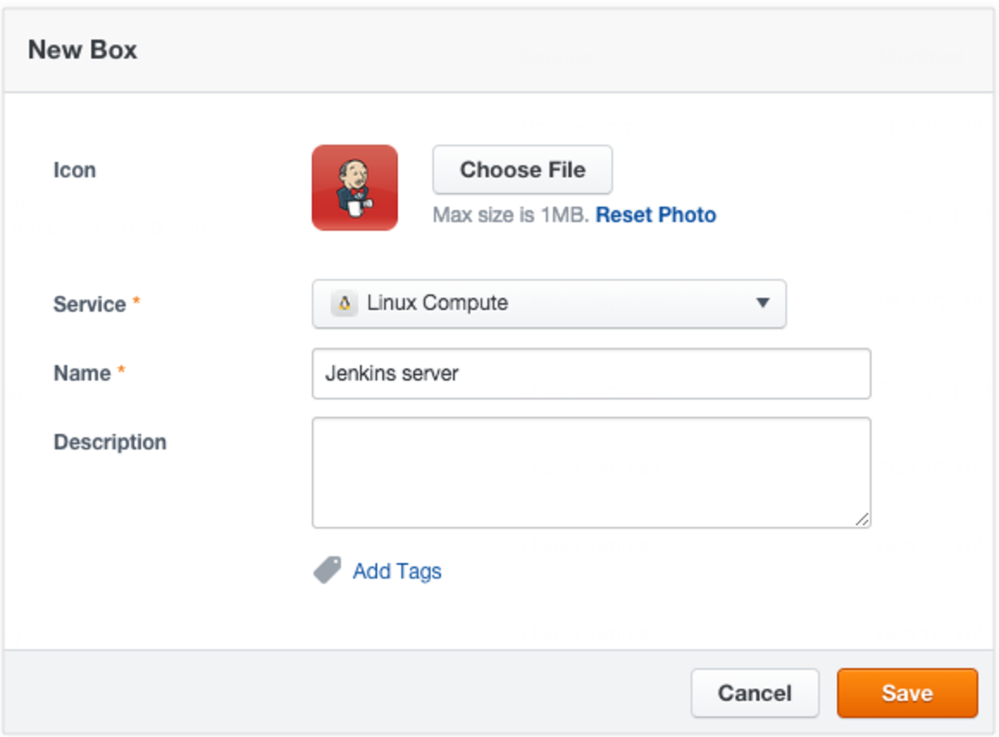
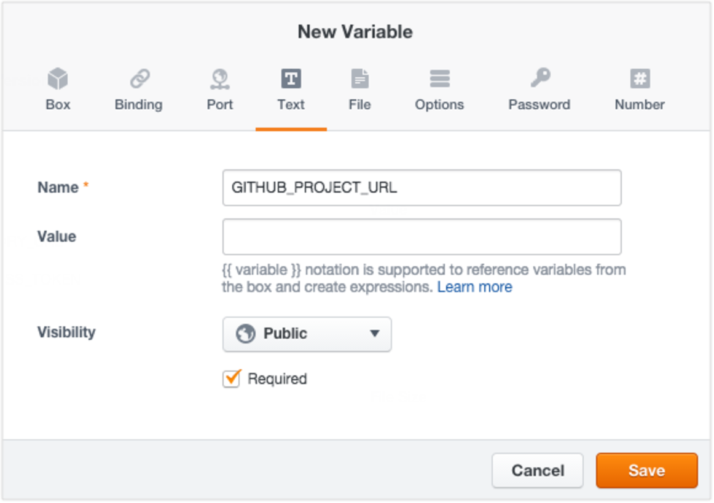
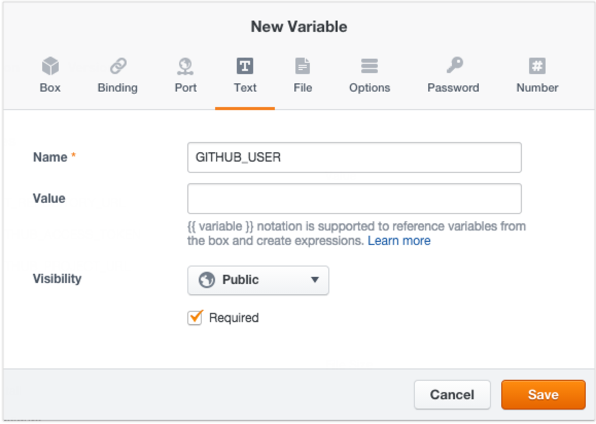
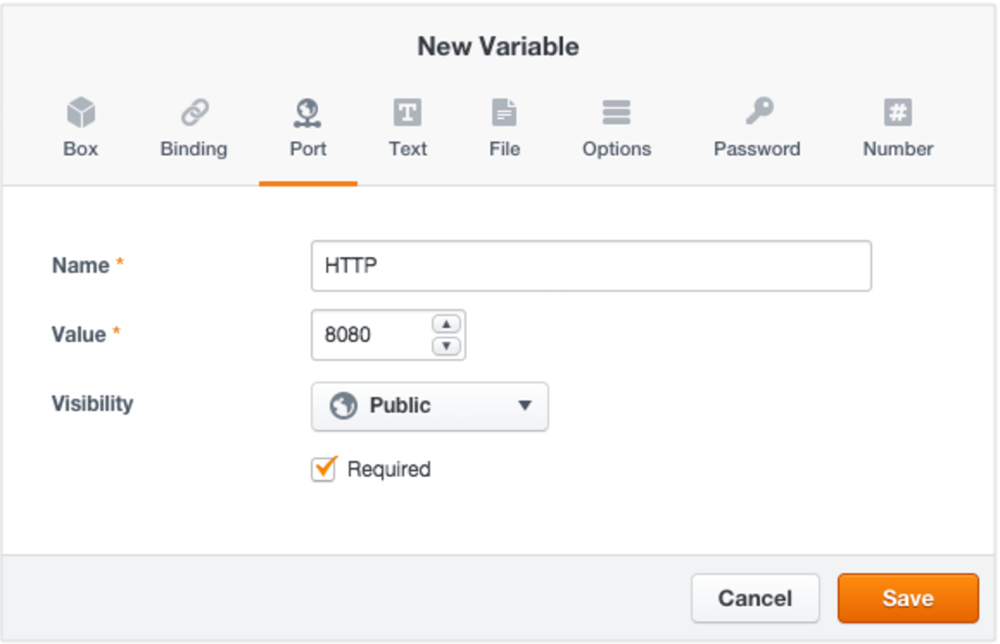
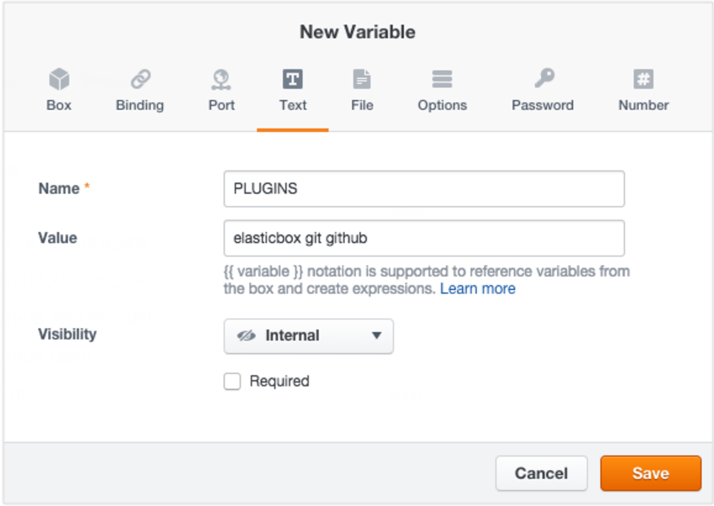
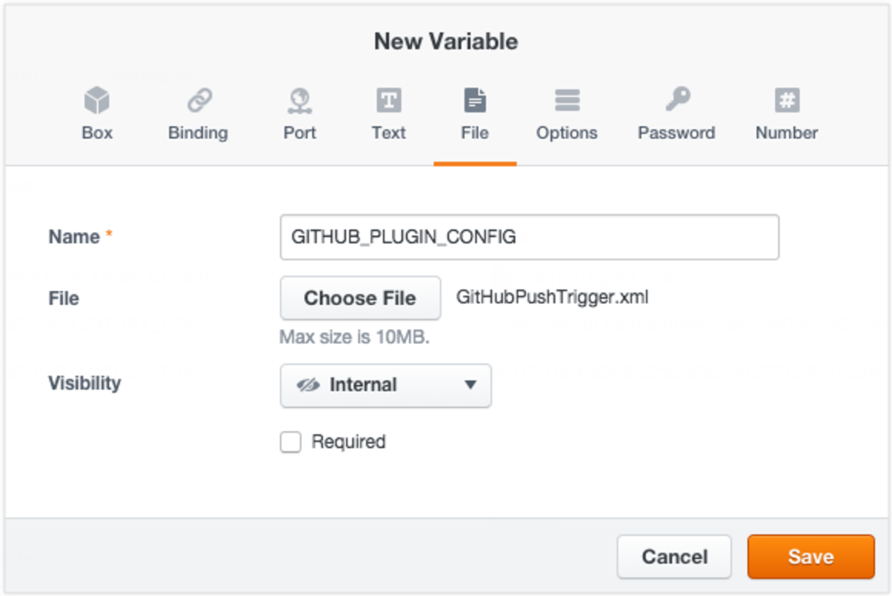
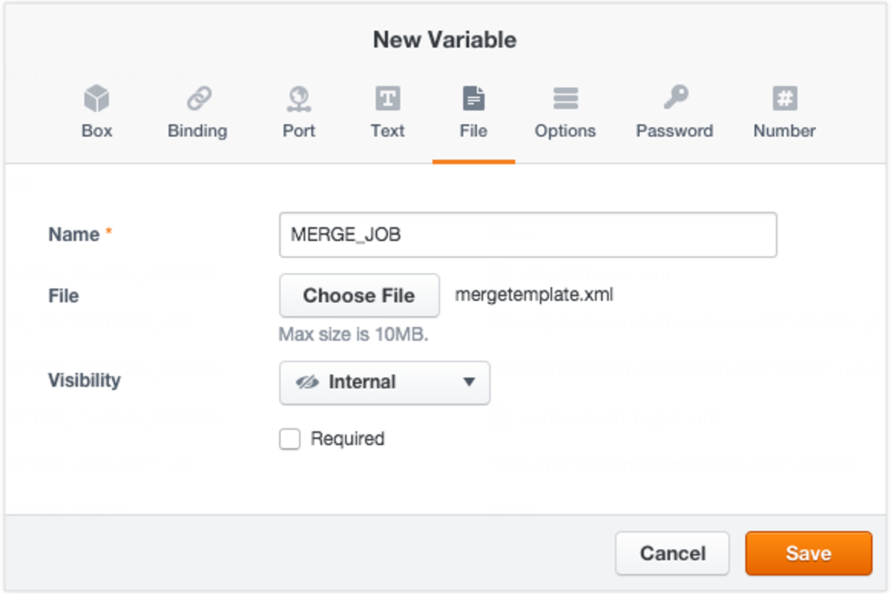
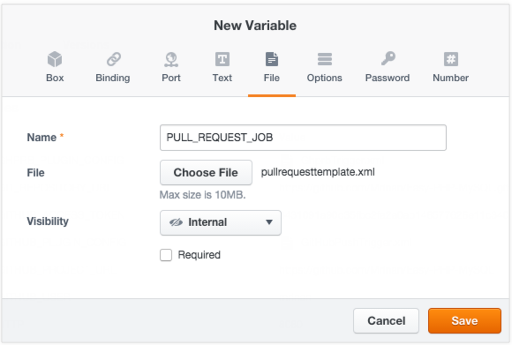
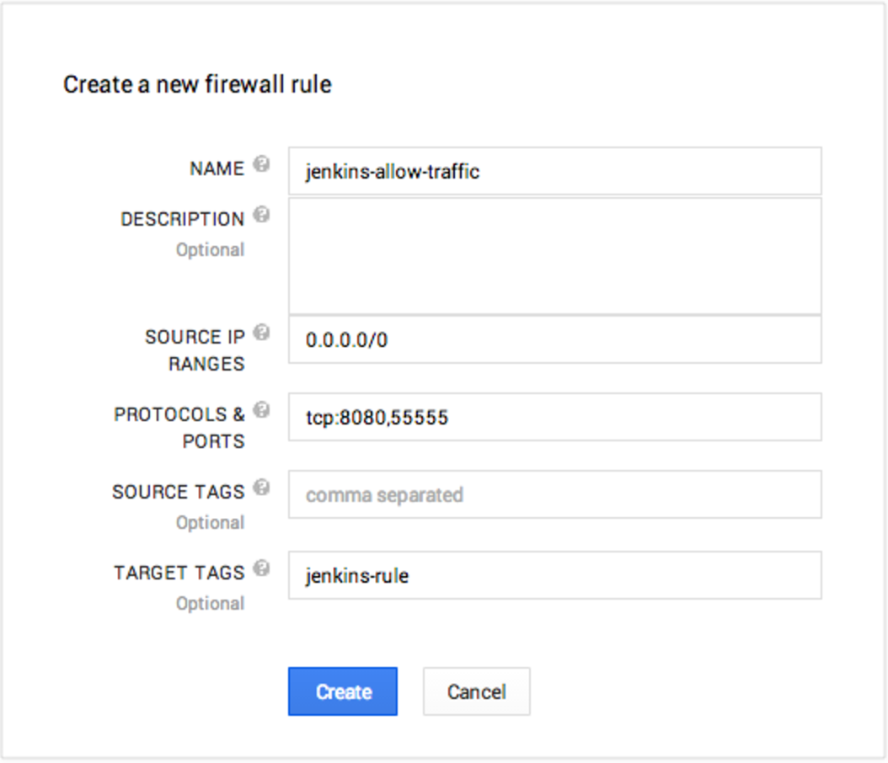
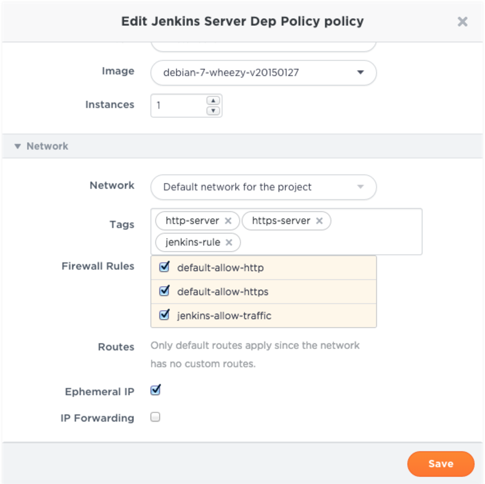

{{{
"title": "Setting Up Jenkins with ElasticBox",
"date": "09-01-2016",
"author": "",
"attachments": [],
"contentIsHTML": false
}}}

To continuously integrate and deploy through ElasticBox, you need a Jenkins server set up to work with your source control management system (SCM) and the [ElasticBox plugin](https://wiki.jenkins-ci.org/display/JENKINS/ElasticBox+CI).

If GitHub is your SCM, follow these sections to integrate Jenkins, GitHub plugins, and ElasticBox.

**In this article:**

* Install Jenkins with ElasticBox and Git plugins
* Connect ElasticBox in Jenkins

### Install Jenkins with ElasticBox and Git Plugins

Follow these steps to build and deploy Jenkins server from a box. The box installs the latest open source Jenkins server with GitHub plugins, dependencies, and the ElasticBox plugin.

**IMPORTANT:** Since the Jenkins server box is Debian based, remember to deploy it on a Debian Ubuntu Linux image.

### Create a Jenkins Server Box

**Steps**

1. On the Boxes page, click **New Box**. Enter these details and save.

	

2. Add the following variables to store Jenkins server deployment values.
Provide your own Git repository through a text variable called GIT_REPOSITORY_URL.

	

3. Pass the GitHub access token in a text variable.

   

   To get it, sign in to your [GitHub](https://github.com/) account. Under settings, go to **Applications** > **Personal access tokens** > **Generate new token**. Describe why you need the token. Under scope, select **repo** and **repo: status**. Then click **Generate Token**. Copy and paste it as shown.

   Provide your GitHub project URL in a text variable called GITHUB_PROJECT_URL.

   

   Provide your GitHub username as a text variable called GITHUB_USER.

   

   Open HTTP port 8080 on the Jenkins server through a port variable called HTTP to allow Internet traffic.

   

Refer to the ElasticBox, Git, and GitHub plugin dependencies in a text variable called PLUGINS.
Enter this value:

```
elasticbox git github

```



Add a plugin that triggers GitHub to push pull requests.



Copy, paste this script in a text file, save in XML, and upload to a file variable called GITHUB_PLUGIN_CONFIG.

```

<?xml version='1.0' encoding='UTF-8'?>
<com.cloudbees.jenkins.GitHubPushTrigger_-DescriptorImpl plugin="github@1.9.1">
    <manageHook>true</manageHook>
    <credentials>
        <com.cloudbees.jenkins.Credential>
            <username>\{{ GITHUB_USER }}\</username>
            <apiUrl>https://api.github.com</apiUrl>
            <oauthAccessToken>\{{ GITHUB_ACCESS_TOKEN }}\</oauthAccessToken>
        </com.cloudbees.jenkins.Credential>
    </credentials>
</com.cloudbees.jenkins.GitHubPushTrigger_-DescriptorImpl>

```
Add the merge build job template as a file variable called MERGE_JOB.



Copy, paste the script in a text file, save in XML, and upload as shown.

```
<project>
    <actions/>
    <description/>
    <keepDependencies>false</keepDependencies>
    <properties>
        <com.coravy.hudson.plugins.github.GithubProjectProperty plugin="github@1.9.1">
            <projectUrl>\{{ GITHUB_PROJECT_URL }}\</projectUrl>
        </com.coravy.hudson.plugins.github.GithubProjectProperty>
    </properties>
    <scm class="hudson.plugins.git.GitSCM" plugin="git@2.2.7">
        <configVersion>2</configVersion>
        <userRemoteConfigs>
            <hudson.plugins.git.UserRemoteConfig>
                <name>origin</name>
                <refspec>+refs/heads/*:refs/remotes/origin/*</refspec>
                <url>\{{ GIT_REPOSITORY_URL }}\</url>
            </hudson.plugins.git.UserRemoteConfig>
        </userRemoteConfigs>
        <branches>
            <hudson.plugins.git.BranchSpec>
                <name>master</name>
            </hudson.plugins.git.BranchSpec>
        </branches>
        <doGenerateSubmoduleConfigurations>false</doGenerateSubmoduleConfigurations>
        <submoduleCfg class="list"/>
        <extensions/>
    </scm>
    <canRoam>true</canRoam>
    <disabled>true</disabled>
    <blockBuildWhenDownstreamBuilding>false</blockBuildWhenDownstreamBuilding>
    <blockBuildWhenUpstreamBuilding>false</blockBuildWhenUpstreamBuilding>
    <triggers>
        <com.cloudbees.jenkins.GitHubPushTrigger plugin="github@1.9.1">
            <spec/>
        </com.cloudbees.jenkins.GitHubPushTrigger>
    </triggers>
    <concurrentBuild>false</concurrentBuild>
    <builders/>
    <publishers/>
    <buildWrappers/>
</project>
```

Add the pull request job template as a file variable called PULL_REQUEST_JOB.



Copy, paste the script in a text file, save in XML, and upload as shown.

```
<project>
    <actions/>
    <description/>
    <keepDependencies>false</keepDependencies>
    <properties>
        <com.coravy.hudson.plugins.github.GithubProjectProperty plugin="github@1.9.1">
            <projectUrl>\{{ GITHUB_PROJECT_URL }}\</projectUrl>
        </com.coravy.hudson.plugins.github.GithubProjectProperty>
    </properties>
    <scm class="hudson.plugins.git.GitSCM" plugin="git@2.2.7">
        <configVersion>2</configVersion>
        <userRemoteConfigs>
            <hudson.plugins.git.UserRemoteConfig>
                <name>origin</name>
                <refspec>+refs/pull/*:refs/remotes/origin/pr/*</refspec>
                <url>\{{ GIT_REPOSITORY_URL }}\</url>
            </hudson.plugins.git.UserRemoteConfig>
        </userRemoteConfigs>
        <branches>
            <hudson.plugins.git.BranchSpec>
                <name>${PR_COMMIT}</name>
            </hudson.plugins.git.BranchSpec>
        </branches>
        <doGenerateSubmoduleConfigurations>false</doGenerateSubmoduleConfigurations>
        <submoduleCfg class="list"/>
        <extensions/>
    </scm>
    <canRoam>true</canRoam>
    <disabled>true</disabled>
    <blockBuildWhenDownstreamBuilding>false</blockBuildWhenDownstreamBuilding>
    <blockBuildWhenUpstreamBuilding>false</blockBuildWhenUpstreamBuilding>
    <triggers>
        <com.elasticbox.jenkins.triggers.PullRequestBuildTrigger plugin="elasticbox@0.9.7">
          <spec></spec>
          <triggerPhrase>.*test\W+this\W+please.*</triggerPhrase>
          <whitelist></whitelist>
        </com.elasticbox.jenkins.triggers.PullRequestBuildTrigger>
    </triggers>
    <concurrentBuild>false</concurrentBuild>
    <builders/>
    <publishers>
        <com.cloudbees.jenkins.GitHubCommitNotifier plugin="github@1.9.1"/>
    </publishers>
    <buildWrappers/>
</project>
```

Add the following events to install Jenkins server and the plugins.
Install Jenkins. Copy, paste the script in the install event and save.

```
#/bin/bash

# For certain images In some clouds like GCE, packages are being installed by the provider at this point, so we need to wait for the installation to finish
WAIT_SECONDS=0
while [[ -f /var/lib/apt/lists/lock && ${WAIT_SECONDS} -lt 180 ]]
do
    sleep 5
    WAIT_SECONDS=$(( WAIT_SECONDS + 5 ))
done

# Install Jenkins and Git
curl -ks https://jenkins-ci.org/debian-stable/jenkins-ci.org.key | apt-key -y add -
echo deb http://pkg.jenkins-ci.org/debian-stable binary/ > /etc/apt/sources.list.d/jenkins.list


apt-get -y update
apt-get -y --force-yes install jenkins git
```

Install the plugins, the build job templates, and configure GitHub plugins with username, access token, and repository URL. Copy, paste the script in the post_configure event and save.

```
#!/bin/bash

set -e

function install_template() {
    SOURCE_URL=${1}
    DESTINATION_PATH=${2}
    curl -ks ${SOURCE_URL} -o ${DESTINATION_PATH}
    elasticbox config -i ${DESTINATION_PATH} -o ${DESTINATION_PATH}
    chown jenkins:jenkins ${DESTINATION_PATH}
}


JENKINS_HOME=~jenkins

# Install plugins specified in variable PLUGINS
PLUGINS="\{{ PLUGINS }}\"
if [ -n "${PLUGINS}" ]
then
    # Get the latest plugin info for update center
    mkdir -p ${JENKINS_HOME}/updates
    curl -Ls http://updates.jenkins-ci.org/update-center.json | sed '1d;$d' > ${JENKINS_HOME}/updates/default.json
    chown -R jenkins:jenkins ${JENKINS_HOME}/updates

    # Restart Jenkins and wait for it to be up
    service jenkins restart
    sleep 30

    for PLUGIN_NAME in ${PLUGINS}
    do
        echo Installing plugin ${PLUGIN_NAME}
        java -jar /var/cache/jenkins/war/WEB-INF/jenkins-cli.jar -s http://127.0.0.1:8080/ install-plugin ${PLUGIN_NAME}
        echo Installed plugin ${PLUGIN_NAME}
    done
fi


# Configure GitHub plugin with GitHub user ID and access token specified in the variable GITHUB_USER and GITHUB_ACCESS_TOKEN
install_template \{{ GITHUB_PLUGIN_CONFIG }}\ ${JENKINS_HOME}/com.cloudbees.jenkins.GitHubPushTrigger.xml

# Install CI/CD job templates
mkdir -p ${JENKINS_HOME}/jobs/pull-request
install_template \{{ PULL_REQUEST_JOB }}\ ${JENKINS_HOME}/jobs/pull-request/config.xml

mkdir ${JENKINS_HOME}/jobs/merge
install_template \{{ MERGE_JOB }}\ ${JENKINS_HOME}/jobs/merge/config.xml

chown -R jenkins:jenkins ${JENKINS_HOME}/jobs

# Restart Jenkins server
service jenkins restart
```

### Deploy the Jenkins Server Box

Select a Debian Ubuntu Linux image when deploying the Jenkins server box. You can launch to any public or private cloud provider, or to your own infrastructure. Here we deploy to Google Cloud.

**Before You Begin**

Configure your cloud provider network to allow Internet traffic to the Jenkins server. Make the instance IP address public and set the firewall port to 8080. Additionally, open another port to let Jenkins slaves talk to the server. Assign this port any number you like.

Here we configure the Google Cloud network to allow Internet traffic through port 8080 and Jenkins slave traffic through port 55555.



1. Log in to the [Google Cloud console](https://console.developers.google.com/apis/library).

2. Select the project associated with your Google provider account in ElasticBox.

3. Expand Compute > Compute Engine > Networks. Select the default network. Under Firewall rules, click Create new.

4. Enter details as shown to open ports 8080 and 55555. Note that ElasticBox uses the target tag to detect the firewall rule.

5. Sync your provider account in ElasticBox to fetch the rule.

**Steps to deploy Jenkins server**

1. Sign in to ElasticBox.

2. Go to the Jenkins server box you built.

3. On its box page, click **Deploy**.

4. In the instance dialog, name the deployment, and create a new policy to select Google Cloud deployment settings.

5. In the policy, select a Debian Ubuntu Linux image. Although a g1.small machine type will do, select n1-standard-2 to deploy faster.

6. Under Network, select the firewall rule from Google Cloud. Select Ephemeral IP to make the instance IP address public.

   

7. Click **Save**.

8. Back in the instance dialog, check the Jenkins server deployment variables such as the repository URL, access token, project URL, and GitHub username.

9. Click **Deploy** to launch the Jenkins server.

When online, in the instance page under **Endpoints**, click the public IP address to open the Jenkins server management portal. You can see that the server has all the GitHub plugins and the build job templates.

### Connect ElasticBox in Jenkins

In your Jenkins server management interface, follow these steps to register your ElasticBox account.

**Note:** Set the Jenkins server URL to make Jenkins server links work in auto-posted messages on GitHub pull requests. Go to Manage Jenkins > Configure System. Under **Jenkins URL**, set the URL and save.

**Steps**

1. Under Jenkins > Manage Jenkins > Configure System > Cloud, click **Add a new cloud** and select **ElasticBox**. Enter details as given:
   * **Description**. Enter information to identify your ElasticBox account in Jenkins jobs.
   * **End Point URL**. Enter a custom URL if using ElasticBox as an appliance.
   * **Max. No. of Instances**. This is the total number of instances Jenkins will launch through your account. We recommend at least 5.
   * **Authentication Token**. [Get a token](./api-overview-and-access.md) and paste it here. If you use username, password to access ElasticBox, get one by clicking **Get Authentication Token**.

2. Click **Verify Authentication Token** to see if Jenkins can connect to ElasticBox.

3. Click **Save** when done.

### Contacting ElasticBox Support

We’re sorry you’re having an issue in [ElasticBox](//www.ctl.io/elasticbox/). Please review the [troubleshooting tips](./troubleshooting-tips.md), or contact [ElasticBox support](mailto:support@elasticbox.com) with details and screenshots where possible.

For issues related to API calls, send the request body along with details related to the issue. In the case of a box error, share the box in the workspace that your organization and ElasticBox can access and attach the logs.
* Linux: SSH and locate the log at /var/log/elasticbox/elasticbox-agent.log
* Windows: RDP into the instance to locate the log at ProgramDataElasticBoxLogselasticbox-agent.log
