{{{
"title": "Launching Slaves via ElasticBox",
"date": "09-01-2016",
"author": "",
"attachments": [],
"contentIsHTML": false
}}}

Slave nodes run Jenkins tasks on remote machines in any cloud. If you configure cloud plugins like AWS to launch slaves and then write command line scripts to set up slave build environments then ElasticBox and the ElasticBox Jenkins plugin can save you the hassle of both tasks.
By configuring the slave node once in ElasticBox, you can reuse it across development, testing, staging, and production. Using ElasticBox, you can launch slaves on any OS, flavor, and cloud. As an example, watch this video on how we use Jenkins slaves to run tests for a sample JBoss app.

<iframe src="//player.vimeo.com/video/113452091" width="640" height="360" frameborder="0" webkitallowfullscreen mozallowfullscreen allowfullscreen></iframe>

**In this article:**
* Configure a Slave
* Configure Jenkins to build with slaves using ElasticBox
* Find a slave from ElasticBox


### Configure a Slave

Configure a Jenkins slave in ElasticBox. Later, you’ll call this slave from Jenkins using the ElasticBox plugin.
**IMPORTANT:** This slave configuration is Debian based, so remember to select a Debian Ubuntu Linux image in the policy at deploy time.

**Steps**

1. Log in to ElasticBox.

2. Create a Jenkins slave box. From the Boxes page, click **New** > **Script**. Name the box, tag it Linux, and save.

	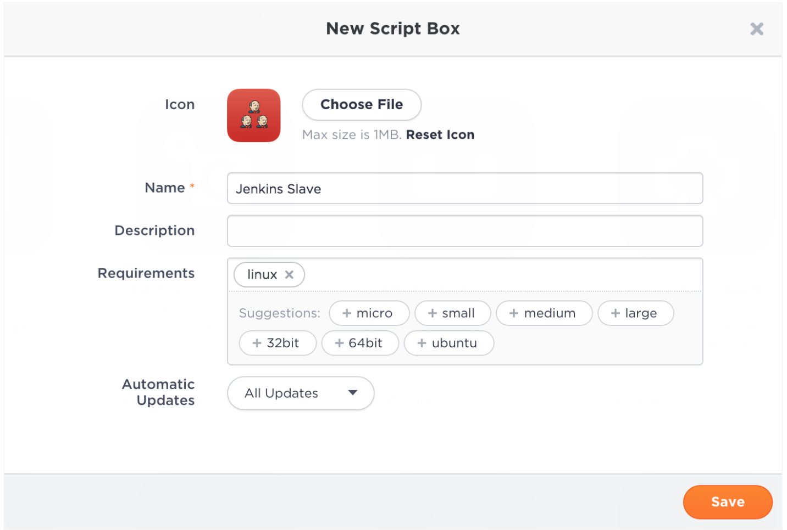

3. Configure the box. Under Configuration > Variables, create two text variables (JENKINS_URL and JNLP_SLAVE_OPTIONS) in uppercase and leave their values empty.

	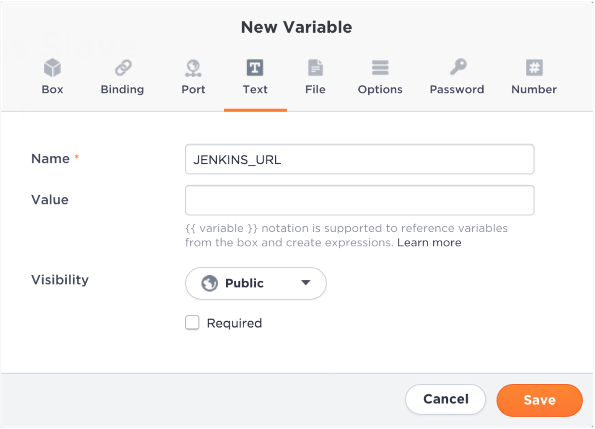

	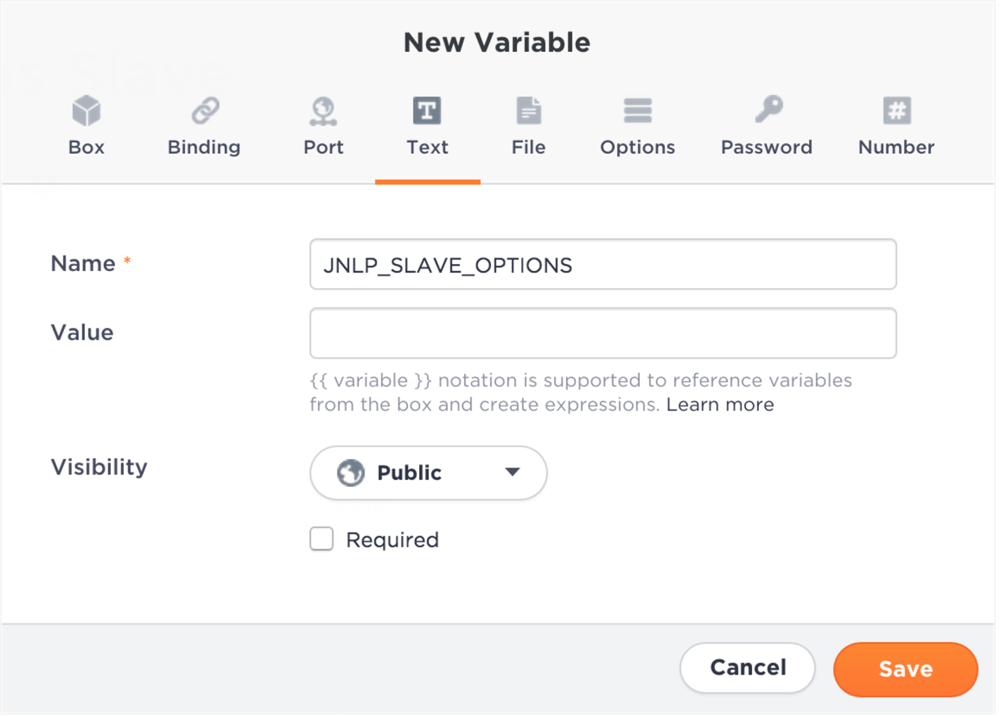

   Under Configuration > Events, add an install, start, and stop script. Copy, paste each script below and save:
**install**. This script installs the latest version of Java if unavailable and downloads the slave agent from the Jenkins server.

   ```
   #!/bin/bash
   apt-get -y update

   if [ -z $(which java 2>/dev/null) ]
   then
       apt-get -y install openjdk-7-jre
   fi

      apt-get -y install git

   # Download the Jenkins agent
   wget $JENKINS_URL/jnlpJars/slave.jar -O slave.jar
   ```

**Start**. This script starts the slave agent.

   ```
   #!/bin/bash

   # Execute the agent and save the PID
   nohup java -jar slave.jar $JNLP_SLAVE_OPTIONS > slave.log 2>&1 &

   echo \$! > slave.pid
   ```

   **Stop**. This script kills the agent when the retention period on Jenkins ends.

   ```
   #!/bin/bash

   # Stop the agent
   SLAVE_PID=$(cat slave.pid)
   if [ -n ${SLAVE_PID} ]
   then
       kill -9 ${SLAVE_PID}
   fi

   ```

4. Create a deployment policy with infrastructure metadata to build the Jenkins slave environment.
   * IMPORTANT: Don’t deploy the Jenkins slave box! Just create the policy. Jenkins will use the policy to launch the slave on-demand via ElasticBox to the cloud provider you choose.

   On the Boxes page, click New > Deployment Policy. In the dialog, select a provider account, and name the policy.

   Under Claims, type or select a linux tag. Claim tags define the policy at a high level. It defines the type of platform, flavor, image, and so on. When configuring the slave in Jenkins, you provide this claim tag to deploy the slave. The claim tag must match the requirement tag in the Jenkins slave box.

  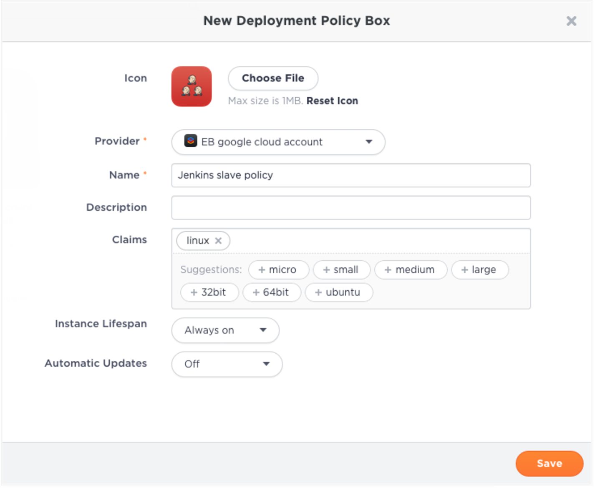

   Edit the policy. Make sure you select a Debian Ubuntu Linux image, select a firewall rule that allows traffic to the instance, and make the machine IP ephemeral to open it to Internet traffic. Save the policy.

   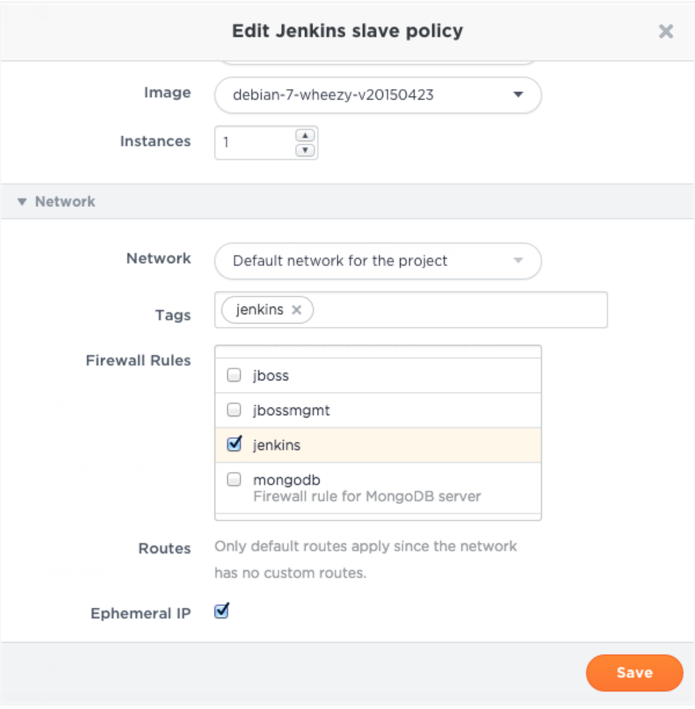

### Configure Jenkins to Build with Slaves Using ElasticBox

Run Jenkins jobs using slaves launched via ElasticBox on any cloud. Be sure to [connect your ElasticBox account](./jenkins-elasticbox-setup.md) in Jenkins before setting up the slave.

**Add Jenkins Slaves**

**Steps**

1. Go to the configure system page at **http://<your Jenkins host>/configure.**
Set up Jenkins to launch slaves using the slave box. Click **Add** for **Slave Configurations**.

	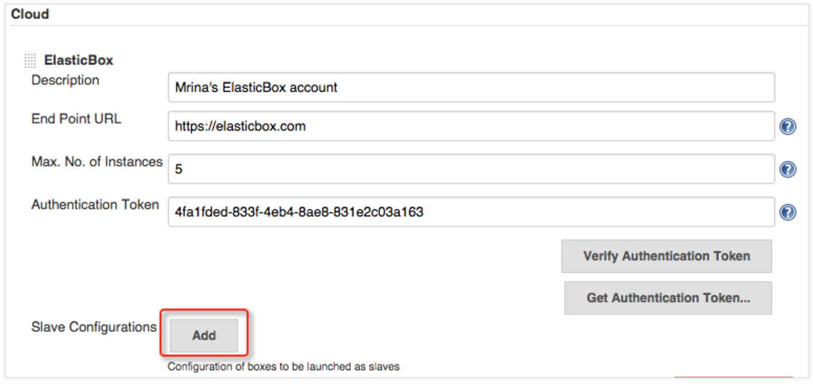

2. In this section, select the slave box from the ElasticBox workspace. Optionally, tag the slave instance. Set **Min. No. of Instances** to 0 when you don’t want to keep idle slaves alive. Set **Max. No. of Instances** to the number of slaves you want at any given time to run Jenkins jobs.

   **IMPORTANT**: Add a label to identify the slave to Jenkins. Use underscores or dashes, but not spaces. When you create a build job (as we’ll do in the next section), you can provide this label to make Jenkins select this slave.

	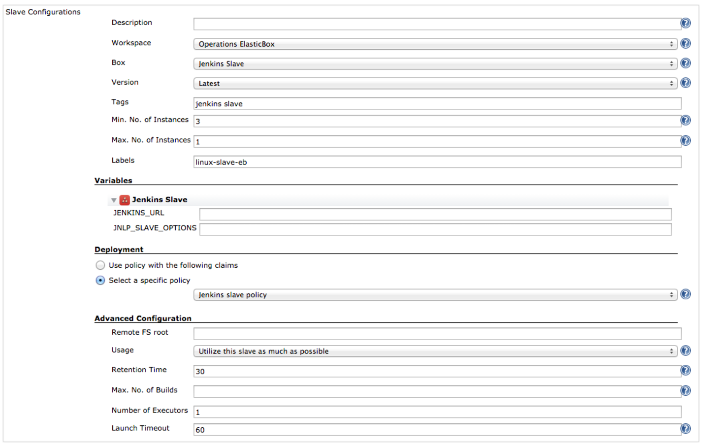

   The plugin uses the JENKINS_URL and JNLP_SLAVE_OPTIONS variables to pass Jenkins server information slaves need to connect. Leave them empty.

3. Under Deployment, select a policy from the ElasticBox workspace or enter a claim tag to use any policy that matches the tag.
   Click Advanced. For **Retention Time**, specify in minutes how long the plugin should wait before terminating an idle slave. If the slave is idle for more than 30 minutes, which is the default, the plugin terminates the slave from your provider. But for this to work, your slave must be connected to the Jenkins server.

   Under **Max. No. of Builds**, set the most builds the slave can execute. If the slave hits that number, the plugin terminates it.

4. Save the slave setup.


### Enable Slaves to Connect through a Port

When defining the [Jenkins server box](./jenkins-elasticbox-setup.md), we opened port 55555 on the cloud provider network to allow slaves to connect to the Jenkins server. In these steps, we open this port (or another you chose) in Jenkins server.

**Steps**

1. Go to the configure global security page at http://<your Jenkins host>/configureSecurity/.

2. Select **Enable Security** and set **Fixed** to 55555 as shown. Save the setting.

  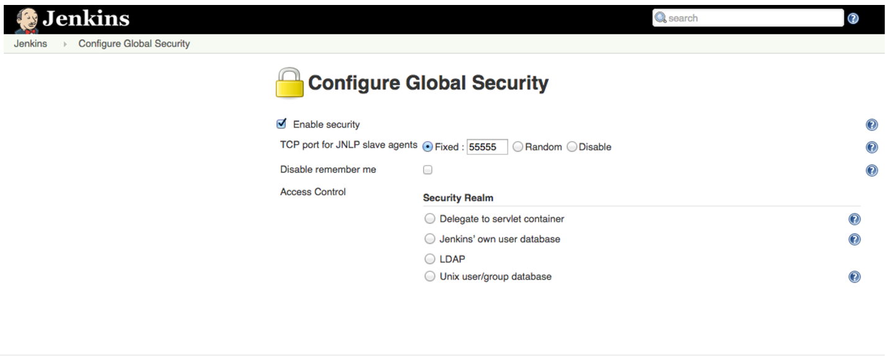


### Attach Slave to a Build Job

Follow these steps to attach a slave from ElasticBox to run Jenkins build jobs.

**Steps**

1. From the Jenkins server management interface, click **Configure** on any build job.

2. Select **Restrict where this project can be run**. Under **Label Expression**, type and select the label for the ElasticBox slave that you gave when setting it up in Jenkins. This causes Jenkins to pick any available slave by that label.

	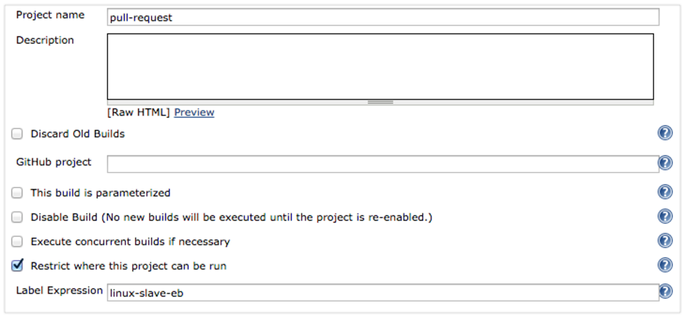

3. Save the job.


### Find a Slave from ElasticBox

Follow these steps to locate slaves launched via ElasticBox in case you need to debug.

**Steps**

1. Go to your Jenkins server management interface at http://<your Jenkins host>:8080.

2. Click the slave if active. It’s typically named as <Jenkins slave box environment name——–ID>. Here’s an example.

	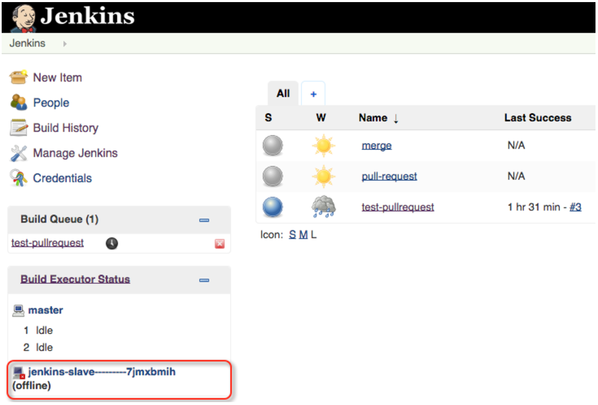

3. Click Configure. This shows settings for the slave.

   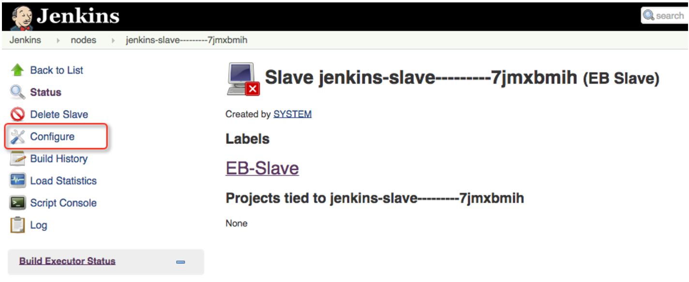

4. Notice the ElasticBox link to the slave instance. Click to open the slave instance in ElasticBox. From there, you can debug the slave in the lifecycle editor or check the logs.

   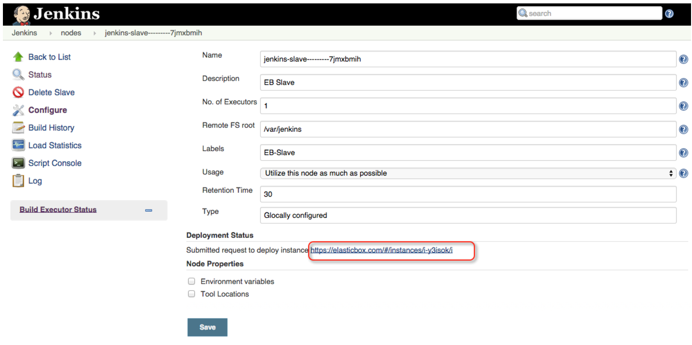

### Contacting ElasticBox Support

We’re sorry you’re having an issue in [ElasticBox](//www.ctl.io/elasticbox/). Please review the [troubleshooting tips](./troubleshooting-tips.md), or contact [ElasticBox support](mailto:support@elasticbox.com) with details and screenshots where possible.

For issues related to API calls, send the request body along with details related to the issue. In the case of a box error, share the box in the workspace that your organization and ElasticBox can access and attach the logs.
* Linux: SSH and locate the log at /var/log/elasticbox/elasticbox-agent.log
* Windows: RDP into the instance to locate the log at ProgramDataElasticBoxLogselasticbox-agent.log
