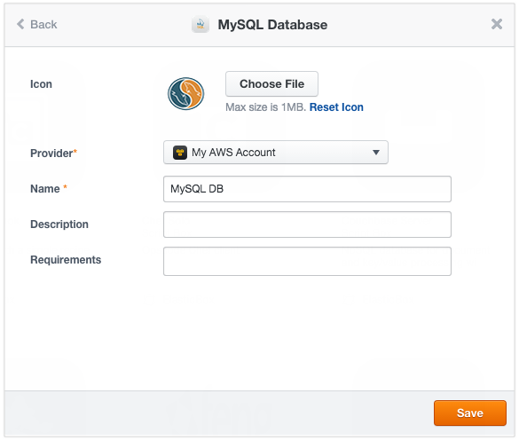
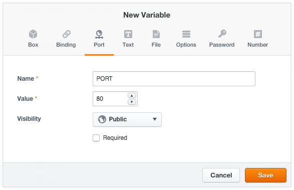
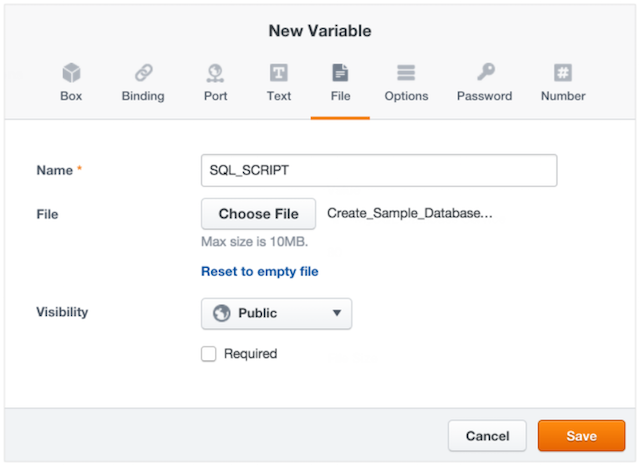
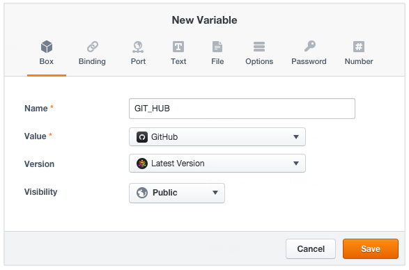
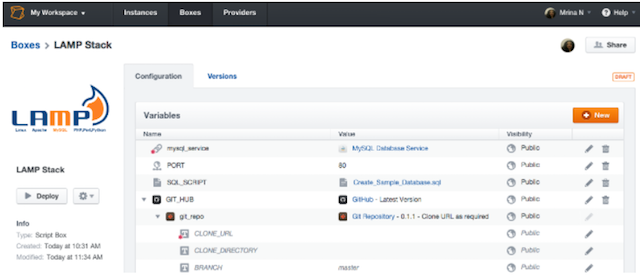
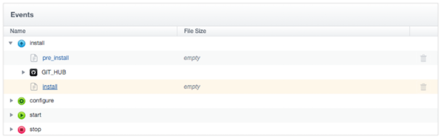
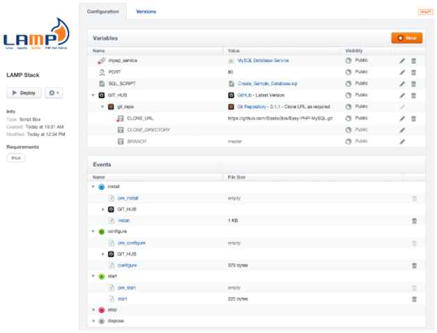
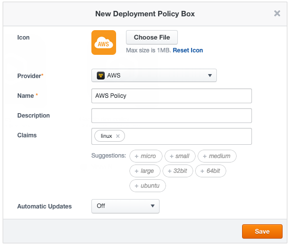
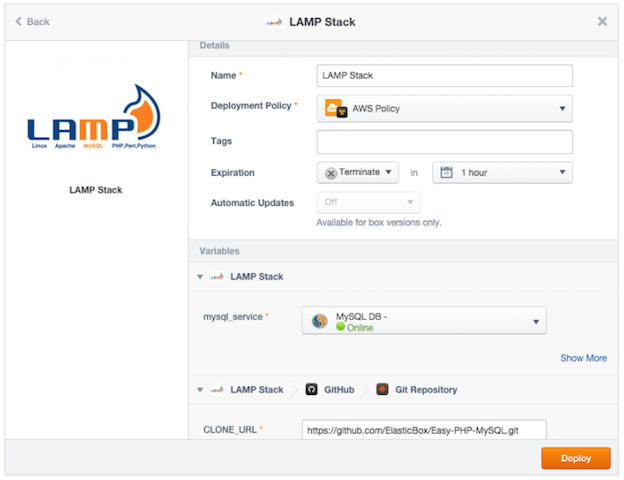

{{{
"title": "LAMP Stack Tutorial",
"date": "09-01-2016",
"author": "",
"attachments": [],
"contentIsHTML": false
}}}

### LAMP Stack Tutorial
In this tutorial, you configure and deploy a simple Apache, PHP, MySQL two-tier LAMP Stack app. You configure the app and database tiers separately and connect them with a binding.

The entire quick start takes 30 minutes or less to complete. By the end, you’ll be well on your way to define and deploy multi-tier applications in ElasticBox.

**In this article:**

* Before you begin
* Define the LAMP Stack database tier
* Define the LAMP Stack app tier
* Deploy the LAMP Stack app

### Before You Begin
* Sign in to ElasticBox or sign up, it’s free!
* Optionally, get a feel for building a basic Hello World box.
* [Register an AWS cloud account](./using-your-aws-account.md) as a provider in ElasticBox.

___


### Define the LAMP Stack Database Tier

**Create a MySQL Database box**

On the Boxes page, click New > CloudFormation and select MySQL Database. Name it MySQL DB and select an AWS provider account registered in ElasticBox because this box needs the AWS CloudFormation service. Save.



### Define the LAMP Stack App Tier

**Step 1. Create a LAMP Stack box.**

On the Boxes page, click **New > Script**. Name it LAMP Stack. Since LAMP needs Linux, tag it under Requirements. Save. Optionally, upload a matching icon to easily identify the box in the catalog.


**Step 2. Indicate a relationship to the database tier with a binding.**

 In the Configuration tab, under Variables, click **New**. Select **Binding**. Call it mysql_service and bind to the MySQL DB box you created earlier.

**Note:** Variable names are case sensitive, so name exactly as given.

At this stage, you’re selecting a box not a real instance for the binding. You’ll select the actual instance at deploy time. Since you need a database, make the binding required. You’re saying you need an available database instance before deploying the app tier.

Save when done to create the variable.


**Step 3. Allow traffic to and from the app tier with a port variable.**

In the Configuration tab, under Variables, click New. Select Port. Call it PORT and give 80 as the value.

Save when done to create the variable.



**Step 4: Add data for the database using a file variable.**

Copy, paste the following code in a plain text file. Save it as Create_Sample_Database.sql. Note the .sql extension.

```
CREATE DATABASE sampledb;

    USE sampledb;

    CREATE TABLE users (first_name VARCHAR(20),  last_name VARCHAR(20), address VARCHAR(20), login VARCHAR(20), password_hash VARCHAR(20));

    INSERT INTO users VALUES ('Antony','Kornings','1850, Las Ramblas','antonyk', 'e22c2d3bf2a5557cb971');

    INSERT INTO users VALUES ('Diana','Krallz','850, El camino','dianak', 'f2a5557e22c2d3bcb971');

    INSERT INTO users VALUES ('Edgard','Boxer','100, Alpine Street','edgardb', 'e25557cb9712c2d3bf2a');

    INSERT INTO users VALUES ('Nathaniel','Cold','55, Elm Street','nathanielc', '7cb971e22c2d3bf2a555');

    INSERT INTO users VALUES ('Michael','Snow','88, Alamo Road','dianak', 'd3bf2a5557ce22c2b971');
```

In the LAMP box Configuration tab, under Variables, click **New**. Select **File**. Call it SQL_SCRIPT and upload the file you saved. This file will be pushed to the database at deploy time.



**Step 5. Nest the default GitHub box to install PHP from GitHub.**

In the Configuration tab, under Variables, click **New**. Select **Box**. Call it GIT_HUB and pick the default GitHub box as the value.

Save when done to create the variable.



Now configure the GitHub default box to pull down PHP scripts at deploy time. Expand the GitHub box and the box variable inside called git_repo. In the context of the LAMP Stack box, edit the clone URL variable and set its value as follows:

CLONE_URL: **https://github.com/ElasticBox/Easy-PHP-MySQL.git**




**Step 6. Add events to install the LAMP stack app tier.**

Under Events > install, click **install**.



Copy, paste the following code in the install event dialog, then save.

```
#!/bin/bash

    # To ensure that all of your software packages are up to date, perform a quick software update on your instance.

    # This process may take a few minutes, but it is important to make sure you have the latest security updates and bug fixes.

    # We use the -y option that installs the updates without asking for confirmation.

    yum update -y

    # Install the Apache web server, MySQL, and PHP software packages.

    # We use the yum groupinstall command to install multiple software packages and all related dependencies at the same time.

    yum groupinstall -y "Web Server" "MySQL Database" "PHP Support"

    # Install the php-mysql package

    yum install -y php-mysql

    # Start the Apache web server

    service httpd start

    # Configure the Apache web server to start at each system boot

    chkconfig httpd on

    # Verify that httpd is on by running:

    chkconfig --list httpd

    # This shoul output something similar to the next line, showing httpd is on in runlevels 2, 3, 4, and 5:

    # httpd           0:off   1:off   2:on    3:on    4:on    5:on    6:off

    # To test your LAMP web server

    # Create a simple PHP file in the Apache document root.

    echo "" > /var/www/html/phpinfo.php

    curl http://127.0.0.1/phpinfo.php

    # You should see the PHP information page in the output of the install script

    # Delete the phpinfo.php file. Although this can be useful information to you, it should not be broadcast to the Internet for security reasons.

    rm /var/www/html/phpinfo.php
```

**Step 7. Add events that connect the tiers using the binding.**

Under Events > configure, click **configure**. Copy, paste the following code and save. This puts PHP in the Apache web server’s root directory and triggers the ElasticBox config command within a concatenate command to run the PHP script. This also gets credentials (public IP address, port, username, and password) of the MySQL Database Service through the binding.

```
 #!/bin/bash

    # In configuration Script there is available ip, and variables of the bindings we will show them for this sample.

    echo $mysql_service.address.public

    echo $mysql_service.port

    echo $mysql_service.username

    echo $mysql_service.password

    cp Easy-PHP-MySQL/index.php /var/www/html

    elasticbox config -i Easy-PHP-MySQL/db_connect.php -o /var/www/html/db_connect.php
```

Under Events > start, click **start**. Copy, paste the following code and save. Here the cURL command connects to the database server using the database credentials from the binding and downloads the file you uploaded in step 4. The script in the file creates a database with sample data.

```
 #!/bin/bash

    # In start script the bindings are ready for use

    curl -ks $SQL_SCRIPT | mysql --host=$mysql_service.address.public  --port=$mysql_service.port --user=$mysql_service.username --password=$mysql_service.password
```

Yay! You just defined a simple LAMP stack application and connected its tiers with a binding.



___


### Deploy the LAMP Stack App

To deploy the app, you need AWS as a provider because we’re using the AWS CloudFormation RDS database service. Here you’ll deploy each tier in the same region on EC2.

**Note:** AWS may charge for the instances you deploy. So after deploying, be sure to shut down the instances from ElasticBox to avoid unnecessary charges.

**Launch the Database Tier**

Before deploying the app tier, you need an active database instance, so launch the database box first. On the Instances page, click **New**. Select the MySQL DB box. Enter values for the username and password variables. The app tier pulls these values through the binding to connect to the database. Click **Deploy**.


**Launch the App Tier**

You need a deployment policy to consume the right AWS resources for the LAMP Stack box. From the Boxes page, click **New > Deployment Policy**. Select the AWS provider account registered in ElasticBox to which you deployed the database. Call the box AWS Policy. Tag Linux as a service the policy provides under Claims. By doing so, you’ll be able to select this policy when deploying the LAMP box. Save.



From the Instances page, click **New** and select the LAMP Stack box. For the deployment policy, select the AWS Policy you just created. For the mysql_service binding, select the database instance you previously launched. Also schedule the instance to terminate an hour after deploying to save money. Click **Deploy** to create an instance of the app tier.



See how ElasticBox launches the database and the app tiers on separate machines. Once the app tier comes online, you see it connected to the database.


You can browse to the application from the IP address on the Endpoints tab to see the results of your hard work.


### Contacting ElasticBox Support
We’re sorry you’re having an issue in [ElasticBox](https://www.ctl.io/elasticbox/). Please review the [troubleshooting tips](./troubleshooting-tips.md), or contact [ElasticBox support](mailto:support@elasticbox.com) with details and screen shots where possible.

For issues related to API calls, send the request body along with details related to the issue. In the case of a box error, share the box in the workspace that your organization and ElasticBox can access and attach the logs.
* Linux: SSH and locate the log at /var/log/elasticbox/elasticbox-agent.log
* Windows: RDP into the instance to locate the log at ProgramDataElasticBoxLogselasticbox-agent.log
