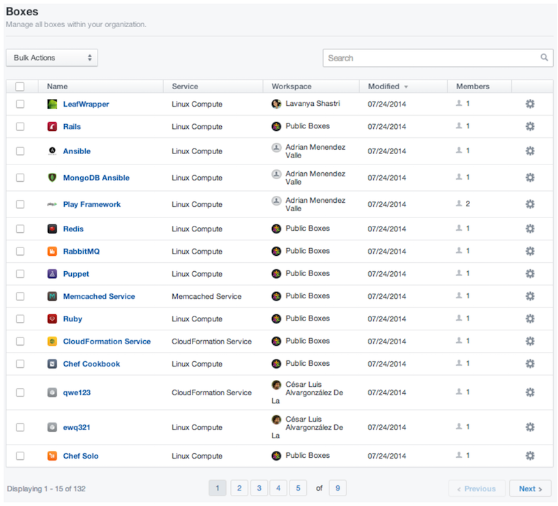
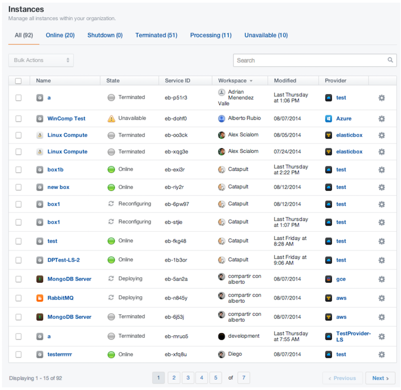

{{{
"title": "Manage ElasticBox Assets & Monitor Usage",
"date": "09-01-2016",
"author": "",
"attachments": [],
"contentIsHTML": false
}}}

### Manage ElasticBox Assets & Monitor Usage

From the admin console, you get full purview over assets others created in your organization. This includes users, providers, boxes, instances, and workspaces. While you can control assets with some bulk actions, you get complete access as if you were its owner directly from the asset page linked from the console.

**In this article:**

* Manage Users
* Manage Providers
* Manage Boxes
* Manage Instances
* Manage Workspaces
* Monitor Usage

### Manage Users

In the admin console, **Users** shows a list of all users in the organization who use ElasticBox. From this view you can do nifty things to manage them:

* Change their username if you need to.
* In the **Unmanaged** tab, see which users signed up for ElasticBox with their company email, but are not added to your ElasticBox organization. This is likely if they signed up before your organization was officially created in ElasticBox. To add them to your organization, give us a list of these users. After that, you’ll see them under the **Managed** tab.
* At a glance, you can tell when a user created their account to get an idea for when they started using ElasticBox.
* To delete users or convert their personal workspace into a team one, see Workspaces.

### Manage Providers

Under **Providers**, you can see a list of all the provider accounts users in the organization have added. Here are some options to manage providers in this view.

* See which provider accounts are online. Online means they’re available for deploying. If unavailable, you can sync to get them online or go to the individual provider page and see what’s wrong by looking at the logs.
* A quick look tells you in whose workspace a provider belongs. If it’s an individual workspace, you know they added that provider.
* Control access to provider accounts. You have full access to provider accounts even those added by others in the organization. Typically you can share to individual or team workspaces by giving edit or view access. Edit gives users full control over the provider account except the option to delete. View lets them deploy to the provider. You can also make someone the owner of a provider account. There can only be one owner at a time. Click on a provider to manage the account from its page.
* Select all the provider accounts in view to sync or delete them in bulk. But to do this, they must all be in the same state as either online or unavailable.

### Manage Boxes

All boxes in the organization are listed under **Boxes** in the admin console. You can manage boxes from everyone’s workspace here.

* Select any box to change its name, add an icon, describe, or tag it. Or go to the box page directly to do these things as well as share or change box ownership.
* Delete unused boxes by selecting them in bulk and clicking delete from the Bulk Actions menu.
* See which boxes are used widely. That is, see which ones have the most members or is shared with many people or teams.
* Sort on the Workspace column to see how many boxes and of what type are in a user or team’s workspace.

### Manage Instances

Take a look at all the instances in the organization by their state under **Instances** in the admin console. You get a quick tally of the total number of instances there are, how many of them are online, shut down, terminated, or processing.

* Select all the online instances and trigger instance actions in bulk from the Bulk Actions menu. You can trigger operations like reinstall, reconfigure, shut down, terminate. See what these [instance operations](./deploying-managing-instances.md) mean.
* Select all terminated instances and delete them at one shot.
* Click the instance to access its page directly.
* See to which provider an instance is deployed. Then go to the provider page to see who owns it.
* See when an instance last changed–maybe its configuration or lifecycle changed.
* Do a hard-terminate on processing instances by clicking Force Terminate.

### Manage Workspaces

View all the team and individual workspaces in your organization under **Workspaces** in the admin console. You can manage workspaces for your organization as follows:

* Add members to a team workspace or make someone the workspace owner.
* Change the workspace name, icon, or delete the workspace.
* Sort by instances, boxes, providers to see which workspace has the most members or boxes, instances, providers. This tells you which workspace is most used.
* See the aggregate number of boxes, instances, providers available in a workspace. Click on these aggregates to see a list of providers, boxes, or instances specific to that workspace. From this view, you can easily take specific or bulk actions.
* Sort the list of workspaces to find out details like whose account a workspace is in, when the workspace was created, or how many members it has.

**Delete Users**

From the Personal tab, you can delete users one at a time when you want to remove duplicate user accounts or deprecate accounts for users no longer in the same role or with the company. Follow these steps to delete a user.

1. Under **Workspaces > Personal**, locate the workspace of the user whose account you wish to remove.

2. From the gear menu drop-down, click **Convert to Team**.

   **Note:** When you do this, assets from the user’s workspace are transferred to a team workspace and you’re assigned owner of that workspace. At the same time, the user’s account is deleted from your ElasticBox organization and they won’t be able to log in. Now use the Team tab, to edit the workspace details, add users, or transfer ownership to someone else.

### Monitor Usage

The admin console is designed to provide insights into how users are deploying and consuming resources. For example, tags give you reporting metrics from any cloud provider to learn how provider resources are spread across teams and users in your organization.

Even with ElasticBox objects like providers, boxes, instances, workspaces, you get a wealth of information and monitoring capabilities. As an example, from the Workspaces section, at a glance, you can tell which projects have the most traction, which ones people tend to collaborate more closely on, and so forth.

With such insights you can enact best practices and policies to enable people to work together better by removing organizational bottlenecks. You can proactively detect patterns, concerns, and report on them to streamline operations as well as control costs.

### Contacting ElasticBox Support

We’re sorry you’re having an issue in [ElasticBox](https://www.ctl.io/elasticbox/). Please review the [troubleshooting tips](./troubleshooting-tips.md), or contact [ElasticBox support](mailto:support@elasticbox.com) with details and screen shots where possible.

For issues related to API calls, send the request body along with details related to the issue. In the case of a box error, share the box in the workspace that your organization and ElasticBox can access and attach the logs.
* Linux: SSH and locate the log at /var/log/elasticbox/elasticbox-agent.log
* Windows: RDP into the instance to locate the log at ProgramDataElasticBoxLogselasticbox-agent.log
