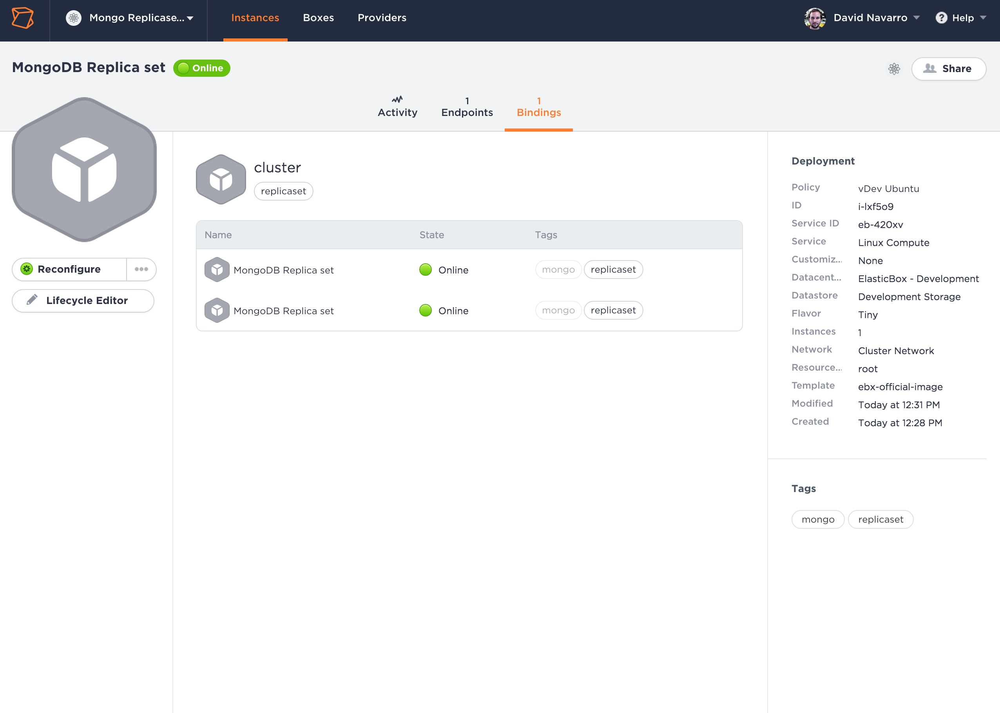
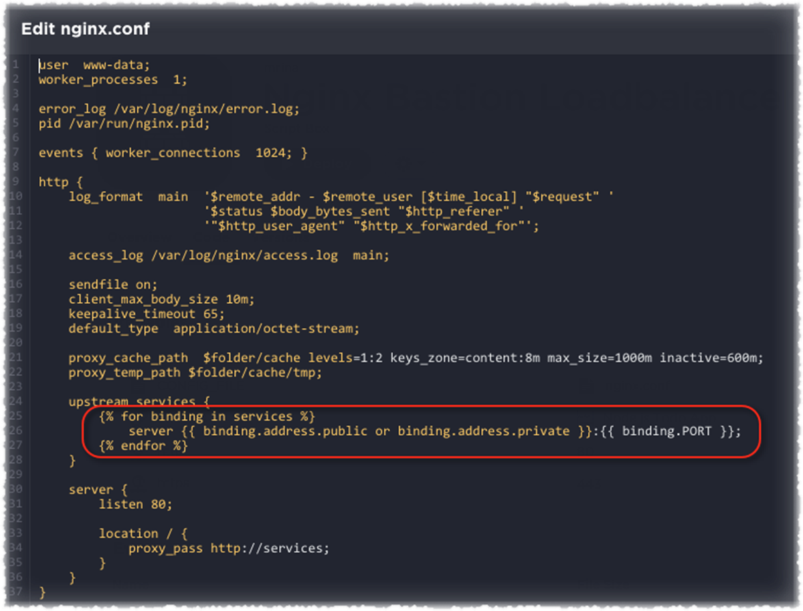
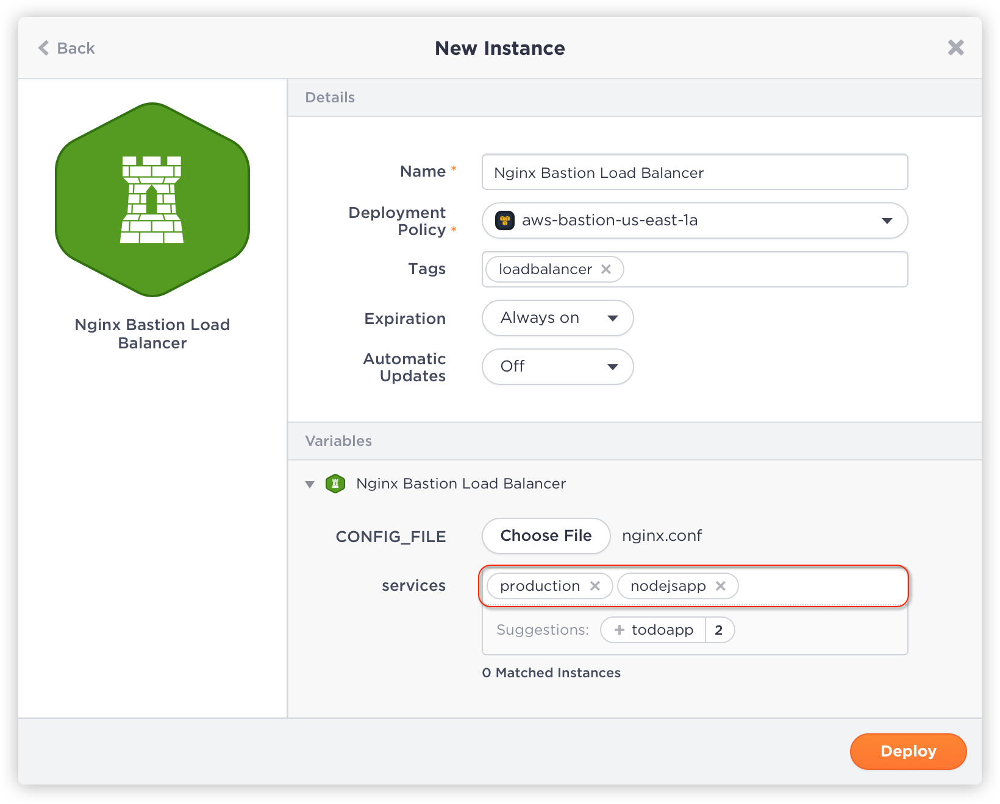

{{{ "title": "Binding Large-Scale Deployments",
"date": "09-01-2016",
"author": "",
"attachments": [],
"contentIsHTML": false
}}}

Bindings glue together different parts of a multi-tier application over the network. These components can be parts of an application stack, a load balancing pool, cluster, and more. Bindings enable services to auto-discover and connect dynamically at scale. They also reconfigure the instances that need it to keep their configuration up to date.

**In this article:**

* What are bindings?
* Which instances does a binding connect to?
* How to use the bindings in configuration?
* Bindings automatic reconfiguration
* Using bindings in three steps
* Step 1. Define binding variables
* Step 2. Configure bindings for your application
* Step 3. Tag bindings for instance connectivity

### What are bindings?

Bindings are [variables](../ElasticBox/parameterizing-boxes-with-variables.md) that you can add to boxes. They represent a connection from the deployed box to other instances. Bindings are used to configure your event scripts of configuration files to work with the other instances.

### Which instances does a binding connect to?

The instances where a binding variable points to are defined by the criteria you configure. You refine the criteria by setting a specific box type for the binding and specifying tags to match. A target instance will be in the binding of the origin instance if:

* The instance is shared in the workspace owner of the origin instance.
* It has connection information available, this usually means that the addresses are available.
* The target instance is not terminated.
* The target instance contains a box of the type in the binding variable.
* The target instance contains at least all the tags in the binding variable.

Here is how the binded instances show after the instance is online.



### How to use the bindings in configuration?

The bindings information is provided in the event scripts (except the install scripts) and configuration files (via elasticbox conf). A binding is a jinja2 list which contains many information of the target instance to be used. The most commonly used information are addresses and variables.

To access a variable on the box of the target instance, just use it’s variable name. For example binding[0].varName access to the varName variable of the first instance in the binding.

To access the addresses of the target instance, you can use binding[1].address.private or binding[1].public.

This allows you to access the private address or, if it’s not available, the public one.

To do something for each instance in the binding, you can use a jinja2 loop. For example, to print an IP per binding instance you can use:

```

{{ i.address.public or i.address.private }}

```

Lastly, the list of bindings provides direct access to the first instance attributes. For example,

{{ binding.varName }}

is equivalent to

{{ binding[0].varName }}

### Bindings automatic reconfiguration

The bindings are calculated after any install event and before the reconfiguration. At that point all the matching instances are saved and will be available in the different events. Keeping the bindings up to date implies reconfiguring the instances to update the bindings and all configuration scripts and files. To help with this task, ElasticBox automatically reconfigures the instances that require it after some changes. You can trust ElasticBox to keep updated the following information:

* The target instances in each binding. This means deploying or terminating instances, or changing their tags, will automatically reconfigure the instances that require it to keep the information up to date.
* The IP information shown by ElasticBox. Every time we detect an IP change, the instances that point to that instance will reconfigure. The detection of IP is provider specific.

This covers almost all cases of reconfiguration, but there are two details to take into consideration. First, we don’t reconfigure if a variable is changed via elasticbox.set or with the lifecycle editor. If other instances are accessing that variable through bindings, you need to reconfigure them also. Second, after a pull version on an instance you should reconfigure all instances that point to that instance so that they get the latest version of the box variables.

### Using bindings in three steps

There are three steps to make bindings work. Say a Node.js application needs MongoDB and needs to become a member of the frontend Nginx load balancing pool. To enable the database and load balancer connections in this example, we use bindings.

**Step 1. Define Binding Variables**

Binding variables are [defined in box automation](../ElasticBox/parameterizing-boxes-with-variables.md). In this example, we defined two binding variables. One in the Nginx loadbalancer box to connect to Node.js application instances, and another in the Node.js application box to connect to the MongoDB database.

In both cases, the bindings point to a box type, which allow the services to bind only to instances of the box type at deploy time.


**Step 2. Configure Bindings for Your Application**

To establish connectivity to a remote service, we must configure the bindings in the box. We do so in the box configure script. Here’s an example. To connect the Nginx loadbalancer to the Node.js application instances, we configure the bindings as follows. In the Nginx loadbalancer box configure script, we run the ElasticBox config command to execute a file variable (ngix.conf)that has the connection string.




Here the ‘services’ binding variable polls each instance fulfilling the binding criteria. As you know, when we defined the binding, the criteria was to connect to all instances of the Node.js application box type.

```
upstream services {

    server {{ binding.address.public or binding.address.private }}:{{ binding.PORT }};

}
```

Within the connection string, each element polls values of the Node.js application box variables, like the port. IP addresses are [default system variables](../ElasticBox/syntax-for-variables.md) available for every instance. Besides IP addresses, bindings provide lots of helpful data about remote services. You can pretty much query ports or any other variables defined in box automation through bindings.

**Step 3. Tag Bindings for Instance Connectivity**

Tagging bindings allow services to discover each other automatically. At deploy time, for the bindings defined in the boxes, we need to apply tags of instances to which they can bind. In this example, we ask the Nginx loadbalancer to bind to instances tagged production and nodejsapp. What this does is, the binding not only looks for instances of a particular box type as defined in the box but makes sure the instances match these tags. The binding takes effect only when both conditions are met. This is how tagged bindings allow instances to connect automatically to one or many services at scale.



As another example, here we launch the Node.js application specifying its binding connection to MongoDB instances tagged production, mongodb. Importantly, also note that we tagged the Node.js instance as production and nodejsapp so that Nginx can bind to it.


### Contacting ElasticBox Support

We’re sorry you’re having an issue in [ElasticBox](//www.ctl.io/elasticbox/). Please review the [troubleshooting tips](../ElasticBox/troubleshooting-tips.md), or contact [ElasticBox support](mailto:support@elasticbox.com) with details and screenshots where possible.

For issues related to API calls, send the request body along with details related to the issue.

In the case of a box error, share the box in the workspace that your organization and ElasticBox can access and attach the logs.
Linux: SSH and locate the log at /var/log/elasticbox/elasticbox-agent.log
Windows: RDP into the instance to locate the log at ProgramDataElasticBoxLogselasticbox-agent.log
