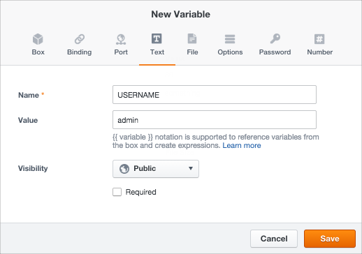
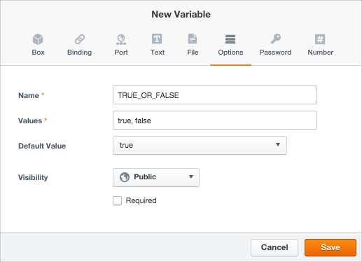
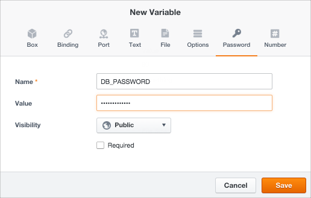
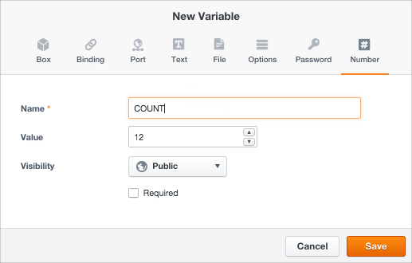

{{{ "title": "Parameterizing Boxes with Variables",
"date": "09-01-2016",
"author": "",
"attachments": [],
"contentIsHTML": false
}}}

An application’s deployment lifecycle is parameterized in boxes using variables. Parameters denote dynamic data like database connection strings, endpoints, and application settings. Since you can’t know all possible values for the different environments and don’t want to hard-code sensitive information like passwords, it’s a good idea to define such data as variables.

It works like this: define variables in box automation. Then refer to them in box [event scripts](./start-stop-and-upgrade-boxes.md) with Jinja templating [syntax](./syntax-for-variables.md). For each environment like development, staging, production, you can customize deployments by passing different values to the variables. ElasticBox executes the event scripts replacing variables with the values you give at deploy time.

Boxes support eight variable types depending on the data type or usage like any programming language. They are box, binding, port, text, file, options, password, and number.

**In this article:**

* Creating variables
* Box type
* Binding type
* Port type
* Text type
* File type
* Options type
* Password type
* Number type

### Creating Variables

In a box, under Code, click New and select a variable type, then specify a name and value.

**Required Variables**

Mark variables like port, text, file, options, password, and number as required if you expect a custom value before deploying. Say you define a database box that needs a username and password to connect. At this point, you know they’re necessary, but can’t get their values till deploy time. So mark them as required.

**Variable Visibility**

A few settings such as Public, Private, and Internal determine variable privacy. Variables have public visibility if you don’t set anything.

**Public:**

Allows customizing values at deploy time.
Allows parent boxes and bindings to see and access values.

**Private:**

Same as the public setting except that bindings can’t access their values.

**Internal:**

Hides variables at deploy time.
Bindings can’t access their values.

### Box Type

Add a box type variable to consume the configuration of another box in your workspace. This is how you stack to achieve multi-tier applications. Child boxes within deploy on the same virtual infrastructure as the parent box.

Stack as many child boxes as you like, as long as they match the parent box Windows or Linux type. To understand the order in which parent and child box scripts execute, see [Event Execution Order](./start-stop-and-upgrade-boxes.md).


Parent box visibility into child boxes:

* When you stack a child box, you consume its variables and scripts in the parent box.
* You can’t change child box configuration in the parent box, but you can change variable values and scripts to suit the parent box deployment.

Boxes can have versions, which are snapshots of stable configuration. When you stack a box, select a specific version if available or use its latest configuration.

**Example**

Here you have a box variable called INSTALLER that points to the Package Installer box as shown.

You can access all the variables of the Package Installer box with this syntax:

`\{{ BOX_VARIABLE_NAME.VARIABLE_NAME }}`

You can also override their values within the context of the parent box.

For example, to access the UPGRADE_ON_INSTALL variable in the Package Installer box from an event script in the parent box, you can do as follows:

```
#!/bin/bash
if [[\{{ INSTALLER.UPGRADE_ON_INSTALL }} = “false”]] then
echo “It’s false”
fi
```

### Binding Type

Bindings provide component connectivity for mutli-tier applications, load balancing pools, cache services, and clusters. Each binding can connect one or more instances. Jinja templating in box configure scripts helps you query binding connection data such as public or private addresses, connection strings, passwords, tokens, ports, and more from linked instances.

**Defining Bindings**

In this section, we look at how to define bindings. To connect instances at deploy time using bindings, [see here](./managing-multi-tier-applications.md).

To define a binding, add a variable of type Binding. Then set its criteria in one of two ways:

* Any Box Instance. In the Value drop-down, select Any Box Instance to bind to any active instance in the current workspace.

    

* Specific box type. In the Value drop-down, choose a particular box type from OS compatible boxes (Windows or Linux Compute) in the workspace. We recommend this option as it allows binding to active instances in the workspace that match the box type.

**Getting Binding Connection Data**

Apply Jinja templating to binding variables in the box configure script to get instance connection data or other values.

**Example**

In this example, for a binding called bindingA, we can get the connection data for all instances that bindingA points to with this Jinja reference:

```

        server \{{ binding.address.private or binding.address.public }}:\{{ binding.http or binding.https or fallback_binding_port }};

}
```

To get value of a variable named connection_string, we apply this Jinja to look up the binding to the first deployed instance: `\{{ bindingA[0].connection_string }}`

As an alternative to Jinja, you can do the same thing with text expressions. For example, since CloudFormation boxes don’t support event scripts, you can use text expression variables to process binding connections.

### Port Type

Use it to store TCP/IP port information. Access it from event scripts using Jinja just like text variables. At deploy time, ElasticBox uses this port to open a connection to the instance if you select the **Automatic** security group option in the deployment profile.


### Text Type

Use this type to store strings like usernames, paths, file names, connection strings, endpoints URLs, binding values, and so on.



Specify them in plain text or as expressions.

* **Plain Text** can contain any string value.
* An **Expression** can combine string values as well as variables in the parent or child boxes.

More on text expressions:

* Use expressions to generate strings for bindings or pass values between boxes when deploying.
* Text expressions save you the trouble of storing and passing strings in event scripts. They let you manage box configuration changes in one place instead of in several scripts.
* CloudFormation templates don’t allow event scripts. So when binding from CloudFormation boxes, use text expressions to store binding variable references.
* To refer to variables, follow this Jinja syntax. You can traverse any number of child boxes.
  * Parent box variables: `\{{ variable_name }}`
  * Child box variables one level deep: `\{{ child_box.variable_name }}`
  * Child box variables two levels deep: `\{{ child_box_1.child_box_2.variable_name }}`

**Examples**

A plain text variable called USERNAME is used to create a directory on the virtual machine using the username supplied by the user deploying the box. See how it’s used in the event script to do that:

```
#!/bin/bash
su - \{{ USERNAME }} “mkdir .ssh”
```

Here’s another example of two CloudFormation boxes that connect over a binding using a text expression: An EC2 box binds to a security group CloudFormation box through a binding called CFBinding. To pass the binding connection string, the EC2 box has a text expression set to `\{{ CFBinding.InstanceID }}`. Here, CFBinding refers to the security group CloudFormation box where InstanceId is a variable. As a result when deployed, the EC2 box launches a Linux instance in a security group using CloudFormation.

### File Type

Use it to upload a file with binary or ASCII data. Files usually store configuration data used by applications.


More on file type variables:

* Each file can be as large as 10 MB.
* Use an event script on the box to download the file to the virtual machine when deploying.
* Files can contain variable references, including box or binding type variables. But to act on them, you must execute the file with a [Config command](./elasticbox-commands.md) in a box event script.

### Example

Say you upload a configuration file to a file variable called CONFIG_PARAMS. And its code refers to some variables on the box.

To access this file from an event script on the box, use a command like cURL or WGET to download and write to the file in the virtual machine file system.

```
#!/bin/bash
curl -ks \{{ CONFIG_PARAMS }} -o
```

Since the file refers to variables in the box, pass the file through the ElasticBox Config command from an event script as shown. ElasticBox replaces these variables with dynamic values when deploying the box:

```
#!/bin/bash
curl -ks \{{ CONFIG_PARAMS }} | elasticbox config -o /tmp/configfile.cf
```

### Options Type

Use it to provide a drop-down of values for users to choose from when deploying the box.



**Example**

Here’s a variable called TRUE_OR_FALSE with two possible values, true and false. Access the option variable from an event script just like you would the text variable.

```
#!/bin/bash
if [[ “\{{ TRUE_OR_FALSE }}” = “true” ]] then
echo “the value is true”
fi
```

### Password Type

Use it to assign a sensitive string value that’s hidden by the ElasticBox interface. Access it just like text variables in event scripts. Typically, you use passwords to give admin accounts access to the virtual machine or applications in it.



**Example**

This script returns the value of a password variable.

```
echo This returns the value of \{{ DB_PASSWORD }}
```

### Number Type

Use it to store integer values and access them in event scripts just like text variables.



**Example**

This script returns the value of the number variable.

```
echo This returns the value of ${COUNT}
```

### Contacting ElasticBox Support

We’re sorry you’re having an issue in [ElasticBox](//www.ctl.io/elasticbox/). Please review the [troubleshooting tips](./troubleshooting-tips.md), or contact [ElasticBox support](mailto:support@elasticbox.com) with details and screenshots where possible.

For issues related to API calls, send the request body along with details related to the issue. In the case of a box error, share the box in the workspace that your organization and ElasticBox can access and attach the logs.
* Linux: SSH and locate the log at /var/log/elasticbox/elasticbox-agent.log
* Windows: RDP into the instance to locate the log at ProgramDataElasticBoxLogselasticbox-agent.log
