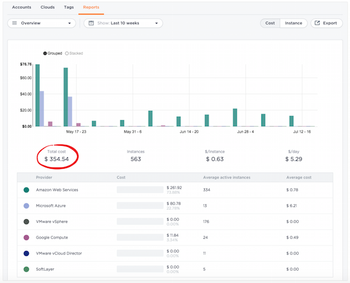
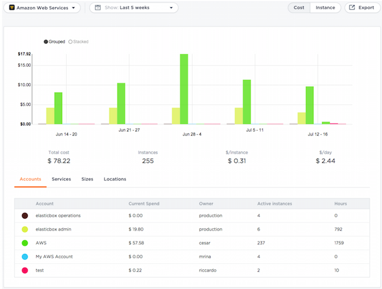
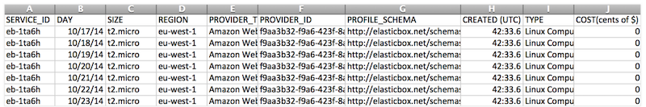
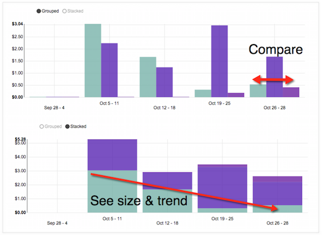
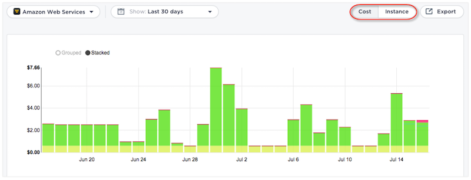
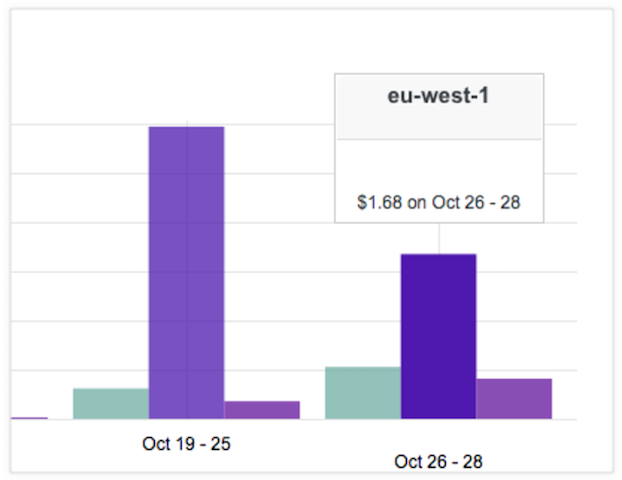
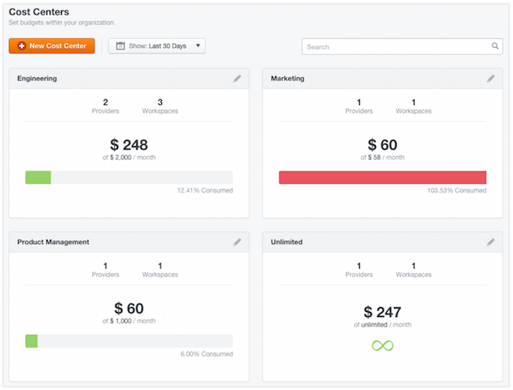

{{{
"title": "Get Control and Insights with Cloud Reporting",
"date": "09-01-2016",
"author": "",
"attachments": [],
"contentIsHTML": false
}}}

### Get Control and Insights with Cloud Reporting
<iframe src="//player.vimeo.com/video/111544299" width="561" height="316" frameborder="0" webkitallowfullscreen="" mozallowfullscreen="" allowfullscreen=""></iframe>

Reports show cloud costs and resource usage in public and private clouds. It includes public clouds like AWS, Google Cloud, Azure and private clouds like VMware vCenter, VMware vCloud Director, and SoftLayer.

If reporting is turned on for your enterprise, ElasticBox Administrators can access it from the admin console. Reports also help you make budget-friendly decisions and curb costs through cost center budgeting.

* **Reports** - Show cost and usage for a given date range.
* **Pricing List** - Shows public cloud pricing for Linux and Windows VMs by instance type. The pricing helps us measure costs for public cloud reports. Since private clouds don’t have that information, we report on resource usage.
* **Cost Center Budgeting** - Lets you set and enforce a quota on how much user or team workspaces can consume from a cloud account per month.

### Reports
Reports are in the admin console under Providers > Reports. They show the cost and resources consumed by public and private cloud deployments. There are two kinds of reports–overview and cloud specific reports. The overview report gives the overall big picture while cloud specific reports drill-down data by cloud.

This section has some report samples to help understand how much users consume and how much deployments cost.

### Overview Report
To see the report, select **Overview** under Providers > Reports in the admin console and select a date range.

**Sample #1:** How much do we spend on cloud deployments daily, weekly, monthly, or over time?

This example shows total dollars spent on public and private cloud deployments in the last 10 weeks. Select a different date range to see other weekly or monthly data. For daily values, highlight a specific day in the chart.

**Sample #2:** Which cloud costs the most?

The same report shows that AWS costs the most. The table in the report shows this data.

**Sample #3:** How many instances were deployed daily, weekly, monthly, or over time?

Here you see the total number of active deployments in the last 10 weeks under the Instance tab. They include instances launched in that time as well as those launched beforehand but still active. Over time, the chart shows which periods saw a spike in deployments.

To track data for other periods, select the appropriate weekly or monthly date range.

### Cloud Specific Reports
To see cloud specific reports, select the cloud from the drop-down under Providers > Reports in the admin console.

**Sample #4:** Which accounts for a particular cloud add up the most hours or cost?

Under Accounts in this AWS report, see which AWS accounts in the last 5 weeks racked up the most compute hours and cost. It’s easy to extrapolate that some accounts though they may have used more compute time still cost less. Spot them and share their best practices for the rest of the team to follow.
In this view, you can deselect accounts to filter for relevant data in the chart.

**Sample #5:** In a given cloud, which compute instance size is most used?

If we look under Sizes in this AWS report, we see that t1.micro is the most deployed instance type. You can get other such insights from cloud specific reports.

**Sample #6:** Where do users most deploy?

To what regions or data centers do users most deploy in AWS? That’s what this AWS report answers under Locations.

### Export Data
To further analyze data or build custom reports of your own, export data as a CSV file.

Under Admin Console > Providers > Reports, select a date range and click **Export**. This downloads data in a CSV file on to your local machine for the date range selected.

Here’s a look at sample data from an exported CSV file. It shows deployed instances by their service ID, their values for each day in a specific date range, and date of their launching in UTC format. The data includes image size, the provider type, provider ID, profile schema, service type, and cost in cents.

### Chart Visualizations
In report charts, you can visualize data with these options.

* View data as grouped or stacked. **Grouped** is better for comparing data sets within a specific date range. **Stacked** helps you understand the size of a sample relative to others and see how it trends over time.

   

* Switch between Cost or Instance tabs to see the breakdown by cost or the number of instances.

   

* Highlight shaded areas of the chart to see individual values.

   

### Pricing List
Pricing List in the admin console shows the latest prices of Linux and Windows VMs for the AWS, Google, and Azure public clouds. We use these prices to calculate cloud report costs. This listing is a good place to check price changes by cloud.

To fine-tune your listing, filter by a specific cloud and region. Or search for a specific size (or flavor) as shown. Sort column headers to see prices from high to low or vice versa.

### Cost Center Budgeting
Cost Centers help you set and enforce a quota on how much users or team workspaces can consume from a cloud account per month. If they exceed the monthly quota, their workspace prevents them from deploying newly using that cloud account.

**Steps**

1. Create a cost center. In the admin console under Cost Centers, click **New Cost Center** and name the group or division whose usage you want to monitor.

2. Assign workspaces. Look up and add workspaces of users, teams, or projects. **Note:** A workspace can only belong to one cost center at a time.

3. Set quota for each cloud account. Choose how much money or resources selected users or workspaces can consume from a cloud account per month. For public clouds, you can set a budget while you can limit by the amount of CPU, memory, and disk resources for private clouds.
   

4. Enforce quota. Turn on to put the limits in place.

5. Save.
   Once you set up cost centers, you can track to see how teams or projects are spending monthly, whether they’re staying within budget in the last 30 days or over the past month. If they go over 90% quota, they’re shown in red. When they’re pretty close to hitting the quota limit, you can proactively send an email alerting them.
   

### Contacting ElasticBox Support
We’re sorry you’re having an issue in [ElasticBox](//www.ctl.io/elasticbox/). Please review the [troubleshooting tips](./troubleshooting-tips.md), or contact [ElasticBox support](mailto:support@elasticbox.com) with details and screen shots where possible.

For issues related to API calls, send the request body along with details related to the issue. In the case of a box error, share the box in the workspace that your organization and ElasticBox can access and attach the logs.
* Linux: SSH and locate the log at /var/log/elasticbox/elasticbox-agent.log
* Windows: RDP into the instance to locate the log at ProgramDataElasticBoxLogselasticbox-agent.log
