{{{
"title": "Setting Up CI/CD with ElasticBox, Jenkins and Bitbucket",
"date": "09-01-2016",
"author": "",
"attachments": [],
"contentIsHTML": false
}}}

### Setting Up CI/CD with ElasticBox, Jenkins and Bitbucket
The ElasticBox Jenkins plugin automates CI/CD on any cloud and SCM. In this article, we use Bitbucket as the SCM.

**Note:** To get started, you need a Jenkins server with Bitbucket and ElasticBox plugins.

To add ElasticBox build steps in Jenkins jobs, go to the job page. Under Build, click **Add Build Step** and select an ElasticBox deploy, manage, or update step.

**In this article:**
* Previous requirements
* Setting up the continuous integration environment
* Reacting to changes in Bitbucket
* Pull Request lifecycle
* Previous requirements

### Previous requirements
1. You will need a Bitbucket repository.

    Example: In this [repo](https://bitbucket.org/oserna/hello-world-war) you can find a Java web application:

    

    The repo was cloned in the local environment:

	

2. You will need a Jenkins instance up and running.
    In our case we are going to deploy the latest stable Jenkins version using a box created in ElasticBox. We created this box for future use when we need to provision a Jenkins environment again. At this point, all we need to do is to deploy this box and a Jenkins master with all the plugin configurations will be setup within minutes.

    

3. We will need an Apache Tomcat 7.
    In order to keep it simple we decided to create a tomcat box in ElasticBox to deploy the apache tomcat server.

    

### Setting up the continuous integration environment
The objective is to demonstrate how easy it is to set up a continuous integration environment using Jenkins, the ElasticBox Jenkins plugin and Bitbucket as repository.

Below is a diagram of workflow and how all the components work together.


1. Set up the Jenkins instance (in our case we will deploy the box we have created previously).

    * Deploy the box.

    

    * Choose the policy box.
    

2. Configure the ElasticBox cloud in the Jenkins Manager section.

    

    * In the cloud section we add the ElasticBox cloud:

    

3. Create a Jenkins job in order to see all the pieces working together.

    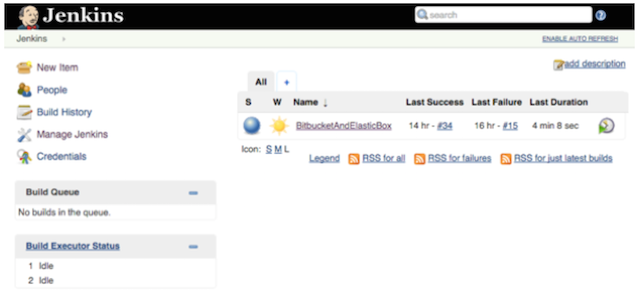

4. Now we are going to configure the job:

	

5. In the Source Code Management section we have to configure the Bitbucket repository (Git should be installed in the Jenkins node):

    

    In this case the url will be: **https://oserna@bitbucket.org/oserna/hello-world-war.git**
    Enter your credentials in order to access the repository.

    

6. In the Build section we add a DeployBox build step in order to deploy our previously created Tomcat box.

    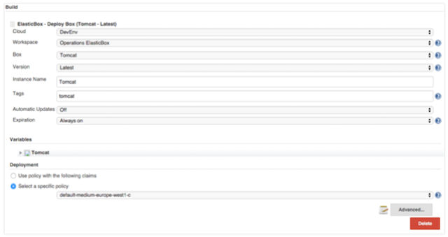

    In the previous schema you saw that we selected the Tomcat box with its latest version. We also added the tag “tomcat” to that instance in order to easily locate them in our cloud. In this case, we have selected to deploy this box in the Google Compute Engine (GCE) using the policy box below:

    

7. Now, once we have configured the Tomcat box that will be deployed, we need to build the source code that we have downloaded previously from the Bitbucket repository. Using a free style Jenkins job and not a maven Jenkins job, we will have to create a shell script step builder:

    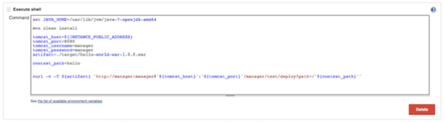

    Apache Maven should be previously installed and added to the path in order to execute the order:

    ```
        mvn clean install
    ```

    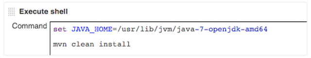

    As you might have noticed, the last command in the shell deploys the just war created package in Tomcat.

    ```
    curl -v -T ${artifact} 'http://manager:manager@'${tomcat_host}':'${tomcat_port}'/manager/text/deploy?path=/'${context_path}''
    ```

    

8. Let’s see how it works:

    * The job gets the code from the repo:

    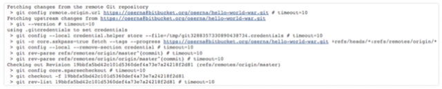

    * In the next step the job deploys the tomcat box.

    

    * Now the job executes the build.

    

    

    * Notice that it finally deploys the war package in the Tomcat server.

    

    * And it works!!

    

 9. All the pieces working together.

    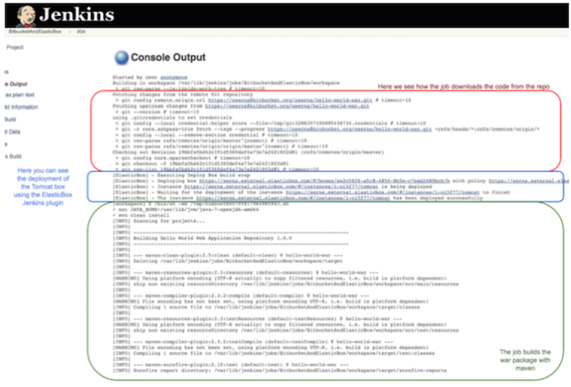

10. Tomcat deployed with ElasticBox Jenkins plugin.

    

### Reacting to changes in Bitbucket
In our previous case we spent some time setting up our continuous integration environment. We’ve started using Jenkins, Bitbucket and the ElasticBox Jenkins plugin, and so far we’re pretty happy. The next goal for us is to set up a Bitbucket service hook to trigger our builds.

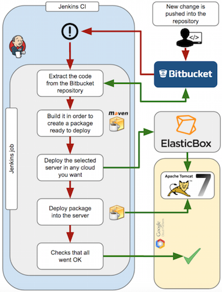

In the job that we created while setting up our continuous integration environment, we are going to enable notifications when a change is made in the Bitbucket repository. We do that in the Build trigger section in the configure job page.


We now have to make the proper changes in order to enable the hooks from the Bitbucket repository. Adding webhooks pointing to our Jenkins CI server.


We make a change in our source code (previously cloned from the repository) within a local environment by a new HTML paragraph tag.

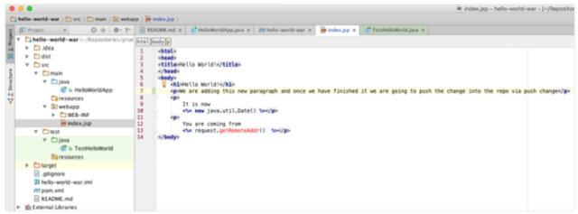

Once the change (the feature) is done we make the commit in our local repository and the push is made into the remote Bitbucket repository.


After the push into the Bitbucket repository, the job is triggered.

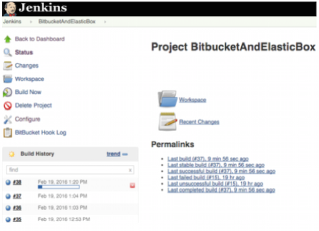

We will confirm that the result is what we expected, the package was properly created and deployed into the Tomcat server.


We can see that our change is ready to be tested. And yes!!, our new paragraph is there.
See the hello world page served from Tomcat.


Just being aware of the push changes in your repo provides many management possibilities depending on the type of development workflow in your company. You have to decide what push hooks will trigger Jenkins jobs. Such scenarios as every push event being able to trigger a Jenkins job or pushing events specific activities in a specific branch truly depends on your development workflow, and can be customized based on your business . As you can imagine the push event is the simplest and yet, most detailed way that you can handle an event. For example take the following classic Git workflow below:


So, assuming that you are using a branch that serves as an integration branch for features (this is the purple branch in the above schema), it may be enough (from the Jenkins perspective) to be notified about the pushes in the integration branch. A Jenkins job would be triggered every time that a new commit is added to the integration branch. The job could also send an email to whoever you want to be notified of build result or other actions that the job is able to do. However, better integration models would be more effective if we could be made aware (in Jenkins) about the different phases of the Pull Request lifecycle. Lets now cover this process next.

### Pull Request lifecycle

As you probably know, pull requests are a tool for developers to notify the rest of the team when a new feature is completed. This makes everyone aware that they need to revise the code before merging it from the feature branch into the master. So, being aware of every commit in the repo, as we did in the previous chapter, is cool, but if we’re able to build pull requests from Bitbucket and report the test results, that would be even better. Below you can see the Pull Request lifecycle as a part of our vision about how CI & CD can be implemented.

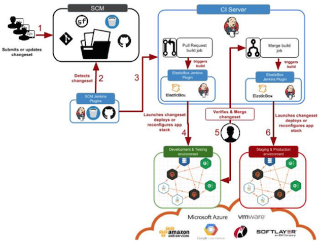

In the image below you can see the simplest implementation of the previous cycle which will be our working example that we’ll walk through in this setup.


There are several ways to achieve this type of integration, depending on the mechanism involved, whether it be polling or pushing, and the type of repository you are using, Stash or Bitbucket Server.

Feel free to review the wiki pages for the simplest approach for using these Jenkins plugins together:

* [Git Jenkins plugin](https://wiki.jenkins-ci.org/display/JENKINS/Git+Plugin)
* [Bitbucket pull request builder Jenkins plugin](https://wiki.jenkins-ci.org/display/JENKINS/Bitbucket+pullrequest+builder+plugin)

In this case, our Jenkins server will poll the Bitbucket repository according to the time interval that we have chosen. We have created a Jenkins job to demonstrate how this method works which will configure the SCM as seen in the section below:


We also need to configure the part related to the Bitbucket Pull Request Builder in the “Build Triggers” section:


Once we have configured our plugins we will see the result from the Bitbucket perspective. So, every time we make a new feature in a new branch, we have created the “master_branch_feature_3” containing commit 13:

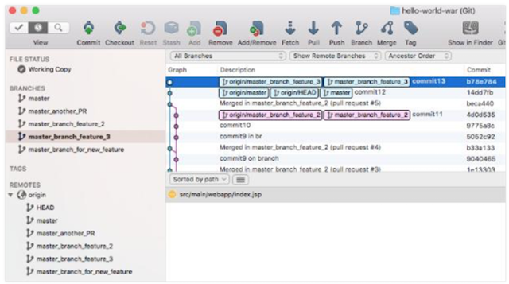

When we create the Pull Request in Bitbucket this is what we will see:


The commit inside:


Notice that we haven’t built the Pull Request in Jenkins yet (red figure in the first schema). But give it some time depending of the cron interval you set in the Jenkins job configuration and you will see the build being triggered and executed (see below):


Notice that the build was triggered because of commit 13.


The branch being checked out is the master_branch_feature_3.

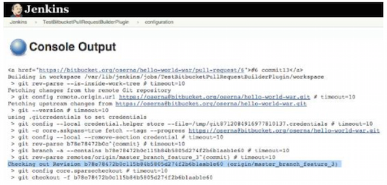

And as soon as the build ends you will see the result in Bitbucket.


The build result notification:


For means of simplicity we decided to use the plugins combination that you saw above, but there are some other ways to integrate Bitbucket and Jenkins.

* [Post services in Bitbucket](https://confluence.atlassian.com/bitbucket/post-service-management-223216518.html) (push based).

    

    As seen above, **POST service management is deprecated** in favor of Webhooks 2.0. Please note that the Bitbucket Jenkins plugin only works for Bitbucket push events not for pull request events.

* [Jenkins CI broker service](https://confluence.atlassian.com/bitbucket/jenkins-service-management-251724180.html) (push based too).

    

    Currently, Atlassian Support does not provide assistance for this configuration. In addition, as you will notice, they redirect to [Jenkins Bitbucket Plugin](https://wiki.jenkins-ci.org/display/JENKINS/BitBucket+Plugin), but that plugin only works for Bitbucket push events, not for pull request events.

* With other combination of plugins you could manage the pull request lifecycle too. For example using these plugins (having Stash but not Bitbucket):

    1. [Git Jenkins plugin](https://wiki.jenkins-ci.org/display/JENKINS/Git+Plugin)

    2. [Pre SCM Buildstep Jenkins plugin](https://wiki.jenkins-ci.org/display/JENKINS/pre-scm-buildstep)

    3. [Stash Notifier Jenkins plugin](https://wiki.jenkins-ci.org/display/JENKINS/StashNotifier+Plugin)

    4. [Pull Request Notifier Stash plugin](https://marketplace.atlassian.com/plugins/se.bjurr.prnfs.pull-request-notifier-for-stash/server/overview)

You can see all details [here](https://christiangalsterer.wordpress.com/2015/04/23/continuous-integration-for-pull-requests-with-jenkins-and-stash/).

### Contacting ElasticBox Support
We’re sorry you’re having an issue in [ElasticBox](https://www.ctl.io/elasticbox/). Please review the [troubleshooting tips](./troubleshooting-tips.md), or contact [ElasticBox support](mailto:support@elasticbox.com) with details and screen shots where possible.

For issues related to API calls, send the request body along with details related to the issue. In the case of a box error, share the box in the workspace that your organization and ElasticBox can access and attach the logs.
* Linux: SSH and locate the log at /var/log/elasticbox/elasticbox-agent.log
* Windows: RDP into the instance to locate the log at ProgramDataElasticBoxLogselasticbox-agent.log
