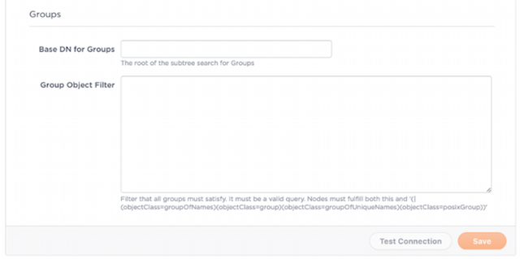

{{{
"title": "Enable User Authentication",
"date": "09-01-2016",
"author": "",
"attachments": [],
"contentIsHTML": false
}}}

### Enable User Authentication
In ElasticBox enterprise organizations, users can sign in using any of the single sign-on authentication options you enable in the [admin console](./admin-overview.md/).

**In this article:**
* Single sign-on with Google, GitHub, or username, password
* Single sign-on with LDAP

### Single sign-on with Google, GitHub, or username, password
To allow users to sign in with an ElasticBox username and password, turn on that option under Authentication in the admin console.

Do the same and turn on Google or GitHub to let users sign in with those credentials without having to create an account exclusively for ElasticBox. When they sign in, ElasticBox provisions an account based on their Google or GitHub username.

### Single Sign-On with LDAP
Enable LDAP in ElasticBox to let users log in using credentials managed in OpenLDAP or Windows Active Directory.

Add LDAP sources in ElasticBox to match the structure of LDAP in your organization. For example, if there are several LDAP servers that replicate the service, you may want to add an LDAP source for each. If users are spread across multiple organizational units, you may want an LDAP source for each unit. Or, to limit access to users in specific groups, you may want to add an LDAP source for each group.

When users sign in to ElasticBox with their LDAP credentials, we don’t store their passwords. The login session passes on their credentials to each LDAP source defined in ElasticBox. The LDAP server looks the user up by their username or Use Principal Name (UPN), typically in the **yourname@example.com** format. The server responds with an authorized or unauthorized request. If authorized, we grant the user access in ElasticBox. Else, we deny access.

**In this article:**
* Setting up LDAP in ElasticBox
* Syncing with LDAP groups
* Giving LDAP accounts admin access

### Setting Up LDAP in ElasticBox

**Steps**
1. Sign in to ElasticBox as the [default administrator](//www.ctl.io/guides/).

2. From the user menu drop-down on the top right, select **Admin Console**.

3. Under Authentication, enable LDAP by turning it on.

4. For each LDAP source, provide information to connect and the conditions to search users and sync groups. This information is divided into:

   **Connection**
   

   * **Connection String:** Required. The LDAP connection URI. This is of the form: schema://host[:port]. It comprises:
   schema: ‘ldap’ or ‘ladps’ for SSL connections. host: LDAP server hostname as a fully qualified domain name or valid IP address, such as ‘ldap.domain.com’ or ‘172.0.1.12’. port: Optional. We use the default protocol if not provided.
   * **Domain Search User:** The username to authenticate to the LDAP server. Example: cn=Alvaro Maclellan,ou=Product Development,dc=elasticbox,dc=com.
   * **Domain Search Password:** Password for the username to authenticate to the LDAP server.
   * **Note:** If search user and search password fields are not provided and the LDAP server does not support public queries, the connection and LDAP group sync will not work. The users will not be able to sign up in ElasticBox.

   **Users**
   

   * **Base DN for Users:** The subtree to use when running queries against the LDAP server to look up users. For example, ou=Product Development,dc=elasticbox,dc=com. If empty, we start the lookup at the root level.
   * **Group DN:** This value is used in addition to the base DN when searching users. The user must be member of the group indicated. Example: cn=elasticos,ou=Groups,dc=elasticbox,dc=com. Add a new LDAP source to specify another group.
   * **Email Field Name:** The field where the email is stored on the user. In Active Directory is ‘userPrincipalName’. In others is commonly ‘email’ or ‘mail’.

   **Groups**
   

   * **Base DN for Groups:** The subtree to use when running queries against the LDAP server for sync groups. For example, ou=Groups,dc=elasticbox,dc=com. If empty, we start the lookup at the root level.
   * **Group Object Filter:** The filter that all groups must satisfy. It must be a valid query. Nodes must fulfill both this and '(|(objectClass=groupOfNames)(objectClass=group)(objectClass=groupOfUniqueNames)(objectClass=posixGroup))'.

5. Click **Test Connection** to verify the configuration.

6. Click **Save** to keep the information.

### Syncing with LDAP Groups
LDAP groups get automatic access to team workspaces in ElasticBox when you enable syncing with those groups. Through the ElasticBox web or API interface, you can directly add LDAP groups as members of a workspace instead of searching and adding them one by one.

This gives your developers, operations engineers, or IT admins access to the same deployment assets to do their part in automating with necessary access levels. Follow these steps to sync with LDAP groups.

**Steps**
1. Sign in as the [default administrator](//www.ctl.io/guides/).

2. From the user menu drop-down on the top right, select **Admin Console**.

3. Under Authentication, make sure LDAP is on and set up with at least one source with the conditions to sync groups.

4. Turn on** LDAP Group Sync**.
   

5. Click **Sync** to start syncing.
   **Note:** By default, we sync every 24 hours to get the latest group updates. To sync at any other time, click **Sync**. If a group member is deleted or moved out, they no longer have access to ElasticBox workspaces and won’t be able to log in. To show or hide synchronized groups details, click on **View Groups** or **Hide Groups**.

### Giving LDAP Accounts Admin Access
As good practice, you should give an LDAP user in your organization administrative access to ElasticBox and set aside the default administrator account to use in case of emergency. After you set up LDAP, give the LDAP user admin access as follows.

**Steps**
1. Sign in to ElasticBox as the LDAP user. This registers the user in ElasticBox with a personal workspace.

2. Log out and log back in as the default administrator.

3. Make the LDAP user an administrator. From here on, use that LDAP user account to manage ElasticBox.

### Contacting ElasticBox Support
We’re sorry you’re having an issue in [ElasticBox](//www.ctl.io/elasticbox/). Please review the [troubleshooting tips](./troubleshooting-tips.md), or contact [ElasticBox support](mailto:support@elasticbox.com) with details and screen shots where possible.

For issues related to API calls, send the request body along with details related to the issue. In the case of a box error, share the box in the workspace that your organization and ElasticBox can access and attach the logs.
* Linux: SSH and locate the log at /var/log/elasticbox/elasticbox-agent.log
* Windows: RDP into the instance to locate the log at ProgramDataElasticBoxLogselasticbox-agent.log
