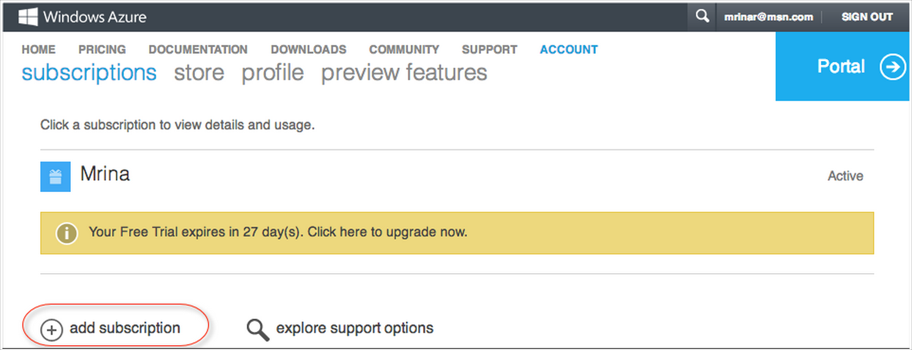
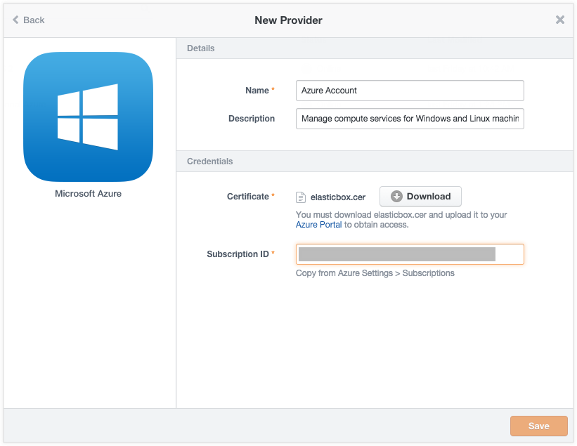
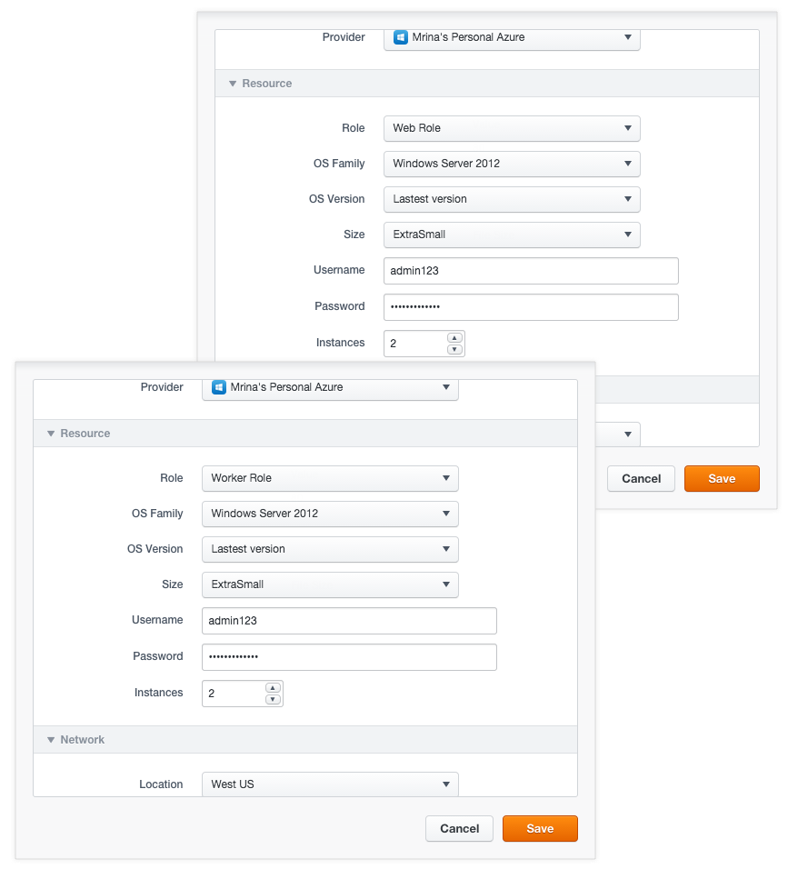
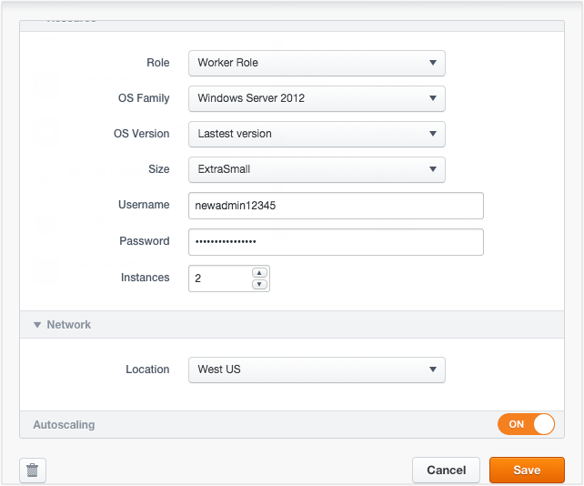
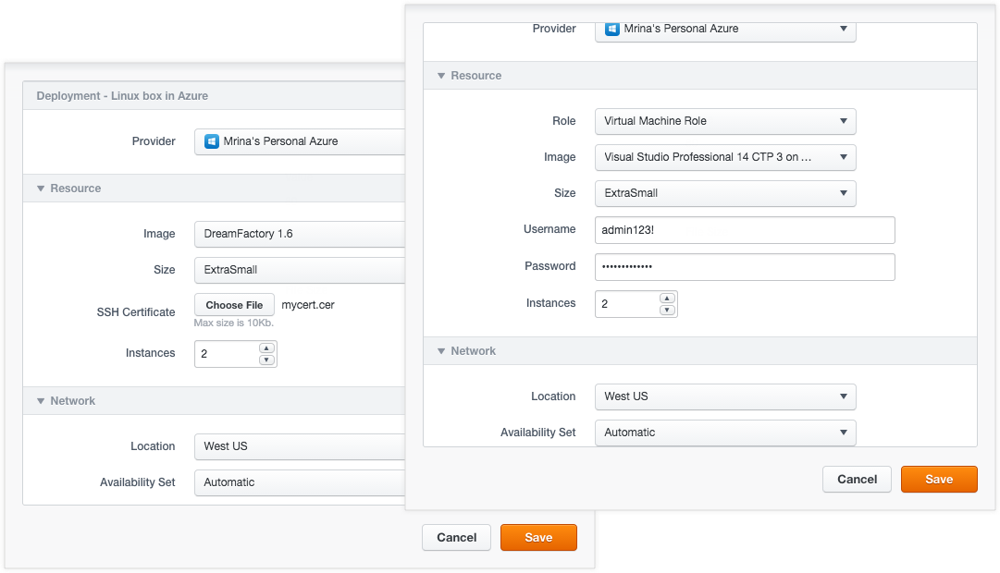
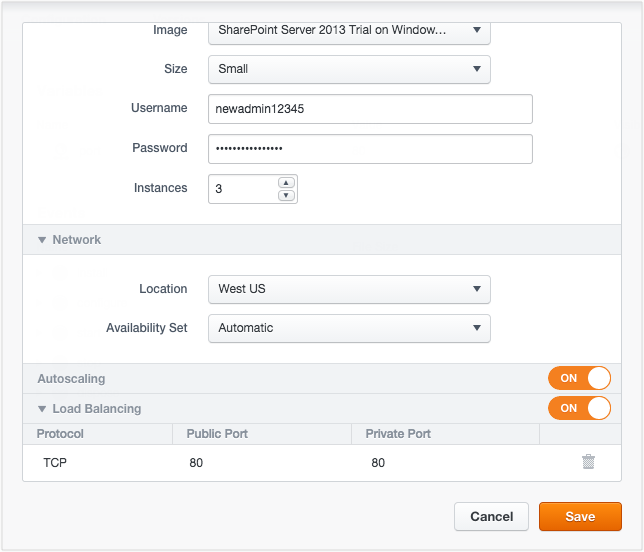
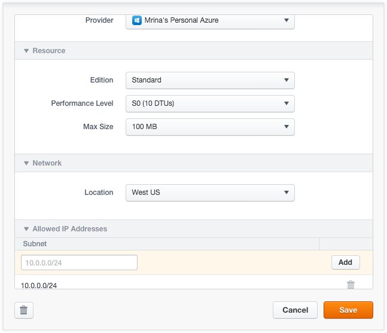

{{{
"title": "Using Azure",
"date": "09-01-2016",
"author": "",
"attachments": [],
"contentIsHTML": false
}}}

### Using Azure

Microsoft Azure hosts applications in virtual machines and in cloud services via Web, Worker roles. ElasticBox supports deploying to all three models through the [Virtual Machine Role](./using-azure.md), [Web and Worker roles](./using-azure.md). In addition, we support [Microsoft SQL Database Service](./using-azure.md) through Azure. Take a look at the [benefits of deploying to Azure using ElasticBox](./using-azure.md).

**Note:** If you’re running ElasticBox as an appliance in your private datacenter, you can deploy only to the virtual machine role.
To learn about Azure hosting services, see the [Azure help](https://azure.microsoft.com/en-us/documentation/articles/choose-web-site-cloud-service-vm/).

**In this article:**
* Before You Begin
* Benefits of Deploying to Azure Using ElasticBox
* Registering Your Azure Subscription in ElasticBox
* Deploying in Azure

### Before You Begin

You need an Azure subscription to be able to consume Azure services. Follow these steps to create one.

**Steps**
1. Sign in to your Windows Live admin [account](https://account.windowsazure.com/Subscriptions).

2. Click add subscription.
   

3. You can use the free trial version or select and purchase a payment plan.
   * **Note:** ElasticBox is not responsible for any costs incurred through deploying to Azure. For more information, see [Azure pricing](https://azure.microsoft.com/en-us/pricing/calculator/?scenario=virtual-machines).

### Benefits of Deploying to Azure Using ElasticBox

ElasticBox simplifies Azure deployments with these benefits:

* **Automate VM deployments:** We automatically provision services that otherwise you’d have to individually configure and spawn in Azure. For example, we work with the Azure APIs to create a storage account, create availability sets, enable auto scaling, load balancing, and enable endpoints for your virtual machine deployments.

* **Deploy easily to web and worker roles:** Typically to deploy in Azure, you have to install and set up the latest Visual Studio development environment, then install Azure SDK tools and extensions including the emulator. After that you must either directly upload your application files through Azure Blob storage or manually create a package (cspkg). But by deploying a web or worker role through ElasticBox, you can skip this fairly involved process.

See how easy it is to get a web or worker role started in ElasticBox: Build a box, upload your application code and configuration files, select Azure deployment options, and deploy. We automatically create a cloud service and storage account for your web or worker role deployments.

* **Switch between VM, web, and worker roles:** It’s easy to migrate from virtual machine to web or worker role deployments or vice versa because your configuration is encapsulated in boxes. Simply kill the VM machines and deploy your box into web or worker roles or the other way around.

* **Focus on applications:** Once your machines are deployed in Azure through ElasticBox, you can focus on your application and easily handle the entire lifecycle of application instances. We do all the backend API operations to manage your instances. For example, when you delete an instance that you no longer need, we automatically delete the availability set, virtual machine instances, storage account and cloud service, associated with the instance.dsfsdsd

### Registering Your Azure Subscription in ElasticBox

To connect to Azure in ElasticBox, you need to upload the elasticbox.cer to your Azure subscription and then provide ElasticBox your subscription ID.
Follow these steps.

**Steps**
1. [Log in to ElasticBox](https://elasticbox.com/login/).

2. Click **Providers** > **New Provider**.

3. In the dialog, select **Microsoft Azure**.
   

4. Enter your Azure subscription credentials as shown.
   * Enter a useful name to identify the Azure subscription in ElasticBox.
   * Under Credentials, click **Download**. The elasticbox.cer certificate is saved to your local machine. Upload the certificate to your Azure portal. 	
      * This allows ElasticBox to manage your subscription based on resources you deploy.
      * Sign in to the [Azure Portal](https://manage.windowsazure.com/).

      Click Settings > Management Certificates > UPLOAD A MANAGEMENT CERTIFICATE.
      
      * Under **FILE** > click **BROWSE FOR FILE** to select the certificate from your local machine.
      * Under Subscription, be sure to select your subscription.
      

5. Click the checkmark to save.
   * Copy your Azure subscription ID located under Settings in the Azure Management Portal.
   
   * In ElasticBox, under Credentials, paste in the subscription ID.
   

6. Click **Save**.

### Deploying in Azure

You can deploy to the following services in Azure:
* Web and Worker Roles
* Virtual machine role
* Microsoft SQL Database Service

Although all the services are available to Windows based applications, Azure supports only the VM role for Linux applications.

When you’re all set to [launch a new instance](./deploying-managing-instances.md) in Azure, ElasticBox presents deployment profile options for the roles or for the database service.

### Web and Worker Roles

Web and worker roles act as the front-end and backend environments to host your multi-tier applications like a web application running on IIS and .NET framework. Although you can run instances in each role independent of the other, you may want to combine them to host complex multi-tier applications.

A web role lets you deploy a Windows web server farm running IIS while a worker role Lets you deploy to a Windows server for processing backend code or running middleware or runtime environments like the .NET framework.

When you deploy a Windows box to a web or worker role, we automatically create a cloud service for your selected affinity group and region and generate the cspkg, csdef, and cscfg files to make boxes and scripts in them run in Azure cloud services.

To deploy in Azure, first upload your application code as file or URL variables in a Windows box. There, add any port variables to open endpoints. And add event scripts as needed to configure the application on the virtual machine. Then [launch an instance](./deploying-managing-instances.md) of the box and choose from the following deployment options.

**Note:** At this time, we only support deploying to the Production environment in Azure.
In case of multi-tier applications deployed to different roles, follow these tips to allow traffic to the instances and to let them communicate with each other:

* To allow traffic to web role instances, we automatically open HTTP port 80 for both public (input) and private (internal) endpoints. We also open any other ports that you define on the box.
* To allow traffic to worker role instances, you have to first define port variables on the box, which we open for both public (input) and private (internal) endpoints.
* To allow web and worker role instances to communicate with each other, make sure they’re deployed to the same availability set. Configure [bindings](./managing-multi-tier-applications.md) to connect their boxes. Then print '\{{ bindingname.address }}:\{{bindingname.port}}' in a configure event script to connect by querying the instance IP address and port.

### Azure Web and Worker Role Deployment Options

**Deployment**

| Option | Description |
|--------|-------------|
| Provider | Select the Azure provider you want to use to deploy. |

**Resource**

| Option | Description |
|--------|-------------|
| Role | Select Web Role or Worker Role. See [Virtual Machine Role](./using-azure.md) to deploy to that instead. |
| OS Family | Select the guest OS to run in the worker role instance. Note that Windows 2008 images are not synced at this time because the ElasticBox agent doesn’t work on them. |
| OS Version | Select the guest OS version to run in the worker role instance. You can select a specific version or go with latest. If you choose latest, the OS is automatically upgraded to the latest version. |
| Size | Select a size to set the number of CPU cores, memory, and disk size to store your OS files, process temporary memory, and store application data. For more information, see the [Azure help](https://msdn.microsoft.com/en-us/library/azure/dn197896.aspx). Note that D-Series sizes use solid-state drive disks. |
| Username | Specify a username to be able to RDP into the instance directly. |
| Password | Specify a password to be able to RDP into the instance directly. |
| Instances | Specify the number of web or worker role instances to spawn. Note that at this time, we don’t autoscale or load balance web or worker role instances. To enable that, you have to manually configure these options in [Azure](https://msdn.microsoft.com/en-us/library/hh680914). |

**Network**

| Option | Description |
|--------|-------------|
| Location | Select a virtual network, region, or affinity group to physically place the instance.<li>**Virtual Networks**. To let the instance connect to services in Azure, select a virtual private network that you previously created in your subscription. See the Azure help on creating virtual networks.</li><li>**Regions**. Select a region to place the instance.</li><li>**Affinity Groups**. Select an affinity group, if you created one to keep the instance close to other regional resources in the datacenter.</li> |

**Autoscaling Web or Worker Role Instances**

To support cloud bursting scenarios, you can proactively plan for scaling your applications deploying to Web or Worker roles in Azure.

ElasticBox supports autoscaling by monitoring CPU thresholds. If CPU usage hits 80%, a new instance is added in that role. Similarly if CPU usage is at 60% or below, the role instances are scaled down.

To autoscale Web or Worker roles, configure these settings in the Azure deployment profile before deploying:

* Select a machine size for the role that has the sufficient number of cores to support scaling.
* Set the number of instances to at least two to meet high availability SLAs from Azure. Here, you can control autoscaling by setting the maximum number of instances to scale.
* Turn Autoscaling to **ON**.

For more information, see the [Azure help](https://msdn.microsoft.com/en-us/library/hh680945).

### Virtual Machine Role

The virtual machine role lets you build and manage highly customizable and flexible OS environments. For more information, see [the Azure help](https://msdn.microsoft.com/library/azure/jj156003.aspx).

To deploy in ElasticBox, simply select your box based on Linux or Windows, and [create a new instance](./deploying-managing-instances.md). Then, choose from the following deployment options.

### Azure Deployment Options

**Deployment**

| Option | Windows or Linux | Description |
|--------|------------------|-------------|
| Provider | Both |	Select your Azure subscription or one that’s shared with you in ElasticBox. |

**Resource**

| Option | Windows or Linux | Description |
|--------|------------------|-------------|
| Role | Windows | Select the **Virtual Machine Role **to deploy to a Windows environment that you want to customize and manage. To deploy to other roles, see Web and Worker Roles section in this documentation. |
| Image | Both | Choose from [images ](https://msdn.microsoft.com/en-us/library/azure/dn790290.aspx)that are custom or stock OS images or are generalized, specialized VM images. The drop-down shows images relevant to a Windows or Linux deployment. Note that Windows 2008 images are not synced at this time because the ElasticBox agent doesn’t work on them. |
| Size | Both |	Select a virtual machine size from the basic or standard tier options including [D-Series](https://azure.microsoft.com/blog/2014/09/22/new-d-series-virtual-machine-sizes/). Each option such as A1 sets the number of CPU cores, OS disk memory, and number of input and output operations per second (IOPS) for the virtual machine. Size affects pricing. For more information, see [Virtual Machine and Cloud Service Sizes](https://msdn.microsoft.com/en-us/library/azure/dn197896.aspx).|
| Username | Windows | Specify the root admin account username required to access and manage Windows machines. For Linux machines, the Service ID shown in the ElasticBox instance page is the admin account username, for example, eb-gm3vg. Inbound traffic from the Internet or virtual networks to Windows virtual machines is allowed through Remote Desktop (RDP) with these default port settings.<table class="internal"><tr style="background-color:#f8f8f9;border-left: solid 1px;border-right: solid 1px"><th>**Endpoint Type**</th><th>**Protocol**</th><th>**Public Port**</th><th>**Private Port**</th></tr><tr><td>RDP</td><td>TCP</td><td>3389</td><td>3389</td></tr></table>|
|Password |	Windows | Required for root admin access to Windows virtual machines. The password must be at least 8 characters long containing 3 of the following: a lowercase, an uppercase, a number, or a special character. |
| SSH Certificate |	Linux |	 Required for Linux virtual machines. Create and upload a X.509 SSH certificate with the .cer extension accepted by Azure. SSH is required to allow inbound traffic from the Internet or from virtual networks to Linux virtual machines. These are default port settings for SSH access.<table class="internal"><tr style="background-color:#f8f8f9;border-left: solid 1px;border-right: solid 1px"><th>**Endpoint Type**</th><th>**Protocol**</th><th>**Public Port**</th><th>**Private Port**</th></tr><tr><td>SSH</td><td>TCP</td><td>22</td><td>22</td></tr></table>|
| Instances | Both | Select the maximum number of virtual machines to deploy when you enable autoscaling and load balancing. |

**Network**

| Option | Windows or Linux | Description |
|--------|------------------|-------------|
| Location | Both | Select a virtual network, region, or affinity group to physically place the instance.<li>**Virtual Networks.** To let the instance connect to services in Azure, select a virtual private network that you previously created in your subscription. See the Azure help on [creating virtual networks](https://msdn.microsoft.com/library/azure/jj156074.aspx).</li><li>**Regions.** Select a region to place the instance.</li><li>**Affinity Groups.** Select an affinity group, if you created one to keep the instance close to other regional resources in the datacenter.</li> |
| Availability Set | Both | Select Automatic to let Azure create an availability set for fault tolerance. This protects the virtual machine against single points of failure in the same cloud service and region. For more information, see [Manage the Availability of Virtual Machines](https://azure.microsoft.com/en-us/documentation/articles/manage-availability-virtual-machines/). |

**Autoscaling**

To automatically scale Linux or Windows virtual machine instances in Azure, you require at least two virtual machines in an availability set in the same cloud service and region. We scale a machine up by one instance if CPU usage goes over 80% or scale down by an instance if CPU usage goes below 60%. In either case, we scale within the maximum instance limit you specified in the deployment profile. To autoscale, be sure to configure these settings:

* In the Instances drop-down, select at least two or more.
* In the Availability Set drop-down, select a set you previously configured in Azure or select **Automatic** to let us create one for you.
* Turn on Auto Scaling by setting it to **ON**.

**Load Balancing**

When you enable autoscaling, you also want to turn on load balancing to direct traffic evenly across instances. Configure these settings to enable load balancing:

* Enable autoscaling first.
* Since basic sizes don’t support load balancing, select a standard sized image.
* To turn it on, set Load Balancing to **ON.**
* To permit Internet traffic to spawned instances, specify port variables in the Linux or Windows based box. All ports you specify in the box appear in the Load Balancing section in the deployment profile. Be sure to add the ports in the profile. When you deploy, we open the ports as both public (input) and private (internal) endpoints on the instance.

**Example of Autoscaling and Load Balancing**

Here we’ve set an instance to autoscale and load balance with a limit of up to three machines. To allow traffic to each instance spawned, the port variable on the box is mapped as both the public and private port through which Internet traffic reaches the instance.

### Microsoft SQL Database Service

In ElasticBox, Microsoft Azure SQL Database service is available as a service box. Select the **Microsoft SQL Database Service** box from Instances > Quick Starts to [deploy a new instance](../ElasticBox/deploying-managing-instances.md). In the instance dialog, provide deployment variable values and select Azure deployment options.

### Deployment Variables

Provide these variable values before you deploy a SQL Database to Azure.

| Variable | Description |
|----------|-------------|
| username | Provide a username to be able to log in to the SQL server hosting the database. |
| password | Provide a password to be able to log in to the SQL server hosting the database. |
| port | By default, port 1433 is opened to allow traffic from outside of the Azure virtual network to the database. It’s the only way to communicate with the database when outside the Azure network. |
| database_name | Optionally, give the database a name. Else, we assign the instance service ID as its name. |

### Azure SQL Database Service Deployment Options

**Deployment**

| Option | Description |
|--------|-------------|
| Provider | Select an Azure provider account that you want to use to deploy. |

**Resource**

| Option | Description |
|--------|-------------|
| Edition |	Choose from Basic, Standard, and Premium editions. Web and Business are soon to be retired. |
| Performance Level | [Performance levels](https://msdn.microsoft.com/en-us/library/azure/dn741336.aspx) are available for different tiers of Standard or Premium editions. Each tier indicates the disk throughput units (DTUs) for CPU, memory, read, and write capacity of the edition. |
| Max Size | Select the maximum size up to which the database can grow. This varies by edition. See the [Azure help](https://azure.microsoft.com/en-us/pricing/details/sql-database/) to learn more. |

**Network**

| Option | Description |
|--------|-------------|
| Location | Select the region where you want the database instance to deploy. |

**Allowed IP Addresses**

| Option | Description |
|--------|-------------|
| Subnet | Enter the IP address ranges in the CIDR format to form virtual subnets that firewall and allow only machines in those IP address ranges to connect to the SQL server. |

Some useful things to keep in mind about Azure SQL Database deployments:

* When you hit deploy, we create a SQL database in a SQL server.
* When you delete the instance, we delete both the server and the database. To save data, you can always [copy the database](https://msdn.microsoft.com/library/azure/ff951624.aspx) to a target server or [export the database](https://msdn.microsoft.com/en-us/library/hh335292.aspx#export) to a storage blob before deleting.
* Use the [Azure Management Portal](http://azure.microsoft.com/en-us/documentation/articles/sql-database-get-started/) or [SQL Server Management Studio](https://azure.microsoft.com/en-us/documentation/articles/sql-database-manage-azure-ssms/) to manage SQL databases.
* Connect to the database using the [connection string information](http://msdn.microsoft.com/en-us/library/azure/ee336282.aspx) from the Azure Management Portal.
* Retrieve, update, or delete database data using [Transact-SQL queries](https://azure.microsoft.com/en-us/documentation/articles/sql-database-get-started/#AddData).

### Contacting ElasticBox Support

We’re sorry you’re having an issue in [ElasticBox](//www.ctl.io/elasticbox/). Please review the [troubleshooting tips](./troubleshooting-tips.md), or contact [ElasticBox support](mailto:support@elasticbox.com) with details and screenshots where possible.

For issues related to API calls, send the request body along with details related to the issue. In the case of a box error, share the box in the workspace that your organization and ElasticBox can access and attach the logs.
* Linux: SSH and locate the log at /var/log/elasticbox/elasticbox-agent.log
* Windows: RDP into the instance to locate the log at ProgramDataElasticBoxLogselasticbox-agent.log
