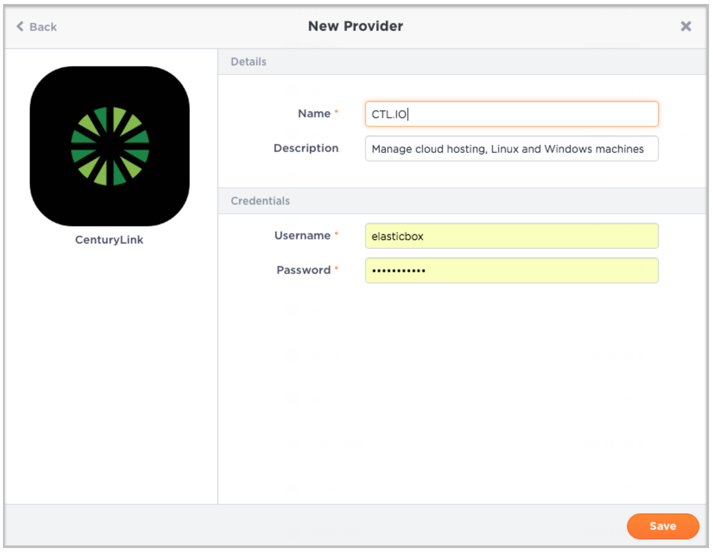

{{{
"title": "Using CenturyLink Cloud",
"date": "09-01-2016",
"author": "",
"attachments": [],
"contentIsHTML": false
}}}

### Using CenturyLink Cloud

Automate application deployments through ElasticBox when you launch to Linux or Windows virtual servers in the CenturyLink Cloud public cloud. ElasticBox simplifies deployments with a dedicated focus on applications rather than infrastructure.

**In this article:**

* Register CenturyLink Cloud provider in ElasticBox
* Deploy to CenturyLink Cloud from ElasticBox

### Register CenturyLink Cloud Provider in ElasticBox

You need a [CenturyLink Cloud account](//www.ctl.io/) to be able to deploy from ElasticBox. When you have an account, follow these steps to register it in ElasticBox to automate your deployments.

**Steps**

1. In ElasticBox, go to **Providers** > **New Provider** and select **CenturyLink.**

2. Enter the CenturyLink username and password as shown and save.

   

### Deploy to CenturyLink Cloud from ElasticBox

Select from the following deployment profile options to launch workloads on Linux or Windows machines.

Note a couple of things about instances you deploy on CenturyLink Cloud through ElasticBox.

* Instance name. Each instance is assigned a name that has the format of DatacenterFirst_six_letters_of_instance_nameCounter. i.e., UC1CITTPUBLIC01 for an instance deployed on UC1 (US West - Santa Clara) of a box called Public Proxy.
* Instance Description. Depending on the number of instances you spin up through ElasticBox, each instance is assigned a description that has the format of dasherized-instance-name-datacenter-service_ID-machine-number.

**Deployment**

| Option | Description |
|--------|-------------|
| Provider |  Select a CenturyLink Cloud account registered in ElasticBox. |

**Resource**

| Option | Description |
|--------|-------------|
| Datacenter | Select a location to place the instance, for example, UC1. |
| Group |	Select placement group for the new instance. |
| Template | Select from a list of CenturyLink Cloud Linux or Windows images. Images are specific to the box service type, that is, Linux or Windows. |
| Managed |	Allow CenturyLink manage this server. |
| Instances | Specify the number of instances to provision. |

**Network**

| Option | Description |
|--------|-------------|
| Network |	Select a vLan for the new instance. |
| Public IP	| Check the box to attach a public IP address to the new instance. |

**Compute**

| Option | Description |
|--------|-------------|
| CPUs | Select virtual CPUs for the instance. You can get up to 16 cores. |
| Memory | Allocate RAM for the instance. You can get up to 128 GB. |

**Disks**

By default, the machine is provisioned with 17GB local disk space. You can add more disks in RAW format or Partitioned, up to 1024 GB.

### Contacting ElasticBox Support

We’re sorry you’re having an issue in [ElasticBox](//www.ctl.io/elasticbox/). Please review the [troubleshooting tips](./troubleshooting-tips.md), or contact [ElasticBox support](mailto:support@elasticbox.com) with details and screenshots where possible.

For issues related to API calls, send the request body along with details related to the issue. In the case of a box error, share the box in the workspace that your organization and ElasticBox can access and attach the logs.
* Linux: SSH and locate the log at /var/log/elasticbox/elasticbox-agent.log
* Windows: RDP into the instance to locate the log at ProgramDataElasticBoxLogselasticbox-agent.log
