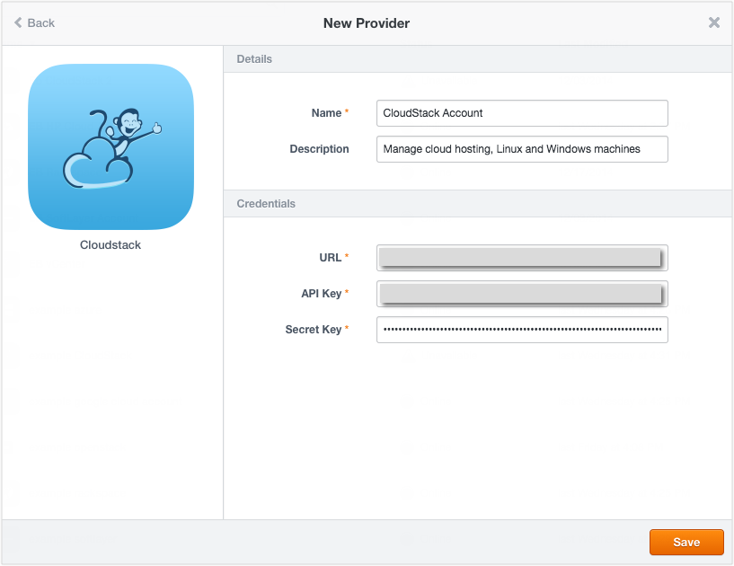

{{{
"title": "Using CloudStack",
"date": "09-01-2016",
"author": "",
"attachments": [],
"contentIsHTML": false
}}}

### Using CloudStack

You can deploy and manage box configurations on Linux and Windows virtual machines through ElasticBox in your CloudStack environment. ElasticBox supports Linux and Windows compute services for all CloudStack implementations, such as XenServer, VMware, vSphere, KVM, and Xen.

**In this article:**

* Getting CloudStack Credentials
* Registering CloudStack in ElasticBox
* Bootstrapping CloudStack Templates
* Deploying in CloudStack

### Getting CloudStack Credentials

ElasticBox uses the user API keys to authenticate access to your CloudStack environment. Follow these steps to get the credentials from CloudStack.

**Before You Begin**
You need a CloudStack environment and access to the management console.

**Steps**
1. Log in to your CloudStack management console as a user or administrator.
   

2. Click **Accounts** > **your user account**.
   

3. Click **View Users** and select your user account.
   

4. If available, copy the existing API and secret keys. Otherwise, click the generate keys icon to create them.
   

### Registering CloudStack in ElasticBox

**Steps**
1. Log in to ElasticBox.

2. Click **Providers** > **New Provider.**

3. Select **CloudStack.**

4. Enter your CloudStack user API credentials.
   

   * **URL** - API endpoint to the CloudStack management server that typically has this format, **http://10.0.128.21:8080/client/api.**
   * **API Key** - Part of the user API credentials generated for the user account in the CloudStack management console.
   * **Secret Key** - Part of the user API credentials generated for the user account in the CloudStack management console.

5. Click **Save.**

### Bootstrapping CloudStack Templates

In order for ElasticBox to configure, deploy, and manage box configurations in CloudStack, both Linux and Windows templates must be bootstrapped with the ElasticBox init agent script. Follow these steps.

**Linux**

**Steps**
1. Log into the Linux virtual machine template.

2. Run this shell script as the root admin in the terminal.

`curl -L https://elasticbox.com/agent/linux/cloudstack/template_customization_script.sh | sudo bash`

### Windows

**Steps**
1. Log in to the Windows virtual machine template using remote desktop protocol (RDP).

2. [Download the script from this URL](https://elasticbox.com/agent/windows/cloudstack/template_customization_script.ps1).

3. Right-click the script file and click **Run PowerShell**.
   * **Note:** For information on creating custom templates, see the [Apache CloudStack help](https://docs.cloudstack.apache.org/projects/cloudstack-administration/en/latest/templates.html#exporting-templates).

### Deploying in CloudStack

When you’re ready to [launch an instance](./deploying-managing-instances.md) in CloudStack, you can define Linux or Windows deployment options in a deployment profile. ElasticBox passes the compute offering, disk offering, and template options you provide in the profile as parameters to CloudStack, which then spins up the virtual machine.

**Deployment**

| Option | Description |
|--------|-------------|
| Provider | Select the CloudStack account you registered in ElasticBox. |

**Resource**

| Option | Description |
|--------|-------------|
| Zone | Availability zone or region isolated for data redundancy where you want to deploy the virtual machine. For example, Zone 1. |
| Template | Pre-configured OS image from which to boot the virtual machine. It can contain the base OS plus additional configuration like application files. If you’re deploying a Linux box type, you’ll see Linux templates such as Ubuntu Server 12.04 64-bit . If you’re deploying a Windows box type, you’ll see Windows templates such as Windows Server 2008 R2 Enterprise. |
| Compute Offering | Determines the allotted CPU cores, memory, high availability, and so on for the selected template. The list includes predefined offerings as well as those configured by you in CloudStack. |
| Disk Offering | Optional data storage in addition to the inherent disk space on the virtual machine. Choose from predefined offerings such as small, medium, large or choose an offering that you configured in CloudStack. |
| Instances | Number of instances to provision for a selected box. |

**Placement**

| Option | Description |
|--------|-------------|
| Network | Default guest network configuration or a pre-configured network to allow traffic to the virtual machine. Consists of the permitted CIDR block of IP addresses from where traffic to the virtual machine is allowed. For more information, see the [CloudStack help](http://docs.cloudstack.apache.org/projects/cloudstack-administration/en/4.3/networking_and_traffic.html). |
| Security Groups |	Filter incoming and outgoing traffic for the virtual machine based on a set of rules. Multiple security groups in a zone can be selected for a virtual machine. For more information, see [Security Groups](http://docs.cloudstack.apache.org/projects/cloudstack-administration/en/4.3/networking_and_traffic.html#security-groups). |

### Contacting ElasticBox Support

We’re sorry you’re having an issue in [ElasticBox](//www.ctl.io/elasticbox/). Please review the [troubleshooting tips](./troubleshooting-tips.md), or contact [ElasticBox support](mailto:support@elasticbox.com) with details and screenshots where possible.

For issues related to API calls, send the request body along with details related to the issue. In the case of a box error, share the box in the workspace that your organization and ElasticBox can access and attach the logs.
* Linux: SSH and locate the log at /var/log/elasticbox/elasticbox-agent.log
* Windows: RDP into the instance to locate the log at ProgramDataElasticBoxLogselasticbox-agent.log
