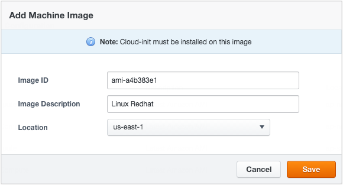
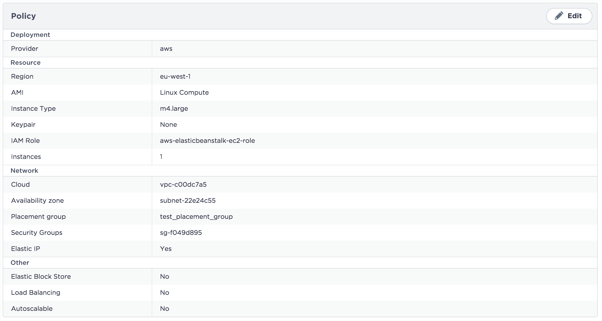
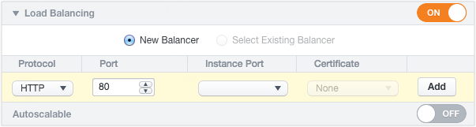

{{{
"title": "Using AWS",
"date": "09-01-2016",
"author": "",
"attachments": [],
"contentIsHTML": false
}}}

### Using AWS

Deploy to AWS from ElasticBox as follows.

* For EC2 (Linux and Windows) use [deployment policies](./deploymentpolicy-box.md). Select a policy when you launch workloads from boxes.
* For AWS RDS, AWS S3, AWS DynamoDB, and AWS Memcached, use readymade CloudFormation boxes.
* For any other AWS service, configure a custom [CloudFormation box](./cloudformation-box.md).

We orchestrate with AWS APIs in the backend to provision, install, and manage the lifecycle of your workloads based on the box configuration.

**In this article:**
* Connect your AWS account in ElasticBox
* Add custom AMIs in ElasticBox
* Deploy to Your AWS Account

### Connect Your AWS Account in ElasticBox

Before you deploy in AWS, you need to connect your AWS account in ElasticBox. Watch this video for details.

<iframe src="//player.vimeo.com/video/126177639" width="640" height="360" frameborder="0" webkitallowfullscreen mozallowfullscreen allowfullscreen></iframe>

**Steps**
1. Create a custom AWS policy and copy, paste these permissions:

   ```
   {
   "Version":"2012-10-17",
   "Statement":[
   {
        "Action":[
            "cloudformation:CreateStack",
            "cloudformation:DeleteStack",
            "cloudformation:DescribeStackEvents",
            "cloudformation:DescribeStackResource",
            "cloudformation:DescribeStackResources",
            "cloudformation:DescribeStacks",
            "cloudformation:GetTemplate",
            "cloudformation:ListStacks",
            "cloudformation:ListStackResources",
            "cloudformation:UpdateStack",
            "cloudformation:ValidateTemplate",
            "elasticache:*",
            "dynamodb:CreateTable",
            "dynamodb:DeleteTable",
            "dynamodb:DescribeTable",
            "dynamodb:ListTables",
            "ec2:AssociateAddress",
            "ec2:AttachVolume",
            "ec2:AllocateAddress",
            "ec2:AuthorizeSecurityGroupEgress",
            "ec2:AuthorizeSecurityGroupIngress",
            "ec2:CopyImage",
            "ec2:CreateImage",
            "ec2:CreateSecurityGroup",
            "ec2:CreateSnapshot",
            "ec2:CreateSubnet",
            "ec2:CreateTags",
            "ec2:CreateVolume",
            "ec2:DeleteSecurityGroup",
            "ec2:DeleteSubnet",
            "ec2:DeleteTags",
            "ec2:DeleteVolume",
            "ec2:DescribeAccountAttributes",
            "ec2:DescribeAddresses",
            "ec2:DescribeAvailabilityZones",
            "ec2:DescribeImageAttribute",
            "ec2:DescribeImages",
            "ec2:DescribeInstanceAttribute",
            "ec2:DescribeInstanceStatus",
            "ec2:DescribeInstances",
            "ec2:DescribeKeyPairs",
            "ec2:DescribePlacementGroups",
            "ec2:DescribeRegions",
            "ec2:DescribeSecurityGroups",
            "ec2:DescribeSubnets",
            "ec2:DescribeTags",
            "ec2:DescribeVolumeAttribute",
            "ec2:DescribeVolumeStatus",
            "ec2:DescribeVolumes",
            "ec2:DescribeVpcAttribute",
            "ec2:DescribeVpcs",
            "ec2:DescribeVpnConnections",
            "ec2:DetachVolume",
            "ec2:RebootInstances",
            "ec2:RegisterImage",
            "ec2:ReleaseAddress",
            "ec2:RevokeSecurityGroupEgress",
            "ec2:RevokeSecurityGroupIngress",
            "ec2:RunInstances",
            "ec2:StartInstances",
            "ec2:StopInstances",
            "ec2:TerminateInstances",
            "rds:AuthorizeDBSecurityGroupIngress",
            "rds:AddTagsToResource",
            "rds:CreateDBInstance",
            "rds:CreateDBSecurityGroup",
            "rds:CreateDBSnapshot",
            "rds:DeleteDBInstance",
            "rds:DeleteDBSecurityGroup",
            "rds:DeleteDBSnapshot",
            "rds:DescribeDBInstances",
            "rds:DescribeDBParameterGroups",
            "rds:DescribeDBParameters",
            "rds:DescribeDBSecurityGroups",
            "rds:DescribeDBSnapshots",
            "rds:DescribeDBEngineVersions",
            "rds:DescribeDBSubnetGroups",
            "rds:DescribeOptionGroups",
            "rds:ModifyDBInstance",
            "rds:ModifyDBSubnetGroup",
            "rds:RebootDBInstance",
            "rds:RemoveTagsFromResource",
            "rds:RestoreDBInstanceFromDBSnapshot",
            "rds:RevokeDBSecurityGroupIngress",
            "s3:CreateBucket",
            "s3:DeleteBucket",
            "s3:DeleteBucketPolicy",
            "s3:GetBucketAcl",
            "s3:GetBucketCORS",
            "s3:GetBucketLocation",
            "s3:ListAllMyBuckets",
            "s3:ListBucket",
            "s3:PutBucketAcl",
            "s3:PutBucketCORS",
            "s3:PutBucketPolicy",
            "s3:PutBucketTagging",
            "autoscaling:CreateAutoScalingGroup",
            "autoscaling:CreateLaunchConfiguration",
            "autoscaling:DeleteAutoScalingGroup",
            "autoscaling:DeleteLaunchConfiguration",
            "autoscaling:DescribeScalingActivities",
            "autoscaling:DescribeAutoScalingGroups",
            "autoscaling:DescribeAutoScalingInstances",
            "autoscaling:DescribeLaunchConfigurations",
            "autoscaling:ResumeProcesses",
            "autoscaling:SuspendProcesses",
            "autoscaling:TerminateInstanceInAutoScalingGroup",
            "autoscaling:UpdateAutoScalingGroup",
            "elasticloadbalancing:CreateLoadBalancer",
            "elasticloadbalancing:CreateLoadBalancerPolicy",
            "elasticloadbalancing:DeleteLoadBalancer",
            "elasticloadbalancing:DeleteLoadBalancerPolicy",
            "elasticloadbalancing:DeregisterInstancesFromLoadBalancer",
            "elasticloadbalancing:DescribeInstanceHealth",
            "elasticloadbalancing:DescribeLoadBalancerPolicies",
            "elasticloadbalancing:DescribeLoadBalancers",
            "elasticloadbalancing:RegisterInstancesWithLoadBalancer",
            "elasticloadbalancing:SetLoadBalancerPoliciesOfListener",
            "sts:AssumeRole",
            "iam:CreateUser",
            "iam:DeleteUser",
            "iam:ListAccessKeys",
            "iam:ListUserPolicies",
            "iam:ListServerCertificates",
            "iam:PutUserPolicy",
            "iam:GetUser",
            "iam:CreateAccessKey",
            "iam:DeleteUserPolicy",
            "iam:DeleteAccessKey",
            "iam:PassRole",
            "iam:ListRoles",
            "iam:ListInstanceProfilesForRole"
        ],
        "Sid":"Stmt1378777340000",
        "Resource":[
   "*"
        ],
        "Effect":"Allow"
   }
   ]
   }
   ```

2. Create an IAM role with this information and attach the policy.
   * Account ID: 540339316802
   * External ID: elasticbox
   * Require MFA: Leave unselected

3. Register the IAM role in ElasticBox.
   * **Important:** If you use ElasticBox as an appliance, connect to your AWS account using the secret and key credentials.

### Add Custom AMIs in ElasticBox

By default, ElasticBox makes the latest AWS Linux and Windows AMIs along with any custom AMIs available in your AWS account. You can add others by clicking **New** and entering the AMI number.



**Note:** For this to work you may have go to the AWS marketplace and accept the license agreement for that AMI. Although most AMIs come pre-installed with [cloud-init](https://cloudinit.readthedocs.org/en/latest/), some may not, in which case you must install it. ElasticBox requires cloud-init to bootstrap the ElasticBox agent.

### Deploy to Your AWS Account
When you deploy a box, we show [deployment policies](./deploymentpolicy-box.md) whose claims match the required tags of the box.

RDS, S3, DynamoDB, and Memcached are CloudFormation boxes. To deploy to an RDS service, such as MySQL, MS SQL, Oracle, or PostgresSQL, configure its CloudFormation box.

* EC2 (Linux and Windows)
* AWS ECS
* AWS RDS
* AWS S3
* AWS DynamoDB
* AWS Memcached
* AWS CloudFormation

**Note:** If your AWS account has new AMIs, key pairs, security groups, and the like, you must sync with the AWS account in ElasticBox to pick up all the changes.

### EC2 (Linux and Windows)
To deploy workloads to an EC2 instance, create a [deployment policy](./deploymentpolicy-box.md) for an AWS account or use the one your admin shared with you.




**Deployment**

| Deployment Option | Description |
|-------------------|-------------|
| Provider | This shows the name or GUID of the AWS provider account in ElasticBox. If you don’t have access to the provider account, you see the GUID. |


**Resource**

| Deployment Option | Description |
|-------------------|-------------|
| Region | Select the region where you want to create the instance, for example, us-east-1.|
| AMI | Select a public, private, or shared AWS or an AWS community based AMI available by location.|
| Instance Type |	Select an instance type that’s pre-determined by the size of compute, memory, and network resources from the list that AWS provides, for example, db.t1.micro.|
| Keypairs | Select a key pair you created in AWS to connect to the instance or select None if you don’t want SSH access to the instance.|  
|IAM Role | Select one to assign an existing IAM role to the instance. This allows the instance to make and accept API requests securely using the permissions defined by the role. To let ElasticBox view and pass the existing role to the instance, update the ElasticBox IAM role policy with the listed permissions. To learn more about IAM roles, see the [AWS docs](https://docs.aws.amazon.com/AWSEC2/latest/UserGuide/iam-roles-for-amazon-ec2.html#permission-to-pass-iam-roles).|
| Instances |	Select the number of instances to launch.|


**Network**

| Deployment Option | Description |
|-------------------|-------------|
| Cloud | Select to deploy an instance in EC2 or in a Virtual Private Cloud (VPC) that you created in AWS. |
| Availability Zone |	Select an availability zone, such as us-east-1a if deploying in EC2 or select a subnet if deploying in your VPC. |
| Placement Group |	Select an existing placement group from AWS to cluster instances for high network performance. Some instances can get 10 Gbps connectivity depending on their instance type. To learn more, see the [AWS docs](//docs.aws.amazon.com/AWSEC2/latest/UserGuide/placement-groups.html). To let ElasticBox view and direct the instance to the placement group, update the ElasticBox IAM role policy with the [listed permissions](./using-your-aws-account.md). |
| Security Groups |	Select security groups to route traffic to the instance. If you didn’t create a security group in AWS for EC2 or a VPC, select **Automatic** for ElasticBox to create one on your behalf. |
| Elastic IP |	When launching to AWS, select Elastic IP to allocate a fresh static IP address from the EC2 or VPC pool and associate it to the instance depending on whether you’re deploying to EC2 classic or your VPC. If you’re using dynamic DNS to assign an IP address in EC2 or want to allow internet traffic to communicate with your instance in a non default VPC, then use Elastic IPs to guarantee public access. **Note:** You can’t autoscale the instance when you choose an Elastic IP for it. For more information, see the [AWS help](https://docs.aws.amazon.com/AWSEC2/latest/UserGuide/elastic-ip-addresses-eip.html). |

**Elastic Block Store**
Instance types come with a default root device volume. To get storage on top of the default volume, add EBS volumes under Elastic Block Store.


Select from General Purpose (SSD), Provisioned IOPS (SSD) or Magnetic volume types. Optionally, EBS-optimize them to dedicate I/O throughput from the instance to the volumes. Check **EBS Optimized** for any of the supported instance types: m3.xlarge, m3.2xlarge, c3.xlarge, c3.2xlarge, c3.4xlarge, g2.2xlarge, r3.xlarge, r3.2xlarge.

**Note:** Some instance types are EBS-optimized by default, so you’ll see the option automatically selected for c4.large, c4.xlarge, c4.2xlarge, c4.4xlarge, c4.8xlarge.

Follow these steps to add more volumes.

**Steps**

Configure volumes. Select a [type](https://docs.aws.amazon.com/AWSEC2/latest/UserGuide/EBSVolumeTypes.html), [device mapping](https://docs.aws.amazon.com/AWSEC2/latest/UserGuide/block-device-mapping-concepts.html), size, and IOPS where available.


| Type | Usage | Size | IOPS |
|------|-------|------|------|
|General Purpose (SSD) | System boot volumes, virtual desktops, small to medium size databases, dev and test environments. | 1 GiB to 1024 GiB |  Cannot set value as its default. Can burst to 3000 IOPS with a base performance of 3 IOPS/GiB.|
| Provisioned IOPS (SSD) | Critical business applications and large databases like MongoDB, Microsoft SQL Server, MySQL, PostgreSQL, and Oracle. | 10 GiB to 1024 GiB | Set the IOPS as a ratio of the volume size. For example, to get 3000 IOPS, the volume must be sized at least 100 GiB. Volumes perform up to 4000 maximum IOPS. |
| Magnetic (standard) | Workloads with lowest storage cost and infrequent data access. | 1 GiB to 1024 GiB | Cannot set value as it’s default. Volumes average 100 IOPS and can burst to hundreds of IOPS. |

Add volumes. Click **Add** to register each volume in the instance deployment profile.
When you save the profile and launch instances with additional volumes, we create and attach them to the instance. However, you still need to format the volumes before using them.
**Note:** At this time, you cannot encrypt the volumes or take volume snapshots through ElasticBox.

**Auto Scaling**
Turn on to allow AWS to automatically scale to the number of instances you specified (under Instances). ElasticBox creates a launch configuration and an auto scaling group that lets AWS scale an instance up or down based on CPU usage. If the usage reaches the 80 percent threshold, AWS launches a new instance. The number of instances launched is limited to the maximum number specified under Instances.
**Load Balancing**
Load balancing evenly distributes load to your application instances hosted on EC2 or a VPC across all availability zones in a region. When you enable and configure it for an instance, ElasticBox automatically sets up load balancing.
To set up, add a new listener or select an existing one. Then specify the protocol and ports through which traffic flows from the client to the load balancer node (front-end) and from the load balancer to the instance (backend). To allow traffic over HTTPS, SSL, you must [upload a certificate](https://docs.aws.amazon.com/ElasticLoadBalancing/latest/DeveloperGuide/US_SettingUpLoadBalancerHTTPS.html) to AWS. The default settings require that your EC2 servers are active and accept requests via the port specified for the load balancing listener. Accepted ports are 25, 80, 443, and 1024 to 65535.



When deploying via AWS, we register the instance to the load balancer and automatically create a security group for the load balancer so that it can communicate with the instance through the protocols and ports you set in the deployment profile.

**Note:** Since you more frequently update or replace applications than load balancers, we recommend you reuse existing load balancers in production environments. This will help retain DNS settings that forward traffic to the instance.

### AWS ECS

To deploy workloads to an ECS instances:
* AWS ECS
* Image Lifecycle
* Deploy the Instance

**Note:** This documentation assumes that you have an ECS cluster already deployed in your AWS account. If you don’t have one, you can deploy a CloudFormation Box using this CloudFormation template as blueprint. After the instance is deployed, don’t forget to synchronize the provider in order to fetch the latest changes.

#### Deployment Policy

Create a new policy box of type “Amazon EC2 Container Service” or use the one your admin shared with you.


**Deployment**

| Deployment Option | Description |
|-------------------|-------------|
| Provider | This shows the name or GUID of the AWS provider account in ElasticBox . If you don’t have access to the provider account, you see the GUID. |


**Resource**

| Deployment Option | Description |
|-------------------|-------------|
| Region | Select the region where you want to create the instance, for example, us-east-1.|
| Cluster | Select the cluster where you want to deploy you container. |
| CPU Units |	The number of cpu units to reserve for the container. A container instance has 1,024 cpu units for every CPU core.|
| Memory | The number of MiB of memory to reserve for the container. If your container attempts to exceed the memory allocated here, the container is killed.|
| IAM Role | Select one to assign an existing IAM role to the instance. This allows the instance to make and accept API requests securely using the permissions defined by the role. To let ElasticBox view and pass the existing role to the instance, update the ElasticBox IAM role policy with the listed permissions. To learn more about IAM roles, see the [AWS docs](https://docs.aws.amazon.com/AWSEC2/latest/UserGuide/iam-roles-for-amazon-ec2.html#permission-to-pass-iam-roles).|
| Instances | Select the number of instances to launch. |


**Network**

| Deployment Option | Description |
|-------------------|-------------|
| Load Balancing | Select the load balancer to be used by the container. |
| Port Mappings | Maps the ports between the container port and the host port. |

### Image Lifecycle

**Build the Image**
Use the ebcli to build the image.

**Sintax**

`ebcli build ”<box ID>” [-t “<image name>”] [--image <image name>] [--boxes-path <boxes path>]`


**Parameters**

| Deployment Option | Description |
|-------------------|-------------|
| -t | Name of the image to be build. |
| –image | Name of the base image to be used. E.g. ubuntu:14.04 or Centos. |
| –boxes-path |	Path where the boxes are located. |

### Push the Image
Use the docker client to push the image to your favorite docker registry. If you have questions about this step, check out the official Docker documentation about images.

**Syntax**

`docker push “<image name>”`

### Post the Image
Use the ebcli to post the image to your box

**Syntax**

`ebcli post “<docker image>”`

### Deploy the Instance

Deploy the instance as you would do for a regular deployment, but instead, select the previously created deployment profile. The box will be deployed as a container within the ECS cluster selected in the Deployment Policy.

### AWS RDS

In ElasticBox, RDS services are available as CloudFormation boxes. To define an RDS service like MySQL, go to the Boxes page. Click **New** > **CloudFormation**. Under Managed Boxes, select **MySQL Database**. Select an AWS provider account registered in ElasticBox.

In the same way, you can define other RDS services like MS SQL, Oracle, or PostgresSQL. Configure the RDS service with these options.

**Note:** Under **Variables**, specify a user and password to be able to log in to the instance. And also specify a port to let the database instance communicate over the network.

| Deployment Option | Description |
|-------------------|-------------|
| Provider | Select an AWS account for the provider that you added in ElasticBox. |
| Region | Select the region where you want to create the instance, for example, us-east-1. |
| Engine | Available for MS SQL and MySQL database services. Select the edition of the database engine from the list that AWS supports, such as mysql5.5 or sqlserver-ex. |
| Engine Version | Select a supported AWS version of the selected database engine. |
| Param Group |	Values to configure the RDS database service are stored in the parameter group. If you didn’t set up one in AWS that you can select here, AWS uses a default parameter group with default values, such as default.mysql5.5 or default.sqlserver-ex-11.0. |
| Option Group | Additional database options including encryption can be set in an option group that you create in AWS and then select here. Otherwise , AWS uses a default option group, such as default:oracle-se1-11-2. |
| Instance Type | Select an instance class that’s determined by compute and memory size from the list that AWS provides, for example, db.t1.micro. |
| Snapshot | If you take database snapshots in AWS, select one to launch the instance based on the snapshot. |
| Allocated Storage | Choose the amount of storage for your data in GB or go with the minimum set by AWS. |
| Cloud | Select to deploy an instance in EC2 or in a VPC that you created in AWS. |
| Availability Zone | Select an availability zone, such as us-east-1a if deploying to EC2 or select a subnet if deploying to your VPC. |
| Security Group | In AWS, if you created a security group to manage network access to your instance, select the group. Else, select **Automatic**. ElasticBox creates a security group that only allows access to those instances that have a binding to this database instance. |
| Upgrade Version |	Turn on to be able to upgrade to major versions of the database engine. |
| IOPS | Turn on to use Provisioned IOPS for the database instance. ElasticBox sets the IOPS rate at a ratio of 10 to 1 unit of allocated storage in GB. For example, if you allocated 10 GB of storage then IOPS is set at 100 input/output reads per second. |
| Final Snapshot | Turn on to take a final snapshot of the database instance before deleting it with a terminate operation. This lets you restore the deleted instance later. |
| Automatic Backups | Customize a preferred window for AWS to take automatic daily backups of your instance. If you don’t turn this on, by default, AWS backs up your data for a day. This is also where you tell AWS when to perform weekly maintenance. |


### AWS S3

In ElasticBox, S3 is a readymade CloudFormation box. To define an S3 bucket, go to the Boxes page. Click **New** > **CloudFormation**. Under Managed Boxes, select **S3 Bucket**. Select an AWS provider account registered in ElasticBox.

Configure the S3 bucket with these options. Select a port (usually 80) through which the storage instance communicates over the network.


| Deployment Option | Description |
|-------------------|-------------|
| Provider | Select an AWS account for the provider that you added in ElasticBox. |
| Region | Select the region where you want to create the storage instance, for example, us-east-1. |

### AWS DynamoDB

In ElasticBox, DynamoDB is a readymade CloudFormation box. To define a DynamoDB service, go to the Boxes page. Click **New** > **CloudFormation**. Under Managed Boxes, select **DynamoDB**. Select an AWS provider account registered in ElasticBox.

Configure DynamoDB with these options. Select a port (usually 80) through which the database instance communicates over the network.

| Deployment Option | Description |
|-------------------|-------------|
| Provider | Select an AWS account for the provider that you added in ElasticBox. |
| Region | Select the region where you want to create the instance, for example, us-east-1. |
| Read Throughput |	Specify the number of data reads per second on the DynamoDB instance. |
| Write Throughput | Specify the number of data writes per second on the DynamoDB instance. |
| Hash Key Type | Select a hash key of type number, binary, or string to define the primary key for the DynamoDB table. |
| Hash Key Name | Select an attribute name for the hash key type such as ID, Customer ID, User ID, or ForumName. |
| Range Key Type | Optionally, select a range key type if you’re defining the primary key to combine both hash and range attributes. This can be a number, string, or binary. |
| Range Key Name | If you selected a range key type, give it a name like Subject or ReplyDateTime. |

### AWS Memcached

in ElasticBox, memcached is a readymade CloudFormation box. To define a memcached service, go to the Boxes page. Click **New** > **CloudFormation**. Under Managed Boxes, select **Memcached**. Select an AWS provider account registered in ElasticBox.

The memcached box adds in-memory caching for your application. By deploying through ElasticBox an application deployed on another cloud can take advantage of the caching service in AWS ElastiCache. To connect to the memcached service from another application use a binding. You need the cache cluster hostname and port from the binding to connect. When launching, use the default port 11211 or specify another value to allow inbound or outbound calls to the nodes in the cache cluster.

Refer to these options to configure a memcached service through ElasticBox. We set defaults for settings like the cache subnet group, which you can select if you have a VPC.


| Deployment Option | Description |
|-------------------|-------------|
| Provider | The name or GUID of the Google Cloud provider account in ElasticBox. If you don’t have access to the provider account, you see the GUID. |
| Region | Select the location in AWS EC2 to launch the memcached service.|
| Engine Version | Select the version of the cache software to use for the cache cluster.|
| Param Group |	Select a parameter group you created for the AWS account or use the [default group](//docs.aws.amazon.com/AmazonElastiCache/latest/UserGuide/CacheParameterGroups.Memcached.html) that AWS creates based on the engine version you selected. The parameters control how the cache node behaves at runtime. |
| Instance Type | Select the cache memory capacity per node. |
| Nodes | Select the number of cache nodes to launch for the service. |
| Cloud | Select whether to launch the cache cluster in the default EC2 VPC or in a VPC you created. |
| Availability Zone | Select an availability zone or VPC subnet group for the cache cluster. |
| Security Groups |	Select a cache security group to control access from specific hosts to your cache cluster. If you don’t already have a group for the AWS account, pick **Automatic**. This triggers AWS to create a default group. |
| Upgrade Version |	Turn it **ON** to let AWS handle scheduled minor patches and upgrades in the cache cluster. |
| Automatic Backups | Customize a preferred window for AWS to take automatic daily backups of your memcached instance. If you don’t turn this on, by default, AWS backs up your data for a day. This is also where you tell AWS when to perform weekly maintenance. |

### Contacting ElasticBox Support

We’re sorry you’re having an issue in [ElasticBox](//www.ctl.io/elasticbox/). Please review the [troubleshooting tips](./troubleshooting-tips.md), or contact [ElasticBox support](mailto:support@elasticbox.com) with details and screenshots where possible.

For issues related to API calls, send the request body along with details related to the issue. In the case of a box error, share the box in the workspace that your organization and ElasticBox can access and attach the logs.
* Linux: SSH and locate the log at /var/log/elasticbox/elasticbox-agent.log
* Windows: RDP into the instance to locate the log at ProgramDataElasticBoxLogselasticbox-agent.log
