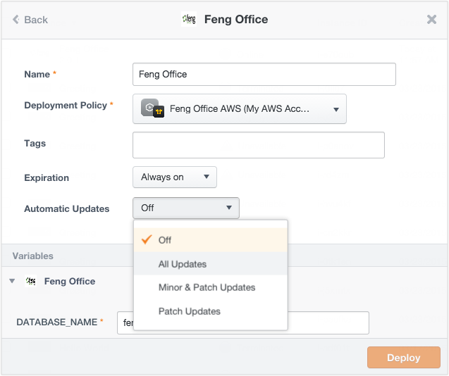

{{{ "title": "Version Control and Auto-Updates",
"date": "09-01-2016",
"author": "",
"attachments": [],
"contentIsHTML": false
}}}

In large-scale, complex deployments where tens or hundreds of distributed applications run from a single box configuration, you need a way to manage changes to box configurations and handle those updates to running instances. Versioning and auto updates help with that.

**In this article:**

* Versioning a box
* Version semantics
* Updating instances automatically or manually

### Versioning a Box

A box must be versioned to push its updates automatically to live instances deployed from it. To create a version, navigate to the box and click the Versions tab. Click **New Version** and save with an appropriate version number.

* Use **Major** to indicate a lot of changes. For example, you may alter the box configuration with different child boxes or variables or a binding.
* Use **Minor** to indicate small changes. For example, instead of apt-get you now install and compile software from a Git repo.
* Use **Patch** to indicate trivial changes like fixing a typo, as an example.

### Version Semantics

Major, minor, and patch follow semantic versioning standards. ElasticBox does not check for the quality or correctness of changes between the versions. It’s up to the box composer to test changes be they minor, patch, or major. Versioning semantics helps others consuming the box decide the level of updates they are comfortable pushing to their instances.

**Draft, current, latest**

* Latest is the highest version number of a box. When you deploy from the Instances page, you always get the latest.
* Draft indicates changes not yet saved to the box. When you deploy from the box page, you typically deploy the draft.
* Current refers to a specific version restored to the box.

### Updating Instances Automatically or Manually

When launching an instance, choose the level of auto update you’re comfortable applying. Go with **All Updates** if you are not concerned about big or small configuration changes. Otherwise, choose **Minor and Patch Updates** or **Patch Updates**, which make sure the configuration remains unchanged, for the most part.

If you don’t set instances to auto-update, no worries. A visual cue on the Instances page reminds you when changes are available from the related box. You can always manually update from the Instances page. Select the instance and under the Bulk Actions or the gear icon of the instance, click **Update Instance**. From here, you can update the instance with a specific version. An update always triggers a [reinstall operation](../ElasticBox/deploying-managing-instances.md).

**Note:** When deploying a box from the Instances page, you consume the latest configuration of the parent and child boxes unless you chose a specific version for the child boxes. To deploy a different version of the parent box, launch it from the box page. From the Versions tab > gear icon, click **Deploy** on a select version.

### Contacting ElasticBox Support

We’re sorry you’re having an issue in [ElasticBox](//www.ctl.io/elasticbox/). Please review the [troubleshooting tips](./troubleshooting-tips.md), or contact [ElasticBox support](mailto:support@elasticbox.com) with details and screenshots where possible.

For issues related to API calls, send the request body along with details related to the issue.

In the case of a box error, share the box in the workspace that your organization and ElasticBox can access and attach the logs.
Linux: SSH and locate the log at /var/log/elasticbox/elasticbox-agent.log
Windows: RDP into the instance to locate the log at ProgramDataElasticBoxLogselasticbox-agent.log
