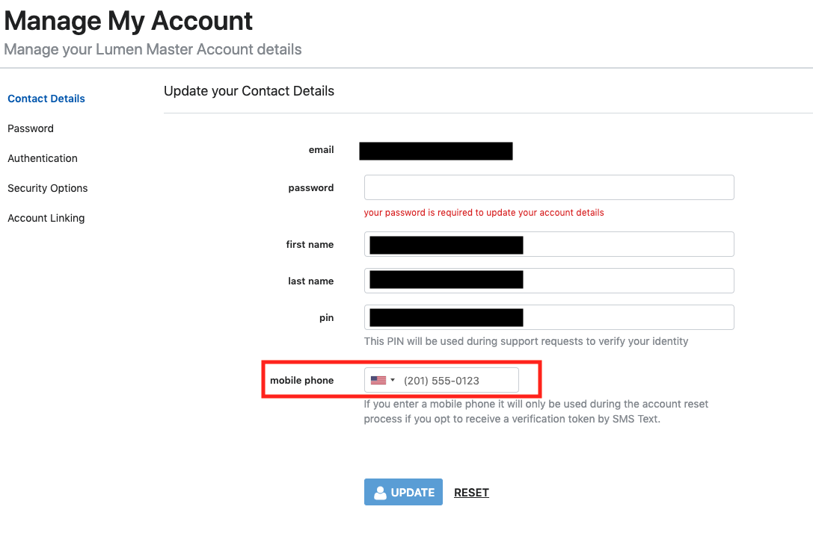

{{{
  "title": "Lumen Master Account: Ability to Reset Account Password via SMS",
  "date": "9-7-2018",
  "author": "Daniel Stephan",
  "attachments": [],
  "contentIsHTML": false
}}}

### Description

As part of our efforts to increase the security of your accounts using Managed Hosting (SavvisStation Portal) and Private Cloud (DCC), you will need to go through a one-time setup to create a new Lumen Master Account.  You may also choose to use a Lumen Master Account to log into Cloud Application Manager or Public Cloud.  Once setup is complete, for your security, you will receive a one-time prompt to provide credentials for your services to link them to your Lumen Master Account; as a result, you will be able to navigate between them without re-authenticating going forward. Other security improvements include optional multi-factor authentication through your smart phone (soft token) and the ability to set up multiple security questions for account validation and retrieval purposes.

When you forget your password, one of the steps is to enter in a token code.  This token code is sent via email, or if you have enabled it, via SMS.  This article shows you how to add your phone number so you can choose to send this token via SMS.

This article assumes that you have [created your Lumen Master Account](lumen-master-account-registration.md) and you have [linked an account](lumen-master-account-linking-and-unlinking_accounts.md).

### Steps
**1:** Logging in With Your Lumen Master Account   

Go to [https://www.ctl.io/](https://www.ctl.io/), and click on the "Log In" link to the top right.  Click on Managed Hosting.  

 

Log in with your master account.  

**2:** Managing Your Account  

Once you are in Managed Hosting (SavvisStation), go to the top right and hover over your name.  Click on "My Account".  

**3:** Adding Your Phone Number  
You should be directed to the Contact Details section.  In this section, you can enter in your mobile phone number. 

**Please Note: You must enter in your country calling code with a plus sign in front of the country calling code.**  
*Example for US resident: +1-555-555-5555.  In this example, +1 is the country calling code.*  

Once the phone number has provided, enter your password and click the update button.

**4:** Verify Your Phone Number  
You will receive a text message with a token.  Enter the token into the verification screen and click update.  Once this is done, you can complete account password resets via SMS.

**5:** Resetting Your Account Password via SMS  
After adding and verifying your phone number, you now have the option to send password reset tokens via SMS.  When resetting your password, choose "SMS Text Message" in the token delivery drop down to receive the token via SMS.

