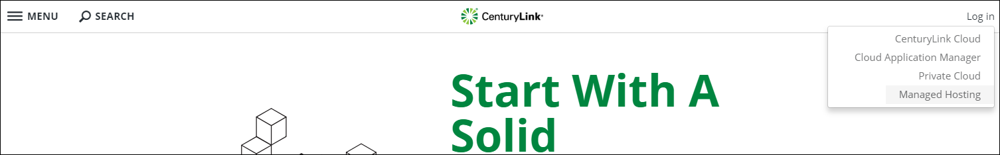
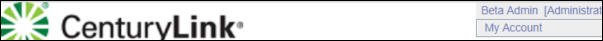
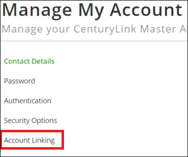
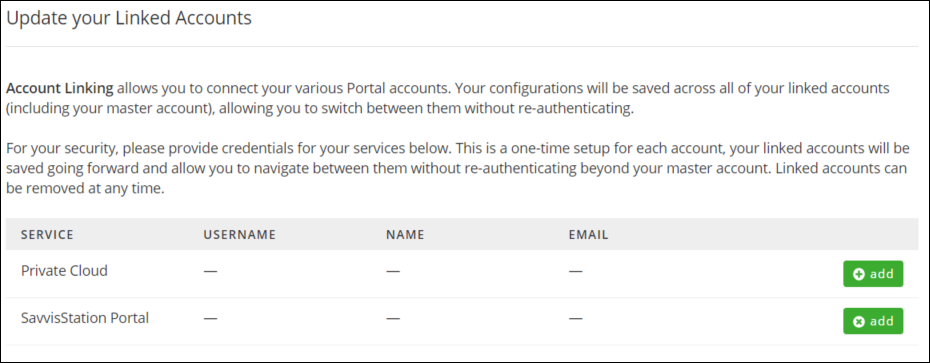
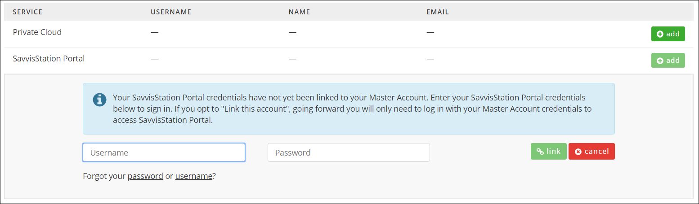
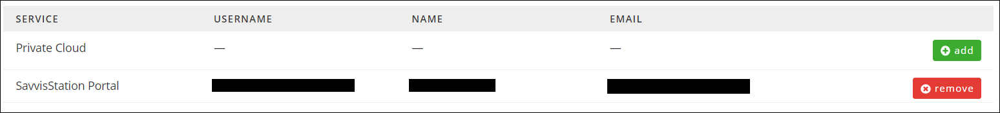

{{{
  "title": "Lumen Master Account: Linking and Unlinking Accounts",
  "date": "6-21-2018",
  "author": "Daniel Stephan",
  "attachments": [],
  "contentIsHTML": false
}}}

### Description

As part of our efforts to increase the security of your accounts using the Managed Hosting (SavvisStation Portal) and Private Cloud (DCC), you will need to go through a one-time setup to create a new Lumen Master Account.  You may also choose to use a Master Account to log into Cloud Application Manager or Public Cloud.  Once setup is complete, for your security, you will receive a one-time prompt to provide credentials for your services to link them to your Lumen Master Account; as a result, you will be able to navigate between them without re-authenticating going forward. Other security improvements include optional multi-factor authentication through your smart phone (soft token) and the ability to set up multiple security questions for account validation and retrieval purposes.

There may be times when you want to manually link or unlink an account.  This article steps you through this process.  This can be done after you have created your Lumen Master Account.

[If you haven't created your Lumen Master Account yet, please go here for a step by step guide.](lumen-master-account-registration.md)

### Steps
**1:** Logging in With Your Master Account   
Go to [https://www.ctl.io/](https://www.ctl.io/), and click on the "Log In" link to the top right.  Click on Managed Hosting.

 

Log in with your Lumen Master Account.

**Please Note:** If you have not linked an account yet, you will be brought to a screen asking you to login with your Managed Hosting (SavvisStation) credentials.  You can link your Managed Hosting (SavvisStation) account and then proceed to step 2.  Otherwise, you can hover over your name at the top right, click "Manage My Account", and proceed to step 3.

**2:** Managing Your Account  
Once you are in Managed Hosting (SavvisStation), go to the top right and hover over your name.  Click on "My Account".  

**3:** Go To Account Linking  
Click on "Account Linking" on the left hand side of the screen.  

**4:** Manage Your Account Links  
In this screen, you can see which accounts have been linked.  You also have the ability to add new links, or remove existing links.  The table lists the different services you can link, and if an account is linked, some basic information on that account.    

**5:** Adding an Account  
To add an account, simply click the "add" button on the desired account type.  A new dialog will appear prompting you to enter your credentials in.  Once you have entered the credentials in, click the "link" button.  This will then authenticate the credentials, and if successful, link the account.  The linked account will then show up in the list and the "add" button will change to a "remove" button.  

  

**6:** Removing an Account  
To remove an account, simply click the "remove" button on the desired account.  You will then be prompted to confirm you do want to remove the account.  Once you confirm, the account will be removed and the "remove" button will become an "add" button. You can then add an account of that type.  

  
