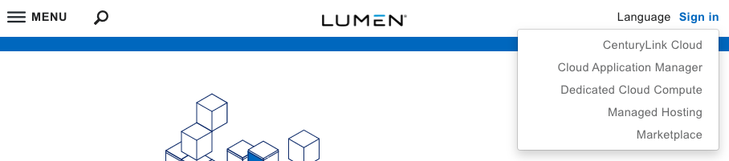
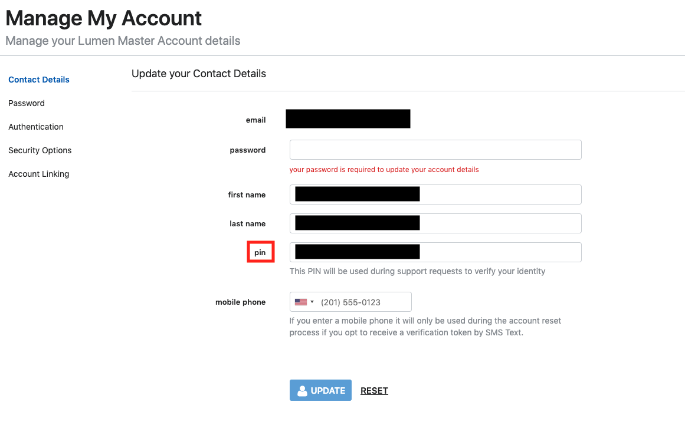

{{{
  "title": "Lumen Master Account: Locating and Changing Your PIN",
  "date": "8-20-2018",
  "author": "Daniel Stephan",
  "attachments": [],
  "contentIsHTML": false
}}}

### Description

As part of our efforts to increase the security of your accounts using the SavvisStation Portal and Private Cloud (DCC), you will need to go through a one-time setup to create a new Master Account.  You may also choose to use a Master Account to log into Cloud Application Manager or CenturyLink Cloud (Public Cloud).  Once setup is complete, for your security, you will receive a one-time prompt to provide credentials for your services to link them to your master account; as a result, you will be able to navigate between them without re-authenticating going forward. Other security improvements include optional multi-factor authentication through your smart phone (soft token) and the ability to set up multiple security questions for account validation and retrieval purposes.

When you engage with the customer care team, there will be times when you need to provide a PIN.  This PIN provides an additional way for the customer care team to validate who you are. This allows us the ability to better protect your account and information.  You will be required to provide a PIN whenever you attempt to make account changes or request sensitive data.  This article steps you through how you can locate your PIN.  It will also show you how can change your PIN if you would like to do so.

This article assumes that you have [created your Lumen Master Account](lumen-master-account-registration.md) and you have [linked an account](lumen-master-account-linking-and-unlinking-accounts.md).

### Steps
**1:** Logging in With Your Lumen Master Account   

Go to [https://www.ctl.io/](https://www.ctl.io/), and click on the "Log In" link to the top right.  Click on Managed Hosting.  

 

Log in with your master account.  

**2:** Managing Your Account  

Once you are in Managed Hosting, go to the top right and hover over your name.  Click on "My Account".  

**3:** View Your PIN  

You should be directed to the Contact Details section.  If you were not, click 'Contact Details' on the left side of the screen. In this section you can find your PIN. 

**4:** Changing Your PIN  

By clicking in the PIN text box, you can enter in a PIN of your choosing.  You must enter your password in the password section to make any changes.  Once you entered a PIN in that meets the below criteria, you can click the update button to set it.  

**PIN Criteria:**  
* Your PIN can only contain numbers
* Your PIN must be a minimum of 4 digits
* Your PIN can only be a maximum of 10 digits
