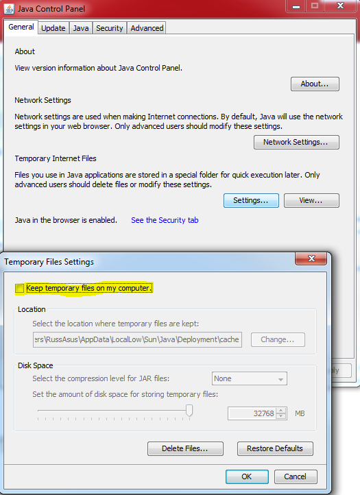
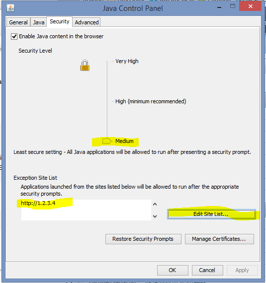

{{{
  "title": "How to configure Java settings to access Citrix web user interfaces",
  "date": "8-5-2014",
  "author": "Lisa Macke",
  "attachments": [],
  "contentIsHTML": false
}}}

### Description
This article will help users properly configure their Java settings to connect to various web management interfaces, such as the Citrix Netscaler VPX.

### Prerequisites
* Must have log on rights to appliance or application
* Windows with IE, Chrome, or Firefox installed
* Applicable Ports open for the Web UI from your location to the RNAP IP of the Netscaler

### Detailed Steps
1. Close your preferred browser.

2. [Download](//www.java.com/en/download) and install the latest version of java.

3. Launch the Java Control Panel by running “Configure Java” from your start menu

4. On the General Tab under Temporary Internet Files click “Settings”.

5. Uncheck the box "Keep temporary files on my computer" and press OK.

    

6. Next go to the Security tab and change the slider to Medium. Please note that you are responsible for the security of your OS and computer.

    

7. Add the Web UI IP Address to the Exception Site List:
    * Click on “Edit Site List”
    * Click “Add”
    * Enter the URL http://netscaler_rnatIP
    * Ignore the http/https warning (Click “continue”)
    * Click “OK”

8. Launch your web browser, and access the Web UI with the URL http://netscaler_rnatIP

9. Throughout your experience you will see Java security prompts. Please click Allow and Run in order to continue.

### Additional Notes
* Chrome Users: You may need to modify some advanced settings in your browser settings as well. Launch the Chrome menu and go to Settings. Click on Advanced settings. Click on Content settings.  Underneath JavaScript, check "Allow all sites to run JavaScript". Scroll down a bit further to "Protected Content". Uncheck the box "Allow identifiers for protected content (computer restart may be required)". Press done and close all instances of browser.
* Recent Java updates have made the Netscaler GUI less reliable, if you are still having issues with the Netscaler GUI, it is recommended that you use the older version of the UI that tends to have less issues.  Log into the netscaler Web UI, then manually change the URL to: http://netscaler_rnatIP/menu/guia

### Still Having Issues?

If you are still having issues, contact support.  
