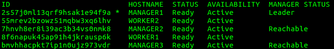

{{{
  "title": "Creating a Docker Swarm on CenturyLink Cloud",
  "date": "07-09-2016",
  "author": "Richard Case",
  "attachments": [],
  "contentIsHTML": false
}}}


The release of Docker Engine v1.12 introduced swarm mode for creating and managing a cluster of Docker Engines which is referred to as a swarm. This replaces Docker Swarm which was previously a separate application.

A Swarm is a collection (cluster) of nodes running Docker Engine following a decentralized design where services can be deployed. Swarm mode includes scaling, service discovery, desired state, and many other features. For an overview of Swarm mode see: https://docs.docker.com/engine/swarm/

By using our plugin for Docker Machine, users can create a Docker swarm on CenturyLink Cloud by running a small number of Docker Machine commands to create the nodes. Thus allowing for the ability to run the Docker CLI commands required to create the swarm by setting the machine context using Docker Machine.

### Prerequisites

The following requirements are needed to create a Docker swarm in CenturyLink Cloud.

- [Docker v1.12 or later](https://www.docker.com/products/overview)
- [CenturyLink Cloud Docker Machine Plugin](../../Ecosystem Partners/Marketplace Guides/getting-started-with-docker-machine.md)
- A CenturyLink Cloud account

If you don’t have a CenturyLink Cloud account yet, no problem. [Sign up for a free trial](https://www.ctl.io/free-trial/).


### Swarm Creation

Creating a Docker swarm is made of a number of different steps. The steps have been divided into the following sections:

* [Environment Setup](#environment-setup)
* [Node Creation](#node-creation)
* [Create the Swarm](#create-the-swarm)
* [Add Manager Nodes](#add-manager-nodes)
* [Add Worker Nodes](#add-worker-nodes)
* [Validate the Cluster](#validate-the-cluster)


### Environment Setup

1) Decide how many *manager* and *worker* nodes you want in your swarm. The following table contains some advice:

 **Node Type**|**Advice**
  -------------|-------------
  Worker|For production environments more than 1 node is recommended.
  Manager|For production environments more than 1 node is recommended. Additionally, due to the use of the Raft consensus algorithm in the manager nodes it's recommended that there are an odd number of manager nodes.

**NOTE:** By default, the manager nodes will be used to run tasks in addition to the worker nodes. The manager nodes are used to submit tasks and they performance the management and orchestration function of the swarm

**NOTE:** More information on Raft can be found here http://thesecretlivesofdata.com/raft/

2) Open a command prompt and set the CLC_USERNAME, CLC_PASSWORD and CLC_ALIAS environment variables for your CLC account. For example, on Linux & OSX:
```
export CLC_USERNAME='<username>'
export CLC_PASSWORD='<password>'
export CLC_ALIAS='<alias>'
```

3) Connect to CLC using VPN. To learn more about ways to connect such as persistent VPN or direct connection, please review [Network Access Options for Connecting to the CenturyLink Cloud Platform](../../Network/network-access-options-for-connecting-to-centurylink-clouds-platform.md).

### Node Creation

1) Create the manager nodes by running the following command once for each manager to create:
```
docker-machine create -d clc --clc-server-group "DockerSwarm" --clc-server-location "GB3" MANAGER1
```
**NOTE:** Docker machine will use *MANAGER1* as the identifier for this manager node. Therefore, when creating multiple manager nodes make sure this name is unique.

**NOTE:** The *clc-server-group* and *clc-server-location* command line options are not required and if they are omitted defaults will be used. For a full list of the supported command line options run this command:
```
docker-machine create -d clc
```

2) Create the worker nodes by running the following command once for each worker to create:
```
docker-machine create -d clc --clc-server-group "DockerSwarm" --clc-server-location "GB3" WORKER1
```
The notes from step 1) apply to the worker nodes as well.

3) Once the nodes have been created run the following command to see a list of all the Docker hosts that have been created:
```
docker-machine ls
```
The output will be similar to the following:


### Create the Swarm

1) Set the Docker environment variables for the first of the manager nodes by first running:
```
docker-machine env MANAGER1
```
Depending on your OS the command will output a command that can be used to set the required environment variables. For example:
```
eval $(docker-machine env MANAGER1)
```

2) Create the swarm by running the following command:
```
docker swarm init
```
The output of the command will contain the command that will be used later to join worker nodes to the swarm. Save the command for later use:


**NOTE:** There are a number of command line options that can be specified when creating the swarm. See: https://docs.docker.com/engine/reference/commandline/swarm_init/

### Add Manager Nodes

1) Whilst the Docker environment variables are still set to the first manager node run the following command:
```
docker swarm join-token manager
```
The output of the command will contain the command that will be used to join additional manager nodes to the swarm:


2) Set the Docker environment variables for the manager node to join to the existing swarm by first running:
```
docker-machine env MANAGER2
```
Depending on your OS the command will output a command that can be used to set the required environment variables. For example:
```
eval $(docker-machine env MANAGER2)
```

3) Run the command that was output in step 1). For example:
```
docker swarm join \
    --token SWMTKN-1-2lptlwq6p1ddt0t6qpil2p904qlmrwnrik7f5a2c0gdvvs7hn4-cuxeu68q9ec159axrciz6wbqf \
    10.105.30.12:2377
```
The output of the command should indicate that the node joined the swarm as a manager.

4) Repeat steps 2) & 3) for each of the remaining manager nodes that need to join the swarm.

### Add Worker Nodes

1) Set the Docker environment variables for the worker node to join to the existing swarm by first running:
```
docker-machine env WORKER1
```
Depending on your OS run the command from the output to set the require environment variables. For example:
```
eval $(docker-machine env WORKER1)
```

2) Run the command that was output in step 2) of the [Create the swarm](#create-the-swarm) section. For example:
```
docker swarm join \
    --token SWMTKN-1-2lptlwq6p1ddt0t6qpil2p904qlmrwnrik7f5a2c0gdvvs7hn4-138uv6z599o1q9gki9wzwumn7 \
    10.105.30.12:2377
```
The output of the command should indicate that the node joined the swarm as a worker.

3) Repeat steps 1) & 2) for each of the remaining worker nodes that need to join the swarm.

### Validate the Cluster

1) Run the following command to list all the nodes in a swarm with their status:
```
docker node ls
```
You should see output similar to the following:

This shows various information including the status of each node and which manager has been elected the leader.

### What's Next?
Now you have a working Docker swarm running on the CenturyLink Cloud you are ready to start managing and deploying services to the swarm. It's recommended that you follow the swarm mode tutorial from this starting point: https://docs.docker.com/engine/swarm/manage-nodes/
