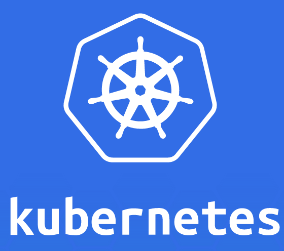

{{{
  "title": "Getting Started with Kubernetes - Ansible",
  "date": "02-01-2016",
  "author": "Chris Kleban",
  "attachments": [],
  "contentIsHTML": false
}}}



Please visit [here](https://github.com/CenturyLinkCloud/adm-kubernetes-on-clc) for instructions on how to install Kubrenetes on CenturyLink Cloud.

### Technology Profile

Kubernetes is an open source orchestration system for Docker containers. It handles scheduling onto nodes in a compute cluster and actively manages workloads to ensure that their state matches the users declared intentions. Using the concepts of "labels" and "pods", it groups the containers which make up an application into logical units for easy management and discovery. Source: Kubernetes.io

For more information on what Kubernetes is, please visit http://www.kubernetes.io


### Description

By using our Ansible scripts, customers can create a Kubernetes cluster on CenturyLink Cloud infrastructure by running a single script.

To see the source code of our Kubernetes Cluster Creation Ansible scripts, please visit our github repo: [https://github.com/CenturyLinkCloud/adm-kubernetes-on-clc](https://github.com/CenturyLinkCloud/adm-kubernetes-on-clc)

By using our Ansible scripts, customers can create a Kubernetes cluster on CenturyLink Cloud infrastruture by running a single script.

### Audience

CenturyLink Cloud Users, Developers, Operations, System Engineers, Architects.

### Impact
After following the instructions this article, the user should have a working Kubernetes cluster on CenturyLink.

### Clusters of VMs or Physical Servers, your choice.

- We support Kubernetes clusters on both Virtual Machines or Physical Servers. If you want to use physical servers for the worker nodes (minions), simple use the --minion_type=bareMetal flag.
- For more information on physical servers, visit: https://www.ctl.io/bare-metal/)
- Physical serves are only available in the VA1 and GB3 data centers.
- VMs are available in all 13 of our public cloud locations.


### Requirements

The following requirements are needed in order to use these scripts to install Kubernetes on CenturyLink Cloud.

- A CenturyLink Cloud account
- VPN access established to your CenturyLink data-center

And

- A linux host with the following items installed:
- ansible _version 2.0_ or newer  
- python
- pip
- git


### Script Installation

After you have all the requirements met, please follow these instructions to install this script.

1) Clone this repository and cd into it.

```
git clone https://github.com/CenturyLinkCloud/adm-kubernetes-on-clc
```

2) Install the CenturyLink Cloud SDK and Ansible Modules.

```
sudo pip install -r requirements.txt
```

3) Create the credentials file from the template and use it to set your ENV variables.

```
cp ansible/credentials.sh.template ansible/credentials.sh
vi ansible/credentials.sh
source ansible/credentials.sh

```
4) Make sure the computer you are working on has access to the CenturyLink Cloud network. This is done by using a VM inside the CenturyLink Cloud network or having an active VPN connection to the CenturyLink Cloud network. To find out how to configure the VPN connection, [visit here](../../Network/how-to-configure-client-vpn.md).


#### Ubuntu 14  Walkthrough: Installation of Requirements and Scripts

If you use ubuntu 14, for your convenience we have provided a step by step guide to install the requirements and install the script.

```
  # system
  apt-get update
  apt-get install -y git python python-crypto
  curl -O https://bootstrap.pypa.io/get-pip.py
  python get-pip.py

  # installing this repository
  mkdir -p ~home/k8s-on-clc
  cd ~home/k8s-on-clc
  git clone https://github.com/CenturyLinkCloud/adm-kubernetes-on-clc.git
  cd adm-kubernetes-on-clc/
  pip install -r requirements.txt

  # getting started
  cd ansible
  cp credentials.sh.template credentials.sh; vi credentials.sh
  source credentials.sh
```

### Cluster Creation

To create a new Kubernetes cluster, simply run the kube-up.sh script. A complete list of script options and some examples are listed below.

```
cd ./adm-kubernetes-on-clc
bash kube-up.sh -c="name_of_kubernetes_cluster"
```

It takes about 15 minutes to create the cluster. Once the script completes, it will output some commands that will help you setup kubectl on your machine to point to the new cluster.

#### Script Options
```
Usage: kube-up.sh [OPTIONS]
Create servers in the CenturyLinkCloud environment and initialize a Kubernetes cluster
Environment variables CLC_V2_API_USERNAME and CLC_V2_API_PASSWD must be set in
order to access the CenturyLinkCloud API

All options (both short and long form) require arguments, and must include "="
between option name and option value.

     -h (--help)                   display this help and exit
     -c= (--clc_cluster_name=)     set the name of the cluster, as used in CLC group names
     -t= (--minion_type=)          standard -> VM (default), bareMetal -> physical]
     -d= (--datacenter=)           VA1 (default)
     -m= (--minion_count=)         number of kubernetes minion nodes
     -mem= (--vm_memory=)          number of GB ram for each minion
     -cpu= (--vm_cpu=)             number of virtual cps for each minion node
     -phyid= (--server_conf_id=)   physical server configuration id, one of
                                      physical_server_20_core_conf_id
                                      physical_server_12_core_conf_id
                                      physical_server_4_core_conf_id (default)
     -etcd_separate_cluster=yes    create a separate cluster of three etcd nodes,
                                   otherwise run etcd on the master node
```
#### Script Examples

Create a cluster with name of k8s_1, 1 master node and 3 worker minions (on physical machines), in VA1

```
 bash kube-up.sh --clc_cluster_name=k8s_1 --minion_type=bareMetal --minion_count=3 --datacenter=VA1
```
Create a cluster with name of k8s_2, an ha etcd cluster on 3 VMs and 6 worker minions (on VMs), in VA1

```
 bash kube-up.sh --clc_cluster_name=k8s_2 --minion_type=standard --minion_count=6 --datacenter=VA1 --etcd_separate_cluster=yes
```
Create a cluster with name of k8s_3, 1 master node, and 10 worker minions (on VMs) with higher mem/cpu, in UC1:


```
  bash kube-up.sh --clc_cluster_name=k8s_3 --minion_type=standard --minion_count=10 --datacenter=VA1 -mem=6 -cpu=4
```

### Cluster Expansion
To expand an existing Kubernetes cluster, simply run the add-kube-node.sh script. A complete list of script options and some examples are listed below. This script must be run from the same hose that created the cluster (or a host that has the cluster artifact files stored in ~/.clc_kube/$cluster_name).

```
cd ./adm-kubernetes-on-clc
bash add-kube-node.sh -c="name_of_kubernetes_cluster" -m=2
```

#### Cluster Expansion: Script Options

```
Usage: add-kube-node.sh [OPTIONS]
Create servers in the CenturyLinkCloud environment and add to an
existing CLC kubernetes cluster

Environment variables CLC_V2_API_USERNAME and CLC_V2_API_PASSWD must be set in
order to access the CenturyLinkCloud API

     -h (--help)                   display this help and exit
     -c= (--clc_cluster_name=)     set the name of the cluster, as used in CLC group names
     -m= (--minion_count=)         number of kubernetes minion nodes to add

```

### Cluster Deletion
There are two ways to delete an existing cluster:

1) Use our python script:

```
python delete_cluster.py --cluster=clc_cluster_name --datacenter=DC1

```

2) Use the CenturyLink Cloud UI. To delete a cluster, log into the CenturyLink Cloud control portal and delete the
parent server group that contains the Kubernetes Cluster. We hope to add a
scripted option to do this soon.

### Cluster Features and Architecture
We configure the Kubernetes cluster with the following features:

* KubeDNS: DNS resolution and service discovery
* Heapster/InfluxDB: For metric collection. Needed for Grafana and auto-scaling.
* Grafana: Kubernetes/Docker metric dashboard
* KubeUI: Simple web interface to view Kubernetes state
* Kube Dashboard: New web interface to interact with your cluster

We use the following to create the Kubernetes cluster:

* Kubernetes 1.1.7
* Unbuntu 14.04
* Flannel 0.5.4
* Docker 1.9.1-0~trusty
* Etcd 2.2.2

### Optional add-ons

* Logging: We offer an integrated centralized logging ELK platform so that all Kubernetes and docker logs get sent to the ELK stack. To install the ELK stack and configure Kubernetes to send logs to it, follow this documentation: [log aggregation](https://github.com/CenturyLinkCloud/adm-kubernetes-on-clc/blob/master/log_aggregration.md). Note: We don't install this by default as the footprint isn't trivial.


### Cluster management

The most widely used tool for managing a Kubernetes cluster is the command-line
utility _kubectl_.  If you do not already have a copy of this binary on your
administrative machine, you may run the script _install-kubectl.sh_ which will
download it and install it in _/usr/bin/local_.

The script requires that the environment variable CLC_CLUSTER_NAME be defined.

_install_kubectl.sh_ also writes a configuration file which will embed the necessary
authentication certificates for the particular cluster.  The configuration file is
written to the local directory, named *kubectl_${CLC_CLUSTER_NAME}_config*.

```
export KUBECONFIG=kubectl_${CLC_CLUSTER_NAME}_config
kubectl version
kubectl cluster-info
```

### Accessing the cluster programmatically

It's possible to use the locally-stored client certificates to access the api server.
```
curl \
   --cacert ${CLC_CLUSTER_HOME}/pki/ca.crt  \
   --key ${CLC_CLUSTER_HOME}/pki/kubecfg.key \
   --cert ${CLC_CLUSTER_HOME}/pki/kubecfg.crt  https://${MASTER_IP}:6443
```
But please note, this *does not* work out of the box with the curl binary
distributed with OSX.

### Accessing the cluster with a browser

We install two UIs on Kubernetes. The original KubeUI and the newer kube dashboard. When you create a cluster, the script should output URLs for these interfaces like this:

KubeUI is running at https://${MASTER_IP}:6443/api/v1/proxy/namespaces/kube-system/services/kube-ui
kubernetes-dashboard is running at https://${MASTER_IP}:6443/api/v1/proxy/namespaces/kube-system/services/kubernetes-dashboard

Note on Authentication to the UIs: The cluster is set up to use basic authentication for the user _admin_.  
Hitting the url at https://${MASTER_IP}:6443 will require accepting the self-
signed certificate from the apiserver, and then presenting the admin password
found at _${CLC_CLUSTER_HOME}/kube/admin_password.txt_.


### Configuration files

Various configuration files are written into the home directory under
_.clc_kube/${CLC_CLUSTER_NAME}_ in several subdirectories. You can use these files
to access the cluster from machines other than where you created the cluster from.

* _config/_: ansible variable files containing parameters describing the master and minion hosts
* _hosts/_: hosts files listing access information for the ansible playbooks
* _kube/_: kubectl configuration files, and the basic-authentication password for admin access to the kubernetes api
* _pki/_: public key infrastructure files enabling TLS communication in the cluster
* _ssh/_: ssh keys for root access to the hosts


### _kubectl_ usage examples

There are a great many features of _kubectl_.  Here are a few examples.

List existing nodes, pods, services and more, in all namespaces, or in just one:
```
kubectl get nodes

kubectl get --all-namespaces services

kubectl get --namespace=kube-system replicationcontrollers

```

The Kubernetes api server exposes services on web urls, which are protected by requiring
client certificates. If you run a kubectl proxy locally, kubectl will provide
the necessary certificates and serve locally over http.
```
kubectl proxy -p 8001
```
and then access urls like http://127.0.0.1:8001/api/v1/proxy/namespaces/kube-system/services/kube-ui/
without the need for client certificates in your browser.


### What Kubernetes features do not work on CenturyLink Cloud

- At this time, there is no support services of the type 'loadbalancer'. We are actively working on this and hope to publish the changes soon.
- At this time, there is no support for persistent storage volumes provided by CenturyLink Cloud. However, customers can bring their pwn persistent storage offering.


### Pricing
The costs associated with running Kubernetes from the Ansible scripts are for the CenturyLink Cloud infrastructure only.  There are no Kubernetes  license costs or additional fees bundled in.


After following the instructions this article, the user should have a working kubernetes cluster on CenturyLink.

### Instructions

Since this is an open source project, the instructions on how to use this scripts are found on Github. Please visit [here](https://github.com/CenturyLinkCloud/adm-kubernetes-on-clc) for the detailed instructions on how to install a Kubernetes Cluster on CenturyLink Cloud.

#### Who should I contact for support?
* For issues related to creating the Kubernetes cluster, please email kubernetes@ctl.io or create a support ticket.
* For issues related to cloud infrastructure (VM’s, network, etc), please open a CenturyLink Cloud Support ticket: https://t3n.zendesk.com/tickets/new
* For more information on using Kubernetes, please visit http://kubernetes.io/v1.1/.
