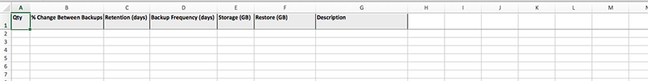
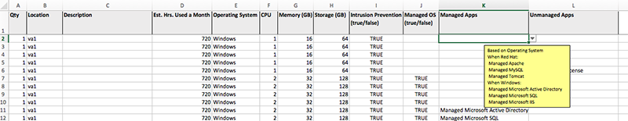
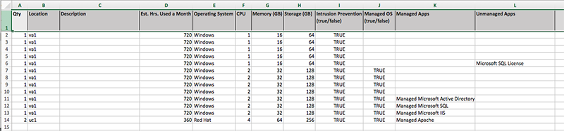

{{{
  "title": "Using the Estimator Spreadsheet with our Online Price Estimator",
  "date": "09-25-2018",
  "author": "Jim Greene",
  "attachments": [],
  "contentIsHTML": false
}}}

### Audience

Customers and Sales Representatives using the [Online Price Estimator](https://www.ctl.io/estimator/) to generate complex Hybrid IT Solution cost estimates.

### Overview

Our Online Price Estimator allows you to estimate the monthly costs and one-time charges for Hybrid IT configurations. For particularly complex scenarios, we have developed a spreadsheet converter that facilitates configuring your estimate by allowing you to bulk import multiple servers and solutions instead of manually configuring each item in the User Interface.

This article explains how to:
1. Fill out the Estimator Spreadsheet
2. Import it into the Online Price Estimator to receive an immediate estimate for solutions and services
3. Export the final estimate for sharing.

### Importing Estimates

For complex Hybrid IT scenarios, we recommend that you contact a Solutions Engineer through the Contact button to the right of the Estimator. Our experts can assist in helping you determine the products and configurations that best suit your needs, and in obtaining your estimate.

To create estimates for multiple products within our Hybrid IT portfolio, first [download the Estimator Spreadsheet template](https://www.ctl.io/estimator/), which is an Excel file containing multiple sheets. Add products to the relevant sheets and save the Excel file. Then, upload the saved file into the Online Pricing Estimator to generate an estimate.

### Completing the Estimator Spreadsheet

The Excel file consists of sheets that match the products that can be configured in the Online Pricing Estimator. Some values are dependent on conditions such as the selected operating system, so available options will change based on whether you have chosen Linux, Red Hat or Windows, or database type.

As a timesaver, the Online Pricing Estimator also contains built-in defaults for some values. Those sections can be left blank in the spreadsheet if they meet your needs. And we’ve done our best to make the Estimator Spreadsheet “mistake-proof.” So if you exceed the allowable maximum for a given variable, the value you entered will revert to the maximum allowed value. After the Excel file has been uploaded, you can make necessary adjustments in the Online Pricing Estimator.

### Exporting the Estimate

After the Estimator Spreadsheet has been uploaded to the Online Pricing Estimator and any necessary updates have been made, you can export the final estimate by selecting the Share/Save button to the right of the Online Estimator. Note that your estimate will list every product you’ve configured, not just VMs.

### Benefits of Using the Estimator Spreadsheet

Bulk upload: For complex configurations, entering data in the Estimator Spreadsheet and then uploading it is faster and easier than building  each item individually in the Online Pricing Estimator.

Making changes: Your needs may change during the course of a project. Instead of completely rebuilding a quote in the Online Pricing Estimator, you can make changes in your original Estimator Spreadsheet, upload it again, and quickly generate a new estimate.

### Notes

* Bare Metal servers are not included in the Estimator Spreadsheet because they’re not normally purchased in large quantities.
* If you’re copying from another Excel file, you will lose the Estimator Spreadsheet’s validation logic. It’s best to either copy values from a text file, or enter them manually.
* Our Online Pricing Estimator is in beta. We welcome any feedback and comments, as we continually strive to improve its functionality and User Interface.
