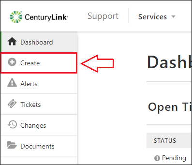
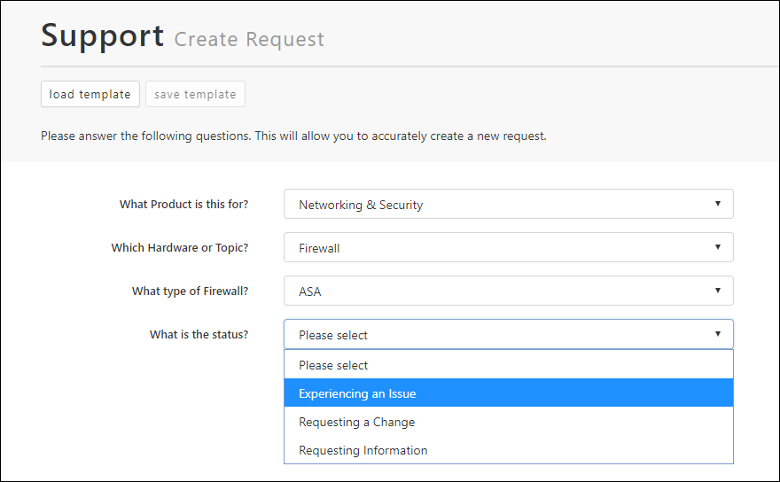
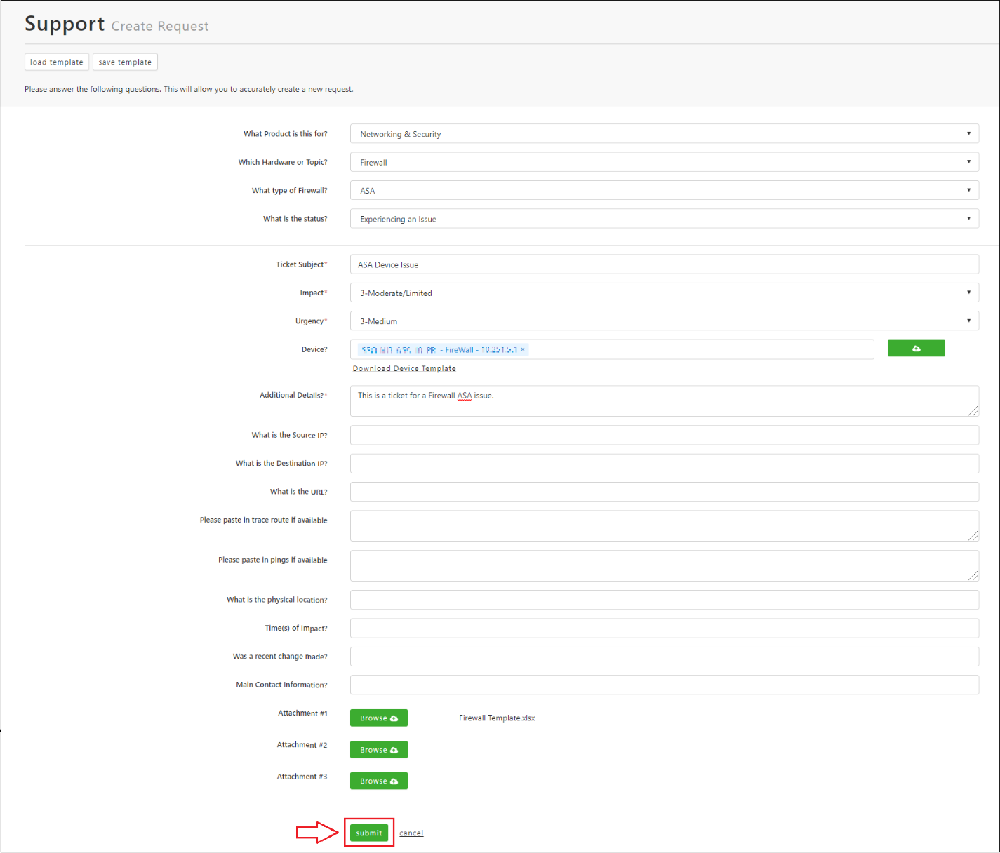
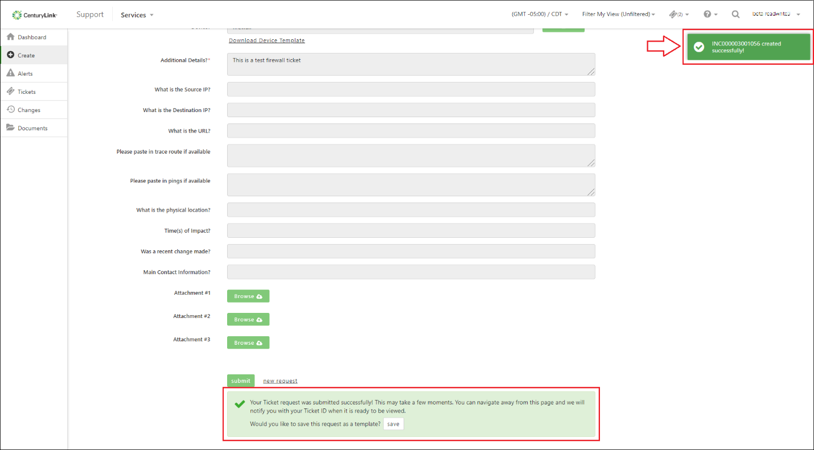

{{{
  "title": "Creating a Ticket, Change, or Request",
  "date": "7-30-2018",
  "author": "Evan McNeill",
  "attachments": [],
  "contentIsHTML": false
}}}

### Description

Creating your support tickets and changes have been refreshed for the [Support Portal](https://managedsupport.ctl.io) to be enabled for submitting both from the same form.  This article will go into detail on how to submit your tickets or changes.

### Steps

**1:** [Navigate to the Support Portal](Managed-Support:-How-to-Navigate-to-Managed-Support-Portal.md) and click Create on the left side navigation.

  

**2:** Answer the questions in the form to identify the nature of your request.

  
  
**Please Note:**

- The number of questions will vary depending on the nature of the request

- ‘What is the Status’ will usually dictate whether a ticket or change is being created.  ‘Experiencing an Issue’ will create a ticket, and ‘Requesting a Change’ will create a change.

**3:** Answer any remaining questions and click Submit.

  

**Please Note:**

- Questions will vary depending on the request (This example is very long).

- Required fields are denoted with a red * symbol

4: Once the request is submitted, you are free to navigate the site to wait for a returned Ticket ID or wait on the same page.  Tickets and changes should be created and available to view in under 30 seconds.  Once complete, the Ticket ID will appear in the upper right of the page.

  
  
At this time, you can click on this returned message and view your ticket.  If the message clears before you can click it, you can find your ticket by clicking Tickets > Open Tickets, or check the dashboard as it displays the most recently modified tickets.  For additional information, please see our guides for viewing or performing self-service on your tickets or changes.  Also see our guides for creating templates for your requests, as well as bulk uploading your devices.
