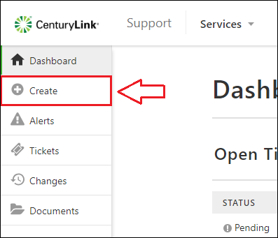

{{{
  "title": "Device Templates for Creating Requests",
  "date": "7-30-2018",
  "author": "Evan McNeill",
  "attachments": [],
  "contentIsHTML": false
}}}

### Description

Templates for your devices can be created to bulk upload your devices to a ticket, change, or request.  This is useful if you have groups of devices you submit request for frequently or on a recurring basis.  This article will cover creating device templates and loading them into the device field.

### Steps

1: [Navigate to the Support Portal](how-to-navigate-to-managed-support-portal.md) and click Create on the left side navigation

  
  
**2:** Download the Device Template from the form.  This download button will appear any time the device field appears.  If you already have a template ready for use, you can skip to step 4.
  
  
  
**3:** Add your devices to the template and save it on your computer.  In the example below, the first 2 devices are real, and the 3rd does not exist.

  
  
**4:** Click the Upload button and choose your template.  
  
  
  
**5:** Review your devices and remove any that could not be applied.  Devices that do not exist or you are not authorized to will appear in red.  These devices will not be applied when the request is submitted.  If you are unable to find a device you believe you should be authorized to view, please contact support.

  
