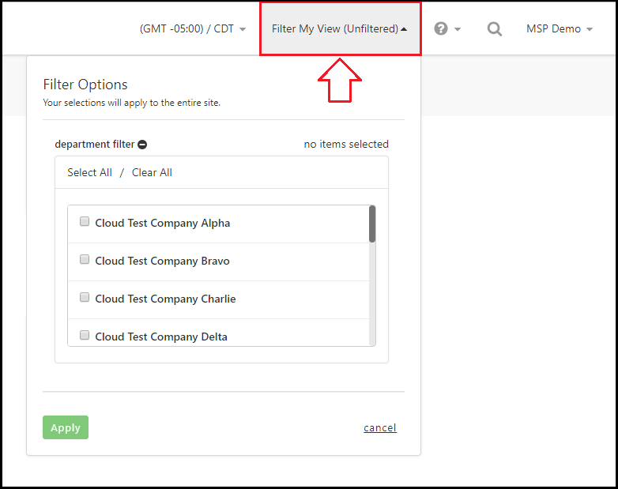
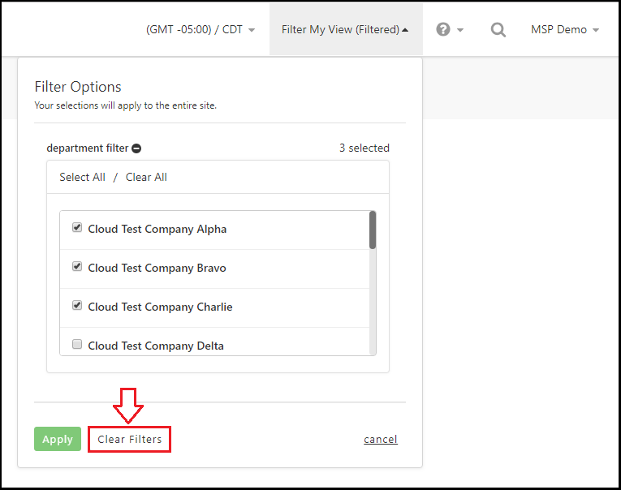

{{{
  "title": "Filter My View",
  "date": "8-27-2018",
  "author": "Evan McNeill",
  "attachments": [],
  "contentIsHTML": false
}}}

### Description

Filter My View can be used to filter your Portal experience by Department authorizations for a customized experience.  All data on the Portal will be updated to reflect your filter options.  Filters are temporarily applied to your current session, logging out and back in will reset your authorizations to default.

### Steps

**1:** Click ‘Filter My View’ from the header.

  
  
**2:** Select the departments you want applied to your current session and click ‘Apply’.  When filters are active, the Filter My View header dropdown will show as (Filtered).

**3:** To reset filters back to default, click the ‘Filter My View’ header dropdown and click ‘Clear Filters’.
  
  
