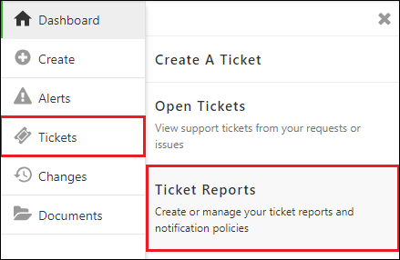
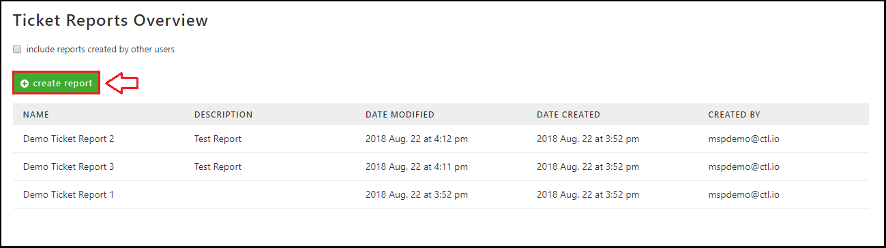
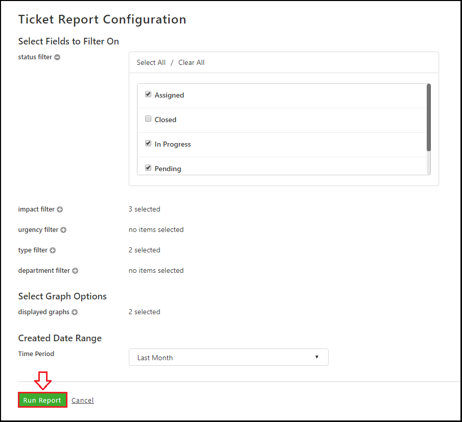
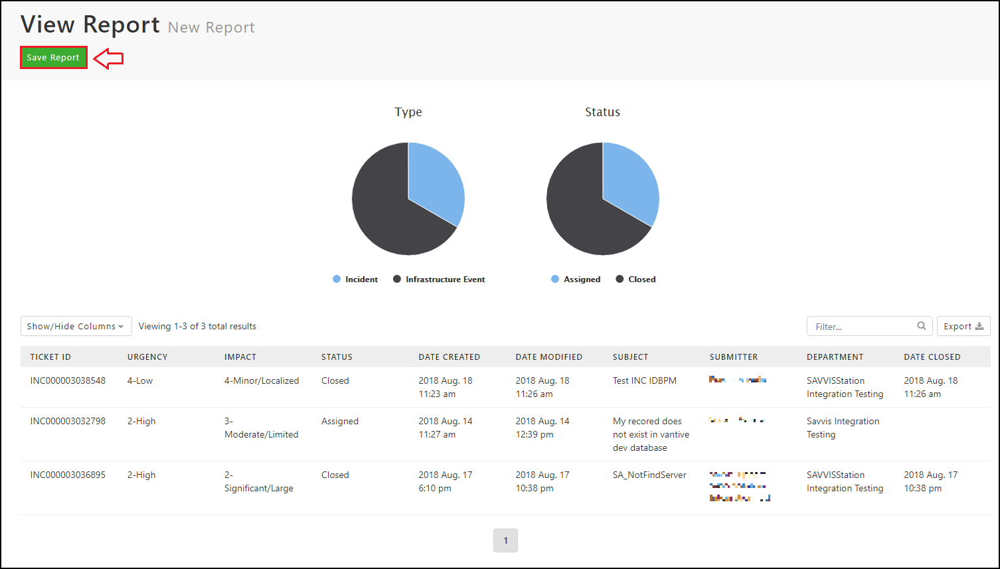
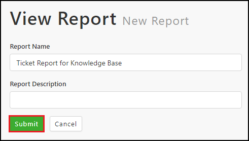
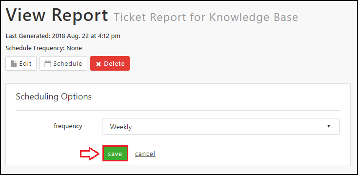

{{{
  "title": "Report Creation and Scheduling",
  "date": "8-23-2018",
  "author": "Evan McNeill",
  "attachments": [],
  "contentIsHTML": false
}}}

### Description

Reporting can be configured to retrieve a historical and customizable list of your tickets, changes, and alerts.  You can apply specific filters to see your desired data.  Reports can be saved to be run later or scheduled to send reports to your email.  This article will walk through the process of creating a new report, scheduling for automated emails, and viewing/editing your existing reports.  Ticket reporting will be used as an example.

### Creating and Scheduling Reports

**1:** Navigate to the Support Portal and click Tickets > Ticket Reports.  Change and Alert reporting will be located in their respective locations.

  
  
**2:** Click ‘Create Report’
  
  
  
**3:** Select your filters, graph options, and date range.  Click the (+) buttons to expand filter selections.  Options will vary depending on the type of report.  Click ‘Run Report’ to generate your report output.
  
  
  
**4:** From the report output page you can drill into individual tickets, export the data, or save your report (required for scheduling).  Click ‘Save Report’.  
  
  
  
**5:** Provide a Name and Description(optional) for the report and click ‘Submit’.
  
  
  
**6:** A saved report can be edited, scheduled, and deleted from this view.  You can return here by selecting the report in the list view seen in step 2.  To schedule your report, click ‘Schedule’, choose a frequency and click ‘Save’.  The report will be sent to your email set in Profile > Contact Information.  
  
  
