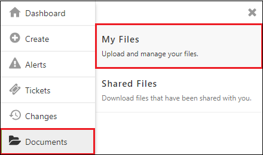
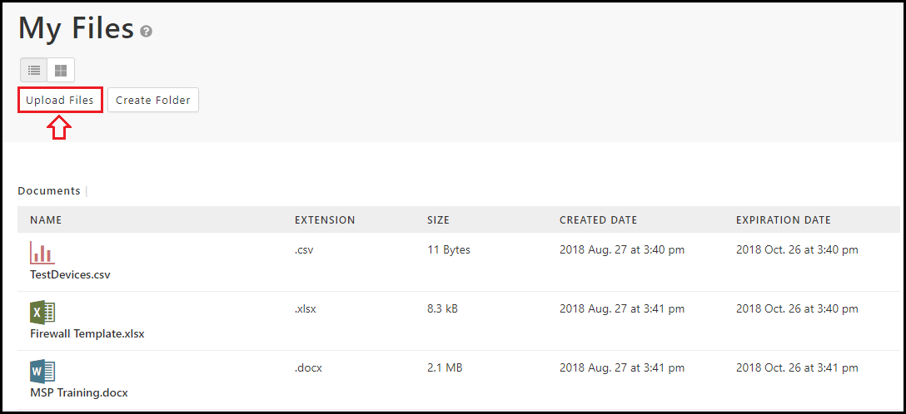
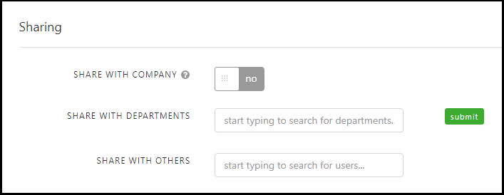
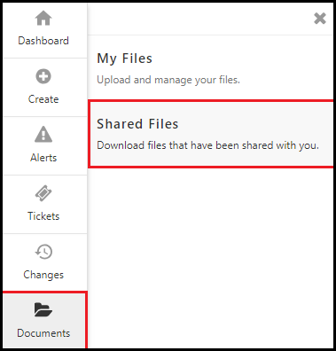

{{{
  "title": "Share Documents",
  "date": "8-27-2018",
  "author": "Evan McNeill",
  "attachments": [],
  "contentIsHTML": false
}}}

### Description

Document sharing is for uploading temporary documents for yourself or to share with other users in your company.

### Steps

**1:** [Navigate to the Support Portal](how-to-navigate-to-managed-support-portal.md) and click Documents > My Files.

  
  
**2:** This page will display a list of your uploaded files.  Click ‘Upload Files’ to add a new file.
  
  
  
**Please Note:**

- If this is your first time uploading a file, you must first select a file server location in accordance with GDPR compliance.

- You can create folders by clicking ‘Create Folder’.

- Your files display in List View by default.  You can change this to File View to see your files in an interface like a File Explorer on your computers’ operating system. 

**3:** Select a file from your file explorer.

**4:** Complete the ‘Upload File’ form and click ‘save’.  The expiration date will default to 60 days.  This time can be changed during upload or later in the file detail page.  You will receive an email to notify you of impending expiring files.

**5:** To share a file, click on the file or right click a file and click ‘View Details’.  From here you can opt to share the file with your entire company, or a combination of departments and other users.  Click ‘Submit’ to save your sharing configuration.
  
  
  
**6:** Files that have been shared with you will appear in the Shared Documents section.  View your shared documents by clicking Documents > Shared Documents.  
  
  
  
You can download shared files by right clicking and selecting ‘Download’ or by viewing the details and clicking ‘Download’ at the top of the page.  
