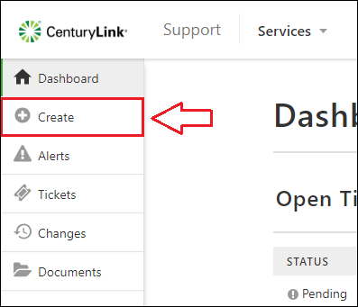
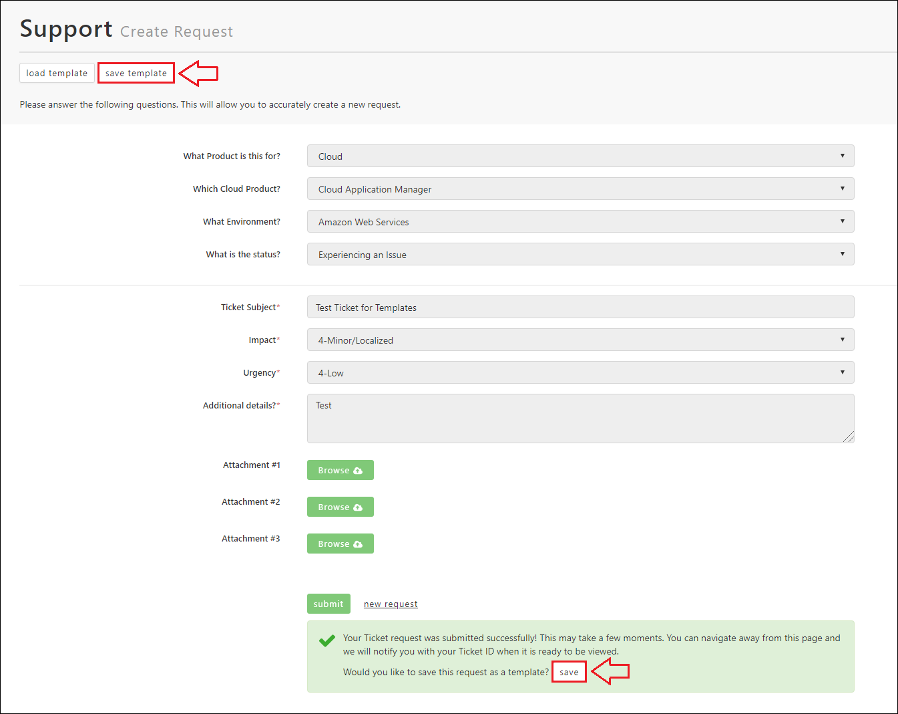
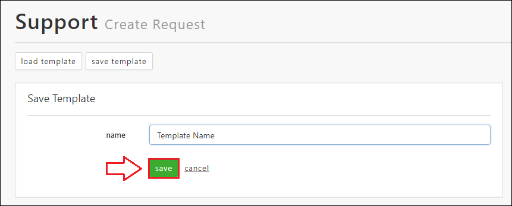
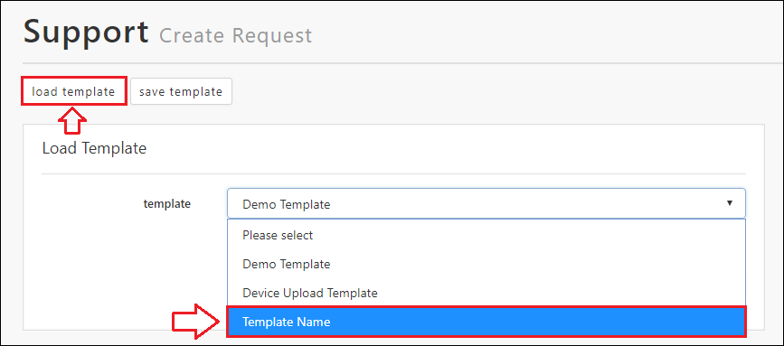
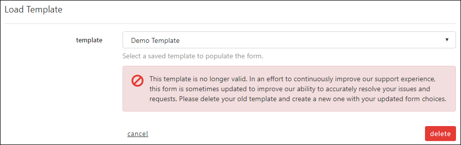

{{{
  "title": "Templates for Tickets, Changes, and Requests",
  "date": "8-6-2018",
  "author": "Evan McNeill",
  "attachments": [],
  "contentIsHTML": false
}}}

### Description

Templates for your tickets, changes, and request can be created to save form configurations for later use.  This is especially useful if you need to submit recurring requests that have all or nearly all of the same information each time.  This article will cover creating templates and loading them into the form.

### Steps

**1:** [Navigate to the Support Portal](how-to-navigate-to-managed-support-portal and click Create on the left side navigation

**2:** Fill out the form with your desired selections.  You do not need to fill in all fields or required fields to save a template, any configuration is accepted.

**3:** Save your Template.  There are two ways to save a template.

First, you can save a template after you complete your submission.  Just click ‘save’ within the request confirmation.  Alternatively, you can save a template any time by clicking ‘save template’ at the top of the form.

**4:** Provide a name for your template and click save.

**5:** To load your saved template, click ‘Load Template’ and select your template from the drop-down.

**Please Note** – The request forms are always being updated to improve our ability to resolve your issues as quickly as possible.  If you receive the following error, your template is out of date and needs to be rebuilt to accommodate the latest updates.  We apologize for this inconvenience, but this is necessary to keep improving our support process to deliver the best possible experience:

