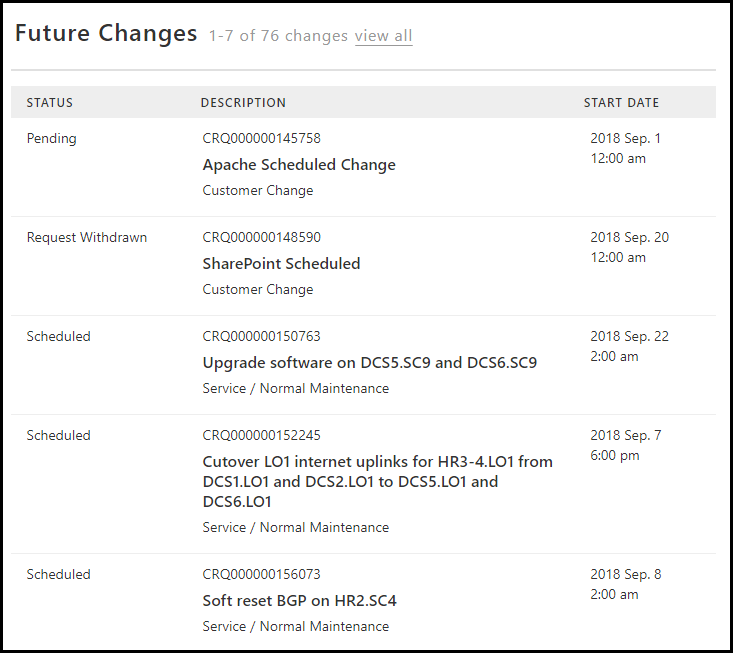
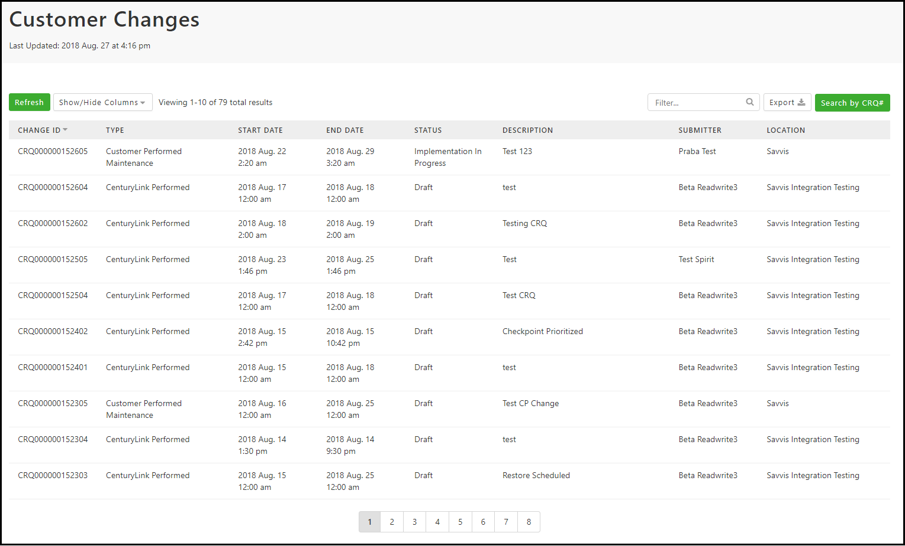
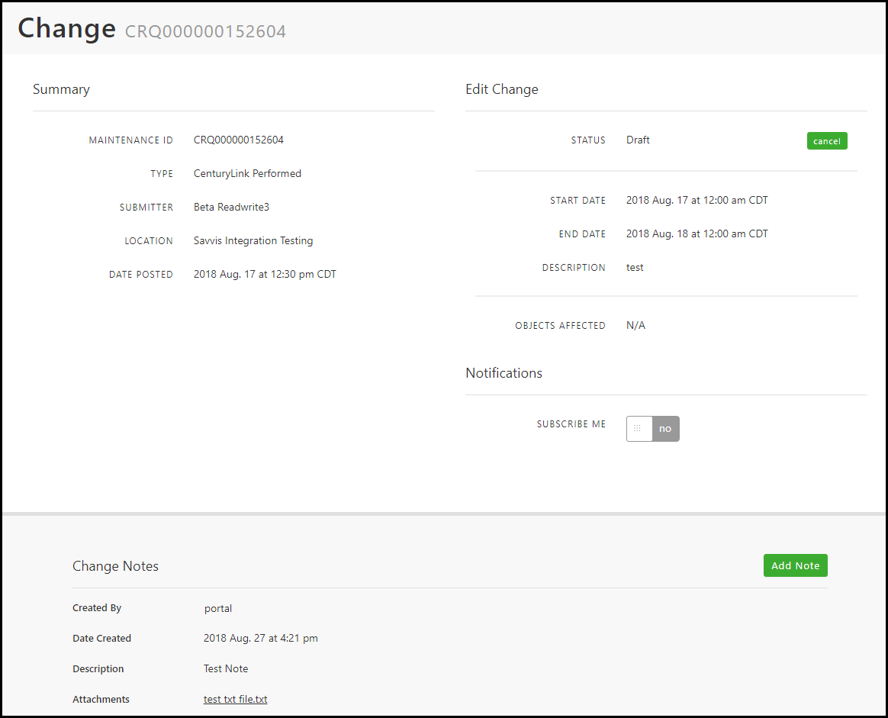
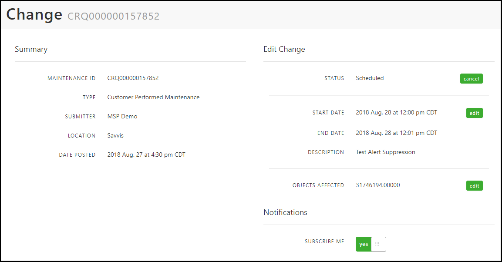
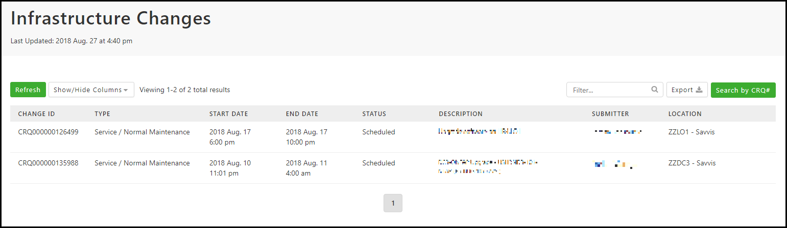
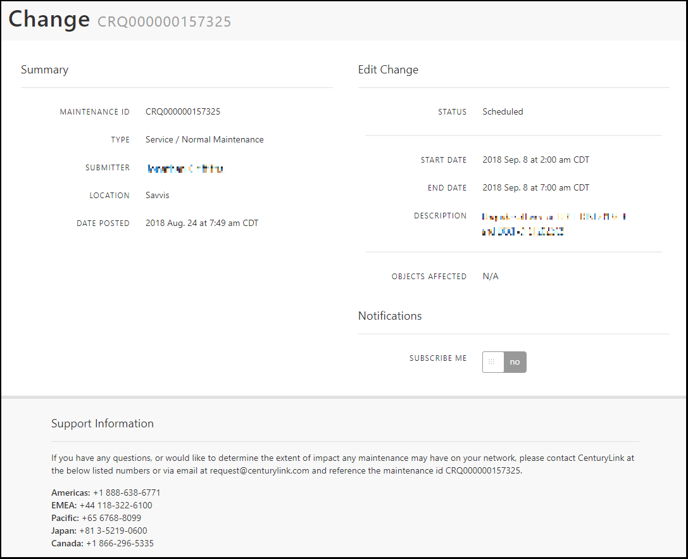

{{{
  "title": "Viewing and Interacting with Changes",
  "date": "8-27-2018",
  "author": "Evan McNeill",
  "attachments": [],
  "contentIsHTML": false
}}}

### Description

Within the Support Portal, you can [create changes](creating-a-ticket-change-or-request.md) to be performed by Lumen or to [suppress alerts](viewing-your-active-alerts-and-suppressing-alerts-via-customer-performed-changes.md) against your devices.  Once your change is created, there are multiple ways to view and interact with that change to check status, provide an update, self-cancel, and more.  This article will cover the various ways you can view and interact with your Lumen-Performed, Customer-Performed, and Infrastructure Changes.

### Change Dashboard Summary View

The change dashboard view displays your earliest upcoming changes by start date.  This view will display up to 10 changes.  Changes of all types will display in this view.

  
  
### Customer Change List View

You can navigate to the Customer Change List View by clicking View All > Customer Changes within the Future Changes Dashboard, or click ‘Customer Changes’ within the ‘Changes’ left side navigation.  This list includes Lumen-Performed changes and Customer-Performed Changes.  This table view allows you to click on a change to view more detail, filter the results, sort by any column, remove/add columns, and export to csv.
  
  
  
### Lumen-Performed Change Detail View

Clicking on a Lumen-Performed Change will present you with a detailed view, providing additional information and self-service capabilities.  From the detailed Lumen-Performed Change view you can view or add notes/attachments, cancel your change, and subscribe for email updates.
  
  
  
### Customer-Performed Change Detail View

Clicking on a Customer-Performed Change will present you with a detailed view, providing additional information and self-service capabilities.  From the detailed change view you can cancel your change, modify start/end date/description, modify objects affected, and subscribe for email updates.
  
  
  
**Please Note:**

[Customer-Performed Changes are created via Suppress Alerts](viewing-your-active-alerts-and-suppressing-alerts-via-customer-performed-changes.md)

### Infrastructure Change List View

You can navigate to the Infrastructure Change List View by clicking View All > Infrastructure Changes within the Future Changes Dashboard, or click ‘Infrastructure Changes’ within the ‘Changes’ left side navigation.  This list includes changes being performed by Lumen global change management that may impact your devices.  This table view allows you to click on a change to view more detail, filter the results, sort by any column, remove/add columns, and export to csv.
  
  
  
### Lumen-Performed Change Detail View

Clicking on an Infrastructure Change will present you with a detailed view with additional information.  Infrastructure changes are purely for notification and transparency purposes, you are unable to edit the details of these changes as they are not at your request, but may be impacting the devices listed.  You can subscribe for notifications by clicking the ‘Subscribe Me’ slider.
  
  
  
### Change Search

You can search for any change you are authorized to view by entering the full Change ID into the header search icon.  Additionally, you can click the ‘Search by CRQ#’ button on any Change List view, which will focus your cursor in the header search icon.  After entering your CRQ# in the field, click enter.
  
  
  
  
### Change Reports

You can run a report on your changes, including completed or canceled changes.  This is the only location to view/search for completed or canceled changes if you do not know the exact ID.  For more information on change reports, [see our article on creating reports.](report-creation-and-scheduling.md)
