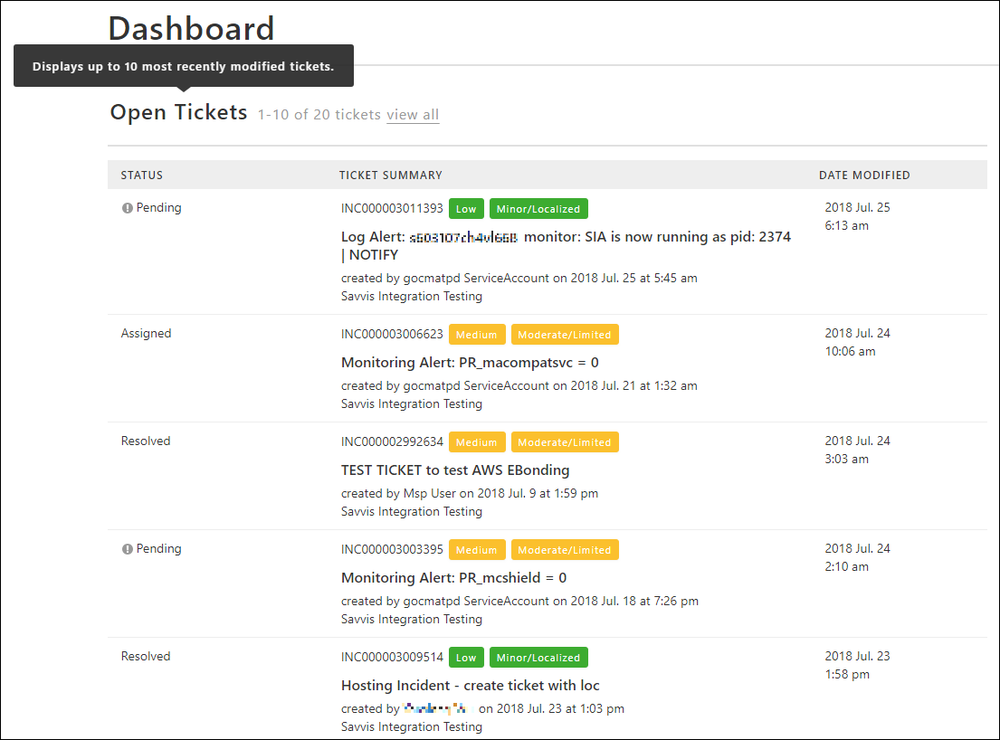
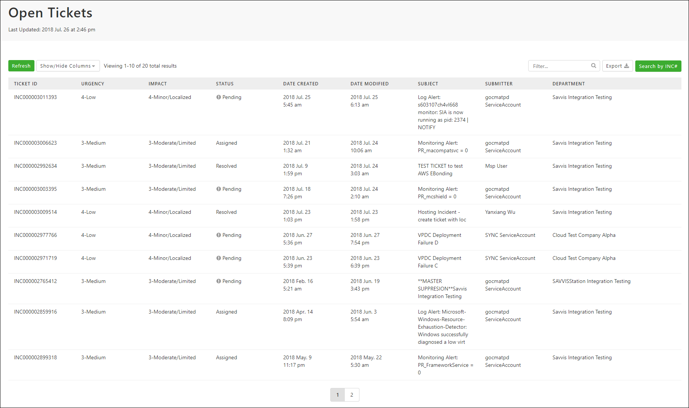
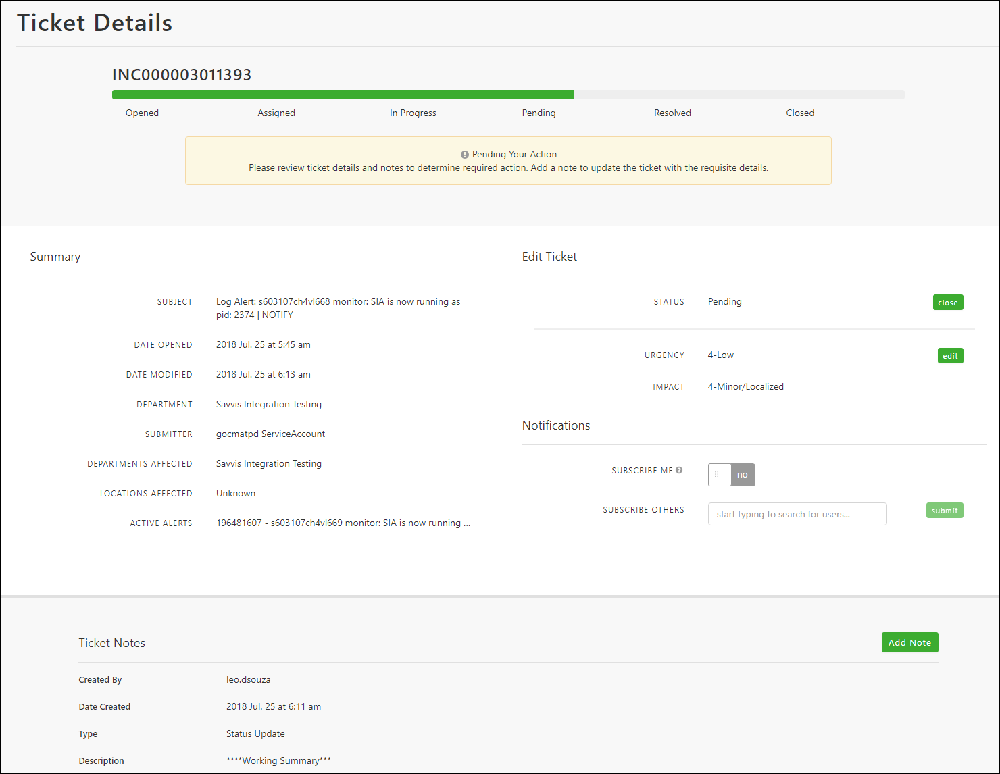

{{{
  "title": "Viewing and Interacting with Support Tickets",
  "date": "7-30-2018",
  "author": "Evan McNeill",
  "attachments": [],
  "contentIsHTML": false
}}}

### Description

Within the Support Portal, you can create tickets for your issues or requests to be reviewed and resolved by Lumen Support.  Once your ticket is created, there are multiple ways to view and interact with that ticket to check status, provide an update, self-close, and more.  This article will cover the various ways you can view and interact with your support tickets.

### Ticket Dashboard Summary View

The ticket dashboard view displays your most recently modified tickets in order of the date they were modified.  This view will display up to 10 tickets.

  
  
### Ticket List View

You can navigate to the Ticket List View by clicking ‘view all’ within the Ticket Dashboard, or click ‘Open Tickets’ within the ‘Tickets’ left side navigation.  This table view allows you to click on the ticket to view more detail, filter the results, sort by any column, remove/add columns, and export to csv.
  
  
  
### Ticket Detail View

Clicking on a ticket will present you with a detailed view, providing additional information and self-service capabilities.  From the detailed ticket view you can view or add notes/attachments, view related alerts, close your ticket, modify the impact/urgency, subscribe for email updates, and subscribe other users (admin-only).
  
  
  
### Ticket Search

You can search for any ticket you are authorized to view by entering the full Ticket ID into the header search icon.  Additionally, you can click the ‘Search by INC#’ button on the Ticket List view, which will focus your cursor in the header search icon.  After entering your INC# in the field, click enter.
  
  
  
  
### Ticket Reports

You can run a report on your tickets, including closed tickets.  This is the only location to view/search for closed tickets if you do not know the exact ID.  For more information on ticket reports, [see our article on creating reports.](report-creation-and-scheduling.md)
 

