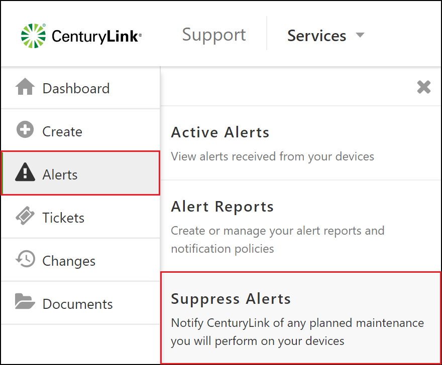
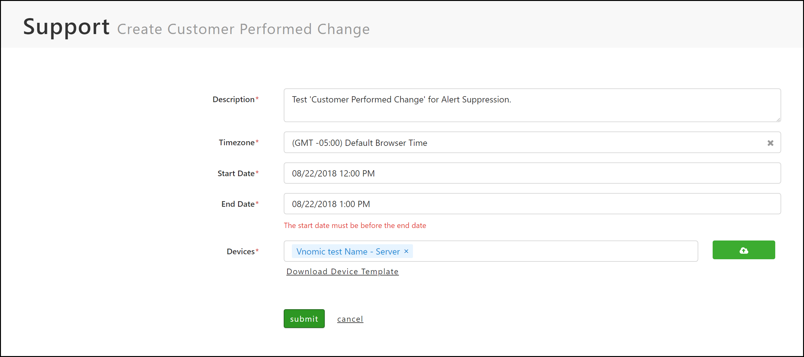
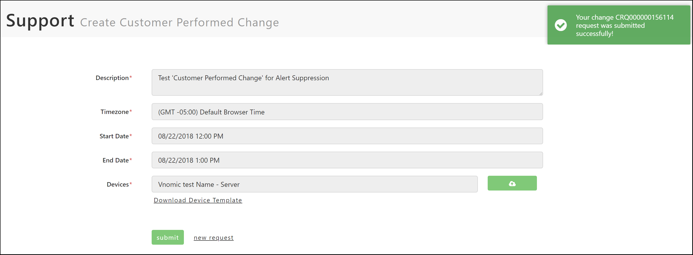
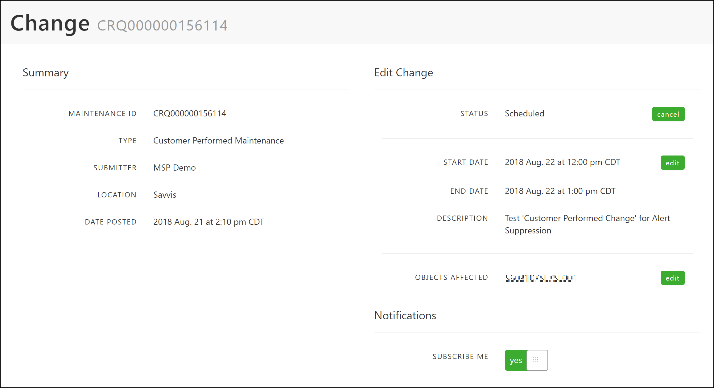
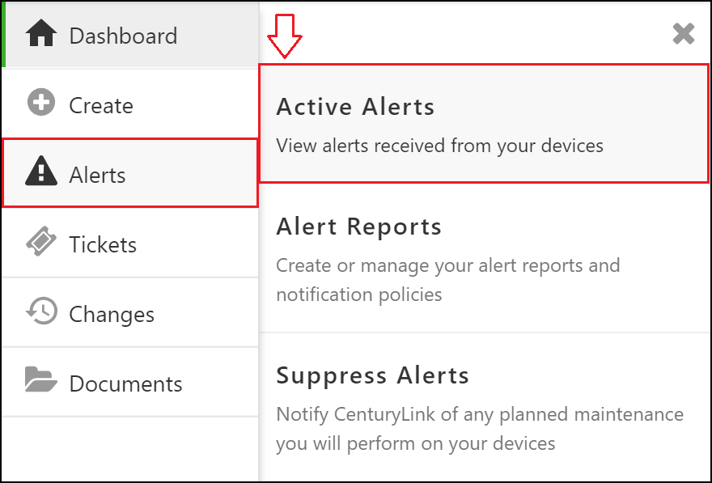
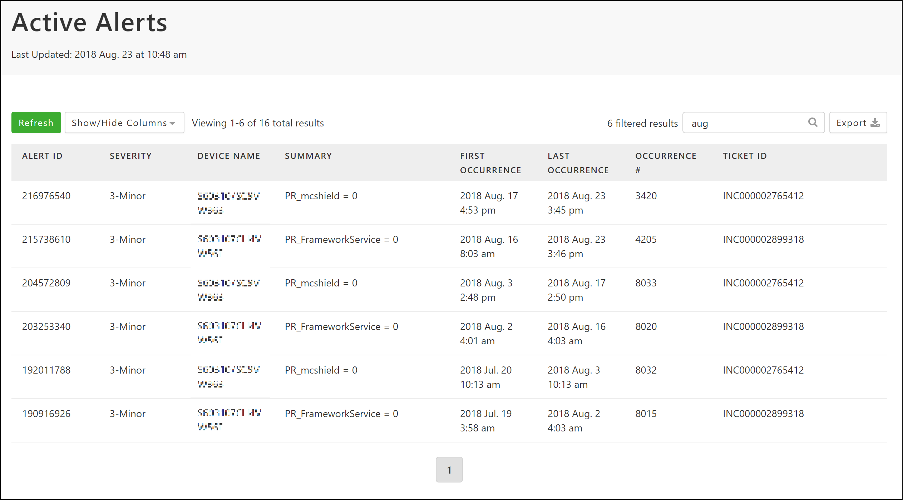
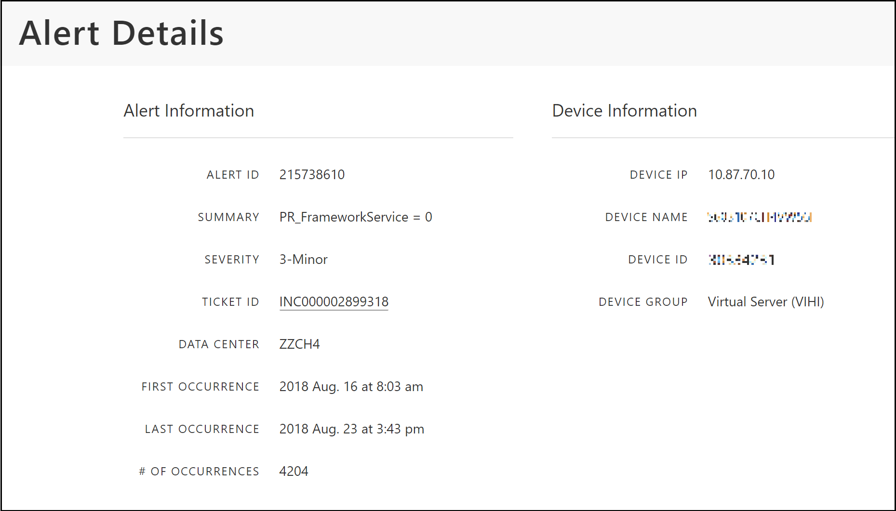

{{{
  "title": "Viewing your Active Alerts and Suppressing Alerts via Customer Performed Changes",
  "date": "8-23-2018",
  "author": "Evan McNeill",
  "attachments": [],
  "contentIsHTML": false
}}}

### Description

Alerts are triggered to notify CenturyLink and our users that there is an issue with a device and action needs to be taken to resolve it.  The Support Portal displays alerts triggered against your devices so you are aware of active alerts, as well as related tickets so you can verify the status.  Additionally, when you plan to make an impacting change on one of your devices, you can create Customer Performed Changes to suppress unnecessary alerts and incident response during these activities.  This article will show you how to view your active alerts and related tickets, as well as how to suppress alerts on your devices.

### Suppress Alerts on your Devices

**1:** [Navigate to the Support Portal](how-to-navigate-to-managed-support-portal.md) and click Alerts > Suppress Alerts on the left side navigation.

  
  
**2:** Complete the form, see example below:
  
  
  
**3:** Click Submit.  A success message should appear at the top right with your CRQ number.
  
  
  
**4:** Click the returned CRQ# return.  This will load the detail page for your Customer Performed Change.

  
  
### Viewing Active Alerts

**1:** Click Alerts > Active Alerts to view a table of your active alerts.

  
  
**2:** This table view allows you to click individual alerts to view more detail, filter the results, sort by any column, remove/add columns, and export to csv. 

  
  
**3:** Click on any Alert to view more detail.  You can click on the Ticket ID to see more information on the status of resolving this alert.  
  
  
