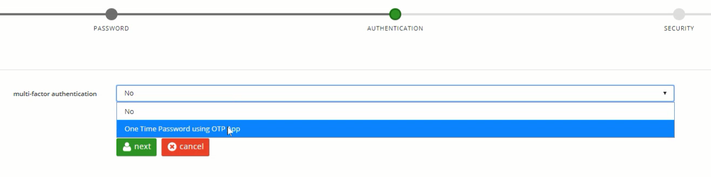
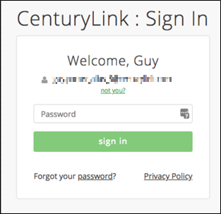
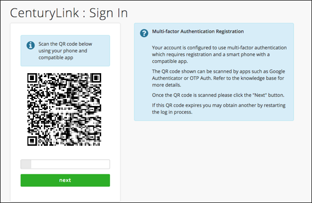
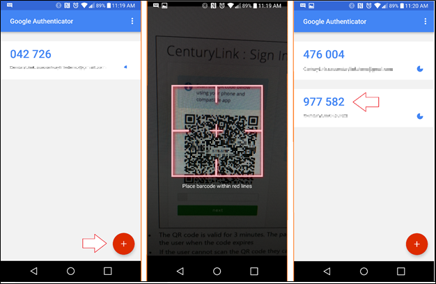
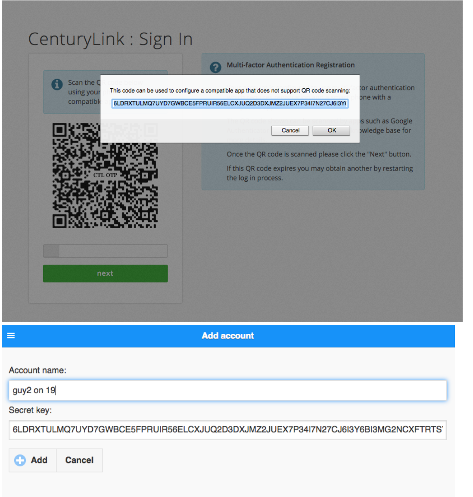
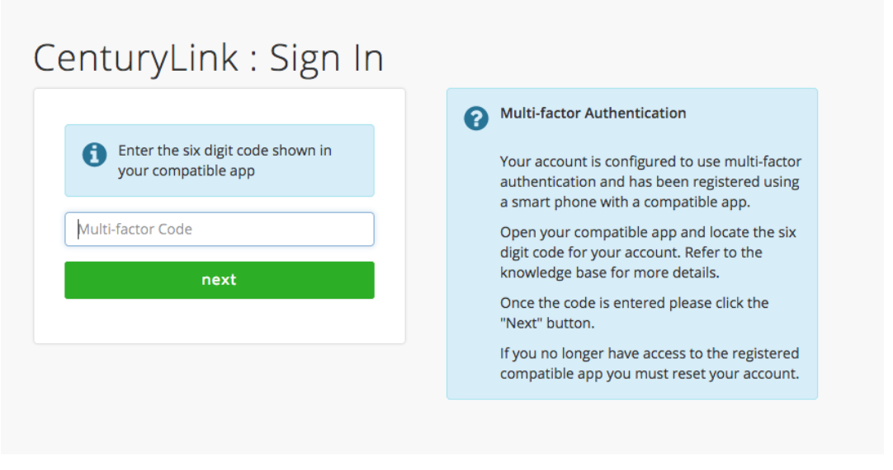

{{{ "title": "Managed Hosting and Cloud: Multi-Factor Authentication", "date": "6-1-2018", "author": "Evan McNeill", "attachments": [], "contentIsHTML": false }}}

## Managed Hosting & Private Cloud: Getting Started on Multifactor Authentication
### Design
OTP based multi-factor authentication can be enforced for multifactor required customers, optionally enabled by a user during registration, or from their account page anytime after registration.

OTP multi-factor authentication requires the use of a smart phone and compatible smart phone app (such as Google Authenticator or OTP Auth) or browser plug-in (such as Google Authenticator for Chrome)
### Workflow
1. Multi-Factor Opt-in within User Registration
*	Select “One Time Password using OTP App” during user registration to enroll in Multi-Factor Authentication.
<kbd></kbd>
* You can opt-in after registration by navigating to the Authentication tab in the left side navigation within Manage My Account.

2. Initial Login after User Registration
* Once registration of the master account is complete, you are prompted to enter your credentials for your CenturyLink Master account for the first time after registration.  
<kbd></kbd>

3. Multi Factor Authentication One-Time-Password (OTP) Enrollment
* If this is the first time you are logging into your master account, you will be prompted to complete your Multi-Factor OTP (one-time password) registration.
<kbd></kbd>

* The QR code is valid for 3 minutes. The page includes a timer that will redirect you when the code expires.
* With your compatible smart phone application (such as Google Authenticator), click the add or + button to configure their Multi-Factor account.

<kbd></kbd>

* If you cannot scan the QR code you can click the QR code to reveal a secret key that can be used to manually configure the OTP app (e.g. GoogleAuthenticator for Chrome).
<kbd></kbd>
  
4. Multi Factor Authentication OTP Code
* After registration of your Multi Factor OTP, you will be prompted to enter the 6 digit code provided on your OTP smart phone app to complete your login process.  You will be prompted to enter this code after every subsequent login with their master account.
<kbd></kbd>

 
