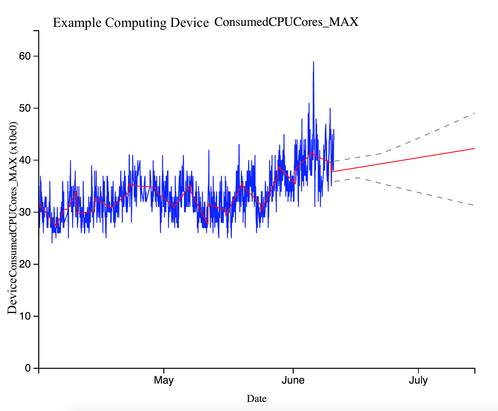
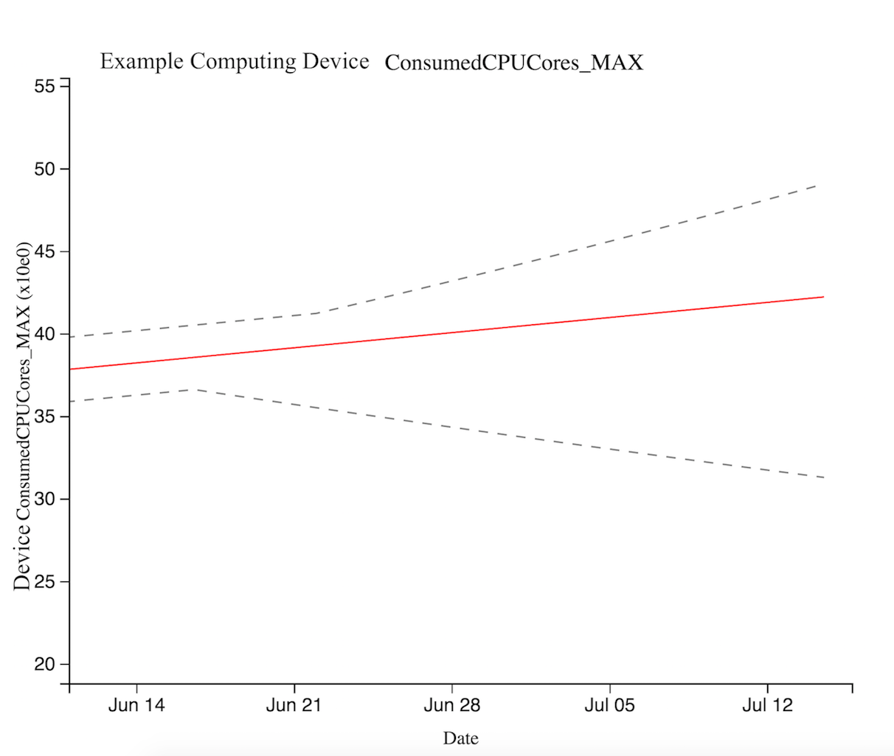
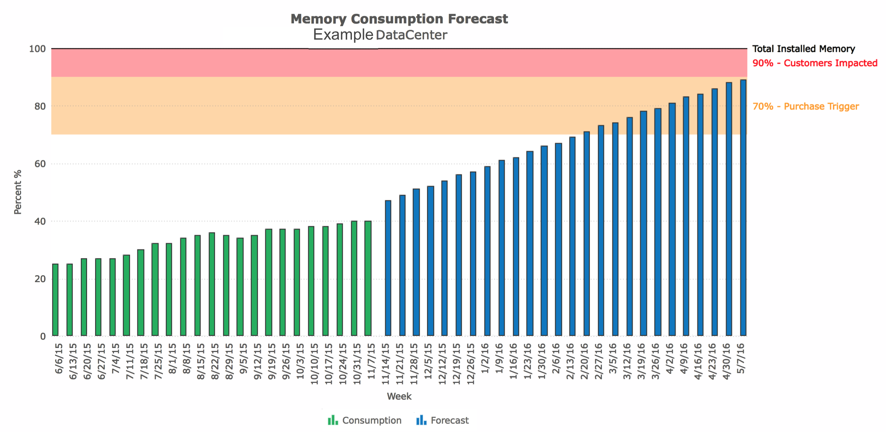
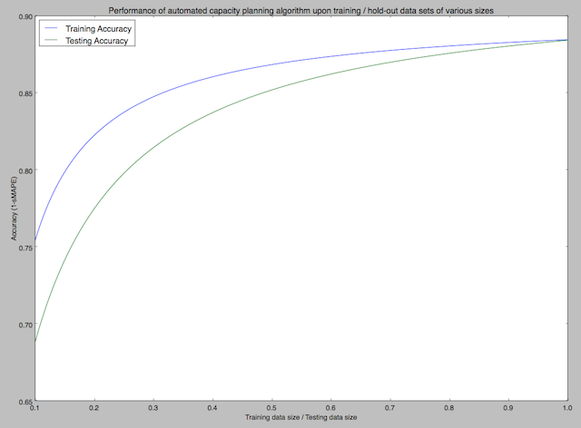

{{{
  "title": "Capacity Planning for Cloud Platforms",
  "date": "3-28-2016",
  "author": "Ryan Kirk",
  "attachments": [],
  "contentIsHTML": false
}}}

### What is capacity planning for the cloud, why does this problem matter?
The cloud promises to provide scale-free access to a variety of platforms, services, and infrastructures. This is especially true for customers who want to trade the expensive “cost of assets” and their management for the much smaller “incremental just-in-time” ability to grow their own applications and technologies, as dictated by the requirements of their business. The need for an underlying set of computational resources is common to all of the offerings on cloud ecosystems. Essentially, providers require a solution that can accurately predict the projected levels of demand needs to coincide with current operational processes to aid in capacity planning and load.

Capacity planning for cloud platforms is both similar to and different from “on-premises” capacity planning. It is similar in that we can project our future expectations based upon our current utilization patterns. However, it is different for at least two substantial reasons. Firstly, cloud platforms represent a large, often global network of interconnected devices - this means that accurate forecasts initially require building a map of the network and devices based both upon device hierarchy and device function. Secondly, cloud platforms allow the consumption of each customer to grow while maintaining an environment where many individuals use a set of common and shared resources.

### Why consumer behavior matters
As with any business, cloud computing exists because of customers and their ever-changing needs and our goal is to meet those needs. Cloud platforms are massive, globally-distributed computers that customers the world over use to accomplish their goals. The expectations, purchasing behavior, and usage patterns of our customers drive the future of cloud computing. As such, capacity planning must accommodate for different purchasing decisions and subsequent patterns and cycles associated with each cadence. Understanding how our customers use the cloud helps us to better assess how much capacity we can expect to need in the future.

The industry of cloud computing is similar to that of banking, in that banks only have a limited amount of cash on-hand at any given time. In order to finance business activities, banks invest in offering home loans and small business loans using the resources that their customers deposit – recycling of sorts. Similarly, the cloud offers favorable pricing strategies, and the ability to vastly scale for consumers because it is rare that every customer requires the use of all of their resources simultaneously. However, in contrast to a banking institution, our customers do not provide us with the resources we use to grow our platform. Instead, the cloud has a tangible physical limit that is a function of the computational resources available. As a business, we need to understand how this rate relates to our customers’ workloads in order to maintain the highest possible quality of service for all customers. Understanding this rate as well as the total capacity of the platform both factor into future capacity projections.

### How we represent the platform
Imagine you are a city planner tasked with figuring out how many roads to build and where to build them. You may approach this situation by examining the growth in the number of new vehicles using roads. However, this still would not tell you where to build the new roads. Instead, you would need to also examine the traffic patterns in a variety of different areas of the city before you knew what to build. Similarly, an accurate representation of overall future growth requires that we start by building a model for each device.

A straightforward technique to represent the growth of a cloud platform would be to project the growth for each device and then determine when we expect each to run out of capacity. However, this approach is not very practical for business. In practice, we often need to “level-up” our analysis to examine sets of devices such as entire racks of devices or even entire data centers full of racks. The need for this level of analysis comes from a couple of different sources.

First, when the business uses this forecast model for procurement reasons, it needs to connect to a plethora of external requirements. From the start, we need to provide enough leeway for the business to obtain capacity ahead of the forecasted demand – this requires connecting the forecast to operations and logistics. Moreover, since logistics and finance ultimately interface with third party suppliers, these forecasts need to consider the vendor constraints such as the typical minimum capacity order to achieve certain pricing thresholds. Considerations such as: performance, price, extensibility, and availability of hardware all influence the likelihood of integration of hardware within the cloud platform.

The cloud is capable of self-healing and of scaling in a variety of ways. We need to account for the interconnection between devices by first modeling them individually and then aggregating these models. In order to know how to combine forecasts from different devices, we need to know how devices relate to one another. To do this we build a virtual reconstruction of the cloud. This requires understanding the set of devices involved in the capacity for each resource type. To understand the present storage capacity we model the set of storage devices. The cloud groups a collection of storage devices together – forming a single entity. The cloud software turns this “cluster of devices” into a cluster of virtual storage partitions. To understand the usage of this cluster, we must understand the usage of each device and the usage of each partition. The cloud platform is constantly changing – as a result, the relationship between devices will differ from day-to-day. We need to be able to reconstruct this representation automatically.

For each low-level device, we then build a forecast model that takes the previous patterns in consumer usage into consideration. Since each device has a separate set of customers, we must consider consumer behavior both at the device level as well as at the global level. Locally, we can model the history of each device. However, as mentioned, the cloud platform is capable of self-healing and it will often load balance across many devices. For this reason, we must modify our expectations of the device-level expectations with the knowledge of global trends taking place. The next section discusses how we build each forecast in more detail.

### How we Forecast for Different Types of Devices
The cloud platform is an infrastructure of connected devices of different types and different manufactures. Fortunately, there are many similarities between devices from different manufactures. For capacity planning purposes, these similarities between manufacturers often allow us to treat different devices similarly as long as they are the same type of device. There are many types of devices such as: network devices, storage devices, and compute devices. For both business and technical reasons, our forecast technique differs based upon the device type. For example, it takes more time to distribute a load across storage devices than it does to distribute across compute devices. To handle these differences we create an approach that allows us to use both linear and non-linear models to create forecasts.

### How we Build the Model
We expect customers to continue to use our platform in similar ways to how they have previously used the platform. However, we do not expect to always see the same internal platform changes in the future. In order to increase the accuracy of our forecasts, we separate the growth in device utilization into two categories: process-oriented and behavior-oriented. We handle each type of change separately.

For behavior-based capacity changes, we start by accounting for the ebbs and flows of customer utilization patterns. We remove the behavior-based variation by examining the typical maximum utilization of the device. This technique allows our forecasting method to plan for the volatility in customer behavior. Additionally, we try to predict future use levels and hardware demand based on past rate of hardware demand.

We find the optimal growth rate for each device that best describes the historic rate of change for that device. Depending upon what technique is more accurate for the particular device in question, we will either use a linear or a non-linear prediction model.

Next, we need to account for the process-oriented changes to the device. Once we factor these into the model, we can then figure out the expected future utilization rate of that device. Since we know the maximum capacity for each device, this means we know roughly how long each device has until it is fully burdened. The next step is to share these expectations with the business and to integrate them within the larger decision-making process.

How we Integrate Forecasts with Business Processes
As previously mentioned, we try to account for process changes in the models for each device. However, there are also business-scale process changes. The biggest sources of these changes come from logistics and procurement. The time it takes to install new hardware depends upon the utilization rate of our data centers, the availability of hardware by suppliers, and the workload of our operations teams. It also takes time for procurement. The finance team helps further investigate the recommendations for capacity and obtains business approval for sustained increases to capacity. Two procurement factors take place: optimization and integration. Optimization is involved in model accuracy and strength while taking the current supply into account. Integration factors current project results and read-outs with procurement-driven business decisions going forward. The manner in which we purchase what we need along with the components themselves will change as the cloud industry itself is constantly changing.

To account for these process changes, we create elasticity in our models. We do this by first examining the typical time required for each stage of the capacity planning process including: planning, purchasing, ordering, building, and installation. Once we know the typical lead times required for increasing the capacity of our platform, we know how far we need to forecast. Next, we create the ideal forecast for this time window.

We also examine the accuracy of our forecast technique by studying the historic data for each device and examining how well our forecast would have done at predicting future capacity needs. Through understanding historic performance, we are able to figure out the most optimal way to configure our forecasts for this duration.

### How we Handle Uncertainty in Forecasts
Another way we account for future uncertainty is by building both a business and a statistical buffer into our forecasts. The business buffer comes from our platform engineers. They have domain expertise that allows them to connect capacity projections with business processes. The statistical buffers are also based upon business thresholds for confidence. By telling us how likely they want to be to cover future use-cases, we can add the necessary tolerances to our forecast models to meet stakeholders' risk tolerance. What results is a projection of growth that accounts for consumer growth, business processes, and statistical uncertainty.

By applying the techniques outlined above, we have been able to consistently and accurately forecast the capacity needs of our platform. However, nothing is ever certain. We do not want to take the volatility of the cloud industry for granted. With proper planning we can help reduce the uncertainties associated with capacity planning. While we strive to do our best from an analytical perspective, there is no substitute for the agility of platform engineers and the operations teams that ensure the continued health and stability of the cloud platform on a daily basis.
