{{{
 "title": "Consuming Webhook Alerts with 3rd Party Web Apps",
 "date": "03-15-2015",
 "author": "Chris Little",
 "attachments": [],
 "contentIsHTML": false
}}}

Customers may wish to leverage the alert notification webhook services built into CenturyLink Cloud with 3rd party web apps or services. While clients could build their own webhook listener platform there are various services on the market that make consuming webhooks and sending them into other web app or services point and click. In this example we are going to leverage [Zapier](http://zapier.com/) in conjunction with [Slack](http://slack.com/).

### Sample Use Case

The Operations team wishes to integrate alert notifications from the CenturyLink cloud into their real time Slack chat system used by the NOC. Slack provides the NOC teams one-on-one messaging, private groups, persistent chat rooms, direct messaging as well as group chats organized by topic. By pushing alerts into slack the operations organization hopes to be more responsive and collaborative to events occurring in the CenturyLink Cloud.

The organization does not wish to build an integration system from scratch to consume and push notifications into slack. Instead they choose Zapier which connects web apps to easily move your data and automate tedious tasks. In this case zapier will consume an alert webhook from CenturyLink Cloud and move that data into the NOC slack channel for immediate action.

### Prerequisites

- A CenturyLink Cloud Account
- A [Zapier Account](http://www.zapier.com/)
- A [Slack Account](http://slack.com/)

### Exceptions

This sample use case will not detail the process to setup a #slack domain and associated #channels. We will simply illustrate the events being pushed into these respective areas after Zapier configuration.

### Configuring Zapier

1. Login to the Zapier dashboard and select Make a New Zap

  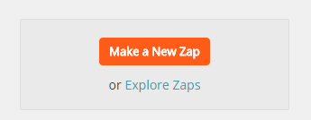

2. Choose a trigger and action. For this use case we want to catch a webhook and send a message to Slack.

  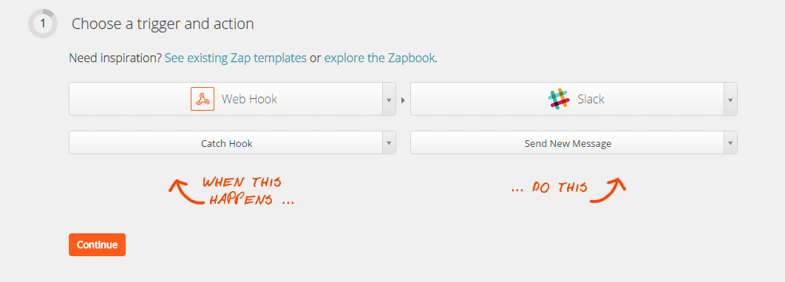

3. Zapier will generate a unique webhook URL for this new Zap. Copy this to clipboard.

  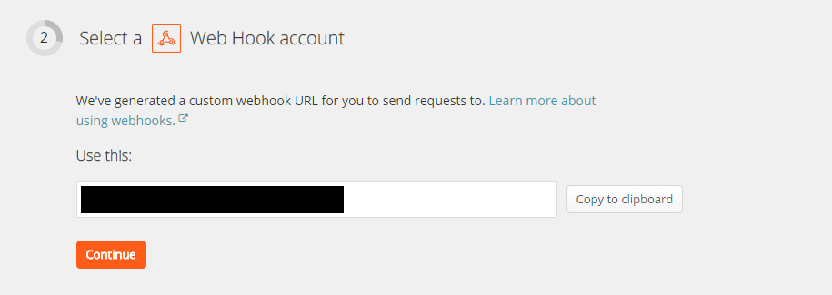

4. Open the CenturyLink Cloud Control Portal, navigate to API, Webhooks. Input the Zapier URL provided previously into the Alert Notifications field. Optionally, cloud administrators can choose to include any sub accounts in this webhook configuration.

  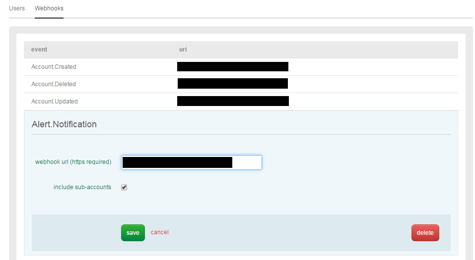

5. Select a slack account for the webhook event to be sent to. If you are setting up your first Zap to Slack you will need to connect and authorize Zapier to connect to your slack account. These steps are not shown.

 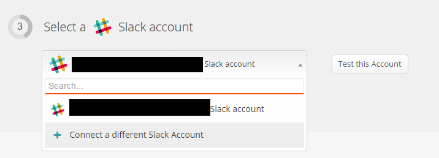

6. Optional: Add key or filters (not required)

 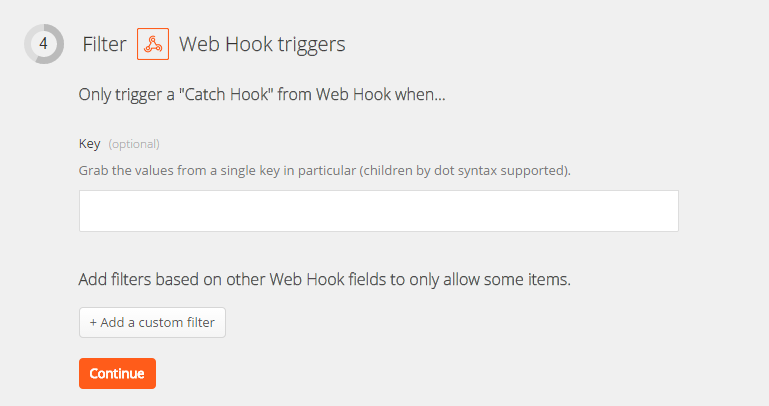

7. Input the slack channel or user you wish to send Alert Notifications. Typically, if pushing to an operations group you'd want to use a channel (i.e. #operations) as the destination for events. However, events can be pushed via the slack bot to individual users as well (i.e. @username).

  In the Text area of the form select the 'Insert Fields' button.

  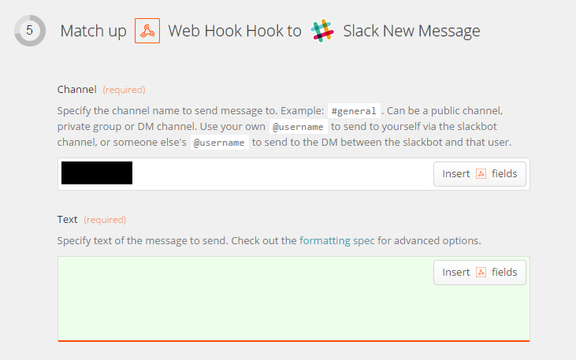

  If this is the first time you've added an alert notification webhook from CenturyLink Cloud a dialog box will pop up saying "We Couldn't get any samples from Web Hook. As you have already 1) taken the URL and added it to control 2) are creating a new hook you can skip right to #3. The Zapier interface will wait until a valid Alert Webhook (don't close browser) arrives from CenturyLink Cloud.

  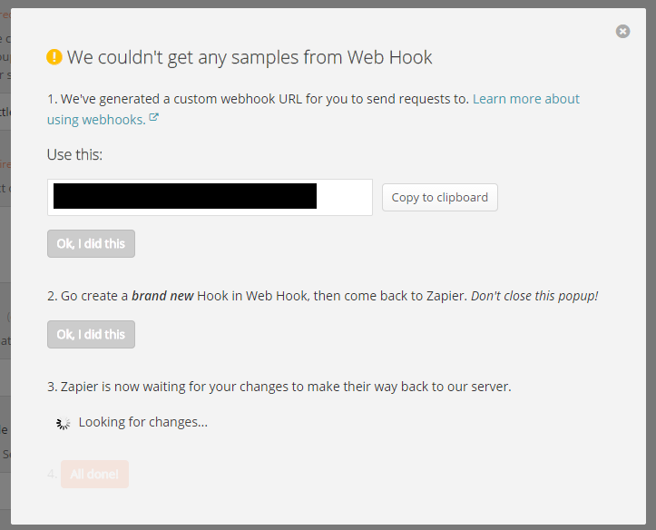

8. In order to generate an Alert Notification from CenturyLink Cloud you can use various tools to max out a CPU, fill disk space etc on a test VM with an [alert policy](../Servers/cloud-server-alerting-faq.md) configured. In this example, I used [Max CPU](http://sourceforge.net/projects/max-cpu/) on a Windows 2012 VM to max out the CPU for the 5 minute duration configured in the alert policy.

  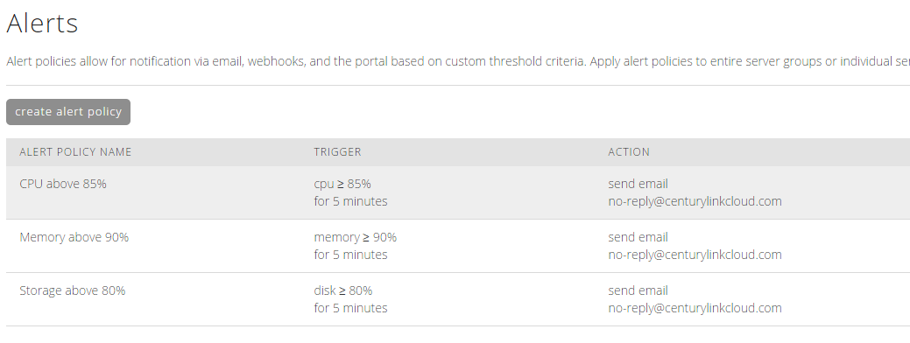

  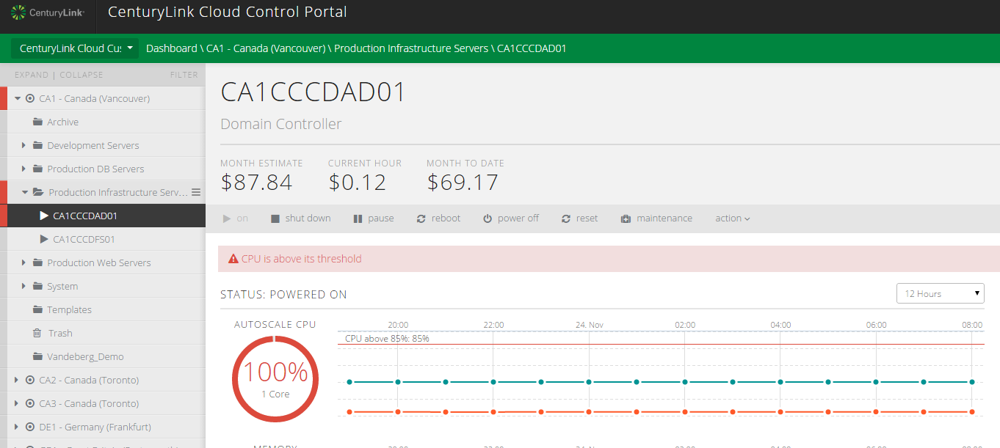

 9. Once the webhook from CenturyLink Cloud fires to Zapier the Zap configuration tool will state 'We found your changes!

  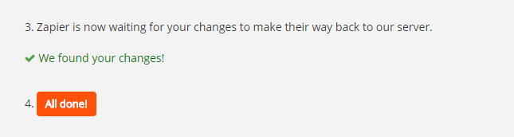

10. The ability to insert fields into the Text data for the message is now functional. With the Alerts Notification webhook from CenturyLink Cloud there are 3 fields available to be inserted into the event. In this sample, we input standard text for Account Alias, Server Name & Event Details paired with fields located in the webhook.

  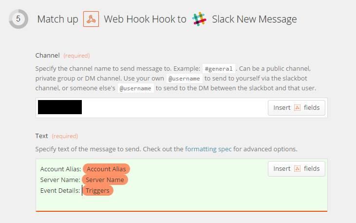

11. Finally, perform a test of the newly created Zap. Select the test webhook trigger and select a sample.

  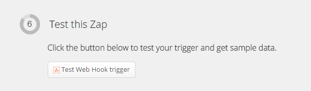

  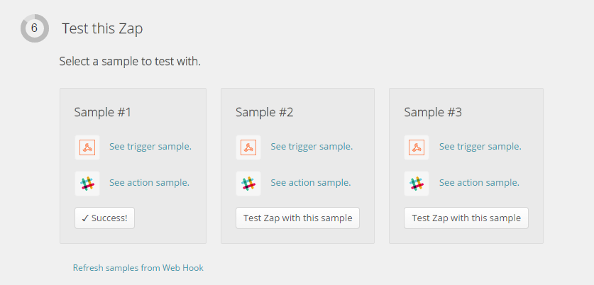

  This test will result in a message being sent to Slack.

12. Provide a name for this new Zap and enable it.

  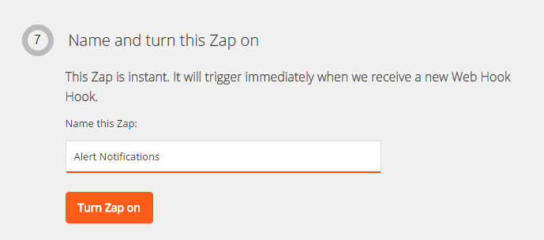

13. Your Zapier dashboard will show all Zaps currently deployed and active.

  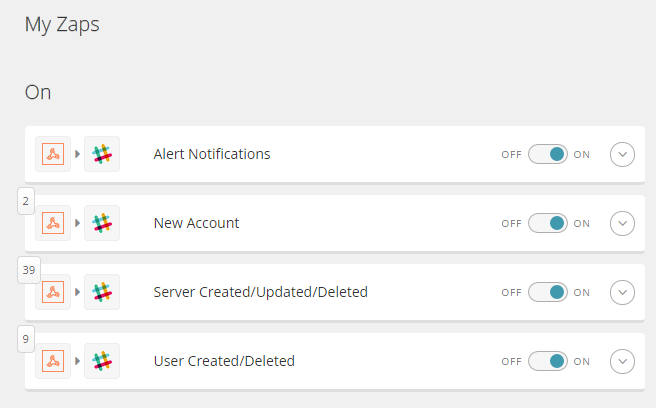

### Testing Alert Notifications

If you'd like to do a live production test of the new Zap and verify data you can follow the steps below.

1. RDP into a Windows VM with your alert policies applied, use a tool like Max CPU.

  Sample CPU Max Tool

  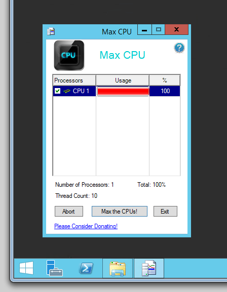

2. Check your slack notifications and events will be posted based on CPU, Disk or Both in this sample.

  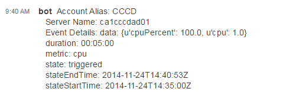
