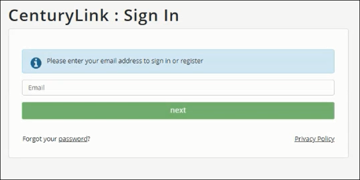
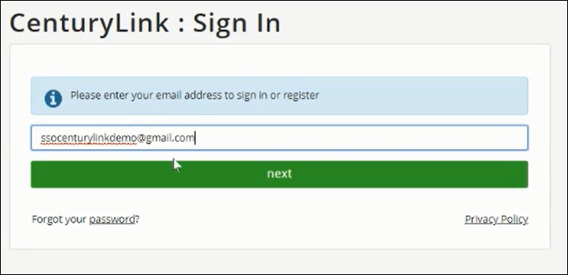
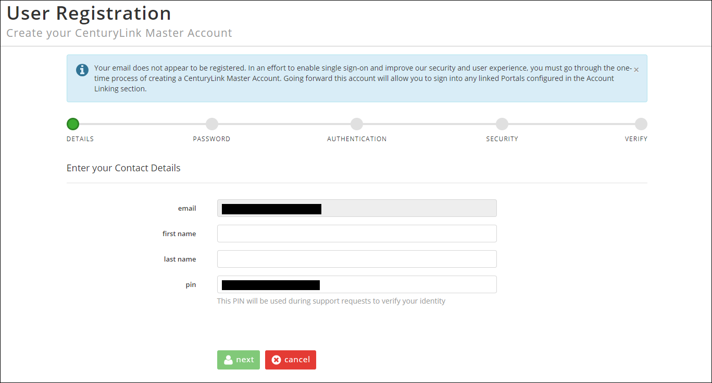
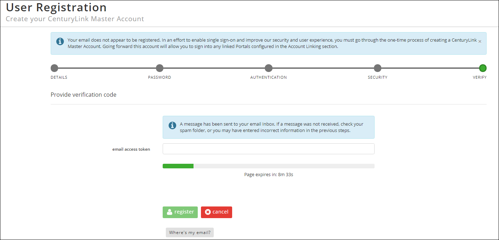
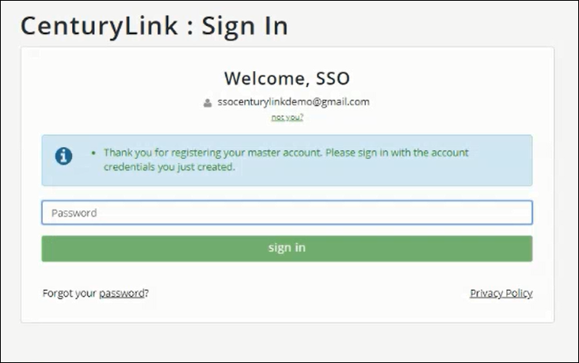

{{{
  "title": "Enhanced Security: Master Account Registration",
  "date": "6-21-2018",
  "author": "Daniel Stephan",
  "attachments": [],
  "contentIsHTML": false
}}}
### Description

As part of our efforts to increase the security of your accounts using the SavvisStation Portal and Private Cloud (DCC), you will need to go through a one-time setup to create a new Master Account.  Once setup is complete, for your security, you will receive a one-time prompt to provide credentials for your services to link them to your master account; as a result, you will be able to navigate between them without re-authenticating going forward. Other security improvements include optional multi-factor authentication through your smart phone (soft token) and the ability to set up multiple security questions for account validation and retrieval purposes.

This article steps you through creating a master account.

Please note: OTP multi-factor authentication requires the use of a smart phone and compatible smart phone app (such as Google Authenticator or OTP Auth) or browser plug-in (such as Google Authenticator for Chrome)

### Steps
**1:** Go to the Enhanced Security login page.  
Go to [https://www.ctl.io/](https://www.ctl.io/), and click on the "Log In" link to the top right.  Click on either Managed Hosting or Private Cloud, whichever service you use.

This will redirect you to the Enhanced Security login page.

**2:** Email Registration  
Enter the email address you would like to register the master account with and click next.  If there is no master account registered to the email, it will automatically redirect you to user registration.  If this email is already registered, it will take you to a login page.

**3:** Enter Your Contact Details  
Enter in your first and last name in the contact details section.  Once done, click the next button.

**4:** Setup Your Password  
Enter your password and confirm the password.  Set the desired password expiration date.  Once done, click the next button.

**5:** Opt-In to Multi-Factor Authentication  
You can choose whether to use OTP multi-factor authentication, or not.  We highly recommend utilizing the multi-factor authentication to keep your account as safe as possible.  After choosing, click the next button.

If you choose to use multi-factor authentication, you will set it up the next time you sign in.

**6:** Setup Your Security Questions  
You must now setup 3 security questions.  You can choose from one of the pre-populated questions, or you can choose to enter in a custom question.  Once done with all 3 questions, click next.

**7:** Verify Your Email  
After setting up your security questions, you will be asked to provide a token sent to your email address.  Log in to your email and obtain the token.  Enter it into the text box and click the register button.

After a period of time, a button will appear that will help you track your email if you did not recieve it.  This will display information regarding the email.  Some common issues are the email was not sent because it was not a valid email address, or it was blocked by the receiving email server.

**8:** Log In With Your Master Account  
After verifying your email, you will be redirected to a login page.  Here you will enter in the password you just set up and sign in.

**9:** Multi-Factor Authentication  
If you elected to use multi-factor authentication, you will now be prompted to complete the multi-factor OTP registration.
[Click here for more information and step by step instructions.](managed-hosting-and-private-cloud-multi-factor-authentication-for-master-account.md)

**10:** Account Linking  
If you didn't elect to use multi-factor authentication, or after you've provided your one time password, you will be directed to the account linking page.  This is the page where you have the ability to link your other services.  Once linked, you will only need to log in with your master account.  There is also an option to login without linking, for those who do not want to link their account.

For more information, please review the [account linking and unlinking guide](enhanced-security-linking-and-unlinking-accounts.md).

### FAQ  
**Q: What services does Enhanced Security currently work with?**

A: Currently Enhanced Security works with our Managed Hosting and Private Cloud services.  This list will be expanded in the future.

**Q: Which browsers are currently supported?**

A: Below are the browsers currently supported:  

Browser|Version|
:---|---:|
Chrome|Latest Version
Firefox|Latest Version
Safari|Latest Version
Microsoft Edge|Latest Version
Internet Explorer|11
