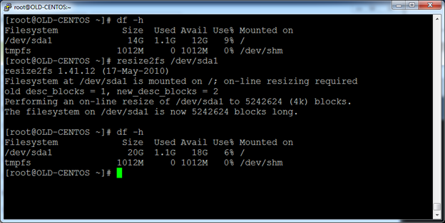

{{{
  "title": "Manually expanding file system on Linux machines",
  "date": "11-29-2014",
  "author": "James Morris",
  "attachments": [],
  "contentIsHTML": true
}}}

<h3>Preface</h3>

Unlike with Windows machines, expanding a drive on Linux machines may not be the exact same process every time. There are many different ways a file system can be setup on a Linux machine and attempting to use the wrong method to expand a file system could potentially result in <strong>COMPLETE DATA LOSS</strong>. Blindly following instructions to expand a drive without understanding what you are doing can be extremely dangerous, so please take every possible precaution and if you have any doubts do not proceed any further. <strong>This should not be looked at as a step by step guide but rather as just providing the necessary information to accomplish this task</strong>. Historically our Linux templates have been configured in 1 of 2 ways, standard partitioning and partition-less. This KB will only focus on those 2 scenarios and not cover things like LVM or any other custom partitioning that a customer may have implemented.

<h3>Part 1: Identify what you are working with</h3>

*Assume for all examples we are looking to expand the <code>/</code> filesystem

We first need to determine which drive and partition we are working with. Running the mount command will show you where the root <code>/</code> file system is mounted.

First on the older images with standard partitioning:

Here you can see that “/” is mounted on /dev/sda1 which translates to being the first partition “1” on the first drive <code>/dev/sda</code> 

On the new images that have been configured partition-less, the mount output will look something like this:

In this example you see that “/” is mounted on “/dev/sdc” which translates to the 3rd drive “sdc” with no partitioning on it. 

Comparing the two outputs the difference you should be concerned with is if the mount point contains a specific partition or not “/dev/sda1” is a specific partition on a drive vs “/dev/sdc” directly on the drive itself (partition-less). This would
  apply to all mount points not just root. If you do not see a partition number after the drive it is most likely partition-less.

You can further confirm the existence or lack thereof by running an fdisk command:

fdisk -l

On the older partitioned image you can see that there is only 1 drive and that 2 partitions exist on it (this presents another problem we will address later.

Compare that with the newer partition-less image and you can see that no partitions exist on /dev/sdb(the drive we use for swap) and /dev/sdc (the drive we mount for “/”)

<h3>Part 2: Expanding the new (Partition less) drives</h3>

IFF you see that the drive you are looking to expand does not have partitions on it, consider yourself lucky as the drive will be much easier to expand (which is why we moved to this model) and will not require a reboot or any downtime.

The failure of a partition-less drive via the control site generally means that the control site was unable to log into the system, the drive will be expanded in vmware but the file system size on the machine will not reflect this. 

In this case I have already expanded the drive to 20GB, but the OS is still showing 15GB 

*ALWAYS TAKE A SNAPSHOT OF THE VM HERE

You will not be able to expand the drive in VMware with an active snapshot, but you CAN expand the drive in vmware and then snapshot the machine before changing the file system itself.

The first thing you will want to do after taking the snapshot is to rescan the SCSI bus, this should pick up the changes to the drive on the back end. The command to do this is:

“<code>for scsi_device in /sys/class/scsi_device/*; do echo 1 &gt; $scsi_device/device/rescan; done</code>”

Once this is done fdisk should show that the drive has grown however the filesystem will still not have the increased space:

In order to grow the file system itself, all that is needed is to run resize2fs on the increased drive:

resize2fs /dev/sdc

You should now see the new space available:

<code>*If all has gone well, delete the snapshot you took</code>

To summarize, on a drive that has been identified as partition-less, the commands needed to do the actual expansion are

# for scsi_device in /sys/class/scsi_device/*; do echo 1 &gt; $scsi_device/device/rescan; done

# resize2fs /dev/sd&lt;drive letter&gt;

<h3>Part 3 Moving and Expanding drives on older (Partitioned) images</h3>

Expanding drives on machines where partitions exist can be quite a bit more complicated as it requires you to manually edit the partition table. To complicate things further, expanding the “/” partition will require a reboot of the machine and is also usually blocked from expansion by another partition (usually swap) existing directly after it on the same drive. Looking at our older CentOS 6 image, that is the exact case.

Here you can see that we want to expand /dev/sda1 but /dev/sda2 exists directly after it on the drive, so we are blocked. The solution here is to add an additional drive, set that drive up as the new SWAP mount, remove the old SWAP partition, and then proceed with writing a new partition table for /dev/sda1 and expanding the filesystem. If the root drive has already been expanded previously, SWAP would have already been moved, but in most cases we will need to move it.

STEP 1. Add a new 2GB drive to use for SWAP and expand the root drive to the desired size in VMware.

*SNAPSHOT THE MACHINE

Detect new drive by running

echo "- - -" &gt; /sys/class/scsi_host/host0/scan

If you do not see the new drive added you may need to reboot at this point.

Remeber the command to detect the resize

<pre><code>for scsi_device in /sys/class/scsi_device/*; do echo 1 &gt; $scsi_device/device/rescan; done</code></pre>

Once you can see the new drive we set it up as SWAP (we can use partition-less here) 

mkswap /dev/sdb

Take note of the UUID returned by mkswap, in this case UUID=c219c0eb-bdaf-42ac-b66c-64259b550b03

Turn off the in use swap volume

swapoff –a

Edit /etc/fstab and update the UUID for the swap mount point

Then turn swap back on using the new mount point, and verify we have swap space attached

swapon –a

free

We are now safe to delete the old SWAP partition as it is not in use

parted /dev/sda

p (shows the current table)

rm 2 (removes partition 2)

p (shows the current table)

q (quits)

Now we can expand the drive as nothing is in the way.

Use the following command so we can get the EXACT sector that the partition we wish to expand begins on.

parted -s /dev/sda 'u s p'

Note the Start value, in this case 2048

We can now manually re-write the partition table using fdisk

BE SURE TO CHANGE THE UNITS TO SECTORS

fdisk /dev/sda

Command (m for help): u

Changing display/entry units to sectors

DELETE THE PARTITION

Command (m for help): d

Selected partition 1

Command (m for help):

RE-CREATE a NEW PARTITION AT THE EXACT SAME STARTING SECTOR AS THE OLD ONE

n - creates new partition

p - primary partition

1 - first partition

w - write the partition table

WE MUST NOW REBOOT THE MACHINE AS THE NEW PARTITION TABLE CAN NOT BE READ WHILE THE DRIVE IS IN USE

When the machine comes back up, run rezise2fs on the partition.

Run a df –h to make sure the expected size was added. If it all checks out, delete the VM snapshot you took and you are good to go!

