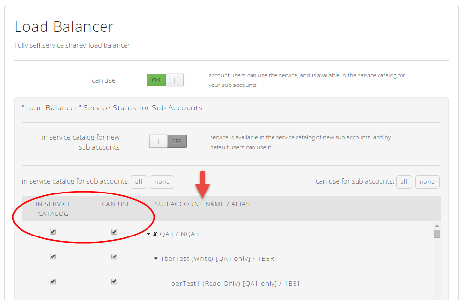

{{{
  "title": "Service Catalog FAQ",
  "date": "3-5-2015",
  "author": "Mary Cadera",
  "attachments": [],
  "contentIsHTML": false
}}}

###Description

The Service Catalog allows Account Administrators to enable or disable certain cloud platform services for users of the account. It also allows certain services to be enabled or disabled for individual sub accounts.

###General

**Q: Which accounts can use the Service Catalog?**

A: Any account, with or without sub accounts, may use the Service Catalog to control the services the account’s users and sub accounts can access.

**Q: When should the Service Catalog be used?**

A: While available to all accounts, the Service Catalog is not intended to be used by everyone. Administrators of accounts with complex environments or multiple sub accounts might consider using this service. It will be especially of interest to resellers.

Here are a few specific examples of scenarios where the Service Catalog might be of use:

* A customer with a complex environment who wants to test a new service on a limited basis before making it broadly available to all users and/or sub accounts in their environment
* A customer with many sub accounts who wants to restrict consumption of certain services as a way to control costs
* A reseller who wants to limit the services made available to its customers

**Q: When is the best time to make changes to service availability via the Service Catalog?**

A: Access to services is best established on a set-it-and-forget-it-basis – it is not advisable to use the Service Catalog to repeatedly toggle services on and off. Access to a service should only be turned off when an Account Administrator is confident that the service is not already being consumed by an account.

**Q: What [roles](../Accounts & Users/roles-faq.md) can access the Service Catalog?**

A: Only Account Administrators have permission to view the Service Catalog and enable or disable services.

**Q: Can a service be turned back on if it’s been turned off?**

A: Yes. Disabling access to a service is never permanent. A user with Account Administrator access to the account where the service was turned off can always turn a service back on for that account and/or its sub accounts.

**Q: How soon do changes take place?**

A: Services are enabled or disabled immediately; however, there may be a slight delay (up to a minute or longer) before the change is reflected in the Control Portal menu and the service is removed (or added back) to the UI.

**Q: Does this apply to users of the API?**

A: Yes. This will be made available to users of the public API. Documentation will follow shortly.

**Q: What if a service is in use by an account and it gets turned off?**

A: Depending on the service, it is possible that a service could be turned off and made unavailable for management but continue to be consumed in the background. In this case, it would continue to incur charges for that usage. This is a scenario that Account Administrators should be aware of and take measures to avoid. See Getting Started with the Service Catalog (link to “Getting Started with the Service Catalog”) for more information on which services are at risk of entering this undesirable state.
If you are using a service and it becomes unavailable, contact your account administrator.

**Q: The service I want to control is not listed in the Service Catalog. How can I restrict access to it?**

A: There are many ways to limit the services that users can or can’t see. User [roles](../Accounts & Users/roles-faq.md) restrict access to specific areas of the cloud platform, and therefore restrict access to specific services and functionality. Additionally, some services are not available in certain datacenters, which effectively precludes users from having access to them.

Suggestions for additional services that should be added to the Service Catalog are enthusiastically welcomed. Send your input to noc@ctl.io or to the CenturyLink UserVoice forum. (See http://www.ctl.io/knowledge-base/support/how-do-i-submit-a-feature-request/ for more details on submitting feature requests via UserVoice.)

**Q: I want to make a service unavailable to users of my sub accounts and also make it invisible to the Account Administrators of those sub accounts. Can I do that?**

A: Yes. It’s possible to turn a service off for sub accounts, and to make that service invisible to the Account Administrators of those accounts. A parent can set access to service use (“can use”) and the visibility to Account Administrators (“in service catalog”) independently, and on a sub account by sub account basis. See the below screen shot for a visualization of how this works.

**Q: Can a sub account make changes to settings made by their parent account?**

A: It depends on whether the sub account is trying to turn the service on or off, and whether or not the parent has made the service visible to the Account Administrators of the sub accounts.

Once a parent has turned a service off for a sub account, any user at the sub account level cannot use the service or make changes to the setting.

If a sub account user has Account Administrator permissions and the service is turned on, the Administrator can potentially turn the service off for users of that sub account (and users of any sub accounts of that sub account). This is conditional on whether or not the parent account set the service to visible at the sub account level. A service can be turned on for sub accounts, but if the parent has made it invisible, the sub accounts’ Account Administrators cannot see it in their view of the Service Catalog, or turn it off for itself or its sub accounts.

**Q: Will new services be automatically exposed to my sub accounts, or do I have to turn them on via the Service Catalog?**

A: New services that are added to the Service Catalog will default to "available" for all existing sub accounts. Account Administrators should disable access to new services when they are added if they wish to make them unavailable to the accounts in their hierarchy.
The Service Catalog also offers a secondary setting that allows Account Administrators to make a service automatically available or unavailable to new sub accounts. This allows for control over that service for sub accounts that have not yet been created.

See Getting Started with the Service Catalog (link to “Getting Started with the Service Catalog”) for more information on how to best leverage the new sub account default setting.
