{{{
  "title": "Getting Started with Load Balancer as a Service",
  "date": "8-25-2016",
  "author": "Matthew Farrell",
  "attachments": [],
  "contentIsHTML": false
}}}

### Audience

Cloud Network Administrators, Application Developers

### Overview

CenturyLink Load-Balancer-as-a-Service (LBaaS) helps you build highly scalable and highly available applications by providing application-level (HTTP & TCP) load balancing. It also offers various persistence methods to ensure that a user, once connected, continues to be connected to the same application instance.

### What is Load-Balancer-as-a-Service?

LBaaS is a load balancing solution that is meant to provide both server load balancing and high availability in an industry standard manner.

### LBaaS Feature List

* Programmable API
  - Create, Read, Update, Delete
* Highly Available, Resilient Infrastructure
* Load Balancing Protocols: HTTP (any port), TCP (any port)
*	Load Balancing Algorithms: Round Robin, Least Connections, Source IP Hash
*	Persistence: Source IP
* Health Checks: SSL, HTTP & TCP
*	Port Forwarding/Redirect

### Create a Load Balancer: User Interface

To get started with the User Interface (UI), select the Network Icon
inside of Control Portal:

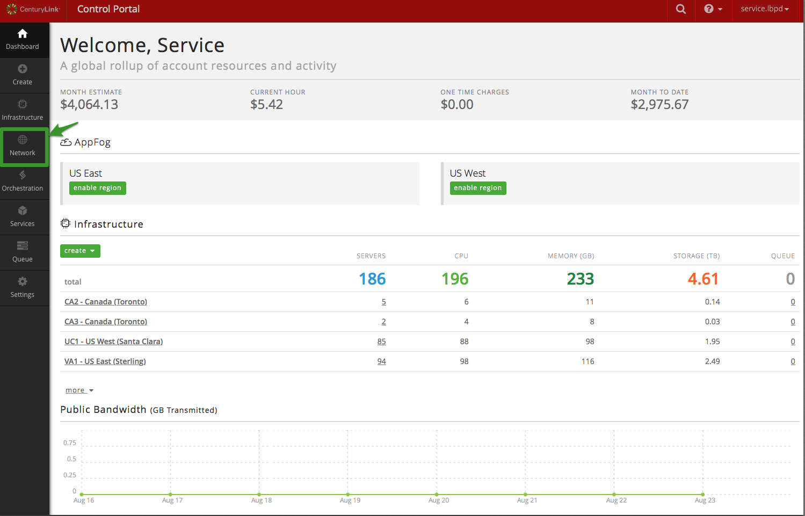

Next, select Load Balancer from list of Network objects:

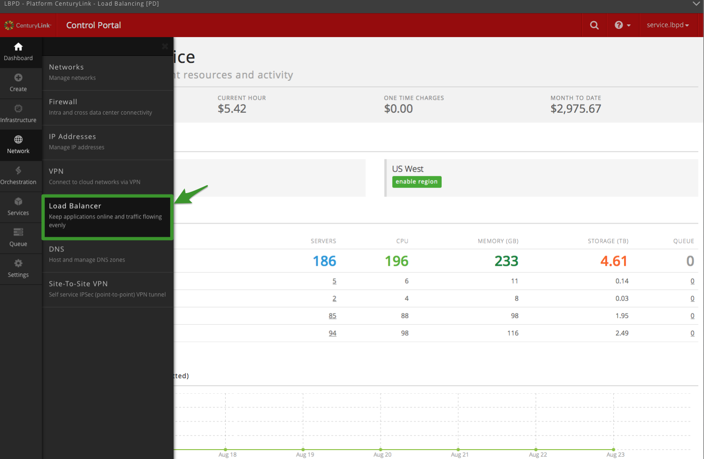

Now, let’s get started creating a Load Balancer. Click ‘create load
balancer’

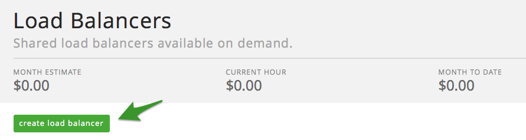

* (1)Select a location (Data Center) you wish to deploy the load balancer
to
* (2) Provide it a Name
* (3) Provide description (if needed)
* (4) Select Create Load Balancer

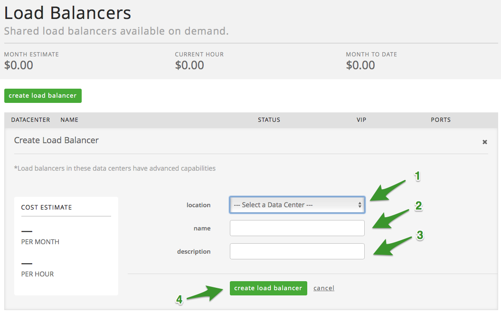

Upon creating your load balancer, the UI will refresh to show you the
status of your load balancer

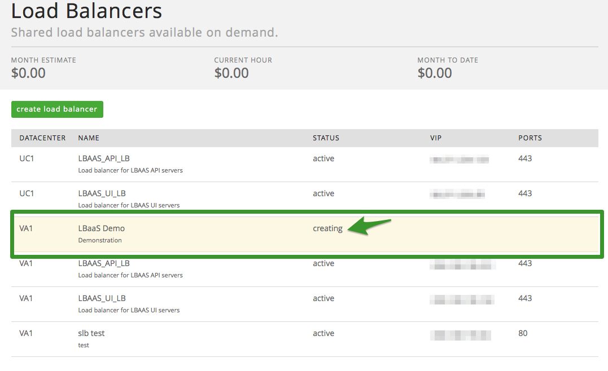

Once status has changed from ‘creating’ to ‘active’ your Load Balancer
is ready to add pools (Please note, a manual refresh of the page may be
required to see an updated status).

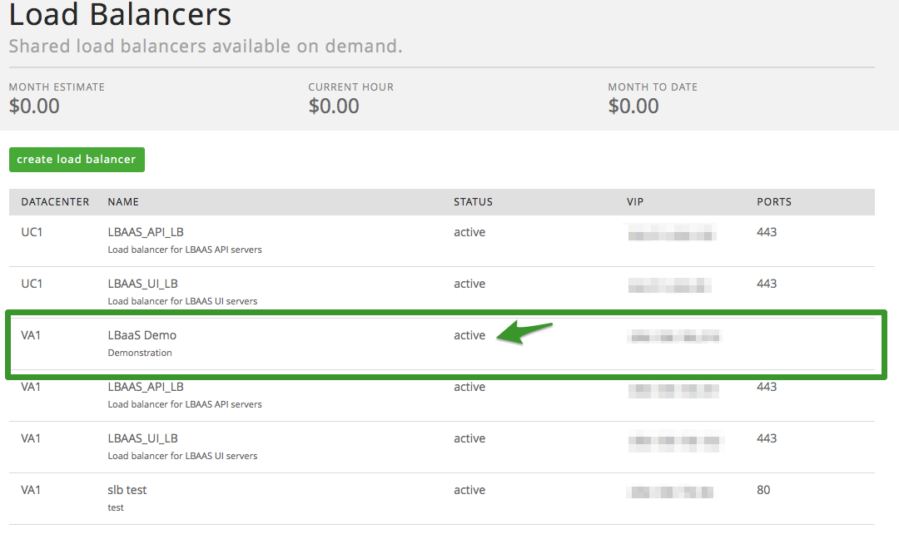

### Adding Pool(s) – User Interface

Now that the Load Balancer is created, we need to add pools. After
selecting the Load Balancer from the previous screen, click on either of
the ‘add pool’ buttons.

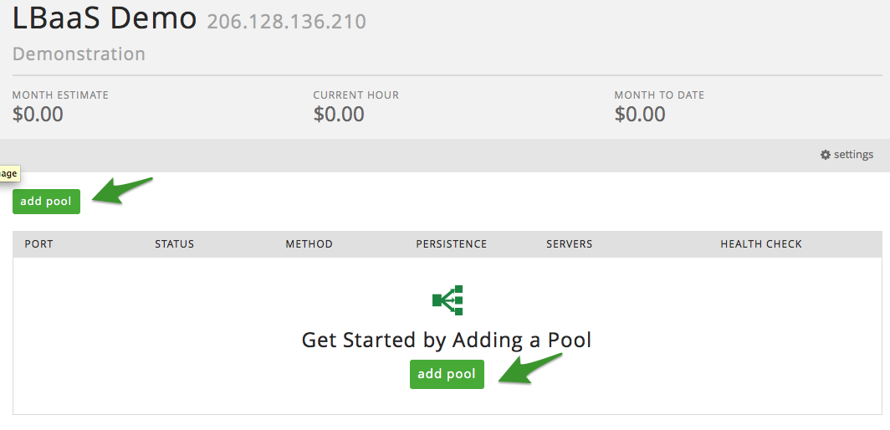

After selecting ‘add pool’, you will now need to populate the following
fields:

1.  **mode/port**: For LBaaS enabled data centers, users can select
    either http or TCP for mode and can populate any port (above 23) to
    load balance against. (Please note for all non-LBaaS enabled
    centers, users will only be offered a selection of http for mode and
    will only be able to load balance against port 80 or 443).

2.  **Method**: Select between round robin, least connection or Source IP

3.  **Persistence**: Select between None and Source IP

### Adding Node(s) – User Interface

At this point it is time to add node(s), do so by selecting the ‘add
node’ button. Enter the IP of the node and the desired port (to add
additional nodes to the pool, simply repeat this step).

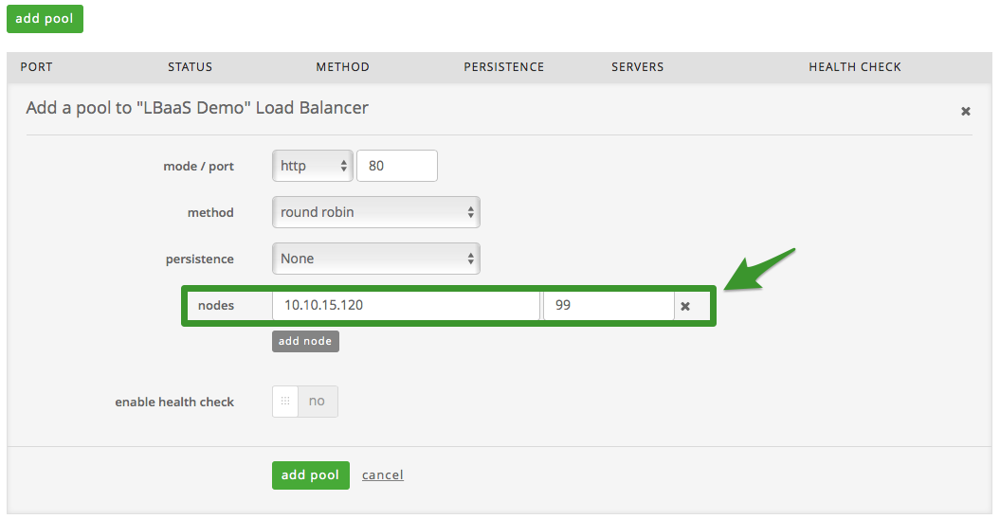

### Health Checks – User Interface

LBaaS uses health checks to determine if a backend server is available
to process requests. This avoids having to manually remove a server from
the backend if it becomes unavailable. The default health check is to
try to establish a TCP connection to the server (i.e. it checks if the
backend server is listening on the configured IP address and port).

If a server fails a health check, and therefore is unable to serve
requests, it is automatically disabled in the backend i.e. traffic will
not be forwarded to it until it becomes healthy again. If all servers in
a backend fail, the service will become unavailable until at least one
of those backend servers becomes healthy again.

### Configure Health Checks via UI

To enable health checks in the UI, simply slide the enable health checks
button from ‘no’ to ‘yes’ (Please note non-LBaaS enabled data centers
will be able to see the health check button, but will be unable to
enable health checks at this time). Simply set the health check
parameters based on the definitions provided below.

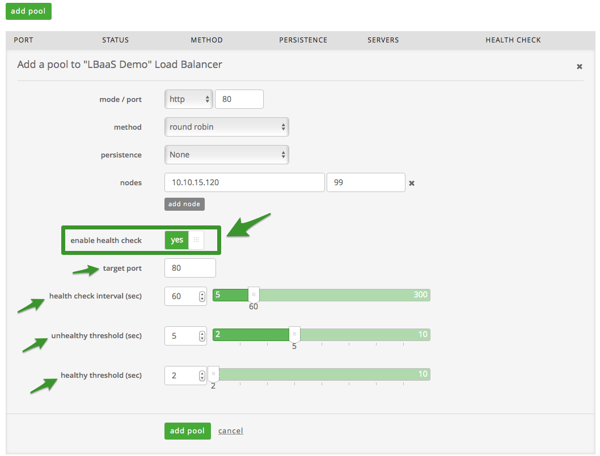

### Health Check Definitions

Target Port: This is the target protocol and port pair. Either HTTP or
TCP and a selection in the range of valid ports from 1 through 65535.
The format is “http:3381”, for example.

Unhealthy Threshold: The number of consecutive health check failures
before moving the instance to the unhealthy state. Integer values
between 2 and 10 are allowed.

Healthy Threshold: The number of consecutive health check successes
requires before moving the instance to the healthy state. Integer values
between 2 and 10 are allowed.

Health Check Interval Seconds: The interval in seconds between health
checks. Integer values between 5 and 300 are allowed.

After adding health checks, if desired, you will be redirected back to
the list of available pools. At this point, the status will be set to
creating. Within minutes the status will be set to active. And that’s
it!

### Updating a Pool via the UI

To update a pool, first, select the load balancer instance the pool is
associated to.

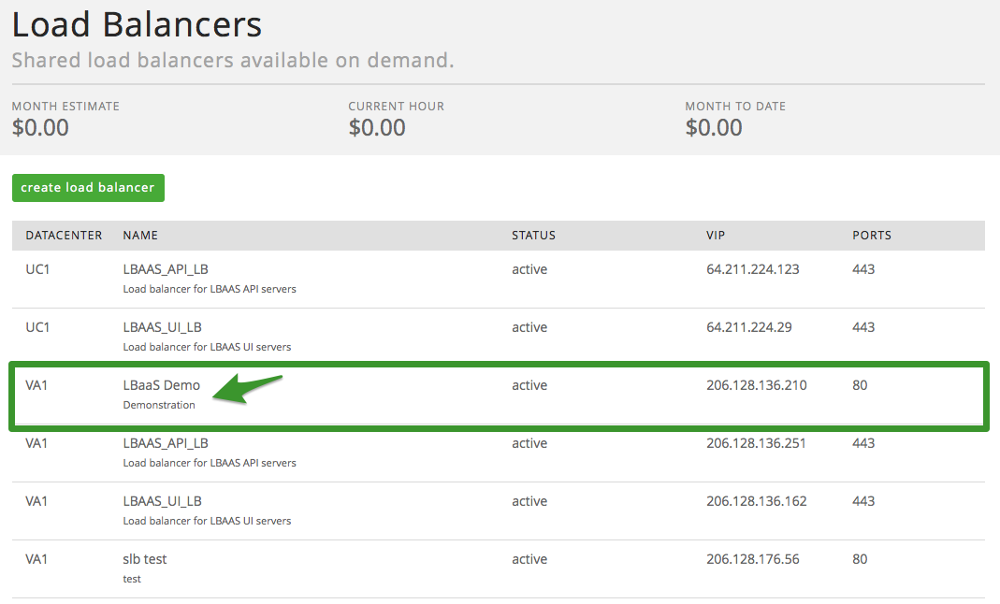

Next, drill in to the appropriate pool:

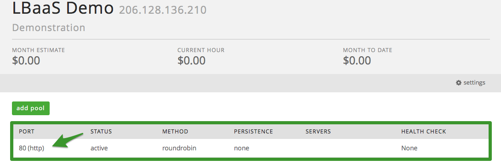

Once in the pool, make any necessary changes and when finished select
‘save’ to commit the changes. Once the changes are committed, you will
be redirected back to the list of pools, which will show a status of
‘updating’

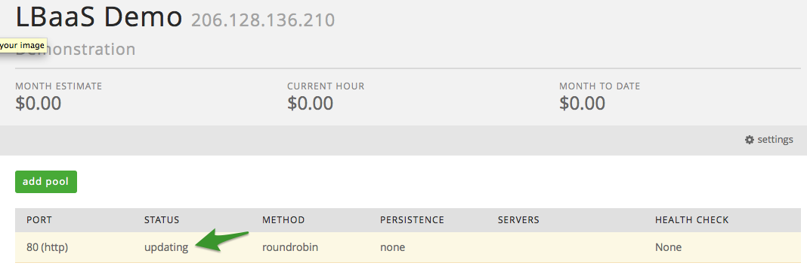

Once the updates are complete, the status will change to ‘active’.

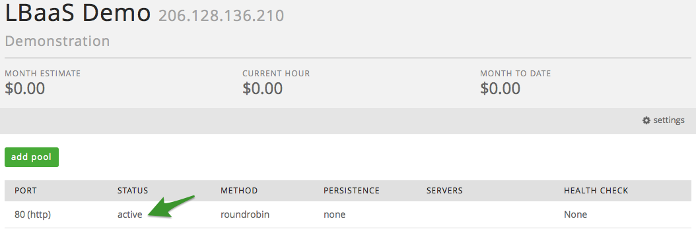

### Delete a Pool via UI

To delete a pool, select the appropriate load balancer the pool is
associated to.

From the list of available pools, select the pool you wish to delete.

Once in the pool, select the delete pool button.

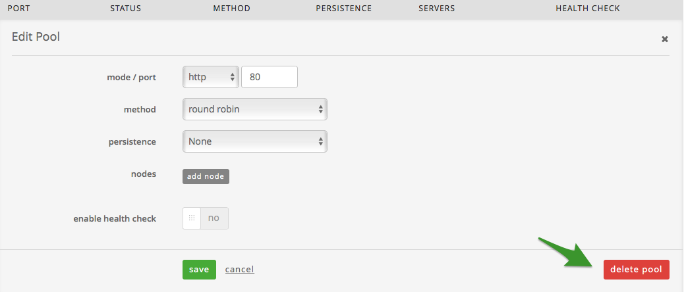

Upon selecting delete, you will be prompted to confirm your decision to
complete. Upon selecting ‘Yes, I am sure’, you will be redirected back
to the list of pools, to which you can see a status of ‘deleting’ on the
pool in question.

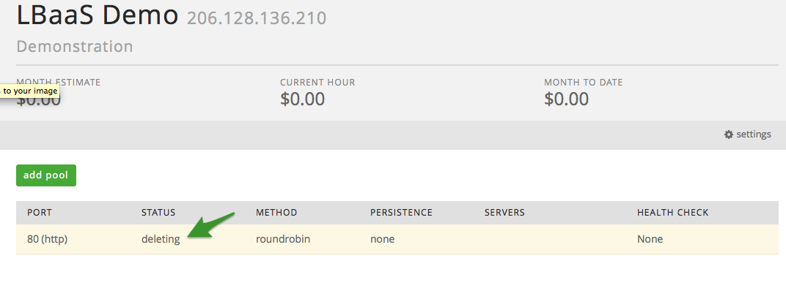

Once the pool has successfully been deleted, the page will refresh and
the deleted pool will no longer appear in the list of available pools.

### Deleting or Updating a Load Balancer via UI

To Delete or Update a load balancer, select the appropriate Load
Balancer.

Select the ‘settings’ button.

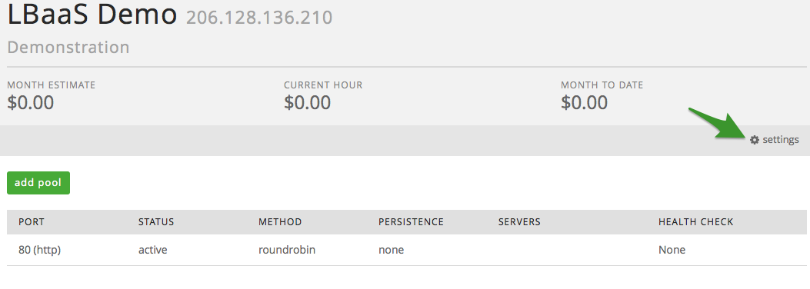

Once inside of the settings, you can update the name and/or description
of the Load Balancer. To commit your changes, select save.

Alternatively, if you wish to delete the load balancer in question,
select the delete button.

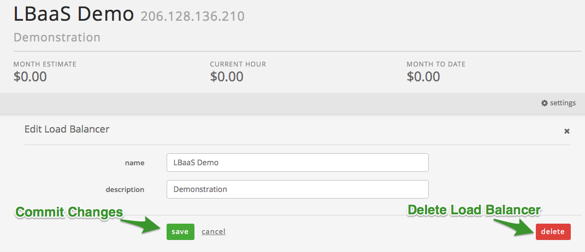

### API Configuration and Management

Manage your LBaaS from anywhere with an API. Create LBaaS VIPs and pools, add/remove servers from pool, and delete LBaaS configurations through a REST API that supports only JSON for all operations.

This API is RESTful, using JSON messages over HTTP and relying on the standard HTTP verbs including GET, POST, PUT, and DELETE. The general URL format of the service is:
https://api.loadbalancer.ctl.io/{accountAlias}/{datacenter}/loadbalancers

The request format is specified using the ‘Content-Type’ header and is required for operations that have a request body. The response format should be specified in requests using the ‘Accept’ header.

#### Authenticate Against the API

Authentication to the API is done with the same credentials used to access the CenturyLink Cloud Control Portal. The username and password are provided to the API and in return, the user gets back a credentials object. This object contains a valid bearer token, which must be provided on each subsequent API request and can be reused for up to 2 weeks. The HTTP request must also include a Content-Type header set to application/json.

### Configure the Load Balancer-as-a-Service (LBaaS)

### Create LBaaS

To create the LBaaS framework and to get a VIP assigned, use the Create LBaaS function.

#### Structure:
    POST https://api.loadbalancer.ctl.io/{accountAlias}/{datacenter}/loadbalancers

| Name | Type | Description | Req. |
| --- | --- | --- | --- |
| AccountAlias | string | Short code for a particular account | Yes |
| DataCenter | string | Short string representing the data center where the load balancer is. Valid codes can be retrieved from the [Get Data Center List](http://www.ctl.io/api-docs/v2#data-centers-get-data-center-list) API operation. | Yes |

#### Example

    POST  https://api.loadbalancer.ctl.io/DV01/NY1/loadbalancers

    {  
      "name":"ExampleGroup",
      "description":"Example Group for demo purposes"
    }  

    RESPONSE:  
    {  
      "id": "d685c028-5852-4b6f-8511-a407147db0e4",
      "status": "ACTIVE",  
      "description": "Create Load Balancer a4ad7c71-1575-400e-8eb2-cef74ed557ad",  
      "requestDate": 1450383770701,  
      "completionDate": null,  
      "links": [  
        {  
          "rel": "loadbalancer",  
          "href": "",  
          "resourceId": "a4ad7c71-1575-400e-8eb2-cef74ed557ad"  
        }  
      ]  
    }  

#### Entity Definition

| Name | Type | Description |
| --- | --- | --- |
| id | string | ID of the LBaaS load balancer create request |
| status | string | Initially the response will show a status for the request of "ACTIVE".  A status of "COMPLETE" will show in the Response of a function when the Group has been created with the new configuration. |
| description | string | Describes the activity running within the LBaaS Group create process |
| requestDate | string | Date-time stamp of the request |
| completionDate | string | Date-time stamp of LBaaS Group creation.  Null value returned until process has completed |
| links | array | Collection of entity links that point to resources related to this LBaaS Group |

### View Status of LBaaS requestDate

To check on the status of the request, use the same URL used to create the load balancer appended with </requests/{id}>.

#### Structure:
    https://api.loadbalancer.ctl.io/{accountAlias}/{datacenter}/loadbalancers/requests/{id}

| Name | Type | Description | Req. |
| --- | --- | --- | --- |
| AccountAlias | string | Short code for a particular account | Yes |
| DataCenter | string | Short string representing the data center where the load balancer is. Valid codes can be retrieved from the [Get Data Center List](http://www.ctl.io/api-docs/v2#data-centers-get-data-center-list) API operation. | Yes |
| id | string | The id of the request the user is interested in.  This id was provided in the response to the Create LBaaS Group API call. | Yes |

#### Example
    GET https://api.loadbalancer.ctl.io/DV01/NY1/loadbalancers/requests/d685c028-5852-4b6f-8511-a407147db0e4  

    {  
      "id": "d685c028-5852-4b6f-8511-a407147db0e4",  
      "status": "COMPLETE",  
      "description": "Create Load Balancer a4ad7c71-1575-400e-8eb2-cef74ed557ad",  
      "requestDate": 1450383770701,  
      "completionDate": null,  
      "links": [  
        {  
          "rel": "loadbalancer",  
          "href": "",  
          "resourceId": "a4ad7c71-1575-400e-8eb2-cef74ed557ad"  
        }  
      ]  
    }

#### Entity Definition

| Name | Type | Description |
| --- | --- | --- |
| id | string | ID of the LBaaS group create request |
| status | string | Initially the response will show a status for the request of "ACTIVE".  A status of "COMPLETE" will show in the Response of a GET LBaaS group function when the Group has been created with the new configuration. |
| description | string | Describes the activity running within the LBaaS Group create process |
| requestDate | string | Date-time stamp of the request |
| completionDate | string | Date-time stamp of LBaaS Group creation.  Null value returned until process has completed |
| links | array | Collection of entity links that point to resources related to this LBaaS Group |  

### View Details of LBaaS (within a given datacenter)

To see the status and details of a single LBaaS, use the GET function with the same basic URL as the Create LBaaS appended with the Load Balancer ID.

#### Structure:
    GET https://api.loadbalancer.ctl.io/{accountAlias}/{DataCenter}/loadbalancers/{loadBalancerId}

| Name | Type | Description | Req. |
| --- | --- | --- | --- |
| accountAlias | string | Short code for a particular account | Yes |
| DataCenter | string | Short string representing the data center where the load balancer is. Valid codes can be retrieved from the [Get Data Center List](http://www.ctl.io/api-docs/v2#data-centers-get-data-center-list) API operation. | Yes |
| loadBalancerId | string | The id of the Load Balancer for which details are to be returned | Yes |      

#### Example
    GET https://api.loadbalancer.ctl.io/DV01/NY1/loadbalancers/a4ad7c71-1575-400e-8eb2-cef74ed557ad

    RESPONSE:
    {
      "id": "a4ad7c71-1575-400e-8eb2-cef74ed557ad",  
      "name": "TomGroup2",  
      "description": "TomDemo2",  
      "publicIPAddress": "10.72.76.199",  
      "privateIPAddress": "10.72.76.199",  
      "pools": [],  
      "status": "READY",  
      "accountAlias": "DV01",  
      "dataCenter": "NY1",  
      "keepalivedRouterId": "199",  
      "version": "7d6f11193ef05e6e"  
    }

### Entity Definitions

| Name | Type | Description |
| --- | --- | --- |
| id | string | ID of the LBaaS Load Balancer |
| name | string | Customer given name of LBaaS Load Balancer |
| description | string | Customer given description of LBaaS Load Balancer |
| publicIPAddress | string | IP address of the LBaaS Load Balancer public interface (Internet facing network) |
| pools | array | Collection of entity values that describe load balanced pools configured on the Load Balancer |
| (pools) id | string | ID of the LBaaS Load Balancer pool |
| (pools) port | string | Port the LBaaS Load Balancer pool will be listening on |
| (pools) loadBalancingMethod | string | Load balancing method configured for the pool - "roundrobin" or "leastconn." |
| (pools) persistence | string | Load balancing persistence type configured for the pool |
| (pools) idleTimeout | integer | Number of milliseconds to allow before disconnecting an idle session |
| (pools) loadBalancingMode | string | Load balancing mode indicates the network layer being load balanced - "tcp" or "http".  Layer 4 - TCP, Layer 7 - HTTP(S) |
| (pools) nodes | array | Collection of entity values that describe the customer backend nodes being load balanced |
| (pools / nodes) ipAddress | string | IP address of the backend node being load balanced |
| (pools / nodes) privatePort | string | Port on the backend node where load balanced transactions are to be sent |
| (pools) healthCheck | string | Health check configuration for the backend node pool members |
| status | string | Status of the LBaaS Load Balancer - "READY", "DELETED", "UNDER_CONSTRUCTION", "UPDATING_CONFIGURATION", "FAILED" |
| accountAlias | string | Short code for a particular account |
| dataCenter | string | Short string representing the data center where the load balancer is. Valid codes can be retrieved from the [Get Data Center List](http://www.ctl.io/api-docs/v2#data-centers-get-data-center-list) API operation. |

### View Details for All LBaaS (within a given account alias)

To see the status and details of all LBaaS instances for a given account, use the GET function with the same API call as used in the Create LBaaS Group.

#### Structure:
    GET https://api.loadbalancer.ctl.io/{accountAlias}/loadbalancers

| Name | Type | Description | Req. |
| --- | --- | --- | --- |
| AccountAlias | string | Short code for a particular account | Yes |

#### Example
    GET https://api.loadbalancer.ctl.io/DV01/loadbalancers

    RESPONSE:
    {
      "values": [  
      {
        "id": "a4ad7c71-1575-400e-8eb2-cef74ed557ad",
        "name": "TomGroup2",
        "description": "TomDemo2",
        "publicIPAddress": "10.72.76.199",
        "privateIPAddress": "10.72.76.199",
        "pools": [],
        "status": "READY",
        "accountAlias": "DV01",
        "dataCenter": "NY1",
        "keepalivedRouterId": "199",
        "version": "7d6f11193ef05e6e"
      },
      {
        "id": "8f65e075-7f72-4b4a-ace8-af69552b10a2",
        "name": "LBAAS_API_LB",
        "description": "Load balancer for LBAAS API servers",
        "publicIPAddress": "10.72.76.224",
        "privateIPAddress": "10.72.76.224",
        "pools": [  
          {
            "id": "42a65738-780f-4539-a02e-29ae0b8c5f44",
            "port": 443,
            "loadBalancingMethod": "roundrobin",
            "persistence": "none",
            "idleTimeout": 50000,
            "loadBalancingMode": "tcp",
            "nodes": [
              {
                "ipAddress": "10.71.250.13",
                "privatePort": 8443
              }
            ],
            "healthCheck": null
          }
        ],
        "status": "READY",
        "accountAlias": "DV01",
        "dataCenter": "NY1",
        "keepalivedRouterId": "224",
        "version": "c0ed2dc00c2aa735"
       }
      ]  
    }

### Entity Definition

| Name | Type | Description |
| --- | --- | --- |
| id | string | ID of the LBaaS Load Balancer |
| name | string | Customer given name of LBaaS Load Balancer |
| description | string | Customer given description of LBaaS Load Balancer |
| publicIPAddress | string | IP address of the LBaaS Load Balancer public interface (Internet facing network) |
| pools | array | Collection of entity values that describe load balanced pools configured on the Load Balancer |
| (pools) id | string | ID of the LBaaS Load Balancer pool |
| (pools) port | string | Port the LBaaS Load Balancer pool will be listening on |
| (pools) loadBalancingMethod | string | Load balancing method configured for the pool - "roundrobin" or "leastconn." |
| (pools) persistence | string | Load balancing persistence type configured for the pool |
| (pools) idleTimeout | integer | Number of milliseconds to allow before disconnecting an idle session |
| (pools) loadBalancingMode | string | Load balancing mode indicates the network layer being load balanced - "tcp" or "http".  Layer 4 - TCP, Layer 7 - HTTP(S) |
| (pools) nodes | array | Collection of entity values that describe the customer backend nodes being load balanced |
| (pools / nodes) ipAddress | string | IP address of the backend node being load balanced |
| (pools / nodes) privatePort | string | Port on the backend node where load balanced transactions are to be sent |
| (pools) healthCheck | string | Health check configuration for the backend node pool members |
| status | string | Status of the LBaaS Load Balancer - "READY", "DELETED", "UNDER_CONSTRUCTION", "UPDATING_CONFIGURATION", "FAILED" |
| accountAlias | string | Short code for a particular account |
| dataCenter | string | Short string representing the data center where the load balancer is. Valid codes can be retrieved from the [Get Data Center List](http://www.ctl.io/api-docs/v2#data-centers-get-data-center-list) API operation. |

### Create pool
Append the URL with the Group ID that was provided in the Create Group POST response followed by </pools>.

#### Structure:
    POST https://api.loadbalancer.clt.io/{accountAlias}/{dataCenter}/loadbalancers/{loadBalancerId}/pools/

| Name | Type | Description | Req. |
| --- | --- | --- | --- |
| AccountAlias | string | Short code for a particular account | Yes |
| DataCenter | string | Short string representing the data center where the load balancer is. Valid codes can be retrieved from the [Get Data Center List](http://www.ctl.io/api-docs/v2#data-centers-get-data-center-list) API operation. | Yes |
| loadBalancerId | string | The id of the Load Balancer for which details are to be returned | Yes |  

#### Example:
    POST https://api.loadbalancer.ctl.io/test1/NY1/loadbalancers/d8490ee7-fd57-4df3-b932-f32f0a785da8/pools  

    {
      "port":"443",
      "loadBalancingMethod":"roundrobin",
      "loadBalancingMode":"http",
      "healthCheck":{"unhealthyThreshold": 2, "healthyThreshold": 2, "intervalSeconds": 5, "targetPort": 80},
      "persistence":"source_ip",
      "idleTimeout": 3600,
      "nodes":[
      {
       "ipAddress":"204.79.197.200",
       "privatePort":"8080"
      },
      {
       "ipAddress":"216.146.46.11",
       "privatePort":"8080"
      }
     ]
    }

#### Entity Definitions:
| Name | Type | Description | Req. |
| --- | --- | --- | --- |
| port | string | The port on which incoming traffic will send requests  | Yes |
| loadBalancingMethod | string | Method for load balancing – “roundrobin” or “leastconn” | No |
| loadBalancingMode | string | Indicates the type of Load Balancing – TCP or HTTP(S) (layer4-TCP or Layer7-HTTP(s)) | Yes |
| healthCheck | string | Configures a TCP health check for the pool with the variable settings noted below in the Health Checks section of this document | No |
| persistence | array | Persistence method for client connections to backend nodes – “none” or “source_ip” | No |
| idleTimeout | integer | Timeout value for idle client connections to backend nodes | No |
| nodes | string | Collection of entity values that describe the customer backend nodes being load balanced | No |
| (nodes) ipAddress | string | IP of the server that will be load balanced | No |
| (nodes) privatePort | integer | Port on which the server that will be load balanced is listening | No |

    RESPONSE:
    {
      "id": "7290dd68-be87-404b-8fc6-e4fa2e8aded6",
      "status": "ACTIVE",
      "description": "Update Pool to Load Balancer a712200e-9504-43db-994f-f5b2e485b078",
      "requestDate": 1444330761475,
      "completionDate": null,
      "links": [
        {
          "rel": "loadbalancer",
          "href": "",
          "resourceId": "a712200e-9504-43db-994f-f5b2e485b078"
        },
        {
          "rel": "pool",
          "href": "",
          "resourceId": "6db7c15c-e954-4b7a-9d24-523b10db2db6"
        }
      ]
    }

### Update Pool
Append the URL with the Group ID that was provided in the Create Group POST response followed by </pools>. Further append the URL with the Pools ID that was provided in the Create Pools POST response.

#### Structure:
    PUT https://api.loadbalancer.clt.io/{accountAlias}/{dataCenter}/loadbalancers/{loadBalancerId}/pools/{poolId}

| Name | Type | Description | Req. |
| --- | --- | --- | --- |
| accountAlias | string | Short code for a particular account | Yes |
| dataCenter | string | Short string representing the data center where the load balancer is. Valid codes can be retrieved from the [Get Data Center List](http://www.ctl.io/api-docs/v2#data-centers-get-data-center-list) API operation. | Yes |
| loadBalancerId | string | The id of the Load Balancer for which details are to be returned | Yes |
| poolId | string | The id of the Load Balancer for which configuration is to be updated | Yes |

#### Example:
    PUT  https://api.loadbalancer.ctl.io/test1/NY1/loadbalancers/d8490ee7-fd57-4df3-b932-f32f0a785da8/pools/786b6438-48fd-45df-9e9c-68b98610fe06

    {
      "port":"443",
      "loadBalancingMethod":"leastconn",
      "loadBalancingMode":"tcp",
      "healthCheck":{"unhealthyThreshold": 2, "healthyThreshold": 2, "intervalSeconds": 5, "targetPort": 80},
      "persistence":"none",
      "idleTimeout": 3600,
      "nodes":[
        {
          "ipAddress":"204.79.197.200",
          "privatePort":"8080"
        },
        {
          "ipAddress":"173.194.46.49",
          "privatePort":"8080"
        }
       ]
      }

#### Entity Definition

| Name | Type | Description | Req. |
| --- | --- | --- | --- |
| port | string | The port on which incoming traffic will send requests  | Yes |
| loadBalancingMethod | string | Method for load balancing – “roundrobin” or “leastconn” | No |
| loadBalancingMode | string | Indicates the type of Load Balancing – TCP or HTTP(S) (layer4-TCP or Layer7-HTTP(s)) |
| healthCheck | string | Configures a TCP health check for the pool with the variable settings noted below in the Health Checks section of this document |
| persistence | array | Persistence method for client connections to backend nodes – “none” or “source_ip” |
| idleTimeout | integer | Timeout value for idle client connections to backend nodes |
| nodes | string | Collection of entity values that describe the customer backend nodes being load balanced |
| (nodes) ipAddress | string | IP of the server that will be load balanced |
| (nodes) privatePort | integer | Port on which the server that will be load balanced is listening |

    RESPONSE:
    {
      "id": "351a23be-2ace-454e-8910-f31a357ceb0f",
      "status": "ACTIVE",
      "description": "Update Pool to Load Balancer a712200e-9504-43db-994f-f5b2e485b078",
      "requestDate": 1444331344021,
      "completionDate": null,
      "links": [
          {
              "rel": "loadbalancer",
              "href": "",
              "resourceId": "a712200e-9504-43db-994f-f5b2e485b078"
          },
          {
              "rel": "pool",
              "href": "",
              "resourceId": "6db7c15c-e954-4b7a-9d24-523b10db2db6"
          }
      ]
    }

### Delete Pool

Simply use the URL with the Group ID followed by </pools>. Further append the URL with the Pools ID that was provided in the Create Pools POST response. No request body is required.

#### Structure:
    DELETE https://api.loadbalancer.clt.io/{accountAlias}/{dataCenter}/loadbalancers/{loadBalancerId}/pools/{poolId}

### Example

    DELETE  https://api.loadbalancer.ctl.io/test1/NY1/loadbalancers/d8490ee7-fd57-4df3-b932-f32f0a785da8/pools/786b6438-48fd-45df-9e9c-68b98610fe06

    RESPONSE:
    {
      "id": "5257d0f9-eb60-4bf8-9b47-6bd510358cd9",
      "status": "ACTIVE",
      "description": "Delete Load Balancer a712200e-9504-43db-994f-f5b2e485b078",
      "requestDate": 1444331474296,
      "completionDate": null,
      "links": [
          {
              "rel": "loadbalancer",
              "href": "",
              "resourceId": "a712200e-9504-43db-994f-f5b2e485b078"
          }
      ]
    }

| Name | Type | Description |
| --- | --- | --- |
| id | string | ID of the LBaaS load balancer pool delete request |
| status | string | Initially the response will show a status for the request of "ACTIVE".  A status of "COMPLETE" will show in the Response of a GET LBaaS group function when the pool has been deleted. |
| description | string | Describes the activity running within the LBaaS load balancer pool delete process |
| requestDate | string | Date-time stamp of the request |
| completionDate | string | Date-time stamp of request completion.  Null value returned until process has completed |
| links | array | Collection of entity links that point to resources related to this LBaaS load balancer pool |
| rel | array | Describes the entity - "loadbalancer" or "pool" |
| resourceId | string | ID of the load balancer or pool entity |    

### Delete LBaaS

Deletes a LBaaS Load Balancer configuration including any pools configured on the Load Balancer.

Simply use the URL with the Group ID. No request body is required.

#### Structure:
    DELETE https://api.loadbalancer.clt.io/{accountAlias}/{dataCenter}/loadbalancers/{loadBalancerId}

| Name | Type | Description | Req. |
| --- | --- | --- | --- |
| AccountAlias | string | Short code for a particular account | Yes |
| DataCenter | string | Short string representing the data center where the load balancer is. Valid codes can be retrieved from the [Get Data Center List](http://www.ctl.io/api-docs/v2#data-centers-get-data-center-list) API operation. | Yes |
| loadBalancerId | string | The id of the Load Balancer to be deleted | Yes |

#### Example
    DELETE  https://api.loadbalancer.ctl.io/DV01/NY1/loadbalancers/47bb8d61-2a3f-4de8-9f93-5c6a4805e7da

    RESPONSE:
    {
      "id": "24d70fdc-965b-48fe-8aa2-9571db3d46a0",  
      "status": "ACTIVE",
      "description": "Delete Load Balancer 47bb8d61-2a3f-4de8-9f93-5c6a4805e7da",
      "requestDate": 1450795381033,
      "completionDate": null,
      "links": [
        {
          "rel": "loadbalancer",
          "href": "",
          "resourceId": "47bb8d61-2a3f-4de8-9f93-5c6a4805e7da"
        }
      ]
    }

| Name | Type | Description |
| --- | --- | --- |
| id | string | ID of the LBaaS load balancer delete request |
| status | string | Initially the response will show a status for the request of "ACTIVE".  A status of "COMPLETE" will show in the Response of a GET LBaaS group function when the pool has been deleted. |
| description | string | Describes the activity running within the LBaaS load balancer delete process |
| requestDate | string | Date-time stamp of the request |
| completionDate | string | Date-time stamp of request completion.  Null value returned until process has completed |
| links | array | Collection of entity links that point to resources related to this LBaaS load balancer pool |
| rel | array | Describes the entity - "loadbalancer" or "pool" |
| resourceId | string | ID of the load balancer or pool entity |    

##### If you delete a LBaaS Load Balancer that has an existing pool, the pool will be deleted at the same time.

### Health Checks

LBaaS uses health checks to determine if a backend server is available to process requests. This avoids having to manually remove a server from the backend if it becomes unavailable. The default health check is to try to establish a TCP connection to the server (i.e. it checks if the backend server is listening on the configured IP address and port).

If a server fails a health check, and therefore is unable to serve requests, it is automatically disabled in the backend i.e. traffic will not be forwarded to it until it becomes healthy again. If all servers in a backend fail, the service will become unavailable until at least one of those backend servers becomes healthy again.

Users can also apply custom health checks at both the pool and node level.  Applying a health check at the pool level applies to all of the nodes in the pool.  A custom health check applied at the node level will on be relevant on the designated node and will supersede any health check applied at the pool level.

### Health Check Configurations

Unhealthy Threshold: The number of consecutive health check failures before moving the instance to the unhealthy state. Integer values between 2 and 10 are allowed.

Healthy Threshold: The number of consecutive health check successes requires before moving the instance to the healthy state. Integer values between 2 and 10 are allowed.

Interval Seconds: The interval in seconds between health checks. Integer values between 5 and 300 are allowed.

Target Port: This is the target protocol and port pair. Either HTTP or TCP and a selection in the range of valid ports from 1 through 65535. The format is “http:3381”, for example.
