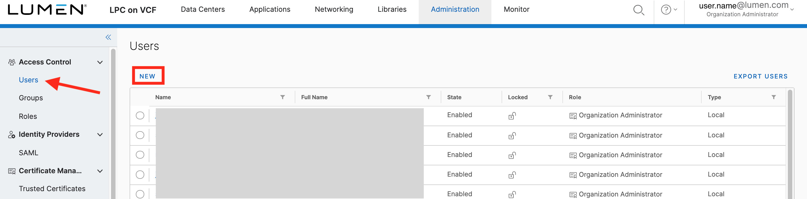
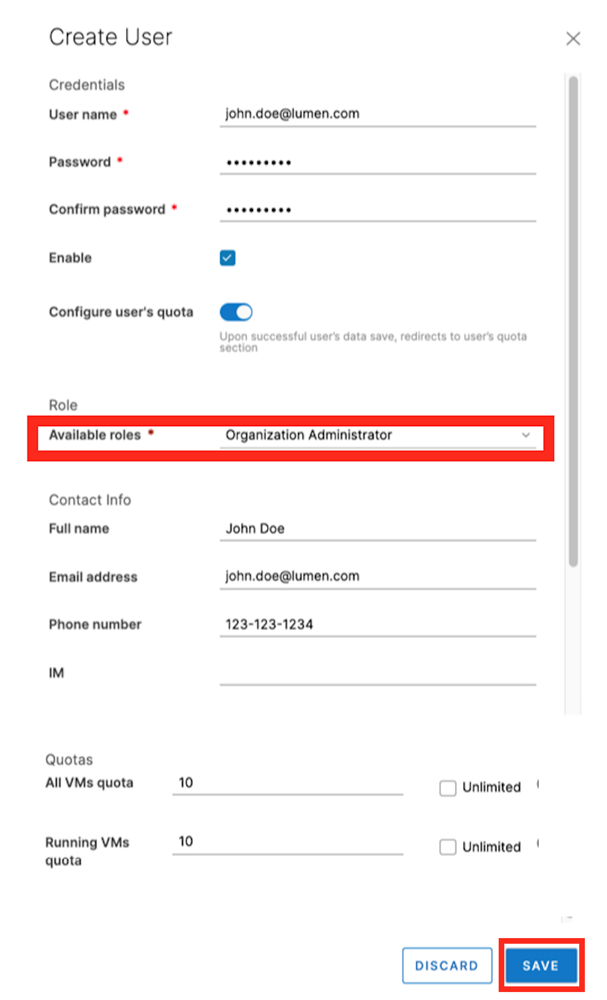
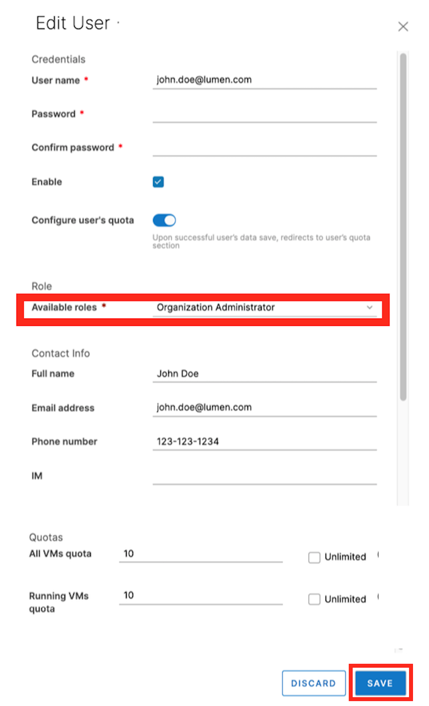

{{{
  "title": "Adding a New Organization Administrator",
  "date": "5-8-2019",
  "author": "Hannah Melvin",
  "keywords": ["cpc", "cloud", "vmware", "admin", "vcloud", "vcf"],
  "attachments": [],
  "related-products" : [],
  "contentIsHTML": false,
  "sticky": false
}}}

### Description
In this KB article, we demonstrate how to add a new user as an OrgAdmin to your VCD organization. When a new user is set up as an OrgAdmin, they have the ability to use the vCloud Director Web Console, tenant portal, or vCloud OpenAPI to manage users and groups in their organization and assign them roles, including the predefined __Organization Administrator__ role.

### Steps to Add a New User as an Org Admin
* Login to your Lumen Private Cloud on the VMware Cloud Foundation environment.

  

* Once logged in, select __Administration__ in the top menu.

  

* On the Users page, click __New__ to add a new user.

  

* A __New User__ window will pop up. Type the user's credentials and password, then be sure "Enable" is checked to activate the user account. Under __Role__, select __Organization Administrator__. Continue filling out the user's contact info if needed. Please note, only fields with a red asterisk are required. When finished, click __Save__.

   

* The new user will appear in the user list.

### Steps to Make an Existing User an Org Admin

* Login to your Lumen Private Cloud on the VMware Cloud Foundation environment.

  

* Once logged in, select __Administration__ in the top menu.

  

* On the Users page, select the user who's role you need to change from the list, then click __Edit__.

  

* From the __Available Roles__ dropdown menu, select __Organization Administrator__. Then click __Save__.

  
