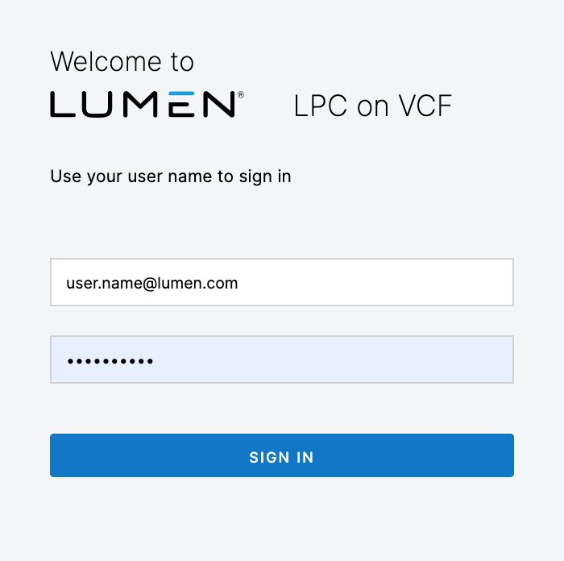
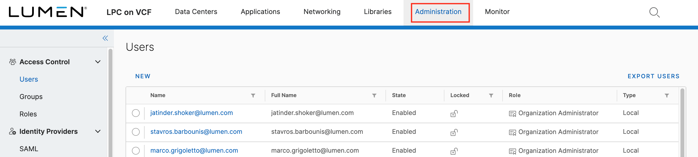
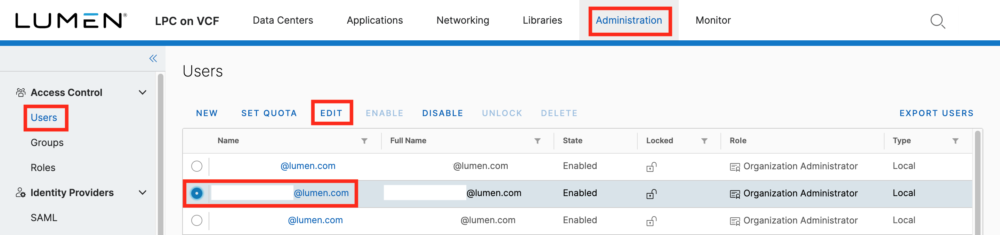

{{{
  "title": "Change User Password",
  "date": "06-17-2021",
  "author": "Anthony Hakim",
  "keywords": ["cpc", "cloud", "vmware", "admin", "password"],
  "attachments": [],
  "related-products" : [],
  "contentIsHTML": false,
  "sticky": false
}}}

### Description
In this KB article, we describe how to change a user password in Lumen Private Cloud on VMware Cloud Foundation™ (LPC on VCF). You can do it by using either Method 1 or Method 2.

### Steps

### Method #1

Log in to your Lumen Private Cloud on VMware Cloud Foundation environment.

  

Once logged in, select __Administration__.

  

In the Administration page, ensure that __Users__ is selected. Select the user account that you wish to change passwords, and then select __EDIT__.

  

In the __Edit User__ page, type a new password in the __Password__ field, and then re-type your new password in the __Confirm password__ field. Click __SAVE__.

  

  ### Method #2

  - Log in to your LPC on VCF environment.
  - Right-click on your login name on the right side of the Virtual Data Center page. 
  - Select Change Password. 

  - Type your new password, and then re-type your new password in the __Confirm New Password__ field.
  - Click __SAVE__.
  - You must log back in to continue using LPC on VCF.

  