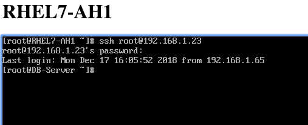
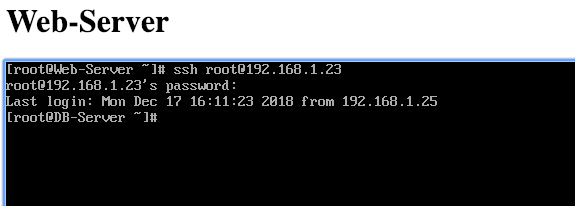
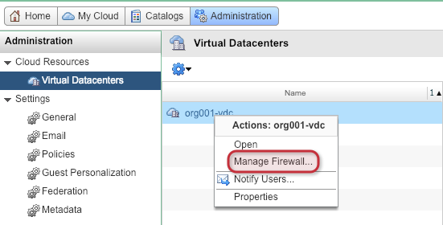
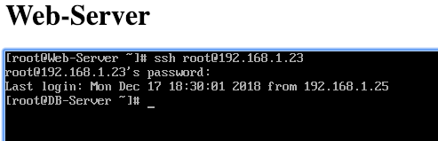
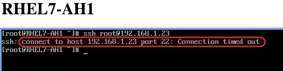

{{{
  "title": "Micro-segmentation with Distributed Firewall - Same Network (Flex UI)",
  "date": "12-17-2018",
  "author": "Anthony Hakim",
  "keywords": ["cpc", "cloud", "vmware", "firewall", "dfw", "flex", "support", "vcf"],
  "attachments": [],
  "related-products" : [],
  "contentIsHTML": false,
  "sticky": false
}}}

### Description
In this KB article, we walk through how to use the Distributed Firewall (DFW) that comes with Lumen Private Cloud on VMware Cloud Foundation (CPC on vCF). In this particular use case, we have 3 VMs that reside on the same virtual network, and we want to ensure that traffic is not allowed between certain VMs on the same network. We will use micro-segmentation with DFW to do this.

### Prerequisites
* Your base URL, and user credentials for Lumen Private Cloud on VMware Cloud Foundation
* 2 VMs on the same network
* DFW should be enabled for your environment. If it is not, please refer to [Enabling the Distributed Firewall](dfw-enabling.md).

### Environment/Use Case

For the purposes of this KB, we have the following environment:

* __Server:__ DB-Server - RHEL 7 (192.168.1.23)
* __Server:__ Web-Server - RHEL 7 (192.168.1.25)
* __Server:__ RHEL7-AH1 - RHEL 7 (192.168.1.65)
* __Network:__ Org VDC Network - (org001-orgvdc-network - 192.168.1.0/24)
* __VDC:__ Org VDC (org001-vdc)

By default, Web-Server and RHEL7-AH1 have access to DB-Server.

### Steps

* Log In to your CPC on vCF environment.

* Click the __Administration__ tab. In the left side pane, under __Cloud Resources__, select __Virtual Datacenters__, then right-click your Virtual Datacenter, and select __Manage Firewall...__

  

  A new window will open. If you get a message stating Distributed Firewall is not enabled for this Org VDC, please follow the steps outlined in the [Enabling the Distributed Firewall](dfw-enabling.md) KB article.

  __Now, let's create a rule to Allow traffic from Web-Server to DB-Server__

* In the Distributed Firewall page, click the + button. Then configure the rule as follows:

  * __Name:__ Allow Web - DB
  * __Source:__ Click the __+__ button in the Source column, change the __Browse objects of type__ to __Virtual Machines__, then select __Web-Server__ (you can type the name in the Filter... field - this is case-sensitive), click the right-arrow, then click __KEEP__
  * __Destination:__ Click the __+__ button in the Destination column, change the __Browse objects of type__ to __Virtual Machines__, then select __DB-Server__ (you can type the name in the Filter... field - this is case-sensitive), click the right-arrow, then click __KEEP__
  * __Service:__ Any
  * __Action:__ Allow
  * __Direction:__ In/Out
  * __Packet Type:__ Any
  * __Applied To:__ Click the __+__ button in the Applied To column, change the __Browse objects of type__ to __Org Vdc Networks__, then select org001-orgvdc-network (you can type the name in the Filter... field - this is case-sensitive), click the right-arrow, then click __KEEP__

* Click __Save changes__

  __Now, we will add a rule to deny all other traffic to the DB-Server.__

* In the Distributed Firewall page, click the + button.

  * __Name:__ Deny all others to DB
  * __Source:__ Click the __+__ button in the Applied To column, change the __Browse objects of type__ to __Org Vdc Networks__, then select org001-orgvdc-network (you can type the name in the Filter... field - this is case-sensitive), click the right-arrow, then click __KEEP__
  * __Destination:__ Click the __+__ button in the Destination column, change the __Browse objects of type__ to __Virtual Machines__, then select __DB-Server__ (you can type the name in the Filter... field - this is case-sensitive), click the right-arrow, then click __KEEP__
  * __Service:__ Any
  * __Action:__ Deny
  * __Direction:__ In/Out
  * __Packet Type:__ Any
  * __Applied To:__ Click the __+__ button in the Applied To column, change the __Browse objects of type__ to __Org Vdc Networks__, then select org001-orgvdc-network (you can type the name in the Filter... field - this is case-sensitive), click the right-arrow, then click __KEEP__

* Click __Save changes__

__Let's test this ...__

Web-Server should have access to DB-Server, and RHEL7-AH1 should not have access to DB-Server.

