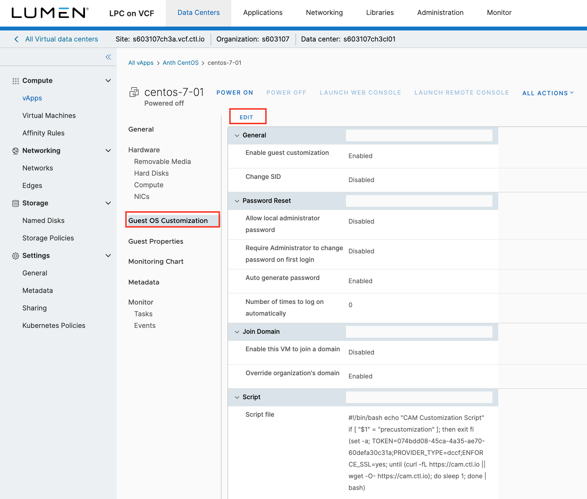
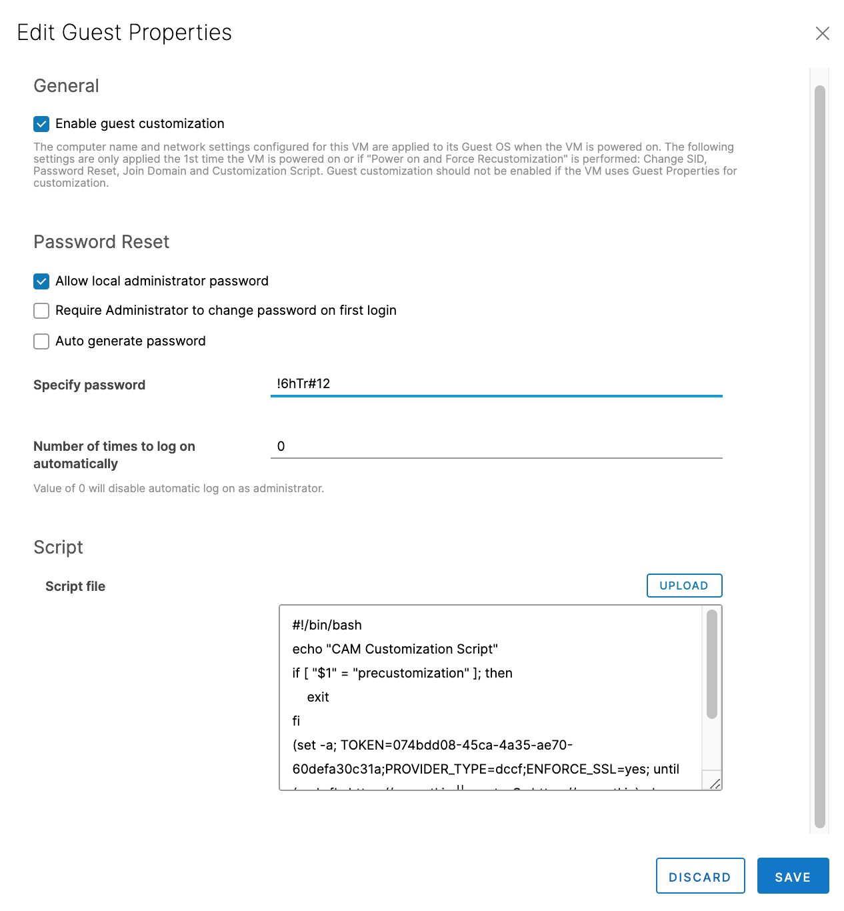
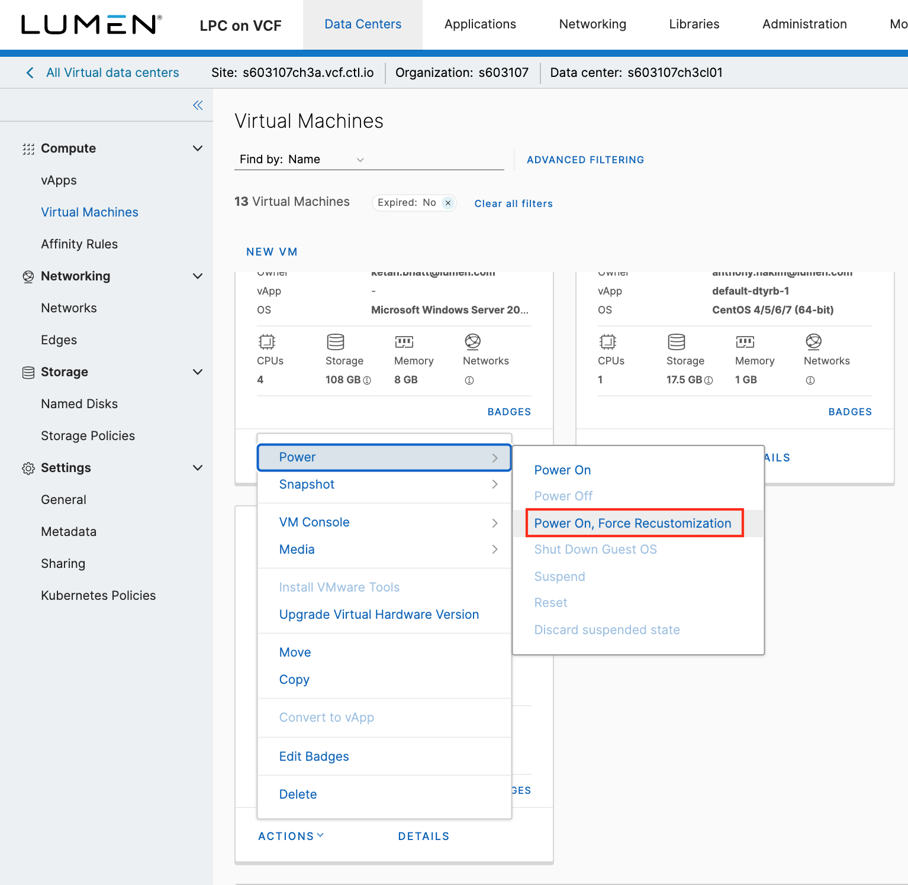
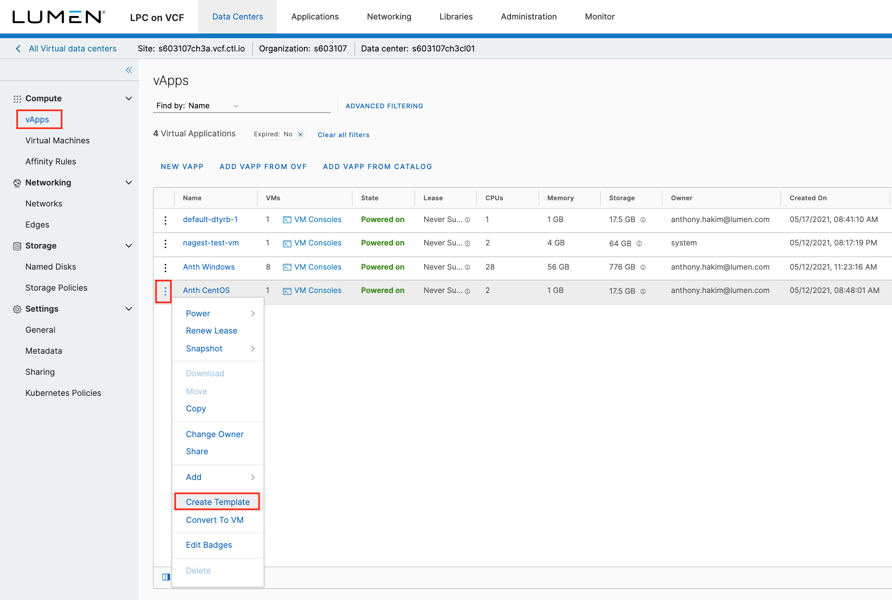

{{{
  "title": "Change Password on a VM",
  "date": "6-29-2021",
  "author": "Anthony Hakim",
  "keywords": ["cpc", "cloud", "vm", "password", "support", "vapp", "template", "vcf"],
  "attachments": [],
  "related-products" : [],
  "contentIsHTML": false,
  "sticky": false
}}}

### Description
In this KB article, we describe how to change the password on VMs that are deployed using our default "<siteID><data center>cl01 Lumen" vApp Templates in Lumen Private Cloud on VMware Cloud Foundation™.

### Steps
Login to your Lumen Private Cloud on VMware Cloud Foundation (LPC on VCF) environment.

  

Once logged in, click __Virtual Machines__ in the menu on the left side of the screen, then select the __VM__ in which you want to change the password.

__Please note:__ The VM must be powered off before we can proceed with this process. Also, VM Tools must be installed on the VM.

In the properties page of the VM, click __Guest OS Customization__. Click __EDIT__.

  

  In the __Edit Guest Properties__ section, select the checkboxes for  __Enable guest customization__ and __Allow local administrator password__. Type your desired password next to __Specify password__, and then click __SAVE__.
  
  

Once the save is completed, click __Virtual Machines__ in the menu on the left side of the screen, and then click on the vertical ellipsis for the __VM__ in which you changed the password. Select __Power On and Force Recustomization__ to enact your changes.

  

You will see the __Status__ change from __Powered off__ to __Powered on__.

  

Once the __Status__ changes to __Powered on__, the password on your VM will be set as desired. If you have other VMs you would like to deploy with this password and configuration, you can click __vApps__ in the menu on the left side of the screen, and then click on the vertical ellipsis for the __VM__ in which you changed the password. Select __Create Template__. Name it, customize it, and then use that vApp Template to deploy from.

  
