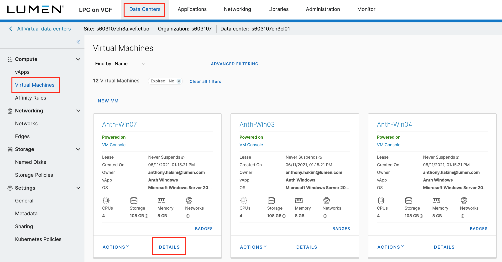
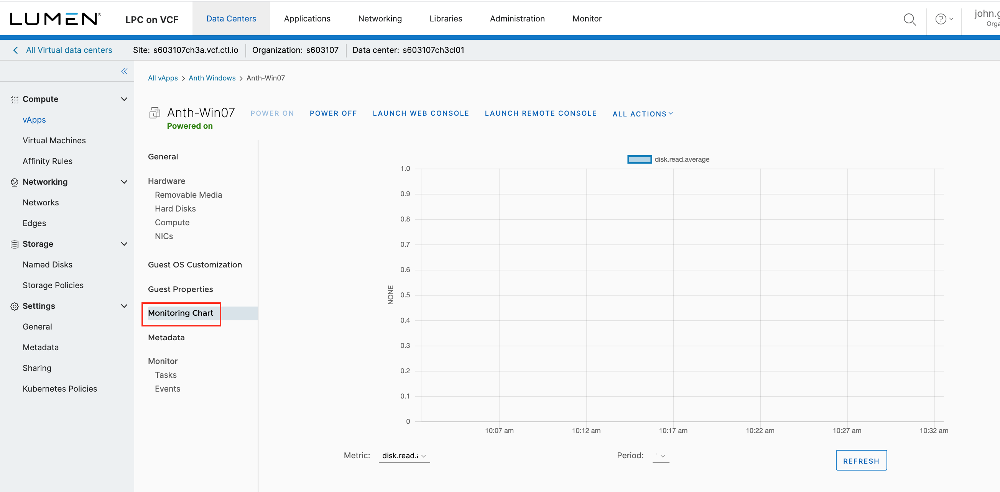
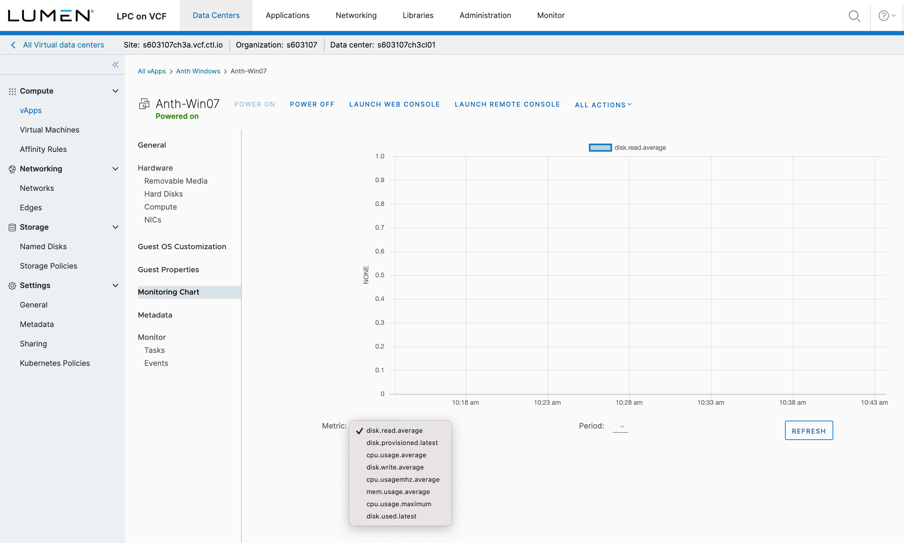

{{{
  "title": "CPC Metrics",
  "date": "06-15-2020",
  "author": "Anthony Hakim",
  "keywords": ["cpc", "cloud", "vm", "metrics", "vapp", "vcloud", "vcf"],
  "attachments": [],
  "related-products" : [],
  "contentIsHTML": false,
  "sticky": true
}}}

### Description
Lumen Private Cloud on VMware Cloud Foundation (CPC on VCF) customers can now view eight (8) different metrics for running VMs that are within the vCloud Director (vCD) environment. Those eight metrics are:

1.	disk.read.average
2.	disk.provisioned.latest
3.	cpu.usage.average
4.	disk.write.average
5.	cpu.usagemhz.average
6.	mem.usage.average
7.	cpu.usage.maximum
8.	disk.used.latest

There are also four (4) different time periods to choose from:

1. 1/2 Hour
2. Hour
3. Day
4. Week

### Steps
* To view metrics, login to vCD, go to **Virtual Machines**, then select **Details** on a running VM for which you would like to view metrics.

  

* In the VM details page, scroll down and select **Monitoring Chart**.

  

* Select the appropriate **Metric** and **Period**. You may need to click **Refresh**.

  
